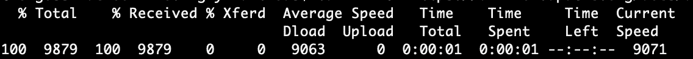
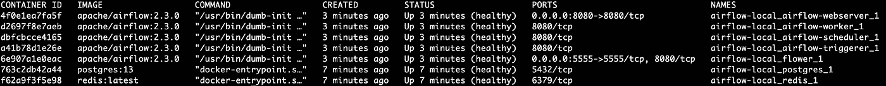
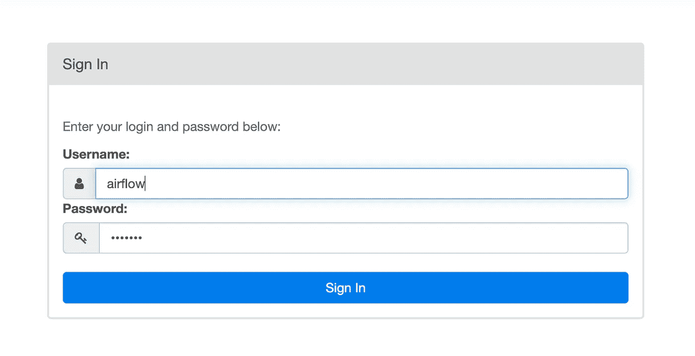
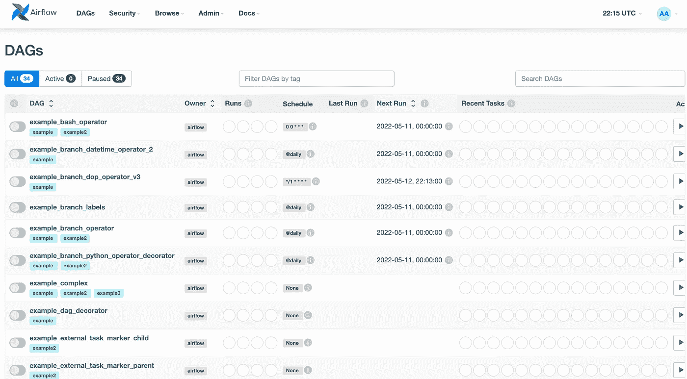

# 如何使用 Docker 在本地运行气流

> 原文：<https://towardsdatascience.com/run-airflow-docker-1b83a57616fb>

## 在本地机器上使用 Docker 运行 Airflow 的分步指南


约书亚·雷德科普在 [Unsplash](https://unsplash.com/s/photos/coding?utm_source=unsplash&utm_medium=referral&utm_content=creditCopyText) 上拍摄的照片

## 介绍

Apache Airflow 是数据工程领域最热门的技术之一，它允许用户大规模地构建、编排和监控数据管道。

很有可能你已经通过`pip`安装了 Airflow，试图在本地运行它，但是很有可能你会遇到问题，甚至更糟，搞乱你的本地环境。

如果您想在本地机器上测试气流，那么最简单的方法就是使用 Docker 图像。在今天的简短教程中，我们将逐步完成一个指南，帮助您在几分钟内通过 Docker 启动并运行 Airflow。

## 先决条件

首先，您需要确保您已经安装了

*   [Docker 社区版](https://docs.docker.com/engine/install/)
*   [Docker Compose](https://docs.docker.com/compose/install/) (注意，你需要版本≥ 1.29.1)

## 步骤 1:获取 docker-compose.yaml

我们首先需要的是 docker-compose.yaml 文件。在您的主目录上创建一个新目录(姑且称之为`airflow-local`):

```
$ mkdir airflow-local
$ cd airflow-local
```

并获取`docker-compose.yaml`文件(注意，我们将使用 Airflow v2.3.0)

```
$ curl -LfO 'https://airflow.apache.org/docs/apache-airflow/2.3.0/docker-compose.yaml'
```



您可以随意查看撰写文件以及其中定义的服务，即`airflow-scheduler`、`airflow-webserver`、`airflow-worker`、`airflow-init`、`flower`、`postgres`和`redis`。

## 步骤 2:创建目录

现在，当您在`airflow-local`目录中时，我们将需要创建另外三个目录:

*   `dags`
*   `logs`
*   `plugins`

```
$ mkdir ./dags ./logs ./plugins
```

## 步骤 3:设置气流用户

现在，我们必须导出一个环境变量，以确保主机上的文件夹和容器中的文件夹共享相同的权限。我们将简单地将这些变量添加到一个名为`.env`的文件中。

```
$ echo -e "AIRFLOW_UID=**$(**id -u**)**\nAIRFLOW_GID=0" > .env
```

使用`cat`检查`.env`的内容，确保其包含上述两个变量。

```
$ cat .env
AIRFLOW_UID=501
AIRFLOW_GID=0
```

## 步骤 4:初始化气流数据库

现在我们已经准备好初始化气流数据库，首先启动`airflow-init`容器:

```
$ docker-compose up airflow-init
```

该服务将运行`airflow db init`，并为气流数据库创建管理员用户。默认情况下，创建的帐户有登录名`airflow`和密码`airflow`。

## 步骤 5:启动气流服务

让气流启动并运行的最后一件事是启动我们在步骤 1 中看到的气流服务。

```
$ docker-compose up
```

请注意，上述命令可能需要一段时间，因为需要启动多个服务。完成后，您可以在新的命令行选项卡中使用以下命令来验证这些映像已启动并正在运行:

```
$ docker ps
```



气流图像启动并运行——来源:作者

## 步骤 6:访问气流用户界面

要访问 Airflow 用户界面，只需前往您喜欢的浏览器并打开`localhost:8080`。



气流管理员登录——来源:作者

键入您的凭据(如前所述，默认情况下，这些凭据将被设置为`airflow`并点击“登录”)。现在，您应该可以访问气流控制面板，在这里您可以看到一些用气流修补的 Dag 示例。



气流界面上的 DAGs 示例—来源:作者

## 第七步:进入气流工作者容器

您甚至可以进入 worker 容器，以便使用下面的命令运行`airflow`命令。您可以通过运行`docker ps`找到气流工作者服务的`<container-id>`:

```
$ docker exec -it <container-id> bash
```

举个例子，

```
$ docker exec -it d2697f8e7aeb bash
$ default@d2697f8e7aeb:/opt/airflow$ airflow version
2.3.0
```

## 第八步:收拾残局

一旦你完成了你的实验，你可以通过简单的运行来清理我们刚刚创造的混乱

```
$ docker-compose down --volumes --rmi all
```

此命令将停止并删除所有正在运行的容器，删除包含数据库数据和已下载映像的卷。

如果您再次运行`docker ps`，您可以验证没有容器启动并运行

```
$ docker ps
CONTAINER ID  IMAGE   COMMAND   CREATED   STATUS    PORTS     NAMES
```

## 最后的想法

在今天的简短教程中，我们探索了一个分步指南，它可以帮助您通过 Docker 在本地计算机上安装和运行 Apache Airflow v2.3.0。

请注意，Airflow Docker 图像仅用于测试目的。如果你计划在生产环境中部署气流，我推荐你在 Kubernetes 上用官方的舵图运行它。

[**成为会员**](https://gmyrianthous.medium.com/membership) **阅读介质上的每一个故事。你的会员费直接支持我和你看的其他作家。你也可以在媒体上看到所有的故事。**

[](https://gmyrianthous.medium.com/membership) [## 通过我的推荐链接加入 Medium-Giorgos Myrianthous

### 作为一个媒体会员，你的会员费的一部分会给你阅读的作家，你可以完全接触到每一个故事…

gmyrianthous.medium.com](https://gmyrianthous.medium.com/membership) 

**相关文章你可能也喜欢**

[](/data-engineer-tools-c7e68eed28ad) [## 数据工程师的工具

### 数据工程工具箱的基础

towardsdatascience.com](/data-engineer-tools-c7e68eed28ad) [](/python-3-11-f62708eed569) [## Python 3.11 有什么值得期待的

### 探索 Python 3.11 中的新增内容和更新，以及如何尽早获得 3.11 Alpha 版本

towardsdatascience.com](/python-3-11-f62708eed569) [](https://betterprogramming.pub/kafka-cli-commands-1a135a4ae1bd) [## 用于日常编程的 15 个 Kafka CLI 命令

### 演示最常用的 Kafka 命令行界面命令的使用

better 编程. pub](https://betterprogramming.pub/kafka-cli-commands-1a135a4ae1bd)