# 使用 Python API 客户端运行 BigQuery SQL

> 原文：<https://towardsdatascience.com/run-bigquery-sql-using-python-api-client-b5287ac05b99>

## 从零开始一步一步来


图片来源于[unsplash.com](https://unsplash.com/photos/AigsWJmvoEo)

今年我正在积极地与谷歌云(GCP)合作，我将分享如何在 WSL (Windows 子系统 Linux)中用 Python 和 Anaconda 设置 API 客户端，以从头开始执行 BigQuery SQL 查询。

如果你需要更多关于 WSL2 和 Anaconda (Miniconda)安装的信息，我可以在这个[的前一篇文章](https://medium.com/@cristiansaavedra/configuring-jupyter-notebook-in-windows-subsystem-linux-wsl2-c757893e9d69)中帮助你。

# 摘要

在这篇文章中，我们将了解如何:

1.  使用 WSL 创建一个新的 Anaconda 环境。
2.  使用 PIP 安装 Google API 客户端库
3.  使用 Web 控制台创建一个 Google 服务帐户
4.  使用 JSON 密钥文件生成 Google 应用程序凭证
5.  设置 Google 应用程序凭据环境变量
6.  将 USA Names 公共数据集添加到 BigQuery 并测试 SQL 查询
7.  设置 Visual Studio 代码以在 WSL 上运行
8.  调用 Python 脚本来执行 SQL 查询
9.  奖励:故障排除
10.  谢谢
11.  结论
12.  有用的资源

# 1.使用 WSL 创建一个新的 Anaconda 环境。

如果你没有 Windows 子系统 Linux (WSL)和 Anaconda (Miniconda ),我建议你看看我的[上一篇文章](https://medium.com/@cristiansaavedra/configuring-jupyter-notebook-in-windows-subsystem-linux-wsl2-c757893e9d69)。

为了不与现有库混淆，我们将设置一个本地项目，执行以下步骤:

1.  打开一个 **WSL2** 端子
2.  转到你的个人文件夹 a 创建一个新文件夹 **gcp_projects**
3.  创建一个名为 **gcp_prj** 的 Anaconda 环境
4.  检查新环境是否已创建
5.  使用 activate 切换到新环境。

使用以下命令:

```
mkdir gcp_projects
cd gcp_projects/conda create --name gcp_prj
conda info --envs
conda activate gcp_prj
```

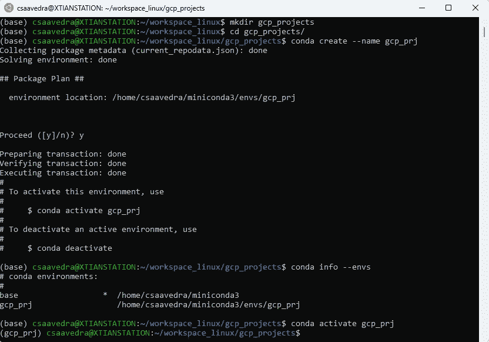

我正在创建一个新的 Anaconda 环境。图片由作者提供。

# 2.使用 PIP 安装 Google API 客户端库

我们将在新的 Anaconda 环境中安装 PIP，然后使用以下命令安装 Google API 客户端库:

```
sudo apt install python3-pip
pip install --upgrade google-cloud-bigquery
```


安装 PIP。图片由作者提供。

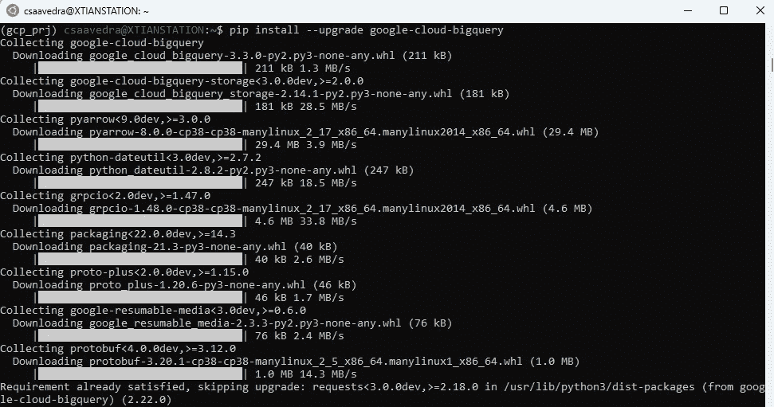

为 Python 安装 Google API 客户端库。图片由作者提供。

# 3.使用 Web 控制台创建一个 Google 服务帐户

下一步是通过转到[https://console.cloud.google.com/](https://console.cloud.google.com/)IAM&管理>服务帐户或[https://console.cloud.google.com/iam-admin/serviceaccounts](https://console.cloud.google.com/iam-admin/serviceaccounts)创建一个新的项目和服务帐户

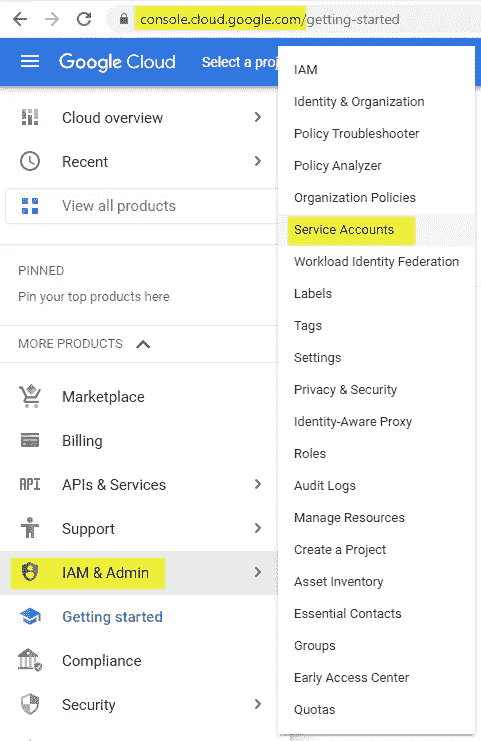

谷歌云控制台，服务账号。作者图片

创建一个名为 **MyBigQueryTest** 的新项目

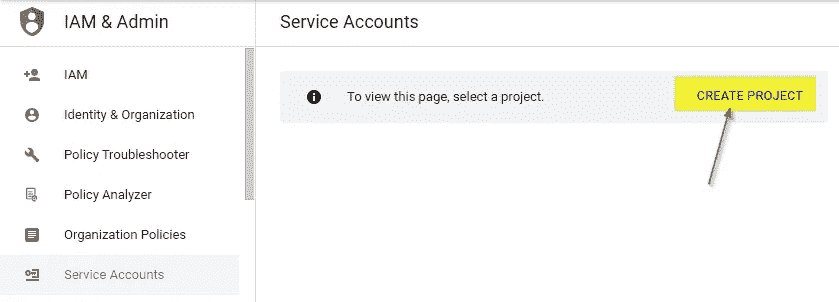

谷歌云控制台，创建一个项目。作者图片

创建一个名为 **sa_python_scripts** 的新服务帐户，并选择角色来访问您的项目。

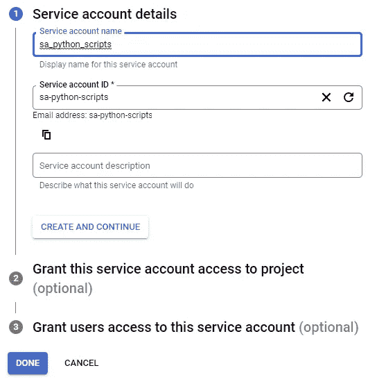

在谷歌云控制台中创建服务帐户。作者图片

出于测试目的，我将使用**所有者**角色，而不授予用户访问服务帐户**的权限。**请注意，不建议在生产环境中使用所有者角色

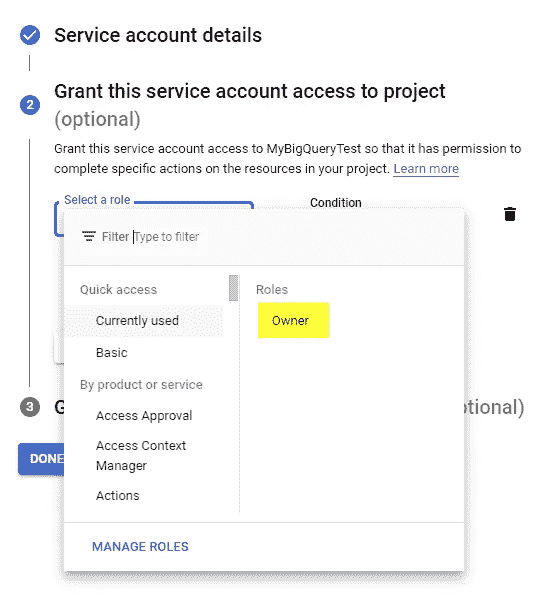

授予服务帐户，谷歌控制台的角色。作者图片

# 4.使用 JSON 密钥文件生成 Google 应用程序凭证

转到服务帐户，选择位于[https://console.cloud.google.com/iam-admin/serviceaccounts](https://console.cloud.google.com/iam-admin/serviceaccounts)的 **MyBigQueryTest** 项目，点击为服务帐户创建的电子邮件，查看详细信息。

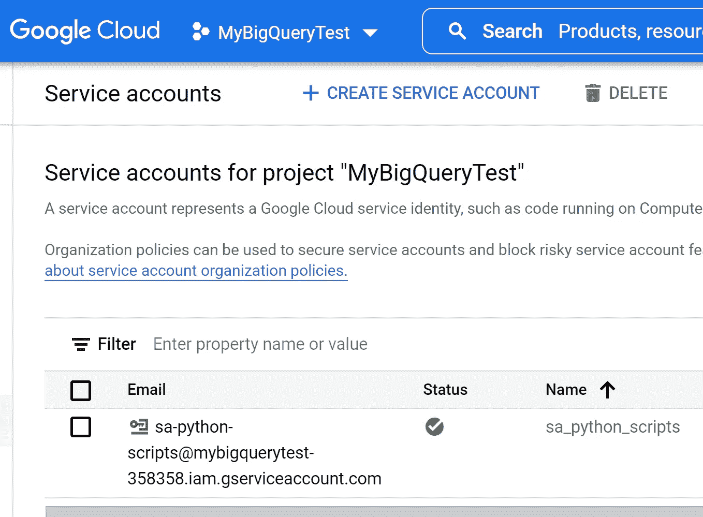

服务帐户可通过电子邮件获得。图片由作者编辑。

创建一个新的**密钥**并将其下载为一个 **JSON** 文件

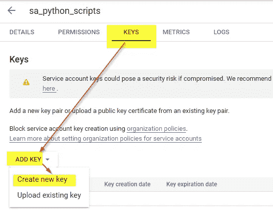

创建新的服务帐户密钥。作者图片

将文件另存为**mybigquerytest . JSON**；我使用的是直接的 WSL 路径**\ \ WSL $**\ Ubuntu \ home \ csaavedra \ workspace _ Linux \ GCP _ projects

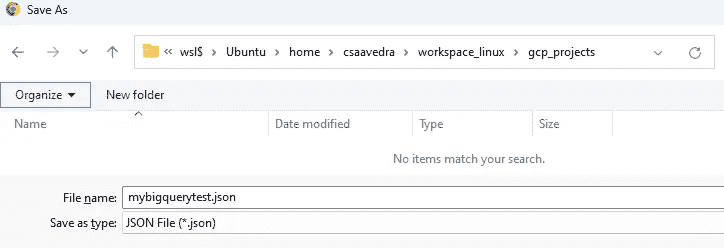

使用\\wsl$ hide Windows 共享网络保存到 WSL。图片由作者提供。

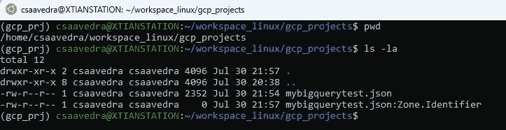

在 WSL 终端 Ubuntu 中检查文件。作者图片

# 5.设置 Google 应用程序凭据环境变量

为您的配置文件永久设置 GOOGLE_APPLICATION_CREDENTIALS 变量。bashrc 文件。

```
sudo nano ~/.bashrc
```

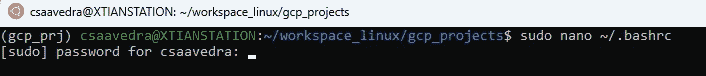

编辑您的个人资料。图片由作者提供。

在文件末尾添加导出**GOOGLE _ APPLICATION _ CREDENTIALS**:

```
export GOOGLE_APPLICATION_CREDENTIALS="/home/csaavedra/workspace_linux/gcp_projects/mybigquerytest.json"
```


将导出 GOOGLE_APPLICATION_CREDENTIALS 添加到您的个人资料中。图片由作者提供。

按下 **Control + X** ，选择 **Y** 为是，保存修改后的缓冲区(文件)


确认更改。作者图片

并按回车键确认文件名和更改。

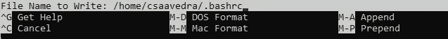

确认文件名。作者图片

我正在重新加载概要文件，并使用变量 GOOGLE_APPLICATION_CREDENTIALS 的 **echo** 和 **printenv** 命令检查路径

```
source ~/.bashrc
echo $GOOGLE_APPLICATION_CREDENTIALS
printenv GOOGLE_APPLICATION_CREDENTIALS
```

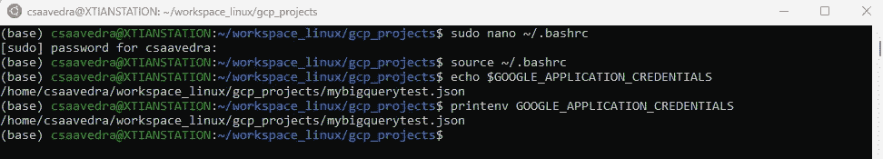

重新加载配置文件并检查 Google 应用程序凭证路径。图片由作者提供。

# 6.将 USA Names 公共数据集添加到 BigQuery 并测试 SQL 查询

进入[https://console.cloud.google.com/bigquery](https://console.cloud.google.com/bigquery)的 BigQuery 控制台，添加数据公共数据集，如下图:

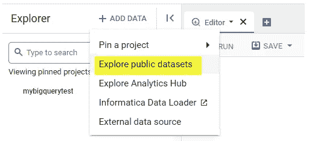

向 BigQuery 添加公共数据集。作者图片

在市场中，搜索 **USA names** 并选择美国社会安全管理局数据集

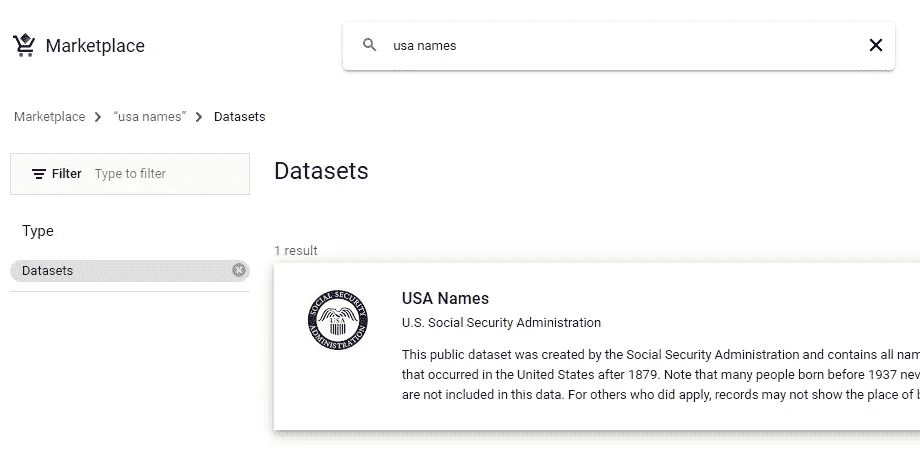

谷歌公共数据集市场。图片由作者提供。

点击名为**的蓝色按钮，通过数据集添加数据集:**

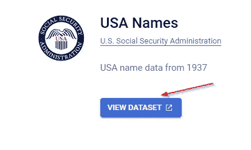

添加美国名称数据集。作者图片

USA Names 数据集已添加，但您无法在 explorer 项目树中找到它。


添加了美国名称。图片由作者提供。

要添加它，你需要搜索**美国名称**，然后选择**将搜索范围扩大到所有项目:**

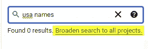

搜索美国名字。图片由作者提供。

然后你需要点击项目名称 **bigquery-public-data** 旁边的**大头针**图标，移动鼠标靠近三个点。

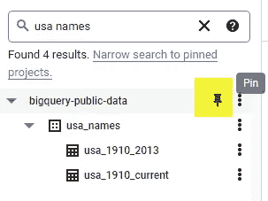

Pinging BigQuery 公共项目。图片由作者提供。

现在，您可以在项目树中看到美国的名称:

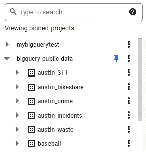

图片由作者提供。

下一步是使用编辑器窗口并执行以下 SQL 查询:

```
SELECT name, SUM(number) as total_people
FROM `bigquery-public-data.usa_names.usa_1910_2013`
WHERE state = 'TX'
GROUP BY name, state
ORDER BY total_people DESC
LIMIT 20
```

我们将使用结果来检查 Python 脚本是否正常工作:

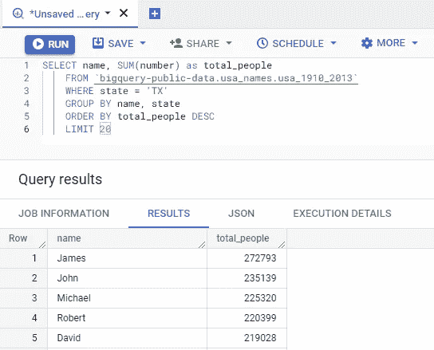

美国姓名查询结果。图片由作者提供。

# 7.设置 Visual Studio 代码以在 WSL 上运行

从 https://code.visualstudio.com/[下载并安装 Visual Studio 代码后](https://code.visualstudio.com/)进入扩展并安装

*   Python 扩展
*   远程 WSL 扩展

如下图所示:

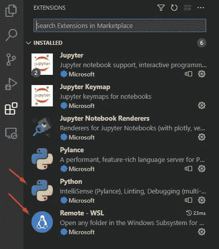

Visual Studio 代码，扩展。图片由作者提供。

然后点击左下角带有
大于号和小于号的绿色图标

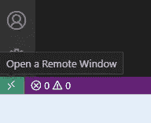

图片由作者提供。

并选择**新建 WSL 窗口**打开一个远程连接 WSL 的 Visual Studio 新实例。

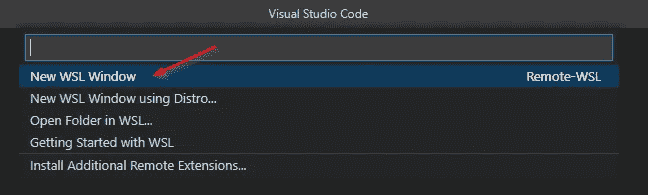

图片由作者提供。

你可以在左下角看到不同的标签，就像文本 WSL: Ubuntu 一样

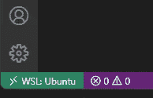

WSL: Ubuntu。图片由作者提供。

现在，您将通过转到文件并打开文件夹来打开 WSL 中的文件夹:

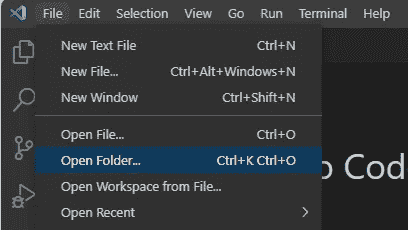

Visual Studio 代码，打开文件夹。图片由作者提供。

选择路径/home/csaavedra/workspace _ Linux/GCP _ projects/

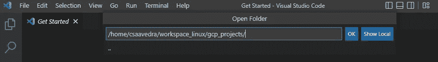

打开远程文件夹。图片由作者提供。

我们可以在那里找到 JSON 密钥文件。现在，右键单击名为**big query-usanames-test . py**的文件，创建一个新文件

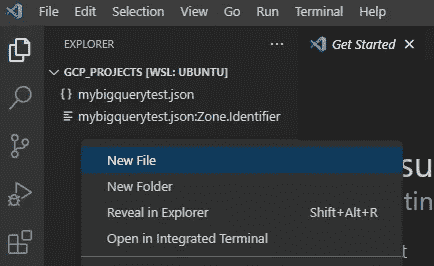

创建新的远程文件。图片由作者提供。

# 8.调用 Python 脚本来执行 SQL 查询

将以下代码复制到**big query-usanames-test . py**文件中

作者修改的代码。基于[https://github . com/Google APIs/python-big query/blob/HEAD/samples/client _ query . py](https://github.com/googleapis/python-bigquery/blob/HEAD/samples/client_query.py)

按 Control + F5 运行**big query-usanames-test . py**文件

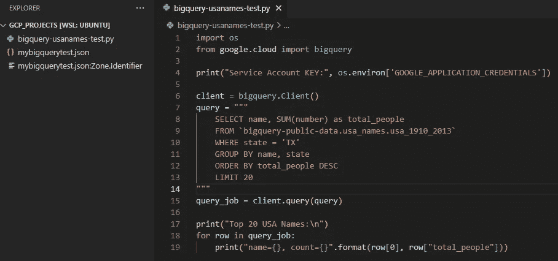

图片由作者提供。

执行的结果在 Web 编辑器中显示为查询结果

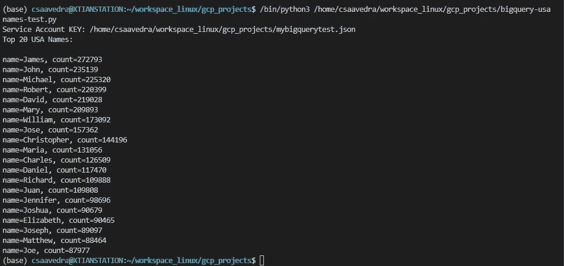

执行的结果。图片由作者提供。

# 奖励:故障排除

## 注入环境变量

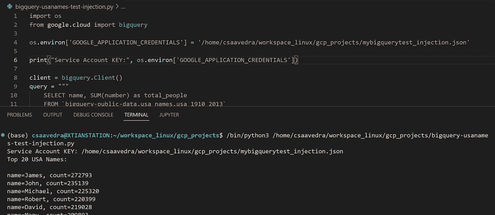

注入环境变量。图片由作者提供。

如果您没有权限**设置**一个环境变量，您可以通过使用 **os.environ** 对象直接将值传递到您的代码中:

```
os.environ['GOOGLE_APPLICATION_CREDENTIALS'] = '/home/csaavedra/workspace_linux/gcp_projects/mybigquerytest_injection.json'
```

## 没有名为 Google 的模块

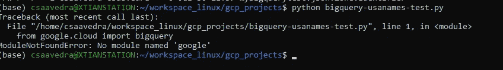

没有名为 google error 的模块。图片由作者提供。

如果您得到错误 No module named Google，请使用以下命令检查 google cloud library 的安装:

```
pip install --upgrade google-cloud-bigquery
```

## 无法自动确定凭据

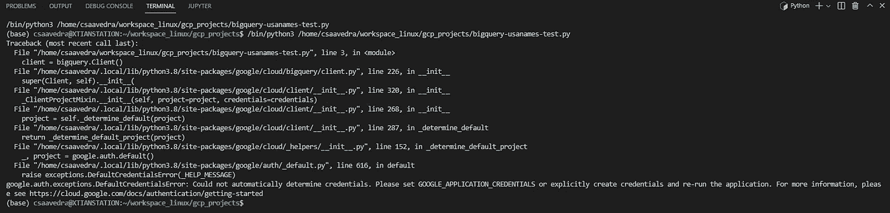

如果出现错误:无法自动确定凭据。请设置 GOOGLE_APPLICATION_CREDENTIALS 或显式创建凭据并重新运行应用程序。更多信息请见[https://cloud . Google . com/docs/authentic ation/getting-started](https://cloud.google.com/docs/authentication/getting-started)

该问题与作为环境变量导出的**GOOGLE _ APPLICATION _ CREDENTIALS**有关。

你可以测试运行代码 **os.environ** 或者在终端打印 printenv 看看是否返回变量。

```
import os
print(os.environ)
```

如果没有，您可以导出或重新加载带有源文件的概要文件。bashrc 和 printenv。

```
export GOOGLE_APPLICATION_CREDENTIALS="/home/csaavedra/workspace_linux/gcp_projects/mybigquerytest.json"source ~/.bashrc
echo $GOOGLE_APPLICATION_CREDENTIALS
printenv GOOGLE_APPLICATION_CREDENTIALS
```

此外，您可以在 visual Studio 终端中退出，以使用环境变量强制重新加载会话

# 谢谢

最后，我要感谢克里斯·冯·塞法尔威，他给了我继续写作的灵感。

[快乐发展！](https://medium.com/@cristiansaavedra)

# 结论

通过使用 API 客户端和一个服务帐户，用 Python 连接到谷歌云服务(GCP)是很容易的。在这第一步之后，您可以进行复杂的自动化操作，比如使用 Python Pandas 处理 Excel 文件，在 Google Big Query 中加载和合并，以及刷新 Tableau 仪表板。

# 有用的资源

[](https://github.com/googleapis/python-bigquery/) [## GitHub-Google API/python-big query

### 如果没有合适的硬件和基础设施，查询海量数据集既耗时又昂贵。谷歌…

github.com](https://github.com/googleapis/python-bigquery/)  [## 谷歌云大查询

### 截至 2020 年 1 月 1 日，本库不再支持最新发布版本的 Python 2。库版本…

googleapis.dev](https://googleapis.dev/python/bigquery/latest/index.html) [](https://cloud.google.com/bigquery/docs/reference/libraries#client-libraries-install-python) [## BigQuery API 客户端库|谷歌云

### 有关更多信息，请参见设置 Java 开发环境。如果您正在使用 Maven，请将以下内容添加到您的…

cloud.google.com](https://cloud.google.com/bigquery/docs/reference/libraries#client-libraries-install-python) [](https://codelabs.developers.google.com/codelabs/cloud-bigquery-python#0) [## 使用 Python | Google Codelabs 的 BigQuery

### BigQuery 是 Google 完全托管的、Pb 级的低成本分析数据仓库。BigQuery 是 NoOps-没有…

codelabs.developers.google.com](https://codelabs.developers.google.com/codelabs/cloud-bigquery-python#0) [](https://cloud.google.com/apis/design/errors) [## 错误|云 APIs |谷歌云

### 本章概述了 Google APIs 的错误模型。它还为开发人员提供了一般指导…

cloud.google.com](https://cloud.google.com/apis/design/errors)  [## 管理环境—康达开发文档

### 使用 conda，您可以创建、导出、列出、删除和更新具有不同版本 Python 和/或的环境

docs.conda.io](https://docs.conda.io/projects/conda/en/latest/user-guide/tasks/manage-environments.html#creating-an-environment-with-commands)