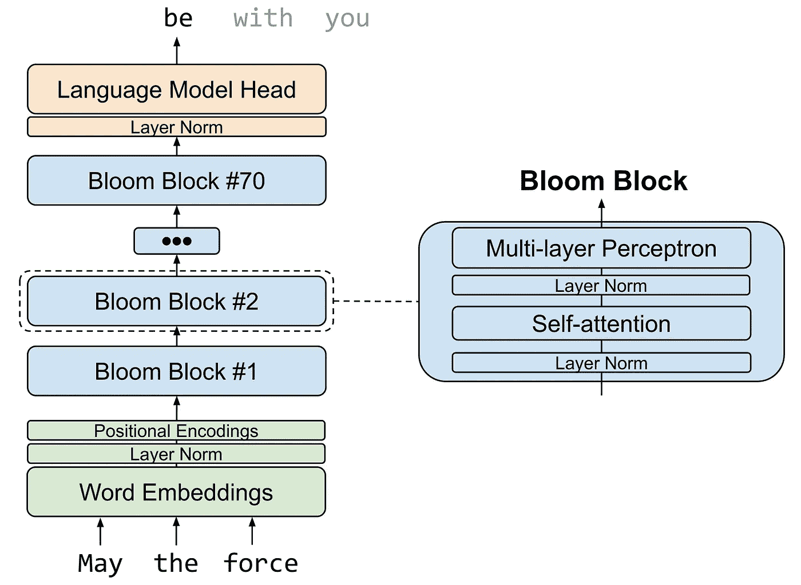

# 了解 BLOOM，最大的开放存取人工智能，并在您的本地计算机上运行它

> 原文：<https://towardsdatascience.com/run-bloom-the-largest-open-access-ai-model-on-your-desktop-computer-f48e1e2a9a32>

## 查看 BLOOM 解决数学、翻译和编码问题的实践。


BLOOM 是一个开放访问的多语言模型，包含 1760 亿个参数，在 384 个 A100–80GB GPU 上训练了 3.5 个月。一个 BLOOM 检查点需要 330 GB 的磁盘空间，因此在台式计算机上运行这个模型似乎不可行。然而，你只需要足够的磁盘空间，至少 16GB 的内存，和一些耐心(你甚至不需要一个 GPU)，在你的计算机上运行这个模型。

BLOOM 是 1000 多名科学家和神奇拥抱脸团队的合作成果。值得注意的是，这种大型多语言模型对每个人都开放。**本教程结束时，你将学会如何在你的本地计算机上运行这个庞大的语言模型，并看到它生成如下文本:**

```
- INPUT: "The SQL command to extract all the users whose name starts with A is: "
  OUTPUT: "SELECT * FROM users WHERE name LIKE 'A%'"- INPUT: "The Spanish translation of thank you for your help is: "
  OUTPUT: "gracias por su ayuda"- INPUT: "John is 4 times as old as Bob. Bob is 3 years younger than Mike. Mike is 10 years old. What is John's age? Let's think step by step. "
  OUTPUT: "First, we need to find out how old Bob is. Bob is 3 years younger than Mike. So, Bob is 10–3=7 years old. Now, we need to find out how old John is. John is 4 times as old as Bob. So, John is 4 times 7=28 years old"
```

本教程使用拥抱脸的`transformers`库的一些组件，以及定制的 Python 代码，有策略地从磁盘加载模型权重，并生成一系列令牌。为了便于学习，本教程中的推理 Python 代码是从头开始编写的，没有使用 Hugging Face Accelerate 中的现成实现。对于生产，拥抱脸加速是更强大和多才多艺。本教程中的 Python 代码在配有 i5 11gen 处理器、16GB RAM 和 Samsung 980 PRO NVME 硬盘的计算机上每 3 分钟生成一个令牌(快速硬盘可以显著提高推理速度)。

# 布鲁姆建筑

BLOOM 是一种因果模型语言，这意味着它被训练为下一个令牌预测器。这种基于一组前面的标记来预测句子中的下一个标记的明显简单的策略，已经显示出对于大型语言模型的一定程度的推理能力(arXiv:2205.11916)。这使得 BLOOM 和类似的模型能够在一个句子中连接多个概念，并以相当的准确性解决算术、翻译和编程等重要问题。BLOOM 使用由输入嵌入层、70 个转换器块和输出语言建模层组成的转换器架构，如下图所示。每个变压器块有一个自我注意层和一个多层感知器层，输入和后注意层规范。



布鲁姆建筑

要使用 BLOOM 预测句子中的下一个标记，我们只需将输入标记(以嵌入的形式)传递给 70 个 BLOOM 块中的每一个。假设这是一个顺序操作，我们可以一次只加载一个块到 RAM 中，以避免内存溢出。类似地，单词嵌入和输出语言建模层可以按需从磁盘加载。

# 下载预先训练的 BLOOM 检查点

使用下面的代码从拥抱脸模型库中下载 BLOOM (176-B 版本):[https://huggingface.co/bigscience/bloom](https://huggingface.co/bigscience/bloom)。这将下载特定的 BLOOM 检查点`2a3d62e`。虽然 BLOOM 的模型大小在 330GB 左右，`git lfs`下载额外的链接文件，那么下载大小差不多是 700GB。确保您有足够的磁盘空间。

```
git lfs install
export GIT_LFS_SKIP_SMUDGE=1
git clone [https://huggingface.co/bigscience/bloom](https://huggingface.co/bigscience/bloom)
cd bloom
git lfs fetch origin 2a3d62e
git lfs checkout
```

下载的文件夹包含一个分片的 BLOOM 检查点，如下所示。分片意味着检查点被分成 72 个不同的文件，命名为`pytorch_model_00001-of-00072.bin`到`pytorch_model_00001-of-00072.bin`，以便于处理。

```
> ls -la
6.7 GB  pytorch_model_00001-of-00072.bin 
4.6 GB  pytorch_model_00002-of-00072.bin 
...
4.6 GB  pytorch_model_00071-of-00072.bin
 57 KB  pytorch_model_00072-of-00072.bin
0.5 KB  config.json
 14 MB  tokenizer.json
 13 KB  pytorch_model.bin.index.json
```

文件`00001`包含单词嵌入和相关层规范，文件`00002` 到`00071` 包含 70 个 BLOOM 块，文件`00072`包含最终层规范。输出语言建模层使用与单词嵌入相同的权重。如果你好奇的话，`pytorch_model.bin.index.json`文件指定了 BLOOM 层是如何分布在碎片上的。

# 推理

现在我们用下载的 BLOOM 模型来做推断。首先我们需要安装拥抱脸`transformers` v4.20.0，如下图。这个特定的版本是必需的，因为本教程中的定制 Python 代码使用了仅在这个特定版本的`transformers`中可用的方法。

```
pip install transformers==4.20.0
```

第二，我们创建一个方法(`get_state_dict`)，它接受一个碎片号(1 到 72)作为输入，从磁盘中读取碎片，并返回一个包含模型对象状态的字典。该方法允许从字典键中移除前缀，以便于使用`torch.load_state_dict`将权重加载到模型对象中。我们还通过从下载的文件夹中加载来创建令牌化器和配置对象。

第三，我们创建了三种方法来将状态字典加载到不同的模型对象中。我们在推理过程中使用这些方法，只将模型的特定部分加载到 RAM 中。这三种方法遵循相似的模式，包括:1)从磁盘读取碎片，2)创建模型对象，3)使用`torch.load_state_dict`填充模型对象的权重，以及 4)返回模型对象。唯一的例外是`load_block` 方法，它不创建新的块对象，而是覆盖作为参数传递的对象，以节省 RAM 内存。

第四，我们创建了一个方法来完全向前遍历 BLOOM 的所有层。该方法将令牌输入 id 的数组作为输入，并返回预测为句子中下一个的令牌 id。该方法从创建注意屏蔽和位置编码(alibi)开始。然后，它在嵌入层上向前传递以创建初始的`hidden_states`。接下来，它将`hidden_states`依次通过 70 个 BLOOM 块和输出语言模型头来生成输出 logits。`argmax`获取输出逻辑并返回预测概率最高的令牌 id。注意，在使用嵌入之后，我们删除它们以避免溢出内存。同样，每次我们调用 bloom 块时，我们从磁盘读取一个新的对象，但是覆盖现有的`block` 对象的权重以节省内存。

最后，我们定义一个输入句子，将其标记化，然后依次调用 forward 方法来预测句子中的下一个标记，一次一个标记。注意，在每一步，我们将新生成的令牌与之前的令牌(`input_ids`)连接起来，以进一步生成额外的令牌。

```
INPUT: The SQL command to extract all the users whose name starts with A is:OUTPUT:
Token 1 ....... SELECT
Token 2 ....... *
Token 3 ....... FROM
Token 4 ....... users
Token 5 ....... WHERE
Token 6 ....... name
Token 7 ....... LIKE
Token 8 ....... 'A
Token 9 ....... %'
Token 10 ....... 

The SQL command to extract all the users whose name starts with A is:  SELECT * FROM users WHERE name LIKE 'A%'
```

这个例子说明 BLOOM 可以生成一个有意义的 SQL 语句。您可以运行其他示例(例如，本教程开头提到的示例)来看看 BLOOM 有多强大。只需记住使用`max_tokens` 变量增加要生成的令牌数量。

## 结论

由于其开放访问和多语言特性，BLOOM 被认为是十年来最重要的人工智能模型之一。这项突破性的技术将彻底改变自然语言处理的研究和实践。通过阅读本教程，即使您的计算资源有限，也可以利用 BLOOM 的强大功能来生成文本。此外，您可以使用伟大的拥抱脸`transformers`库来微调 BLOOM 以执行下游任务，如问题回答和文本分类。如果 BLOOM 的大版本对于您的应用程序或可用的计算资源来说太大，您可以利用拥抱人脸模型库中可用的较小版本的 BLOOM([https://huggingface.co/bigscience](https://huggingface.co/bigscience))。

在我网站的博客部分有一个 Jupyter 笔记本，里面有本教程的所有源代码:[https://arte agac . github . io](https://arteagac.github.io/)