# 使用动态设置在任何地方运行 Python 应用程序

> 原文：<https://towardsdatascience.com/run-your-python-app-anywhere-with-dynamic-settings-aafd27e04b8e>


图片来自 [Pavlofox](https://pixabay.com/users/pavlofox-514753/?utm_source=link-attribution&utm_medium=referral&utm_campaign=image&utm_content=1452987) 来自 [Pixabay](https://pixabay.com/?utm_source=link-attribution&utm_medium=referral&utm_campaign=image&utm_content=1452987)

## 使用配置文件参数化您的应用程序，并使用 ConfigParser 读取

当我们使用 Python 编写应用程序时，我们可能希望它能够在不同的环境中运行。或者，我们希望它在运行时有不同的行为。也就是说，参数化这个应用程序，而不是硬编码一切，因为我们不想改变代码来适应情况。

这可以通过多种方式实现。一种常见的方法是给程序添加参数。这是我以前的一篇文章，详细介绍了这种方法。

</typer-probably-the-simplest-to-use-python-command-line-interface-library-17abf1a5fd3e>  

然而，使用参数的局限性也是显而易见的。

*   当我们运行程序时，添加大量的参数是不实际的。
*   运行时不能更改初始化参数。我们必须重新运行程序来改变参数。
*   保留值或参数对用户不友好。所以，不容易和别人分享。

当我们至少满足上面的一个约束时，值得考虑使用配置文件。所以，所有的参数都可以物理化成一个文本文件。

在本文中，我将介绍 Python 内置模块之一，名为`configparser`。它将使我们能够开箱即用地读取和写入配置文件。

# 1.写入配置文件


图片来自 [Pixabay](https://pixabay.com/?utm_source=link-attribution&utm_medium=referral&utm_campaign=image&utm_content=2291916)

从读取配置文件开始会更有意义。但是，如果你熟悉我的写作风格，你就会知道，我总是尽量写出可以按顺序进行的文章。因此，我们可以从这个实验开始，首先将配置写入文件。

由于`configparser`是 Python 3 内置的，所以我们只需要导入它并开始使用它。不需要下载和安装任何东西。

```
import configparserconfig = configparser.ConfigParser()
```

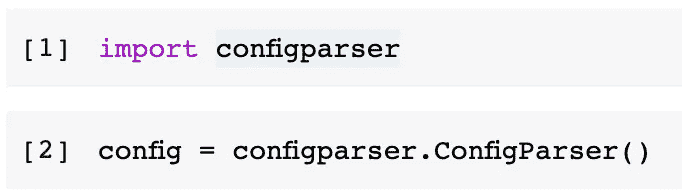

这里，我们使用模块中的`ConfigParser`类初始化一个名为`config`的对象。因此，我们得到了一个配置对象。

## 1.1 建立一个配置对象

当我们使用一个`config`物体时，和使用字典没有太大的区别。当我们想给对象添加一些配置项时，可以像这样添加。

```
config['PERSON'] = {
    'name': 'Christopher Tao',
    'age': '34'
}
```

“顶层”键`PERSON`将被视为配置文件的一部分。对于`PERSON`部分，我们定义了一个包含两个条目的字典。然后，我们可以尝试将这个配置对象写入一个文本文件，如下所示。

```
with open('settings.cfg', 'w') as configfile:
    config.write(configfile)
```

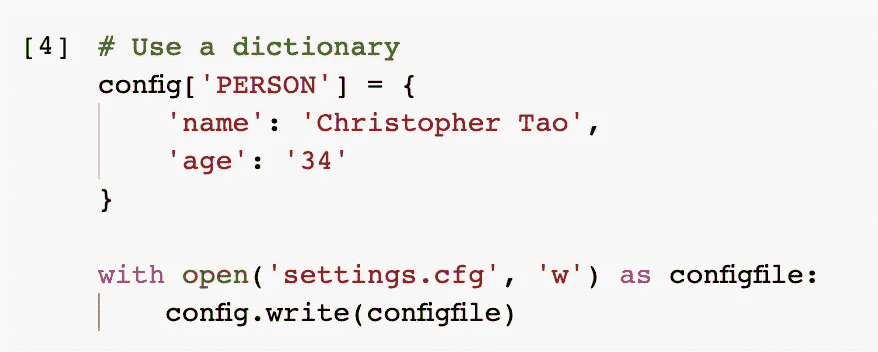

这是我们刚刚写好的文件。


就是这样！当然，我们不必一次性提供整个词典。按如下方式逐步构建配置部分是完全没问题的。

```
config['RUN_PARAMETERS'] = {}
config['RUN_PARAMETERS']['start_time'] = '2020-05-01 00:00:00'
config['RUN_PARAMETERS']['end_time'] = '2020-05-31 00:00:00'
config['RUN_PARAMETERS']['frequency_min'] = '10'
config['RUN_PARAMETERS']['is_active'] = 'True'with open('settings.cfg', 'w') as configfile:
    config.write(configfile)
```

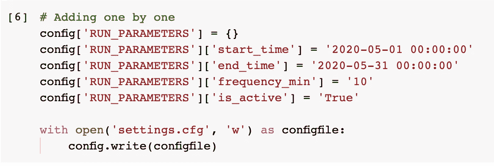

然后，该文件将被追加新的部分。

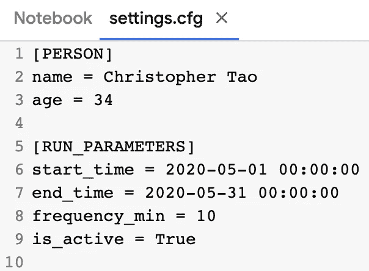

## 1.2 配置值必须是字符串

然而，与实际的字典相比，一些约束是有目的地添加到配置对象中的。例如，值得一提的是，所有的配置值都必须是字符串。如果我们试图给一个非字符串值如下，它会抱怨。

```
# Must be string
config['RUN_PARAMETERS']['is_active'] = True
```

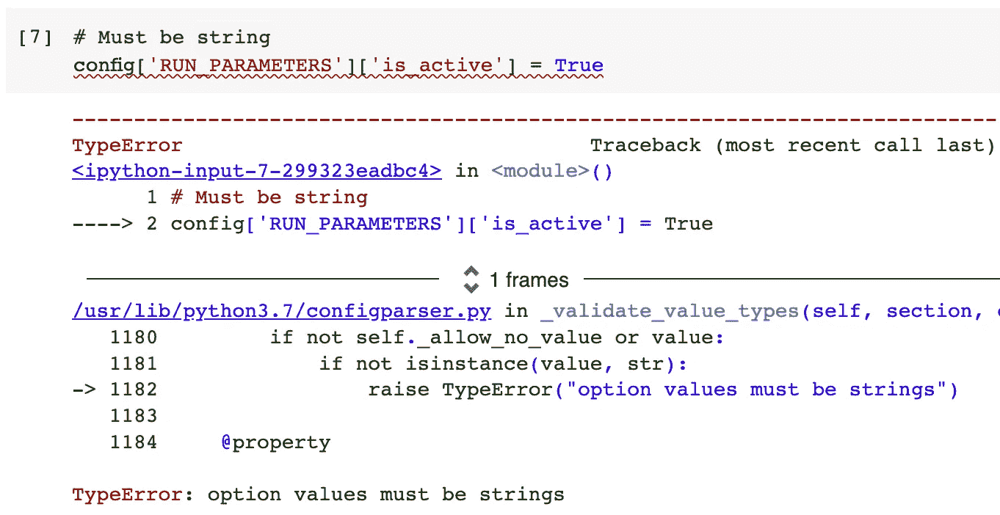

这是有意义的，因为所有的配置值稍后将被写入一个文本文件。强制使用字符串值会降低出错的可能性，保持一致性。

# 2.从配置文件中读取


图片来自 [Pixabay](https://pixabay.com/?utm_source=link-attribution&utm_medium=referral&utm_campaign=image&utm_content=1236578) 的 [MustangJoe](https://pixabay.com/users/mustangjoe-2162920/?utm_source=link-attribution&utm_medium=referral&utm_campaign=image&utm_content=1236578)

现在我们可以进入今天的主题了。从配置文件中读取。请注意，文本文件的扩展名并不重要，甚至作为内容的键值对的格式也不重要，这将在本节中详细介绍。

## 2.1 读取配置对象的参数

在我们想从配置文件中读取之前，我们还需要一个`config`对象。

```
config = configparser.ConfigParser()config.read('settings.cfg')
```

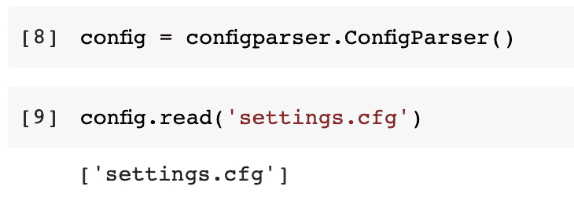

函数将返回一个列表中的配置文件名。这是因为`configparser`可以将多个配置文件读入一个对象。一旦我们已经阅读了项目，我们也可以使用`sections()`功能检查所有部分。

```
config.sections()
```

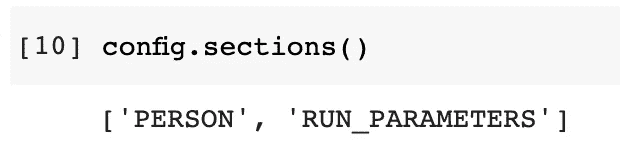

如果您没有跳过前面的部分，您可以很容易地获得我们已经写入配置文件的参数。

```
print(config['PERSON']['name'])
print(config['PERSON']['age'])
print(config['RUN_PARAMETERS']['start_time'])
print(config['RUN_PARAMETERS']['is_active'])
```

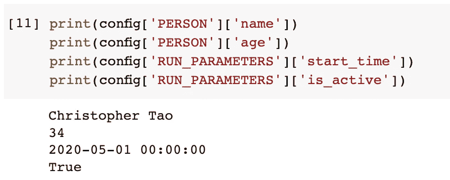

## 2.2 读取数据类型的参数

配置文件中有一些非字符串参数是很常见的，比如 integer、float 或 boolean。没有什么可以阻止您将它们读入字符串，然后将它们转换成应该的数据类型。类似下面的内容。

```
int(config['PERSON']['age'])
```

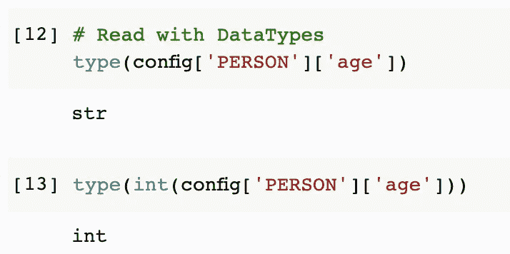

然而，`configparser`允许我们将值读入特定的数据类型，而不需要额外的转换步骤。例如，`getint()`方法将读取整数形式的值，而`getboolean()`方法将它们读入 bool 类型。

```
print(config['PERSON'].getint('age'))
type(config['PERSON'].getint('age'))print(config['RUN_PARAMETERS'].getboolean('is_active'))
type(config['RUN_PARAMETERS'].getboolean('is_active'))
```

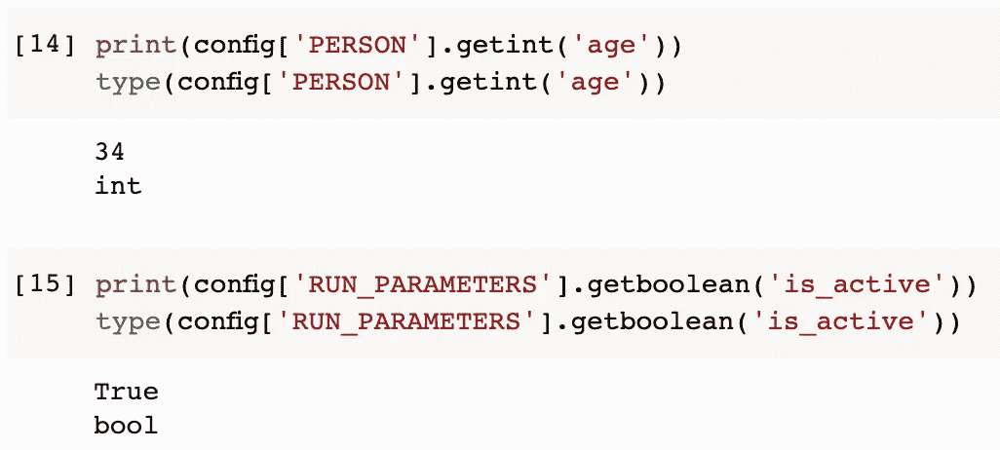

## 2.3 回退值

有时，配置文件本身也可能是动态的。期望的功能之一是，我们可能希望用户只需要添加必要的参数，而不是一切。但是，对于那些不存在的参数，它会引发一个`KeyError`。

```
# Fallback Values
config['PERSON']['middle_name']
```

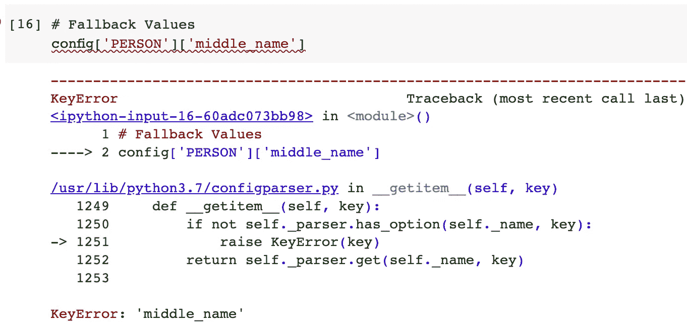

解决方案与普通词典非常相似。我们可以使用`get()`函数来获取键的值，并在没有值时提供一个后备值。

```
config['PERSON'].get('name', '')
config['PERSON'].get('middle_name', '')
```

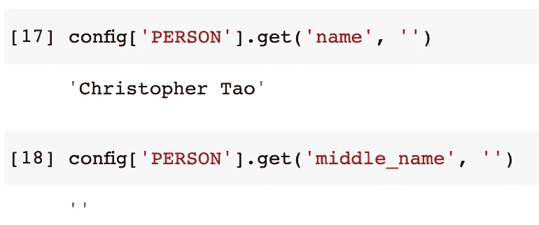

在上面的例子中，当我们试图获取`name`时，它存在，因此我们可以取回值，而键`middle_name`不存在，因此空字符串将被用作回退值。

## 2.4 多级价值获取

我们还可以使用`get()`方法直接从 config 对象中获取键值，这意味着我们也可以将节名放入方法中。

```
# Multilevel
config.get('PERSON', 'name')
```

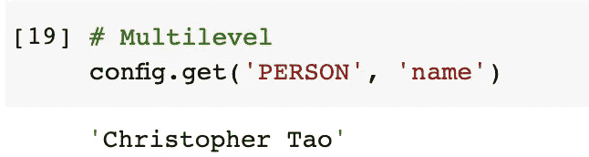

当我们使用上面的`get()`方法时，我们也可以显式地定义 fallback 值，如下所示。

```
config.get('PERSON', 'middle_name', fallback='I do not have middle name')
```

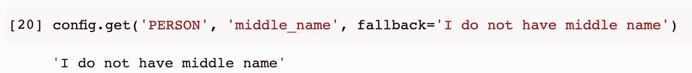

值得一提的是，多级特性也可以与“获取数据类型”方法一起使用。

```
print(config.getint('PERSON', 'age'))
type(config.getint('PERSON', 'age'))
```

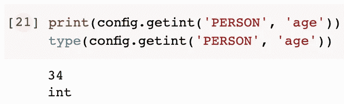

## 2.5 检查密钥是否存在

最后，就像 Python 字典一样，我们也可以检查一个键是否存在于一个节中，如下所示。

```
# Check key
'name' in config['PERSON']
'middle_name' in config['PERSON']
```

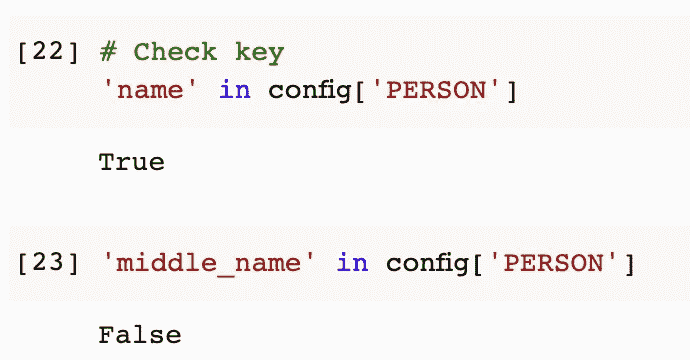

# 3.默认部分


图片来自 [Pixabay](https://pixabay.com/?utm_source=link-attribution&utm_medium=referral&utm_campaign=image&utm_content=444493) 的[迈克尔·施瓦森伯格](https://pixabay.com/users/blickpixel-52945/?utm_source=link-attribution&utm_medium=referral&utm_campaign=image&utm_content=444493)

`configparser`中有一个神奇的版块，就是`DEFAULT`版块。当配置文件有默认节时，可以从任何节访问该值。

让我们通过将`DEFAULT`部分写入配置文件来构建一个示例。

```
config['DEFAULT'] = {
    'version': '1.0',
    'author': 'Christopher Tao'
}with open('settings.cfg', 'w') as configfile:
    config.write(configfile)
```

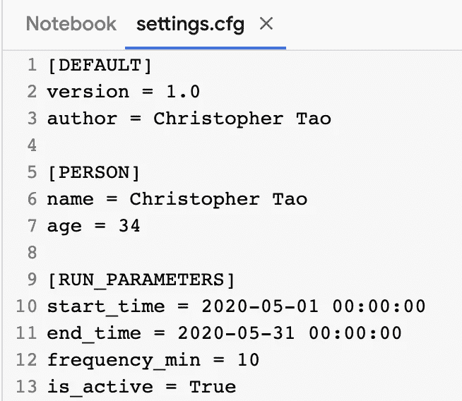

然后，如果我们试图列出 config 对象中的所有部分，我们会发现默认部分不会在那里。

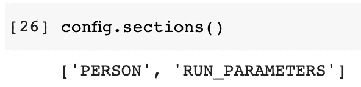

但是，可以证明它肯定是存在的。

```
for key in config['DEFAULT']:
    print(key, '=', config['DEFAULT'][key])
```

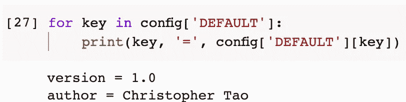

这是`configparser`默认部分的特性，正如我之前所说的，默认部分中的项目可以从任何其他部分访问。如果我们尝试在其他两个部分列出所有的键值对，我们会发现它们都存在。

```
for key in config['PERSON']:
    print(key, '=', config['PERSON'][key])for key in config['RUN_PARAMETERS']:
    print(key, '=', config['RUN_PARAMETERS'][key])
```

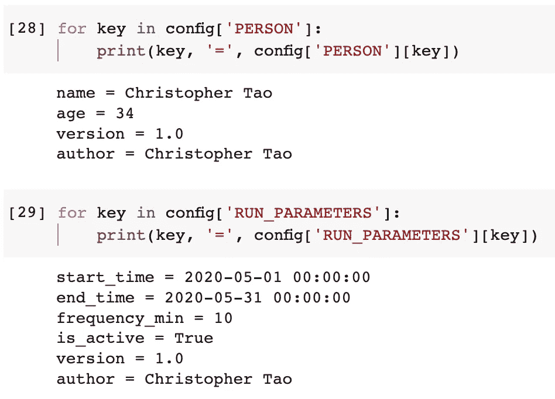

# 4.支持的键值对格式


图片来自 [Pixabay](https://pixabay.com/?utm_source=link-attribution&utm_medium=referral&utm_campaign=image&utm_content=444499) 的[迈克尔·施瓦森伯格](https://pixabay.com/users/blickpixel-52945/?utm_source=link-attribution&utm_medium=referral&utm_campaign=image&utm_content=444499)

对键值属性使用等号`=`在配置文件中很常见。然而，在不同的标准中确实使用了其他格式。`configparser`模块的美妙之处在于我们可以发现它支持几乎所有的流行风格。

让我们如下定义另一个配置文件。然后，命名为`examples.cfg`。

```
[Equal With Padding]
name = Christopher Tao[Equal]
name=Christopher Tao[Colon]
name: Christopher Tao[Multiline]
name = Christopher 
Tao[No Values]
key_without_value
empty key =[Comments]
# This is comment
; This is comment, too# Empty line is OK [Indented Section]
        name=Christopher Tao
```

在这个示例配置文件中，混合了多种不同的样式。如果我们尝试读取文件，所有的场景都可以处理得很好。

```
config = configparser.ConfigParser()
config.read('examples.cfg')
config.sections()
```

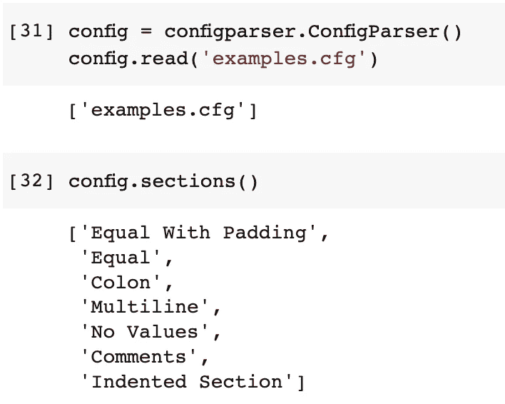

等号和冒号都可以。

```
# name=Christopher Tao
config['Equal']['name']# name: Christopher Tao
config['Colon']['name']
```

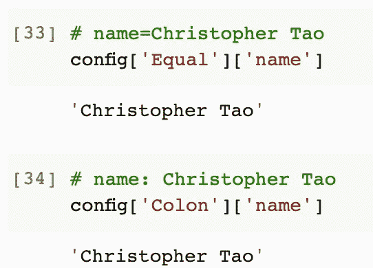

当值中存在换行符时，可以正确捕获。

```
# name = Christopher 
# Tao
config['Multiline']['name']
```

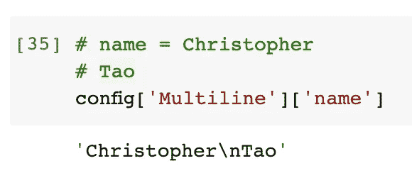

有评论的时候会忽略。因此，对于[Comments]部分，不存在键值对。

```
# [Comments]
# # This is comment
# ; This is comment, too
# # Empty line is OK
len(config['Comments'])
```

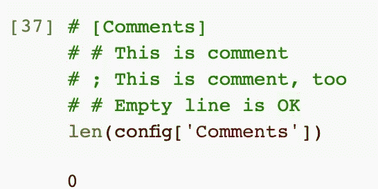

如果一个节是缩进的，或者在节头或键的前面有意外的空格，就不会有任何问题。

```
#     [Indented Section]
#         name=Christopher Tao
config['Indented Section']['name']
```

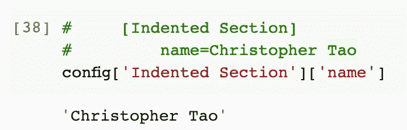

# 摘要


图片来自 [Pixabay](https://pixabay.com/?utm_source=link-attribution&utm_medium=referral&utm_campaign=image&utm_content=1197800) 的[诺尔·包萨](https://pixabay.com/users/noel_bauza-2019050/?utm_source=link-attribution&utm_medium=referral&utm_campaign=image&utm_content=1197800)

在本文中，我介绍了一个名为`configparser`的 Python 内置库。它允许我们动态地从文本文件中读取和写入参数。它还提供了许多现成的特性，例如将值读入某些数据类型和回退值。它还支持多种键值对格式，可以很好地处理注释、空键和无用的缩进。

<https://medium.com/@qiuyujx/membership>  

如果你觉得我的文章有帮助，请考虑加入 Medium 会员来支持我和成千上万的其他作者！(点击上面的链接)

> *除非另有说明，所有图片均出自作者之手*