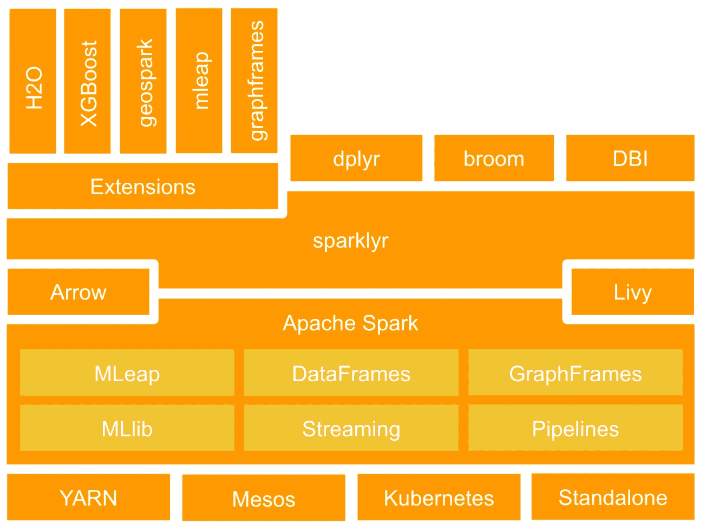
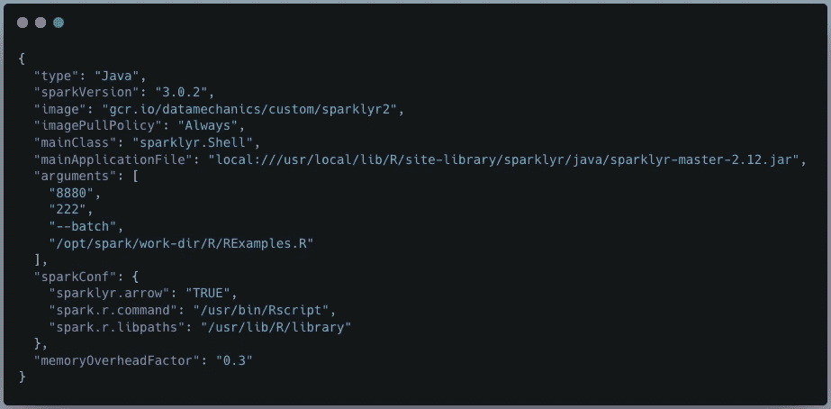
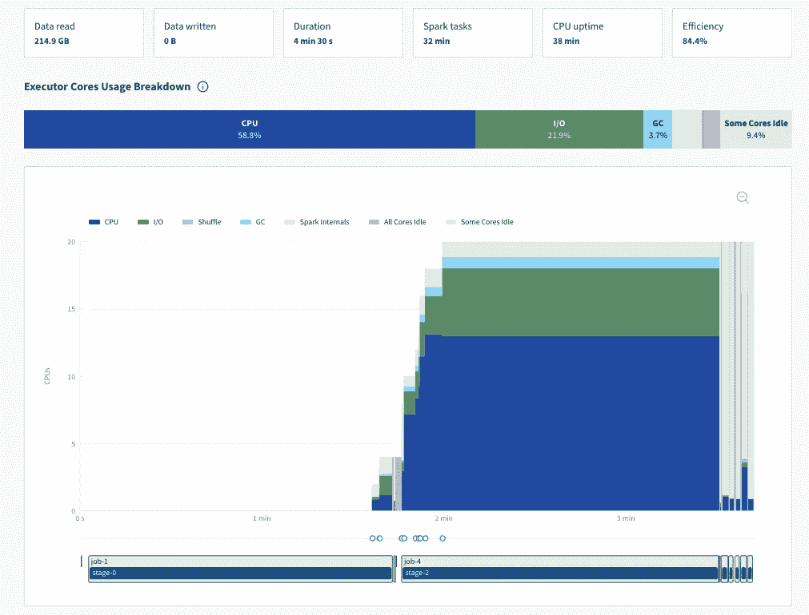

# 借助 Spark-on-Kubernetes 大规模运行您的 R (SparklyR)工作负载

> 原文：<https://towardsdatascience.com/run-your-r-sparklyr-workloads-at-scale-with-spark-on-kubernetes-3db4f26d3348>

# 借助 Spark-on-Kubernetes 大规模运行您的 R (SparklyR)工作负载

## 教程:如何建立正确的 Docker 映像，开始您的 Spark 会话，并大规模运行！

r 是一种用于统计计算的编程语言。它被统计学家和数据科学家广泛使用。长期以来，在单台机器上运行应用程序已经足够了，但是当需要更多数据和高级分析时，这就成了一个限制因素。

这就是为什么 R 社区开发了 [sparklyr](https://spark.rstudio.com/) 来使用 Apache Spark 扩展数据工程、数据科学和机器学习。它支持 Apache Spark 用例:Batch、Streaming、ML 和 Graph、SQL，此外还有众所周知的 R 包:dplyr、DBI、broom。更多信息可以在 [sparklyr.ai](https://sparklyr.ai) 上找到。

**Spark lyr 如何建立在 Spark 之上**(来源: [sparklyr.ai](https://sparklyr.ai) ，根据 Apache License 2.0 授权商业使用转贴)

问题是，Sparklyr 和 Apache Spark 之间的集成很脆弱，很难得到库和环境设置的正确组合。我们的一个客户试图让它在 EMR 上工作，并将其描述为“一场噩梦”。相反，通过构建他们自己的 Docker 映像并在我们的 Spark-on-Kubernetes 平台上运行，他能够使他的 SparklyR 设置可靠地工作。

因此，让我们看看如何使用 Spark-on-Kubernetes 让您的 SparklyR 应用程序大规模运行！本教程的所有代码都可以在这个 [Github 库](https://github.com/datamechanics/examples/tree/main/sparklyr-example)上获得。

# 要求

您必须配置 Docker 映像。这是最困难的部分，但我们为你做到了！下面的 dockerhub 文件使用了我们发布的一张图片作为基础——参见这篇[博客文章](https://www.datamechanics.co/blog-post/optimized-spark-docker-images-now-available)和我们的 [dockerhub](https://hub.docker.com/r/datamechanics/spark) 资源库，了解关于这些图片的更多细节。‍

作者代码。[全公开回购](https://github.com/datamechanics/examples/tree/main/sparklyr-example)。

您可以在 RUN install2.r 部分调优您的包。 [Tidyverse](https://www.tidyverse.org/) 包含了很多众所周知的包，比如 dplyr，ggplot2。一旦您的映像被构建并在注册表中可用，它就包含了您所有的依赖项，在您运行应用程序时需要几秒钟的时间来加载。

# 开发您的 SparklyR 应用程序

首先，我们将向您展示一些代码示例。您可以在 [sparklyr github repo](https://github.com/sparklyr/sparklyr) 中找到更多示例。有两个关键话题:

*   创建 Spark 会话
*   理解 R 对象是 Spark 数据帧或 R 数据集的接口。

有经验的 Sparklyr 开发者可以查看 Spark 会话的创建，然后直接切换到*大规模运行 Spark 应用*。

## 创建 Spark 会话

作者代码。[全公开回购](https://github.com/datamechanics/examples/tree/main/sparklyr-example)。

## 如何操作你的 R 对象和火花数据帧

没有比阅读代码示例更好的学习方法了(见下文)！以下是需要注意的主要事项:

*   sparklyr **copy_to** 函数返回对生成的 Spark 数据帧的引用，作为 **tbl_spark** 。返回的对象将作为底层 Spark 表的 dplyr 兼容接口([见文档](https://dplyr.tidyverse.org/reference/copy_to.html))。
*   您可以使用 **spark_apply** 将 R 函数应用于 Spark 数据帧
*   您可以通过调用 **tbl_cache** (或 **tbl_uncache** )显式缓存(或取消缓存)Spark 数据帧
*   可以用 [**dbGetQuery**](https://www.rstudio.com/blog/sparklyr-r-interface-for-apache-spark/) 用 SQL 查询 Spark 表
*   你可以用 **spark_read_parquet** (或 **spark_write_parquet** )读取(或写入)镶木地板表格
*   您可以使用 [**ggplot2**](https://datacarpentry.org/R-ecology-lesson/04-visualization-ggplot2.html) 包绘制您的 R 对象。
*   不要忘记在应用程序代码结束时用 **spark_disconnect** 关闭 Spark 会话。您仍然可以在这一行之后运行 R 代码，但是不能使用 Spark 运行任何分布式命令。

作者代码。[完全公开回购](https://github.com/datamechanics/examples/tree/main/sparklyr-example)。

# R‍un 你的星火大规模应用

您必须首先通过[模板或 configOverride](https://docs.datamechanics.co/docs/first-application) 定义一个数据机制配置。对于开源的 Spark-on-Kubernetes 用户来说，很容易适应这种配置，特别是如果你使用开源项目 [Spark-on-Kubernetes 操作器](https://github.com/GoogleCloudPlatform/spark-on-k8s-operator)。

示例数据机制配置(JSON)。来源:作者。

要执行的‍The 代码在文件 rexamples 中。这就是为什么 **mainApplicationFile** 指向 Docker 映像内部的本地路径。

然后，您可以使用 [Delight](https://github.com/datamechanics/delight) 来监控和优化您的 Spark 应用程序，这是一个适用于 Spark 的开源监控 UI，可以在任何 Spark 平台(商业/开源、云/本地等)上运行。

来自 [Delight](https://www.datamechanics.co/delight) UI 的截图。来源:作者。

特别感谢在 Data Mechanics 平台上运行 SparklyR 工作负载的客户分享他们的技巧和设置。我们希望本教程能帮助你成功使用 Spark 和 R！

*最初发表于*[*【https://www.datamechanics.co】*](https://www.datamechanics.co/blog-post/tutorial-run-your-r-sparklyr-workloads-at-scale-with-spark-on-kubernetes)*。*