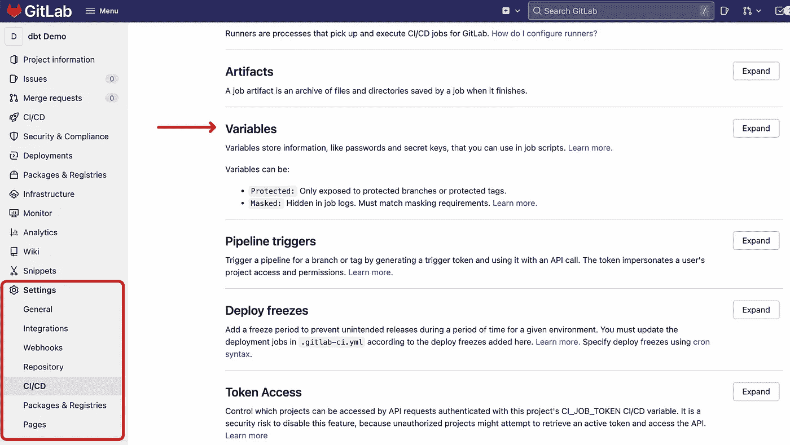
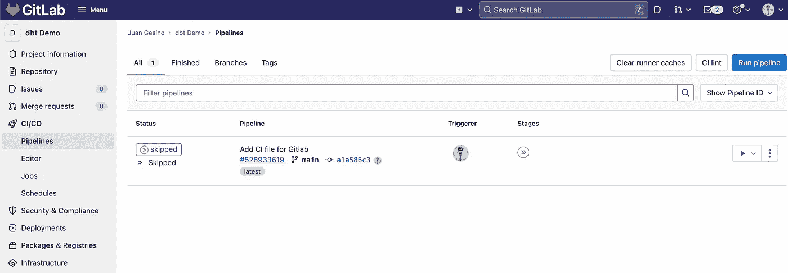
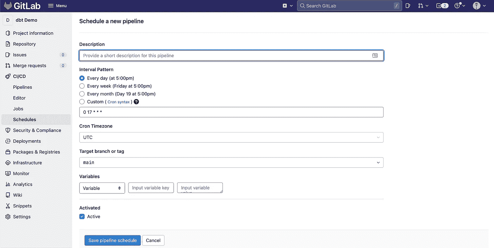

# 使用 Gitlab CI/CD 运行 dbt

> 原文：<https://towardsdatascience.com/running-dbt-using-gitlab-ci-cd-8a2ef0f05af0>

## 免费部署、运行和安排 dbt 的最简单方式

由 [Samuel Sianipar](https://unsplash.com/@samthewam24?utm_source=unsplash&utm_medium=referral&utm_content=creditCopyText) 在 [Unsplash](https://unsplash.com/) 拍摄的照片

我第一次实现 [dbt](https://www.getdbt.com/) 是在 [Sirena](https://www.sirena.app/en-us/) 管理数据团队的时候，我立刻成为了它的超级粉丝。我们用它来运行我们所有的转换，并在我们的数据仓库中创建我们的模型([雪花](https://www.snowflake.com/))。能够将维度建模应用于我们的数据，尤其是有大量非结构化数据来源的数据，确实是一个游戏规则的改变者。更好的是，我们所有的模型和业务逻辑都受版本控制，变化完全可见，协作极其容易。不过，我最喜欢的部分可能是它在原始数据和业务实体之间创建的抽象层。例如，我们可以创建一个`dim_customers`模型，并从生成模型的原始数据中完全提取出我们公司客户的唯一真实来源。对于我们的利益相关者来说，他们在 BI 工具中使用的表格是来自我们的 CRM、产品数据库、ERP 还是客户成功软件并不重要。重要的是，在这张表中，他们可以找到我们客户的所有信息，这对他们来说是完全透明的。如果我们的数据源上游发生了变化，我们作为一个数据团队可以通过这个抽象层修复这些变化。更令人惊讶的是，希望没有人必须处理这一点，它允许我们在数据源中进行巨大的更改(例如 CRM 迁移或同时运行多个 CRM)，同时最小化对我们的 BI 层的影响(是的，我有一些战斗伤疤)。哦，还有，所有这一切都得益于 SQL 的简单性。太神奇了。

正如我提到的，我们对 dbt 项目进行版本控制，为此我们使用了 Gitlab。当我看到 Gitlab 数据团队的视频[解释他们如何使用 Gitlab CI 运行 dbt 时，这变得非常有趣。同时，Gitlab 作为一家开源公司，让他们的 dbt 项目](https://www.youtube.com/watch?v=-XBIIY2pFpc&t=1301s)[的所有代码完全可用](https://gitlab.com/gitlab-data)。我建议你在那里花一点时间，很多有用的东西。

在这篇文章中，我将详细介绍如何使用 [Gitlab 的 CI/CD](https://docs.gitlab.com/ee/ci/) 来“部署”您的 dbt 项目。注意，使用 [Github 动作](https://github.com/features/actions)可以实现类似的工作流程。

# 入门指南

Gitlab 的 [CI/CD 工具非常容易使用，你需要做的就是在你的库的根目录下创建一个名为`.gitlab-ci.yml`的文件。这个](https://docs.gitlab.com/ee/ci/)[文件基本上是 Gitlab 应该如何执行管道的配方](https://docs.gitlab.com/ee/ci/yaml/index.html)。在本帖中，我们将回顾我们可以实现的最简单的工作流，重点是在生产中运行 dbt 模型。我将在后面的文章中讨论如何进行实际的 CI/CD(包括测试)、生成文档和存储元数据。现在，我们的目标是能够每天运行`dbt build`，这样我们所有的模型都是最新的。

这是一个使用 Gitlab 的 CI/CD 运行 dbt 的最简单设置之一的`.gitlab-ci.yml`文件示例:

我们首先定义希望在管道中运行的阶段。在这种情况下，我们将只有一个阶段称为`deploy-production`。如果我们现在忽略`.gitlab-ci.yml`文件的中间部分，直接跳到底部，我们可以看到我们定义了这个阶段实际做什么:

因为我们将`when`参数( [docs](https://docs.gitlab.com/ee/ci/yaml/index.html#when) )定义为只有`manual`，这个阶段只有在通过 Gitlab 的 UI 触发后才会运行。除此之外，stage 还定义了一个名为`TARGET_NAME`的变量，其值为`postgres`(稍后会详细介绍)。当谈到这个阶段实际上做什么时，它只是扩展了`.deploy`中的定义。同时，`.deploy`由`dbt_jobs`的定义延伸而来，也就是`.dbt_run`。这由下面一行指定:`<<: *dbt_jobs`，它实际上插入了`dbt_jobs`定义。

查看`.dbt_run`,我们看到我们定义了运行所有内容的映像，在本例中是`python:3.8.1-slim-buster` Docker 映像( [docs](https://docs.gitlab.com/ee/ci/yaml/index.html#image) )。之后，我们运行一些脚本来安装依赖项，并定义一个名为`CI_PROFILE_TARGET`的变量。为此，我们使用之前定义的`TARGET_NAME`变量。在这种情况下，`CI_PROFILE_TARGET`变量看起来会像`--profiles-dir . --target postgres`。你大概可以看到这是怎么回事。我们可以在运行 dbt 命令时使用这个变量来指定到我们的`profiles.yml`的路径和我们想要使用的目标。

就`profiles.yml`而言，我们可以使用与[相似的设置，使用 docker](https://juangesino.medium.com/setup-dbt-using-docker-7b39df6c6af4) 运行 dbt，从 env 变量获取数据仓库凭证。

使用 [Gitlab 的 CI/CD 变量](https://docs.gitlab.com/ee/ci/variables/)设置这些变量非常容易:

在 Gitlab 中添加 CI/CD 变量(图片由作者提供)

之后，我们终于可以看一看`.deploy`了。由于添加了 0.21.0 中引入的`dbt build` [命令，我们可以简单地安装依赖项，然后运行`dbt build`命令，该命令将根据我们的 dbt DAG 按照运行模型、测试、快照和种子的顺序来处理它们。](https://docs.getdbt.com/reference/commands/build)

就这样，如果我们将代码推送到 Gitlab，我们应该会看到一个新的管道被创建，我们可以手动触发它(记住，因为有了`when: manual`配置)。一旦我们这样做了，我们的 dbt 项目就会运行。

在 Gitlab 中检查 CI/CD 管道(图片由作者提供)

# 安排 dbt 每天运行

使用这个设置，至少有两种方法可以安排 dbt 每天运行。第一种方法是使用 Gitlab 内置的[流水线调度](https://gitlab.com/help/ci/pipelines/schedules)，第二种方法是使用 [Gitlab 的 API](https://docs.gitlab.com/ee/ci/triggers/) 触发流水线。

## 流水线调度

这可能是最简单、最直接的方法。在 Gitlab 的 CI/CD 部分下，有一个用于创建管道计划的部分。

您可以按照说明每天运行管道，或者以任何频率运行您的 dbt 模型。

## 通过 API 触发管道

安排管道的另一种方式是使用您当前正在使用的任何编排工具，例如[气流](https://airflow.apache.org/)或 [Dagster](https://dagster.io/) 。这还有一个额外的好处，就是可以与数据管道的其余部分集成在一起。使用它，您可以在数据加载到仓库后触发 dbt 构建。

您可以在这里找到用于触发管道[的 API 文档，但是基本上您需要做的就是](https://docs.gitlab.com/ee/ci/triggers/)[创建一个触发令牌](https://docs.gitlab.com/ee/ci/triggers/#create-a-trigger-token)，并在对 URL: `https://gitlab.example.com/api/v4/projects/<project_id>/trigger/pipeline`的`POST`请求中使用它。这种方法的一个惊人的特性是，您可以将变量传递给管道。这意味着，当数据管道的不同部分已经加载时，您可以触发 dbt 的构建。

以下是如何使用 Python 触发管道的示例:

请记住，要做到这一点，您需要移除`when: manual`条件。

# 进一步的改进

希望这篇文章向您展示了如何将 Gitlab CI/CD(或 Github Actions)与 dbt 结合使用。然而，我希望这能成为灵感，因为有很多方法可以利用这一点。例如，在 [Sirena](https://www.sirena.app/en-us/) 和 [Zenvia](https://www.zenvia.com/) 中，我们使用此工作流来利用雪花零拷贝克隆进行实际的 CI/CD。每当一个合并请求(或拉请求)被创建时，它将触发一个管道来克隆我们的雪花数据库，并在其上运行代码更改和测试。这给了我们很大的信心，我们的改变不会引入任何问题。我们使用这个工作流实现的另一件事是存储元数据并生成 dbt 文档来记录我们的数据仓库。如果这一切听起来很有趣，请考虑[在媒体上关注我](https://juangesino.medium.com/)，因为我将在未来创造更多关于这方面的内容。