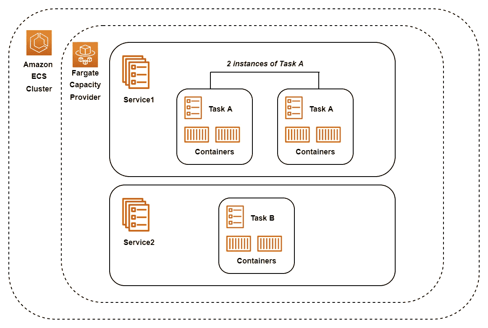
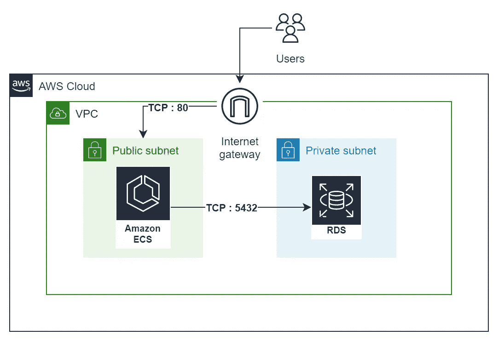
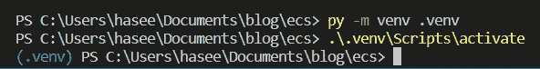
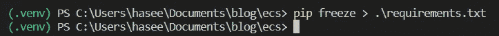
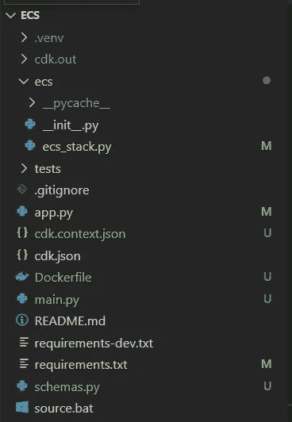
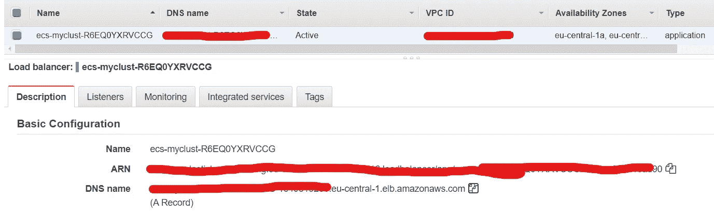
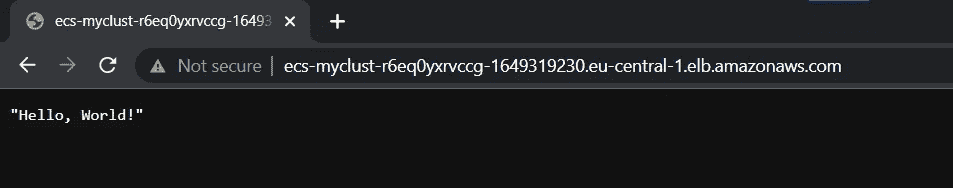

# 在云中运行无服务器应用程序—教程

> 原文：<https://towardsdatascience.com/running-serverless-applications-in-the-cloud-a-tutorial-2b5b38457d8d>

## 为什么没有服务器？又是怎么做到的？AWS ECS 的实际应用


作者照片

在这篇文章中，我们将在 AWS 上设计和部署一个 FastAPI 应用程序。

我们将使用无服务器计算服务和托管数据库服务来设计应用程序。这种微服务架构有助于构建一个解耦系统，从而提高健壮性。接下来，我们使用 AWS CDK 将我们的整个基础设施捆绑成代码。这样做的好处很多。简而言之，它使部署和基础设施更新更加容易。它允许在 VCS(版本控制系统)如 git 中提交定义基础设施的整个代码。

但是什么是无服务器，我们为什么需要它？

# 无服务器简介

AWS 提供了几个无服务器计算选项。有了无服务器计算，我们无需担心服务器的管理和配置。安装补丁、更新和安全修复等维护任务完全消失了。这释放了时间和资源。我们也不需要担心容量供应，因为如果负载增加，AWS 会自动扩展实例。无服务器计算选项提供随用随付的定价模式。这意味着我们只为我们实际使用的计算时间付费。根据用例，这可以降低运行我们软件的相关成本。

## EC2 上的 Docker 和对 ECS 的需求

在介绍这个架构之前，我们先看看如何使用简单的虚拟服务器(AWS EC2)在 AWS 中运行一个容器化的应用程序。

涉及的步骤有:

1.  构建 Docker 映像
2.  部署 EC2 实例
3.  管理 Docker 应用程序和 EC2 实例
4.  为 EC2 实例付款

这似乎很简单。但是也有一些不利的方面。

首先，我们需要管理我们的 EC2 实例。所以随着时间的推移安装更新和补丁。其次，我们需要管理 Docker 应用程序。万一容器停止工作，或者 FastAPI 版本需要更新，我们需要手动更新容器。这可能会很麻烦，因为正在运行的容器需要停止。

另一点是规模。生产系统是由数百个容器组成的大规模系统。使用上述方法同时运行几个容器是不可行的。我们需要分别管理每个容器。例如，确保容器平稳运行(健康检查)，并且它们可以安全地相互通信。或者在不危及整个应用程序的情况下更新容器使用的图像。如果用户需求增加，我们如何处理增加容器数量的用例？类似地，对于如此多的容器，负载平衡变得至关重要，因为我们不想让选定的几个容器不堪重负，而让其他容器闲置。

AWS ECS 可以帮助我们解决所有这些问题，甚至更多。

## AWS ECS

*为了简单起见，我们只考虑 Fargate 上的 AWS ECS，不考虑 EC2。*

弹性集装箱服务。这是一个容器编排服务，允许我们运行和管理容器化的 Docker 应用程序。对于可能有数百个容器的大型工作流，管理它们既具有挑战性又非常耗时。这里有一张解释 ECS 的图表。



用 Fargate、服务和任务说明 AWS ECS。图片作者。

ECS 由以下组件组成:

*   集群——这只是一个被称为容量提供者的 Fargate 实例的逻辑分组。任务在运行前被放入集群。
*   AWS Fargate — Fargate 与 ECS 集成，并“在幕后”提供无服务器计算服务。Fargate 本质上运行我们的 Docker 容器，而我们不必担心管理服务器。
*   服务—服务允许您指定希望运行多少任务，是否希望启用负载平衡等。一个集群中可以有多个服务。例如，您可以让一个服务处理所有生产流量(生产环境)，另一个服务处理测试/开发流量(测试环境)。上图中，您可以看到集群中运行着两个服务— *服务 1* 和*服务 2* 。任务在服务内部运行。
*   任务定义——这是一个用 JSON 编写的模板文件。它就像一个蓝图，指定运行什么容器、内存和 CPU 规格、应该打开什么端口以及其他配置，如使用什么 Docker 映像。本质上，它定义了要运行的实际代码。
*   任务—这是任务定义的实例。它可以是挂起、运行或停止。正在运行的任务意味着任务定义中指定的所有容器都正在运行，即您的应用程序正在运行。
    还可以运行几个任务来处理应用程序的大负载。在上图中，有两个*任务 A* 的实例在*服务 1 中运行。*

# 架构图

架构图如下所示:



AWS 架构图。图片作者。

首先，我们使用虚拟私有云(VPC)。这是我们专用的 ip 地址集合，与我们的 AWS 帐户相关联。一个因特网网关被连接到 VPC，以便于与因特网的连接。

FastAPI 应用程序将在公共子网内的 ECS 上运行。PostgreSQL 数据库将在私有子网内的 RDS(关系数据库服务)上运行。RDS 只是 AWS 提供的一项托管数据库服务，意味着 AWS 为我们管理数据库。

用户请求被路由到 ECS，因为它位于公共子网内。在本教程中，这是通过简单的 HTTP，端口 80 完成的。对于所有实际使用案例，这应该在 HTTPS 端口 443 上完成。RDS 禁止任何公共访问。这是因为它存储了敏感的用户数据。但是，由于 ECS 和 RDS 在同一个 VPC 中，所以 ECS 可以与 RDS 通信来存储和检索数据。这是通过默认的 PostgreSQL 端口 TCP: 5432 完成的。

# 密码

***完整的回购代码是*** [***这里的***](https://github.com/CrimsonScythe/ecs-intro) ***。***

*这篇文章假设你的系统已经安装了 AWS CLI 和 CDK。*
*如果没有请查看此* [*帖子*](https://haseebkamal.com/deploying-a-static-site-with-aws-cdk/) *获取教程。*

好了，现在我们终于可以进入正题，写一些实际的代码了👩🏾‍💻

第一站，CDK！

## CDK 初始化

创建一个名为`ecs`
的新项目目录，运行以下命令为 CDK 创建一些样板代码:

```
cdk init sample-app --language python
```

如果在 Python 中创建 venv 时出现错误，可以执行以下命令为 Python 创建一个新的虚拟环境:

```
py -m venv .venv
```

然后使用以下命令激活它:

```
.\.venv\Scripts\activate
```



创建和激活 Python 虚拟环境

启用虚拟环境后，我们可以通过以下方式安装 Python 依赖项:

```
pip3 install -r requirements.txt
```

编辑`app.py`并确保提供了地区和帐户。它应该是这样的:

接下来，打开`ecs_stack.py`。这是我们定义要创建的架构和资源的地方。
粘贴以下代码:

我们从定义一个`vpc`开始。您可以将此视为与您的帐户相关联并可供使用的 ip 地址的集合。

接下来，我们定义两个安全组，一个用于数据库，另一个用于 fargate。安全组的作用类似于有状态的防火墙，默认情况下，它们允许所有传出的网络流量并阻止所有传入的流量。我们明确允许通过 TCP 从 fargate 连接到我们的数据库服务器。

接下来，我们创造秘密。这些可以是任何东西，包括 API 密钥、数据库凭证或其他需要存储和访问的敏感数据。通过 AWS secrets manager，可以轻松地存储、检索和循环使用，以获得最大的安全性。在这里，我们为数据库实例创建凭证。我们提供用户名为`postgres`，让 cdk 自动为我们生成一个密码。这里的好处是我们不会暴露代码中的秘密，因为我们可以简单地传递`templatedSecret`变量来引用敏感的密码。

我们创建一个新的数据库实例，将`templatedSecret`作为凭证传入，并将之前创建的安全组传入。

最后，我们创建一个新的 fargate 服务。默认情况下会创建一个应用程序负载平衡器，但其详细信息不在讨论范围之内。这里最重要的事情是我们提供了一个到 docker 映像的路径。我们将用户名和密码作为`task_image_options` `secrets`传递，并将数据库实例的端点作为`environment`变量传递。这允许 docker 容器能够连接到数据库。注意我们没有以明文形式传递任何东西！甚至数据库实例端点也是在运行时自动生成的，所以我们事先并不知道，但我们只是用`rdsInstance.db_instance_endpoint_address`将它传递给 fargate。

最后，我们添加了对`rdsInstance`的依赖。这确保了数据库在 fargate 服务之前创建。否则，我们的 FastAPI 应用程序将无法连接。

太好了！大部分工作已经完成。
接下来，我们需要为 ECS 创建一个 FastAPI 应用程序和一个 docker 文件。

## REST API 与 FastAPI

确保虚拟环境已激活，并逐一安装以下软件包:

```
pip3 install psycopg2 
pip3 install fastapi 
pip3 install uvicorn[standard] 
pip3 install sqlalchemy
```

接下来，在根目录下创建一个`main.py`文件。
为`main.py`粘贴以下代码:

这是一个简单的 REST API，有两个端点。我们可以存储一个`book`或者基于`book_name`检索一个`book`。在第 30 行，我们为插入和检索数据库记录所需的`book`创建了一个数据库模型。

注意如何简单地引用`username`、`password`和`endpoint`作为环境变量。这是可行的，因为我们在前面的 CDK 代码中明确地将它们作为秘密和环境变量传递。

我们还需要为 FastAPI 创建一个 Pydantic 数据模型。这具有在向端点发出请求时提供输入数据的自动验证的优点。例如，当 POST 请求存储一本新书时，pydantic 会自动验证是否提供了正确的`book`字段。继续在名为`schemas.py`的新文件中创建一个 Pydantic 模型。
应该是这样的:

现在开始有趣的部分！

## Dockerfile 文件

而在根目录下运行`pip freeze > requirements.txt`得到一个`requirements.txt`。这是建立我们码头工人形象的需要:



pip 冻结要求

在根目录下创建一个新的`Dockerfile`，如下所示:

我们简单地提取 Python:3.9 的官方 Docker 映像，设置一个命名的工作目录，我们将在后面引用它。然后我们在`requirements.txt`上运行一个 pip 安装，最后将所有代码从我们的主机复制到 Docker 容器中。容器运行时执行最后的`CMD`命令。
在这种情况下，它启动了我们的 FastAPI 应用程序。

您现在应该有一个如下所示的目录结构:



项目目录结构

好了😇为自己出色的工作给自己一点鼓励！
现在最激动人心的时刻到来了！

## 部署🚀

***注意:*** ***运行下面的命令将向您的 AWS 帐户支付费用。***

喝杯咖啡，然后跑步:

```
cdk deploy
```

这将启动资源的创建并部署应用程序。

***请耐心等待。这一步可能需要几分钟。***
***如果几分钟后控制台上看不到任何输出，点击*** `CTRL+C` ***，然后点击*** `cdk destroy`。在这种情况下，您可以直接联系我/在下面评论，以获得故障排除帮助。

## 瞧吧🎆

我们需要获得`ECS`任务的 ip 地址来与服务器交互。
因为我们启动的 fargate 任务包含一个负载平衡器，所以我们使用负载平衡器的名称`DNS`。这是 AWS 自动生成的。继续在 AWS 控制台上搜索`EC2`。在左侧导航窗格中，找到并选择`load balancers`。打开的页面应该会列出一个负载平衡器。从描述中复制`DNS name`。



从负载平衡器获取 DNS 名称

粘贴复制的 URL 并在浏览器上点击 enter。您应该看到:



到达端点以测试应用程序

您还可以使用 Postman 或类似的命令，通过 POST 和 GET 调用 API 端点。

***记得销毁堆栈，防止跑费。
从终端执行以下命令，销毁所有创建的资源:***

```
cdk destroy
```

***请耐心等待，这可能需要几分钟。
您也可以通过在 AWS 控制台中搜索*** `***Cloudformation***` ***来手动删除堆栈。***

销毁堆栈后，您可能需要检查任何 RDS 快照。在控制台中搜索 RDS，并在左侧导航窗格中找到`Snapshots`。如果您看到列出了任何快照，请将其全部删除。

# 结论

在本文中，我们研究了如何在 AWS ECS 和 RDS 上部署 FastAPI 应用程序。

我们剖析并描述了 ECS(一种无服务器计算服务)的时间和资源优势。我们还使用了 RDS——一种托管数据库服务，AWS 负责为我们管理服务器。同样，像 ECS 一样，我们获得了不需要管理服务器的好处。

为了实现自动化部署，我们使用了 AWS IaC(基础设施即代码)产品 CDK。通过 CDK，我们可以将我们的架构定义为代码，轻松地将其提交给版本控制，并在未来进行更改等等。这也使得将来更改和更新基础设施变得更加容易。

希望你喜欢这篇相当长的帖子。

***如果你喜欢这部作品，可以考虑关注并订阅*** [***这里***](https://medium.com/subscribe/@haseebkamal98) ***。***

*原载于 2022 年 8 月 26 日*[*https://haseebkamal.com*](https://haseebkamal.com/running-serverless-applications-in-the-cloud/)*。*