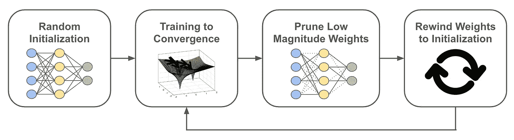
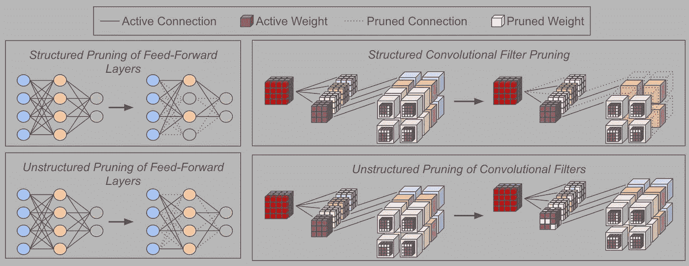
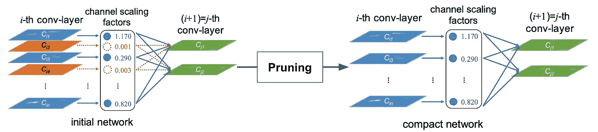
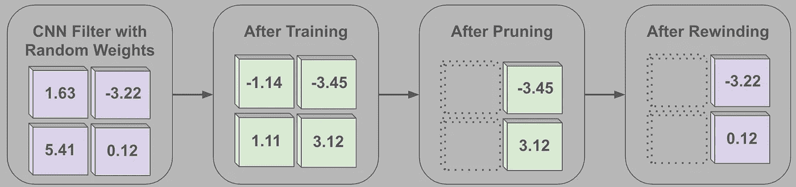
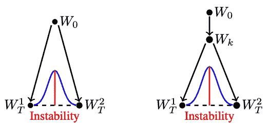

# 彩票假说的传奇

> 原文：<https://towardsdatascience.com/saga-of-the-lottery-ticket-hypothesis-af30091f5cb>

## 中奖彩票是如何被发现、揭穿和重新发现的

(作者创作)

彩票假设(LTH)与神经网络修剪相关，可以通过下面的陈述简明地概括出来[1]:

> “密集的、随机初始化的前馈网络包含子网(中奖票)，当独立训练时，在相似的迭代次数下，达到与原始网络相当的测试精度。”

虽然有点难以解释，但这种说法表明，如果我们:

*   训练神经网络收敛
*   修剪它的权重，产生一个更小的子网
*   将子网权重倒回其原始的随机初始化值
*   训练产生的子网收敛

然后，子网(通常被称为“中奖票”)将实现匹配或超过子网所源自的原始密集神经网络性能的测试精度。

这样的观察对于深度学习社区来说很有趣，因为这意味着随机子网络存在于密集网络中，即 *(i)* 更小/计算效率更高，并且 *(ii)* 可以被独立训练以表现良好。如果这些中奖彩票可以很容易地被识别出来，那么通过简单地训练子网络而不是完整的密集模型，神经网络的训练成本就可以大大降低。

通过 LTH 启发的发现来降低训练复杂性的目标尚未实现，因为发现中奖彩票需要密集网络的全部(或部分[2])预训练，这是一个计算繁重的过程。但是，深度学习社区继续研究 LTH，因为它有可能通知和简化神经网络训练。

# 背景资料

在进入主题之前，我将提供理解 LTH 所需的相关背景信息。我的目标是通过提供相关背景的全面总结来建立对该主题的基础理解。然而，在某些情况下，提供一个主题的完整概述是不实际的或不在范围之内的，所以我提供了外部资源的链接，可以用来更深入地理解一个观点。

## **什么是神经网络修剪？**

为了充分理解 LTH，人们必须熟悉 LTH 所基于的**神经网络修剪**【3，4，5】。剪枝背后的基本思想是从一个大型、密集的网络中删除参数，产生一个更小、计算效率更高的(可能是稀疏的)子网。虽然我在这里引用了一些关于神经网络修剪的最有用的论文，但是网上有许多高质量的资源[有助于探索。](https://jacobgil.github.io/deeplearning/pruning-deep-learning)

理想情况下，修剪后的子网应该表现得与密集网络相似，尽管如果移除大量参数，情况可能并非如此。因此，修剪过程的目标是找到并移除不会显著损害网络性能的参数。

在大多数情况下，神经网络修剪遵循预训练、修剪和微调的三步过程。密集网络首先被部分地或收敛地预训练。然后，在这个密集网络上执行修剪，并且在修剪发生之后，进一步训练/微调所产生的子网。

## 不同类型的修剪

描述前馈和卷积网络的结构化和非结构化修剪方法(由作者创建)

存在许多用于神经网络修剪的技术，但是它们可以粗略地分为两组— **结构化和非结构化修剪**。

**非结构化修剪**对修剪过程没有任何限制。网络中的任何和所有权重可以被单独修剪/移除，这意味着在执行修剪之后，所得到的网络通常是稀疏的。

相比之下，**结构化修剪**移除整个权重“组”(例如，卷积滤波器、前馈层中的神经元、变压器中的注意力头等)。)一起从基础网络中分离出来，以避免产生的子网中的稀疏性。因此，子网只是一个更小、更密集的模型。

结构化和非结构化修剪方法(如上图所示)都被广泛使用——没有一种方法一定“更好”。非结构化修剪允许在不降低性能的情况下达到更高的稀疏度，因为它对修剪过程的约束更少。然而，结构化修剪具有产生密集子网的额外好处，从而允许避免使用用于稀疏矩阵乘法的专用库，这通常会使网络训练/推理慢得多。

## 迭代幅度修剪(IMP)

*基于信道比例因子的卷积神经网络的 IMP(来自【8】)*

最常用于研究 LTH 的神经网络修剪类型是**迭代幅度修剪(IMP)**【4】，其操作如下:

1.  从一个训练有素的密集模型开始
2.  选择并修剪网络中的最低幅度权重
3.  微调/训练产生的子网进行收敛
4.  重复步骤(2)-(3)，直到达到所需的修剪比率

尽管 IMP 背后的想法看起来很简单，但是这种方法在实践中非常有效，并且已经证明了自己是一个难以超越的基线[4，5]。因为 IMP 运行得如此之好，许多有用的解释都可以在网上找到。

当应用于结构化修剪或用于更复杂的网络变体时，IMP 有时会被修改。例如，用于卷积神经网络中结构化滤波器修剪的 IMP 的一个变体为网络中的每个通道分配单独的缩放因子，然后基于这些因子的大小而不是权重本身来修剪滤波器[8]。请参见上图中的示意图。

# **出版物**

在此，我将概述与 LTH 相关的三份重要文件。我考虑的第一个作品提出了 LTH，而其他作品则进一步分析了这个想法并提供了有用的见解。有趣的是，LTH 在其提议后不久就被部分揭穿，随后在原作者的后续论文中得到证实(有所修改)。围绕这个话题的争论导致了研究界的许多困惑，我将尽力在这里澄清这些困惑。

## **彩票假说:寻找稀疏的、可训练的神经网络[1]**

*描绘在 LTH 发现中奖彩票的 IMP +倒带(作者创作)*

**主旨。**模型可以很容易地削减到总参数的< 10%。但是，如果我们:

*   采用修剪过的网络的结构/架构
*   随机重新初始化其参数
*   从头开始训练网络

子网的性能会很差。这篇论文发现，在随机初始化的密集网络中存在特殊的子网，称为“中奖票”，当独立训练时，这些子网可以与完全训练的密集网络的性能相匹配。这种现象被创造为彩票假说(LTH)，正如本综述的第一段所解释的。

**方法论。** 为了验证 LTH，作者采用了一种非结构化的剪枝方法。使用的修剪技术非常类似于 IMP，只有一个小的不同。也就是说，为了产生中奖彩票，作者进行如下操作:

1.  从一个训练有素的密集模型开始
2.  选择并修剪网络中的最低幅度权重
3.  将剩余的子网参数倒回它们的初始随机值
4.  训练子网收敛
5.  重复步骤(2)-(4)，直到达到所需的修剪比率

上述方法与 IMP 的主要区别在于模型参数的重绕。修剪后，参数被重置为其原始的随机值，而不是简单地微调现有的模型参数。

通过这种方式，获胜的彩票——它的结构和权重——存在于随机初始化的密集网络中。因此，这个子网被显示已经赢得了“初始化彩票”，因为它可以从零开始被训练到比完全训练的密集网络或具有相同结构的随机重新初始化的子网更高的精度。

**调查结果。**

*   使用全连接网络和小规模 CNN 在 MNIST 和 CIFAR10 数据集上对 LTH 进行了经验验证。发现原始网络大小的 10–20%的中奖票持续存在。
*   在许多情况下，中奖票比原始稠密网络具有更好的泛化性能。
*   在培训前随机重新初始化中奖彩票会损害性能。将参数恢复到初始随机值对于匹配或超越密集网络性能至关重要。

## **重新思考网络修剪的价值【5】**

**大意。** 简而言之，本文表明随机重新初始化并从头训练的子网与通过 IMP 获得的子网表现相似。这一结果与神经网络修剪文献[1，4]中的先前发现相矛盾，揭示了训练大型、过度参数化的模型对于获得更有效的子网络实际上是不必要的。

尽管该结果与一般的神经网络修剪更相关(即，不是特别的 LTH)，但是本文中的结果表明:

*   将子网参数恢复到初始值并不是 LTH 方法的必要组成部分——通过在迭代修剪期间随机重新初始化子网参数，可以获得相同的结果。
*   LTH 是一种无法在使用结构化剪枝和复杂网络架构的大规模实验中复制的现象。

**方法论。** 与最初的 LTH 出版物不同，这项工作中的作者在他们的大部分实验中利用了结构化修剪方法。虽然在某些情况下采用非结构化剪枝，但结构化剪枝更常用于大规模实验(例如，卷积网络的结构化滤波器剪枝[4])，使这种方法更合适。

研究了多种网络修剪方法(参见第 4 节标题和[5]中的描述)，这些方法执行:

*   **预定义结构修剪**:对每一层进行固定、均匀的修剪
*   **自动结构修剪**:动态决定每层应该修剪多少，而不是均匀修剪
*   **非结构化 IMP** :参见前面关于 IMP 的讨论

对于这些方法中的每一种，作者都遵循前面描述的三步修剪过程。对于第三步，从各种不同的参数初始化开始训练得到的子网:

*   将子网参数恢复到它们的初始随机值
*   保留/微调现有子网参数
*   随机重新初始化子网参数

作者发现，在大多数情况下，修剪后随机重新初始化子网参数匹配或超过其他方法的性能。因此，对于如此大规模的实验，LTH 无法得到验证。

**调查结果。**

*   子网参数的随机重新初始化足以实现有竞争力的子网性能，表明 LTH 在本研究探索的大规模实验中不成立。
*   LTH 和本文之间的发现差异可能是由 *(i)* 主要使用结构化剪枝进行分析， *(ii)* 使用更大的模型和数据集，或者 *(iii)* 优化和超参数设置的差异造成的。
*   从神经网络剪枝中获得的中奖票或高性能子网的参数并不重要，揭示了神经网络剪枝可能只不过是[神经架构搜索](https://lilianweng.github.io/posts/2020-08-06-nas/)的一种替代形式。

## **线性模式连通性和彩票假说【6】**

*当您在两个网络之间进行插值时，误差增加到超过两个网络的平均误差时，就会出现不稳定性(来自【6】)*

**主旨。**这项工作探索了上面论文中概述的问题— *为什么 LTH 在大规模实验中不成立？*作者发现，使用【1】中提出的方法，在大规模实验中无法发现中奖彩票。也就是说，这种子网不能达到匹配或超过密集网络的精度。

然而，有趣的是，如果修改这个过程，将权重倒回到某个早期的训练迭代 k，而不是严格地倒回到初始化，那么得到的子网表现良好。因此，如果方法稍微修改如下，LTH 在大规模实验中仍然成立:

1.  从一个训练有素的密集模型开始
2.  选择并修剪网络中的最低幅度权重
3.  将子网参数倒回训练迭代 k 的值
4.  训练子网收敛
5.  重复步骤(2)-(4)，直到达到所需的修剪比率

因为这种子网不是在随机初始化的密集网络中发现的，所以作者称它们为“匹配”子网，而不是赢得入场券。

**方法论。**为了发现 LTH 内这种有趣的重量重绕特性，作者采用了一种基于**线性模式连通性**的新型不稳定性分析。他们的分析方法执行以下步骤:

*   创建网络的两个副本。
*   用不同的随机种子独立地训练这些网络，使得网络在用随机梯度下降训练期间经历不同的随机噪声和数据排序。
*   确定两个生成的网络是否通过非递增误差区域线性连接。

实际上，上述方法的最后一步是通过测试两个网络权重之间固定数量的线性插值点来完成的。在这些点中的每一点上，测试插值网络的误差，以确保它不超过实际网络的平均误差值。

通过执行如上所述的不稳定性分析，作者发现网络在训练早期变得稳定，但在初始化时不稳定。此外，匹配子网总是稳定的，表明匹配子网不能从随机初始化的不稳定参数中导出。这样的观察解释了为什么 LTH 仅在权重被重新绕到一些早期训练迭代时成立，而不是一直到初始化。

**调查结果。**

*   LTH 在比例上不成立。但是，“匹配”子网可以通过修改 LTH 来发现，以将权重倒回到训练的某个早期迭代，而不是一直到初始化。
*   只有非常小规模的网络和数据集(如 MNIST 上的 LeNet)在初始化时是稳定的，这解释了为什么最初的 LTH 公式[1]只能在这样的小规模数据集上得到验证。
*   给定对 LTH 的这种修改，即使在 ImageNet 上使用最先进的卷积神经网络架构的大规模实验中，也可以一致地找到匹配的子网。

# 外卖食品

通过研究 LTH，我们了解了几个有用的概念:

*   **神经网络修剪**:通过去除不需要的权重，从一个经过充分训练的密集网络中生成一个更小、更高效的网络
*   **结构化与非结构化剪枝**:两类剪枝方法，对剪枝过程施加不同的约束
*   迭代幅度修剪:一种简单而有效的修剪方法，迭代地丢弃网络中最低幅度的权重
*   **线性模式连通性**:用于描述网络对随机梯度下降训练产生的噪声“稳定”的特性。

在概述的工作中，我们首先了解到——在小规模实验中——密集、随机初始化的神经网络包含子网络(即中奖彩票),这些子网络可以用 IMP 发现并隔离训练以实现高精度[1]。

这一发现后来与研究相矛盾，研究表明，在大规模实验中，这种中奖彩票可以随机重新初始化，仍然可以达到相当的准确性，这表明除了 IMP [5]发现的网络结构之外，这些中奖彩票没有什么特殊之处。

当表明虽然在随机初始化的密集网络中可能不存在中奖票，但是可以通过 IMP 在已经少量训练的网络中找到匹配子网(即，匹配或超过密集网络性能的子网)时，这种矛盾的结果得到解决[6]。因此，只要稍加修改，LTH 在大尺度上仍然有效。

## 结论

非常感谢你阅读这篇文章。如果你喜欢它，请订阅我的[深度(学习)焦点时事通讯](https://cameronrwolfe.me/signup)，在那里，我每两周对深度学习研究中的一个相关主题进行情境化、解释和检查。欢迎在[媒体](https://medium.com/@wolfecameron)上关注我或者访问我的[网站](https://cameronrwolfe.me/)，那里有我的社交媒体和其他内容的链接。如果您有任何建议/反馈，请直接联系我或留下评论。

## 文献学

[1]弗兰克，乔纳森和迈克尔卡宾。"彩票假说:寻找稀疏的、可训练的神经网络." *arXiv 预印本 arXiv:1803.03635* (2018)。

[2]尤，浩然等，“画早鸟票:走向更高效的深度网络训练” *arXiv 预印本 arXiv:1909.11957* (2019)。

[3] LeCun、Yann、John Denker 和 Sara Solla。"最佳脑损伤"*神经信息处理系统进展* 2 (1989)。

[4]李，郝等.“高效神经网络的剪枝滤波器” *arXiv 预印本 arXiv:1608.08710* (2016)。

[5]刘，庄等.“网络剪枝的价值再思考” *arXiv 预印本 arXiv:1810.05270* (2018)。

[6] Frankle，Jonathan 等人，“线性模式连接和彩票假说”*机器学习国际会议*。PMLR，2020 年。

[7]尤，浩然等，“画早鸟票:走向更高效的深度网络训练” *arXiv 预印本 arXiv:1909.11957* (2019)。

[8]刘，庄等.“通过网络瘦身学习高效卷积网络”IEEE 计算机视觉国际会议论文集。2017.