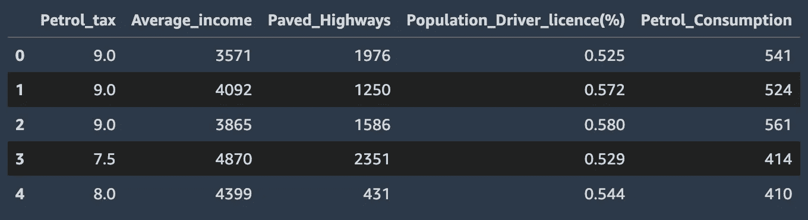
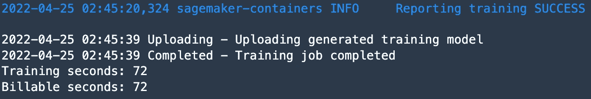
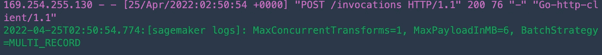

# SageMaker 批量转换

> 原文：<https://towardsdatascience.com/sagemaker-batch-transform-d94dbaf889f6>

## 使用 Sklearn 示例生成大型离线预测

图片来自[黄邦贤·法伯](https://unsplash.com/@farber)拍摄的 [Unsplash](https://unsplash.com/photos/6jpdeeA2GBU)

在我的上一篇文章中，我谈到了最新的 [SageMaker 推理选项](https://aws.plainenglish.io/what-sagemaker-inference-option-should-you-use-2e88c8fc70bf)中的[无服务器推理](/sagemaker-serverless-inference-is-now-generally-available-e42550a146fe)。一个更老但同样重要的选择是 [SageMaker 批量转换](https://docs.aws.amazon.com/sagemaker/latest/dg/batch-transform.html)。有时候，对于我们的机器学习模型，我们不一定需要一个持久的端点。我们只有一个**大型数据集**，我们希望为该数据返回**推断**。对于没有任何延迟需求的工作负载来说，这是一个很好的选择

使用 SageMaker 批处理转换，我们将探索如何使用 **Sklearn 回归模型**并在**样本数据集**上获得**推论**。本例中的数据集不一定很大，但实际上您可以对数千个数据点使用批量转换。一些非常流行的用例包括在您需要实时推理之前对数据集进行预处理，或者为计算机视觉工作负载处理图像数据。

**注意:**对于 AWS 的新用户，如果你想跟进，请确保在下面的 [**链接**](https://aws.amazon.com/console/) 中进行登记。批量转换作业的部署过程中会产生成本。本文还将假设您对 SageMaker 和 AWS 有一定的了解。

## 目录

1.  资料组
2.  设置
3.  批量转换示例
4.  其他资源和结论

## 资料组

对于我们的示例，我们将使用 Kaggle 的[汽油消耗回归数据集](https://www.kaggle.com/datasets/harinir/petrol-consumption)。原始数据源在这里被许可[。](https://creativecommons.org/publicdomain/zero/1.0/)

## 设置

对于我们的示例，我们将使用 Kaggle 的[汽油消耗回归数据集](https://www.kaggle.com/datasets/harinir/petrol-consumption)。在我们得出结论之前，我们将使用 SageMaker 训练一个 [Sklearn 随机森林模型](https://scikit-learn.org/stable/modules/generated/sklearn.ensemble.RandomForestRegressor.html)。在脚本中，我们还将拥有定制的推理处理程序，以便能够处理我们为推理而输入的 csv 数据集。在本例中，我们不会深入介绍整个培训设置，但是您可以在这里阅读端对端指南。

对于这个例子，我们将在 [SageMaker Studio](https://docs.aws.amazon.com/sagemaker/latest/dg/studio.html) 中使用数据科学内核和 ml.c5.large 实例。如果您已经设置了 [AWS 凭证](https://docs.aws.amazon.com/cli/latest/userguide/cli-configure-files.html)，您也可以使用 [Classic Notebook 实例](https://docs.aws.amazon.com/sagemaker/latest/dg/nbi.html)或您的本地环境。首先，我们将读取数据集，看看我们正在处理什么。

读取数据集

数据集头(作者截图)

我们将把这个数据集分成两部分，一部分用于训练，一部分用于批量推断的测试集。

分割数据集

然后，我们可以像往常一样将这些数据推送到 S3，在那里 SageMaker 将获取训练数据，并随后将模型工件和推理输出一起转储。

上传数据到 S3

您将在笔记本中找到的另一组代码是，您可以先**本地测试批量推理**而无需 SageMaker。获取您想要使用的模型，并在 train.csv 文件中对其进行本地训练。之后，获取模型工件(Sklearn 的 joblib 文件)并使用 test.csv 文件执行推理。如果您可以在本地执行批量推理，那么您就知道如何在您的训练脚本中调整您的[推理处理函数](https://aws.plainenglish.io/adding-custom-inference-scripts-to-amazon-sagemaker-2208c3332510)。这是在开始 **SageMaker** 培训或推断之前和**调试** **的一个很好的方式。**

现在我们可以创建我们的 [Sklearn 估算器](https://sagemaker.readthedocs.io/en/stable/frameworks/sklearn/sagemaker.sklearn.html)，它自动为 Sklearn 提取亚马逊支持的[图像](https://aws.plainenglish.io/how-to-retrieve-amazon-sagemaker-deep-learning-images-ff4a5866299e)。在这里，我们可以用我们的模型和推理处理器来填充我们的训练脚本。

Sklearn 估计量

培训脚本

训练成功(作者截图)

在下一节中，我们将看看处理输入的推理函数。

## 批量转换示例

在培训脚本中，您会注意到 **input_fn** 已经配置为处理 **CSV 输入**。对于您自己创建的示例，这是需要针对您的**模型**所期望的**输入进行调整的函数。在这种情况下，我们将输入一个 CSV，因此我们为此配置输入处理程序。**

输入函数

训练完成后，我们现在可以进入批量推断部分。使用**批处理推理**我们不像其他三个 SageMaker 推理选项那样使用端点。这里我们实例化一个 [**Transformer**](https://sagemaker.readthedocs.io/en/stable/api/inference/transformer.html) 对象，它将使用您提供的参数启动一个批处理转换作业。类似于实时推理，我们可以抓住经过训练的估计器，并根据它创建一个转换器。

变压器

尽管我们在本文中没有涉及到，但是您可以调整来优化批处理推断的两个旋钮是:**max _ concurrent _ transforms**和 **max_payload** 。使用 max payload，您可以控制**输入有效负载大小**，使用 concurrent transformations，您可以控制发送到转换作业中每个实例的并行请求数量**。默认情况下，它们被设置为下面截图中显示的值。**

批处理作业成功(作者截图)

我们现在可以执行我们的转换作业，您也可以通过 SageMaker 控制台对此进行监控。

转换作业

控制台(作者截图)

工作完成后，**结果**将被转储到 **S3 位置**。我们可以使用 SageMaker 的 [Boto3 客户端](https://boto3.amazonaws.com/v1/documentation/api/latest/reference/services/sagemaker.html)来获取 S3 URI，并解析结果文件来显示我们的输出。

解析转换结果(作者截图)

转换结果(作者截图)

## 其他资源和结论

<https://github.com/RamVegiraju/SageMaker-Deployment/tree/master/BatchTransform/BYOM-Sklearn>  

关于示例的整个**代码**，请访问上方的链接**。批处理推理有大量的用例，我希望这篇文章可以作为一个很好的入门和参考，让您用自己的模型和工作负载来尝试这个推理选项。在下面的[链接](https://github.com/huggingface/notebooks/blob/main/sagemaker/12_batch_transform_inference/sagemaker-notebook.ipynb)查看另一个很酷的批量推理例子。如果你更喜欢视频教程，下面的[课程](https://www.coursera.org/lecture/ml-models-human-in-the-loop-pipelines/amazon-sagemaker-batch-transform-batch-inference-svDGb)中有一个很棒的批量转换部分。**

一如既往，我希望这是一篇关于 SageMaker 推论的好文章，欢迎在评论中留下任何反馈或问题。如果你对更多 AWS/SageMaker 相关内容感兴趣，请查看我为你编辑的这个[列表](https://ram-vegiraju.medium.com/list/aws-42b81fcfe143)。

*如果你喜欢这篇文章，请在*[*LinkedIn*](https://www.linkedin.com/in/ram-vegiraju-81272b162/)*上与我联系，并订阅我的媒体* [*简讯*](https://ram-vegiraju.medium.com/subscribe) *。如果你是新手，使用我的* [*会员推荐*](https://ram-vegiraju.medium.com/membership) *报名。*