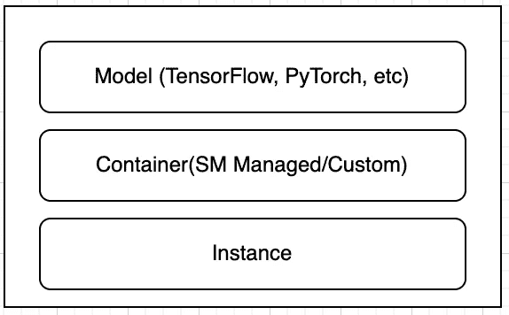
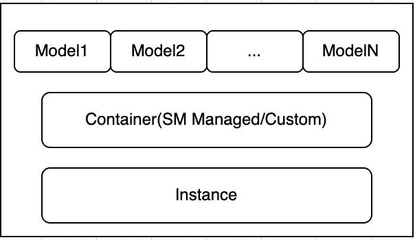
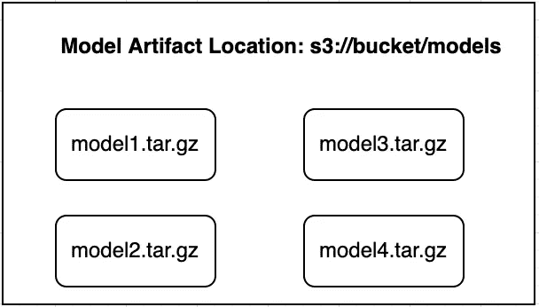
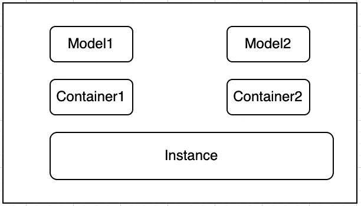

# SageMaker 多模型与多容器端点

> 原文：<https://towardsdatascience.com/sagemaker-multi-model-vs-multi-container-endpoints-304f4c151540>

## 使用哪个实时推理选项

Amazon SageMaker 为模型托管和部署提供了过多的推理选项。在推论内具体有四个主要选项:

1.  [实时推断](https://docs.aws.amazon.com/sagemaker/latest/dg/realtime-endpoints.html)
2.  [无服务器推断](https://docs.aws.amazon.com/sagemaker/latest/dg/serverless-endpoints.html)
3.  [批量转换](https://docs.aws.amazon.com/sagemaker/latest/dg/batch-transform.html)
4.  [异步推理](https://docs.aws.amazon.com/sagemaker/latest/dg/async-inference.html)

出于本文的目的，我们将关注**实时推理**。当您需要一个具有严格延迟需求(亚毫秒级)的**持久端点**时，实时推理是理想的。在实时推理中，你也可以使用不同的选项。最简单的形式是，您可以拥有一个端点，其中包含一个由一个实例支持的模型。让我们来看看这个基本架构是什么样子的。

作者截图

您可以为 TensorFlow、PyTorch、Sklearn 等流行框架创建一个模型并[检索](https://aws.plainenglish.io/how-to-retrieve-amazon-sagemaker-deep-learning-images-ff4a5866299e)一个 [SageMaker 支持的图像](https://docs.aws.amazon.com/sagemaker/latest/dg/notebooks-available-images.html)。如果你正在为你的模型使用一个定制的框架，那么你也可以[使用你自己的容器](/bring-your-own-container-with-amazon-sagemaker-37211d8412f4)来安装你的依赖项。

随着你的 ML 平台变得越来越复杂，有更多的高级选项，如[多模型端点](https://docs.aws.amazon.com/sagemaker/latest/dg/multi-model-endpoints.html)和[多容器端点](https://docs.aws.amazon.com/sagemaker/latest/dg/multi-container-endpoints.html)。让我们看一下每种产品的架构，以了解它们的使用情形。

# 多模型端点(MME)

多模型端点帮助您将数千个模型扩展到一个端点。通过使用共享的服务容器，您可以在同一个端点中以经济高效的可伸缩方式托管多个模型。该体系结构将不同于下图所示的单个模型端点。

MME 架构(作者截图)

底层基础设施(容器+实例)保持不变，但是主要的区别在于可以装载到这个容器上的模型。类似于单个模型端点的部署，您需要指向**模型数据**。这里的关键区别是，您将拥有多个模型数据/工件，而不是一个，您需要为您拥有的每个模型加载它们。像单模型端点这样的工件存储在 S3，但是为了让 SageMaker 意识到您正在处理一个多模型端点，您将把所有的模型数据放在一个公共的 S3 位置。模型数据也需要压缩成 modelname.tar.gz 格式，以便 SageMaker 理解。

模型数据结构(作者截图)

使用 MME 需要理解的最重要的特性是**所有的模型都必须在同一个框架**中构建。例如，MME 中的所有模型应该是纯粹的 PyTorch，或者纯粹的 TensorFlow，或者纯粹的您正在处理的自定义框架。**您不能混合和匹配具有多模型端点**的模型框架。

现在可能会有一个问题，为什么不只是有一堆单一模型端点，而不是在一个多模型端点上加载所有的模型。简而言之，将所有模型加载到一个端点上更具成本效益。例如，假设您有 10 个想要部署的模型。如果我们为每个端点部署一个 **ml.c5.large** 实例，我们就有 10 个持久端点在运行。如果我们看一下这个实例的[定价](https://aws.amazon.com/sagemaker/pricing/)，它是每小时 0.102 美元。

**10 个单一模型端点:10 * $ 0.102 =每小时$ 1.02**

另一方面，如果我们用一个 ml.c5.large 实例将所有 10 个模型加载到一个多模型端点上，我们可以节省 10 倍。

**1 个多型号终点(10 个型号):1 个& $.102 = $.102 每小时**

## 多模型端点资源

[多模型端点张量流示例](/deploy-multiple-tensorflow-models-to-one-endpoint-65bea81c3f2f)

[多模型终点文件](https://docs.aws.amazon.com/sagemaker/latest/dg/multi-model-endpoints.html)

# 多容器端点(MCE)

我们讨论多模型端点的一个警告是，我们不能混合和匹配框架。多容器端点解决了这个问题，您可以为您将要使用的不同框架提供容器。例如，您可以在同一个端点上加载 PyTorch 和 TensorFlow 容器。

多容器结构(作者截图)

多容器端点还提供了强大的功能，您可以在一个[串行推理管道](https://docs.aws.amazon.com/sagemaker/latest/dg/inference-pipelines.html)中将容器缝合在一起，或者调用您选择的容器。串行推理管道允许你将 2-15 个容器连接在一起，一个容器的输出成为下一个容器的输入。这是一个理想的用例，例如，如果您有 Sklearn 预处理容器- > TensorFlow 模型。

## 多容器端点资源

[多容器示例](https://github.com/RamVegiraju/SageMaker-Deployment/tree/master/RealTime/Multi-Container)

[串行推理流水线示例](https://github.com/aws/amazon-sagemaker-examples/blob/master/contrib/inference_pipeline_custom_containers/inference-pipeline.ipynb)

# 代码差异

使用 SageMaker 的许多步骤都可以通过 Boto3 Python SDK 来完成，您可以在其中创建一个 SageMaker 客户端。任何 SageMaker 端点的三个主要部署步骤如下。

1.  SageMaker 模型创建(提供模型数据+图像)
2.  SageMaker 端点配置创建(获取模型名称，在创建端点之前添加实例详细信息/配置)
3.  端点创建(需要 3-4 分钟实施端点配置的详细信息)
4.  端点调用

像任何其他实时端点一样，多模型和多容器端点遵循相同的方法。对于区分这两者的几个步骤，需要添加一些微小的差异。

模型设定

对于多模型，我们想要指定包含模型工件的模型前缀(S3 位置)。对于多容器，我们需要指定我们在这个用例中处理的不同图像/容器。

MCE 模型创建

这里，我们在 [create_model](https://boto3.amazonaws.com/v1/documentation/api/latest/reference/services/sagemaker.html#SageMaker.Client.create_model) 调用中用 containers 参数指定了两个不同的容器。

下一个需要注意的主要区别是端点是如何被调用的，通过下面的代码示例，这一点是显而易见的。

MME 调用

对于 MME，您在调用中指定一个名为 TargetModel 的参数，并指定您想要调用的模型。

MCE 调用

类似地，对于 MCE，有一个名为 TargetContainerHostname 的参数，您可以在其中指定要调用的容器。

# 结论和附加资源

Amazon SageMaker 有一个不断扩大的推理选项列表。使用对您的用例最有效的选项是很重要的，我希望这篇文章已经阐明了使用这两个选项中的哪一个。我在下面附上更多关于推论和 SageMaker 的资源。

[SageMaker 推理范例库](https://github.com/RamVegiraju/SageMaker-Deployment)

[SageMaker 推理推荐器选择正确的实例](https://aws.amazon.com/about-aws/whats-new/2021/12/amazon-sagemaker-inference-recommender/)

*如果你喜欢这篇文章，请在*[*LinkedIn*](https://www.linkedin.com/in/ram-vegiraju-81272b162/)*上联系我，订阅我的媒体* [*简讯*](https://ram-vegiraju.medium.com/subscribe) *。如果你是新手，使用我的* [*会员推荐*](https://ram-vegiraju.medium.com/membership) *报名。*