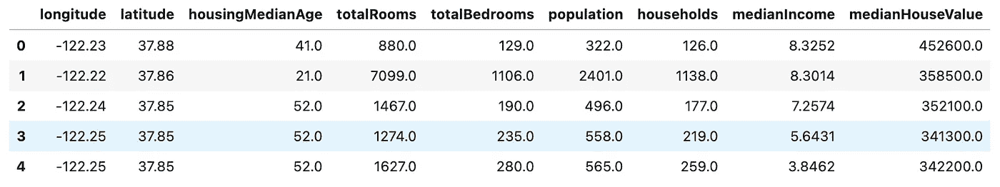
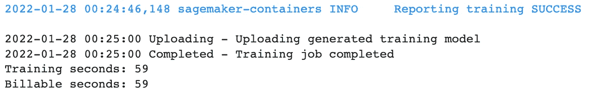
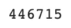

# SageMaker 无服务器推理现在已经普遍可用

> 原文：<https://towardsdatascience.com/sagemaker-serverless-inference-is-now-generally-available-e42550a146fe>

## 探索最新的 SageMaker 推理选项

由[泰勒维克](https://unsplash.com/@tvick)从[取消](https://unsplash.com/photos/M5tzZtFCOfs)的图片

写这篇文章让我超级兴奋。ML 推理本身就超级有趣。添加无服务器，它会变得更加有趣！当我们谈到无服务器推理之前，我们不得不考虑可能使用的服务，如 AWS [Lambda](https://github.com/aws-samples/aws-lambda-docker-serverless-inference) 。Lambda 等服务的问题在于，它们没有现成的托管 ML 基础设施工具。你必须自己建立、管理和维护所有的容器、ML 基础设施。

SageMaker 无服务器推理将所有这些抽象出来。它允许你专注于模型构建过程，不需要像 Lambda 那样维护你自己的容器。无服务器推理从其他 SageMaker 推理选项中获得了相同的核心基础。它仍然支持 [AWS 深度学习图像](https://github.com/aws/deep-learning-containers/blob/master/available_images.md)/框架和[自带容器(BYOC)](/bring-your-own-container-with-amazon-sagemaker-37211d8412f4) 方法的灵活性。如果您在 SageMaker 上已经有实时推理工作负载，那么您可以保留大部分相同的代码，并添加包含无服务器配置的代码片段。在本文中，我们将探索一个将 Sklearn 模型部署到 SageMaker 无服务器端点的示例。

**注意:**对于刚接触 AWS 的人来说，如果你想继续学习，请确保在下面的 [**链接**](https://aws.amazon.com/console/) 中注册账户。部署过程中会产生成本，尤其是如果您让端点保持运行。本文还将假设您对 SageMaker 和 AWS 有一定的了解。

## 目录

1.  何时使用无服务器推理
2.  无服务器推理支持什么？
3.  无服务器推理示例
4.  其他资源和结论

## 何时使用无服务器推理

目前 SageMaker 推理有四个主要选项:[实时推理](https://docs.aws.amazon.com/sagemaker/latest/dg/realtime-endpoints.html)、[批量推理](https://docs.aws.amazon.com/sagemaker/latest/dg/batch-transform.html)、[异步推理](https://docs.aws.amazon.com/sagemaker/latest/dg/async-inference.html)，以及现在的无服务器推理。在过去的[文章](https://aws.plainenglish.io/what-sagemaker-inference-option-should-you-use-2e88c8fc70bf)中，我解释了前三个选项的用例。那么什么时候使用无服务器推理呢？

**当你有**间歇性**和**不可预测的工作负载**时，无服务器推理**是一个很好的选择。理想情况下，您的工作负载应该能够承受任何无服务器解决方案的冷启动。使用无服务器推理的另一个主要原因是没有基础设施管理。如果你不想处理自动缩放或实例管理/设置，那么无服务器推理是一个很好的选择。无服务器推理的另一个主要价值主张是节约成本。你通过[调用](https://aws.amazon.com/sagemaker/pricing/)为无服务器推理付费，而不是通过实时推理按小时计费。如果您的团队正在 SageMaker 上构建一个 **POC** 并且不想在此过程中产生大量费用，这是一个很好的选择。

## 无服务器推理支持什么？

在 Reinvent 2021 中推出无服务器推理预览版后，增加了一些关键功能。启用了 SageMaker Python SDK 支持，这使得使用 Amazon SageMaker 进行无服务器推理来训练和部署受支持的[容器/框架](https://aws.plainenglish.io/how-to-retrieve-amazon-sagemaker-deep-learning-images-ff4a5866299e)变得前所未有的容易。您还可以使用[模型注册表](https://docs.aws.amazon.com/sagemaker/latest/dg/model-registry.html)进行无服务器推断，这将为您的 MLOps 工作流添加无服务器端点提供灵活性。最后，每个端点的**最大并发调用**已经增加到 **200** **(预览时为 50)。**

## 无服务器推理示例

对于我们的无服务器推理示例，我们将使用 California Housing 数据集训练和部署 Sklearn 模型。该数据集在 SageMaker 示例数据集存储库中公开提供，我们将展示您可以在笔记本中检索它。

对于设置，我们将使用 **SageMaker Studio** 和 **Python3 数据科学内核**。您还可以使用**经典笔记本实例**并使用 **ml.m5.xlarge 笔记本实例**和 **conda_python3 内核**。一旦你在你的笔记本上，我们将设置我们的 S3 桶和培训实例。

S3 和培训设置

接下来，我们将从公共 SageMaker 样本中检索加利福尼亚住房数据集。这是一个**回归问题**，我们将使用 **Sklearn 框架**来解决它。

检索数据集

然后，我们可以使用 Pandas 读取数据集，以确保我们已经正确地创建了数据帧。

读取数据集

数据集头(作者截图)

然后，我们将这个数据集上传到 S3，SageMaker 将在那里访问训练数据并转储模型工件。

上传数据到 S3

[Sklearn](https://sagemaker.readthedocs.io/en/stable/frameworks/sklearn/sagemaker.sklearn.html) 是 SageMaker 提供的支持深度学习的容器之一，因此我们可以直接使用 SageMaker Python SDK 抓取图像，而无需处理任何 Docker 相关的工作。

Sklearn 估计量

这里我们传入一个包含模型和推理函数的入口点脚本。我们不会深入讨论这个例子中的[脚本模式](https://github.com/aws-samples/amazon-sagemaker-script-mode)，而是看一看这篇[文章](https://ram-vegiraju.medium.com/training-and-deploying-custom-scikit-learn-models-on-aws-sagemaker-3de6a2f669f4)来了解如何在亚马逊 SageMaker 上训练 Sklearn 模型。

如果我们快速浏览一下训练脚本，我们可以看到我们正在使用一个[随机森林模型](https://scikit-learn.org/stable/modules/generated/sklearn.ensemble.RandomForestRegressor.html)。

培训脚本中的模型

请注意处理输入的函数。 **input_fn** 决定了**数据格式**的类型，您可以为您的**模型推断**传递该数据格式。要了解更多关于推理处理器的信息，请查看这篇文章。

现在，我们可以使用我们的 Sklearn 估计器执行模型训练。

火车模型

培训完成(作者截图)

训练完成后，我们现在可以进行推理了。到目前为止，一切都与实时推理或任何其他 SageMaker 推理选项完全相同。在这里，我们可以通过 [SageMaker Python SDK](https://sagemaker.readthedocs.io/en/v2.77.1/api/inference/serverless.html) 添加一个 ServerlessConfig，并将其附加到我们的端点。

这里的两个参数是 **MemorySize** 和 MaxConcurrency。内存大小一般应该是最小的****和你的**型号**一样大的**。您可以将内存设置为以下值: **1024 MB、2048 MB、3072 MB、4096 MB、5120 MB 或 6144 MB** 。 **MaxConcurrency** 是单个端点的**最大并发调用数**，现在已经增加到 GA 的 **200** 。这是您必须为无服务器端点指定的唯一两个参数，所有基础设施工作和管理都在幕后进行。**

**无服务器配置对象**

**现在，我们可以像往常一样部署端点并附加这个对象。**

**无服务器端点部署**

**现在我们可以看到这个端点的一个简单推论。**

**示例调用**

****

**推论(作者截图)**

## **其他资源和结论**

** [## 主 RamVegiraju/sage maker-Deployment 上的 sage maker-Deployment/sk learn-server less . ipynb

### SageMaker 推理选项和其他功能的例子汇编。…

github.com](https://github.com/RamVegiraju/SageMaker-Deployment/blob/master/Serverless/Sklearn/sklearn-serverless.ipynb) 

有关示例的完整代码，请访问上面的链接。关于使用无服务器推理的模型注册的例子，请看这个[例子](https://github.com/aws/amazon-sagemaker-examples/blob/main/serverless-inference/serverless-model-registry.ipynb)。关于无服务器推理的拥抱脸的例子，看看这个[博客](https://www.philschmid.de/sagemaker-serverless-huggingface-distilbert)和[例子](https://github.com/huggingface/notebooks/blob/main/sagemaker/19_serverless_inference/sagemaker-notebook.ipynb)。对于 AWS 官方博客发布的无服务器推理，请查看下面的文章[。](https://aws.amazon.com/blogs/aws/amazon-sagemaker-serverless-inference-machine-learning-inference-without-worrying-about-servers/)

一如既往，我希望这是一篇关于 SageMaker 推论的好文章，欢迎在评论中留下任何反馈或问题。如果你对更多 AWS/SageMaker 相关内容感兴趣，请查看我为你编辑的这个[列表](https://ram-vegiraju.medium.com/list/aws-42b81fcfe143)。** 

***如果你喜欢这篇文章，请在*[*LinkedIn*](https://www.linkedin.com/in/ram-vegiraju-81272b162/)*上与我联系，并订阅我的媒体* [*简讯*](https://ram-vegiraju.medium.com/subscribe) *。如果你是新手，使用我的* [*会员推荐*](https://ram-vegiraju.medium.com/membership) *报名。***