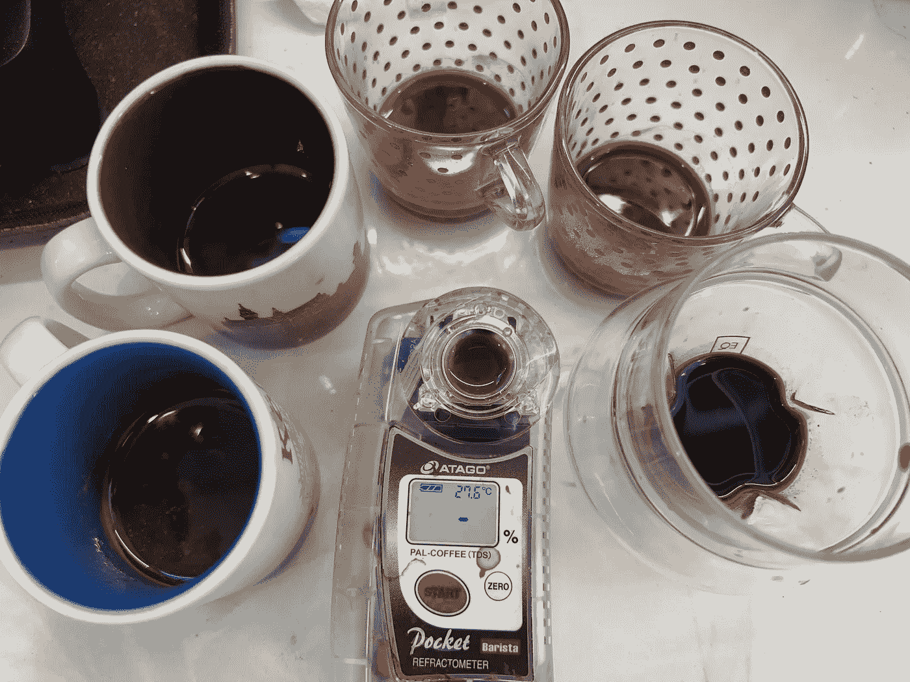
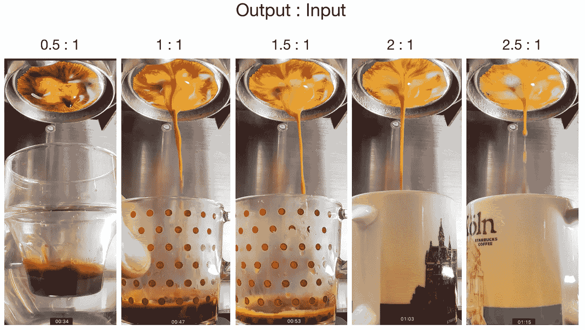
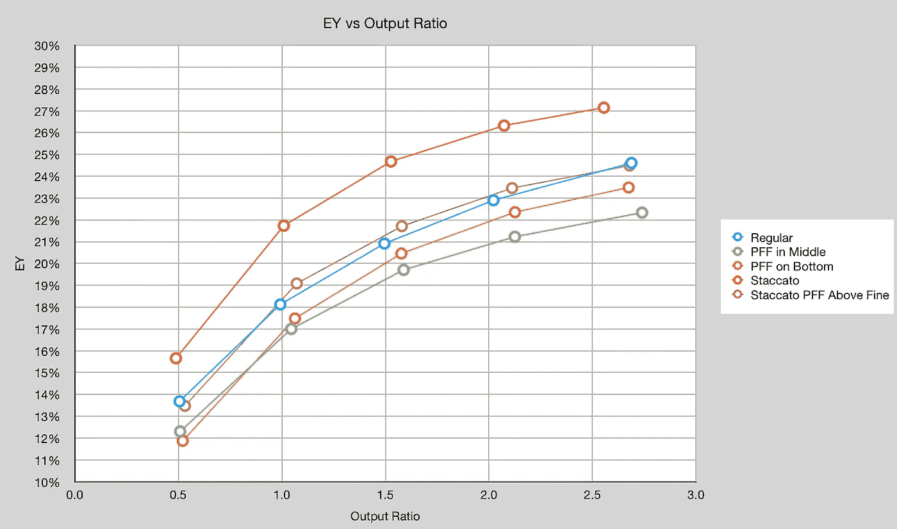
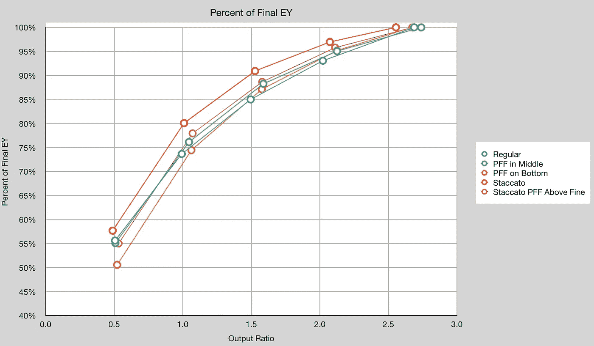
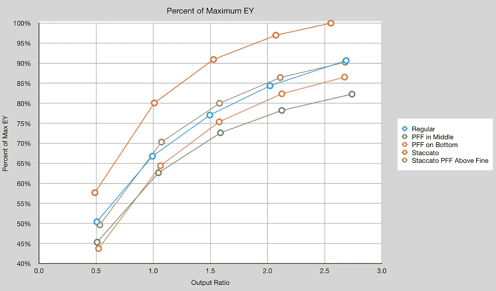
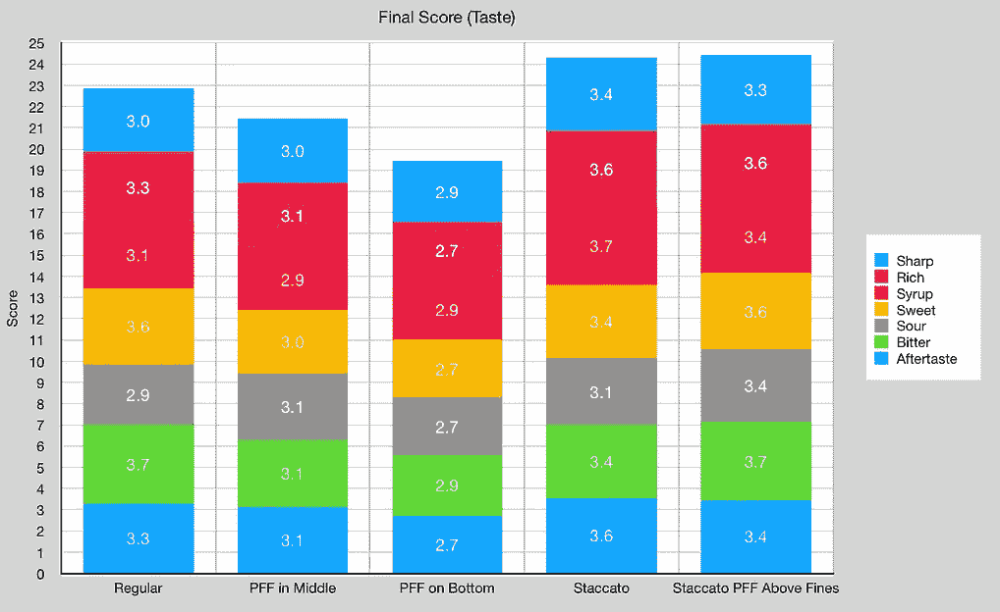
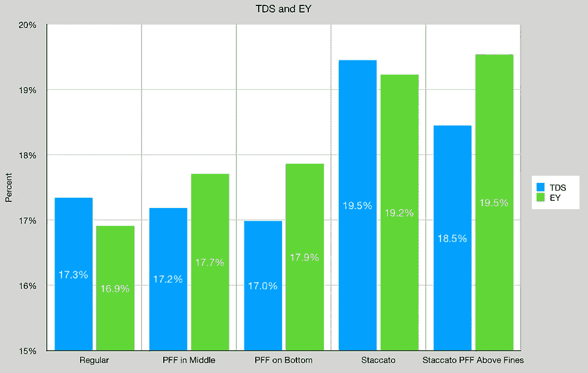

# 意大利香肠浓缩咖啡

> 原文：<https://towardsdatascience.com/salami-espresso-shots-d94abad77805>

## 咖啡数据科学

## 对整个镜头提取的另一种看法

我喜欢腌肉，但是意大利香肠浓缩咖啡不是腌肉。意大利香肠是一杯浓缩咖啡，切成几杯。这是非常有用的帮助一个人品尝镜头，因为它发展。利用意大利香肠可以帮助人们找到最佳的输出比。

所有图片由作者提供

萨拉米香肠的另一个用途是观察咖啡萃取物在整个过程中的变化。几年前我已经这样做过了，我决定用同样的咖啡烘焙的几个变种再做一次。

第一个杯子有如此高的 TDS，我用等量的水滴定样品。

# 绩效指标

我使用两个[指标](/metrics-of-performance-espresso-1ef8af75ce9a)来评估技术之间的差异:最终得分和咖啡萃取。

[**最终得分**](https://towardsdatascience.com/@rmckeon/coffee-data-sheet-d95fd241e7f6) 是记分卡 7 个指标(尖锐、浓郁、糖浆、甜味、酸味、苦味和回味)的平均值。当然，这些分数是主观的，但它们符合我的口味，帮助我提高了我的拍摄水平。分数有一些变化。我的目标是保持每个指标的一致性，但有时粒度很难确定。

**用折射仪测量总溶解固体量(TDS)，这个数字结合咖啡的输出重量和输入重量用于确定提取到杯中的咖啡的百分比，称为**提取率(EY)** 。**

# **设备/技术**

**[浓缩咖啡机](/taxonomy-of-lever-espresso-machines-f32d111688f1):像样的浓缩咖啡**

**咖啡研磨机:[小生零](/rok-beats-niche-zero-part-1-7957ec49840d)**

**咖啡:[家庭烘焙咖啡](https://rmckeon.medium.com/coffee-roasting-splash-page-780b0c3242ea)，中杯(第一口+ 1 分钟)**

**镜头准备:[断奏捣实](/staccato-tamping-improving-espresso-without-a-sifter-b22de5db28f6)、[断奏](https://medium.com/overthinking-life/staccato-espresso-leveling-up-espresso-70b68144f94)、[圆盘中的滤纸](https://rmckeon.medium.com/paper-filters-for-espresso-splash-page-f55fc553e98)**

**[预输注](/pre-infusion-for-espresso-visual-cues-for-better-espresso-c23b2542152e):长，约 25 秒**

**输液:[压力脉动](/pressure-pulsing-for-better-espresso-62f09362211d)**

**[过滤篮](https://rmckeon.medium.com/espresso-baskets-and-related-topics-splash-page-ff10f690a738) : 20g VST**

**其他设备: [Atago TDS 计](/affordable-coffee-solubility-tools-tds-for-espresso-brix-vs-atago-f8367efb5aa4)、 [Acaia 比重秤](/data-review-acaia-scale-pyxis-for-espresso-457782bafa5d)、 [Kruve 筛](https://www.kruveinc.com/pages/kruve-sifter)、[滤纸(PFF)](https://rmckeon.medium.com/paper-filters-for-espresso-splash-page-f55fc553e98)**

# **整个注射过程中的提取率(EY)**

**我的常规注射比正常注射有更高的 EY，部分原因是预输注时间更长。在这种情况下，断奏镜头显然是赢家，但我很惊讶纸过滤器(PFF)没有改善断奏镜头。我也很惊讶常规拍摄中的纸质滤镜没有改善 EY。这可能是因为需要做得更好，但我没有调查。**

**底部的 PFF 和中间的 PFF 开始于同一个 EY，但是随着拍摄的进行，它的提取率上升了。**

****

**当我们查看每个输出的 EY 占最终 EY 的百分比时，在 1:1 时，80%的断奏镜头被提取出来。类似地，大约 75%的其他镜头是在 1:1 中提取的。这就是我保持接近 1:1 命中率的原因。通常在 1:1 和 1.3:1 之间。**

****

**就可能的最大 EY 而言(以 2.5:1 的比率拍摄的断奏的 EY，27%)，我们可以看到与之前类似的图表。然而，这显示了断奏镜头和其余镜头之间的对比。**

****

# **品尝 1:1**

**我把咖啡混合成 1:1 的比例，然后给它们打分。我还为每个人收集了一个新的 TDS 样本。**

**断奏是明显的赢家，但即使 TDS 更低，我也看不出有或没有纸质过滤器(PFF)在味道上有什么不同。**

********

**正常拍摄的味道分数下降了，这不是纸质过滤器应该如何影响味道的典型情况。还是那句话，我没有调查。**

**萨拉米香肠镜头是一个非常有用的工具，可以帮助你了解你的镜头是如何表现的。挑战总是存在于数据收集中。这个数据是一个很小的数据集，我已经查看了关于 1:1 和 3:1 提取的其他数据。对于断奏的镜头，这是另一个证据:**

1.  **断奏镜头比常规镜头提取率更高。**
2.  **80%的断奏镜头提取发生在 1:1，90%发生在 1.5:1**

**这个数据的警告是它是少量的数据。我确信不同的烘烤或休息时间会影响这些曲线。**

**至少对于口味检查，我会鼓励每个制作浓缩咖啡的人至少做一次意大利腊肠测试，以更好地了解味道来自哪里。**

**如果你愿意，可以在推特、 [YouTube](https://m.youtube.com/channel/UClgcmAtBMTmVVGANjtntXTw?source=post_page---------------------------) 和 [Instagram](https://www.instagram.com/espressofun/) 上关注我，我会在那里发布不同机器上的浓缩咖啡照片和浓缩咖啡相关的视频。你也可以在 [LinkedIn](https://www.linkedin.com/in/dr-robert-mckeon-aloe-01581595) 上找到我。也可以关注我在[中](https://towardsdatascience.com/@rmckeon/follow)和[订阅](https://rmckeon.medium.com/subscribe)。**

# **[我的进一步阅读](https://rmckeon.medium.com/story-collection-splash-page-e15025710347):**

**[我未来的书](https://www.kickstarter.com/projects/espressofun/engineering-better-espresso-data-driven-coffee)**

**[我的链接](https://rmckeon.medium.com/my-links-5de9eb69c26b?source=your_stories_page----------------------------------------)**

**[浓缩咖啡系列文章](https://rmckeon.medium.com/a-collection-of-espresso-articles-de8a3abf9917?postPublishedType=repub)**

**工作和学校故事集**