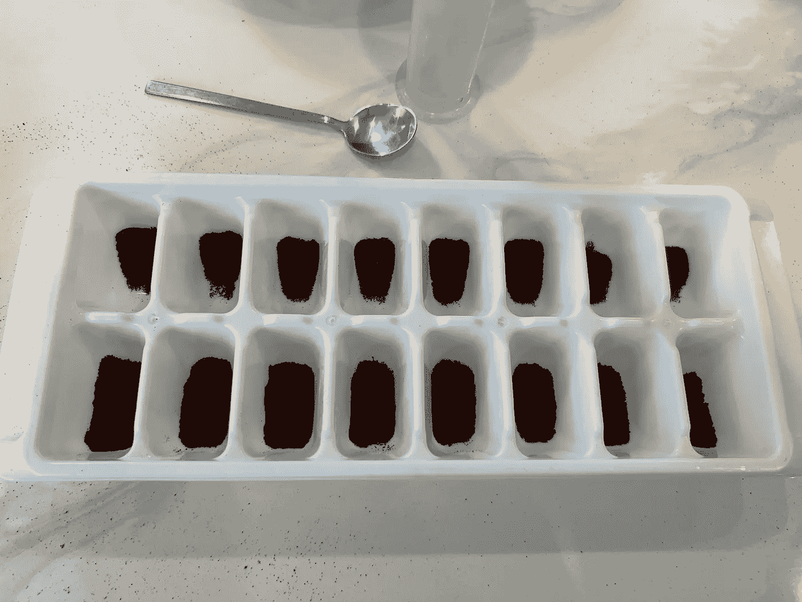
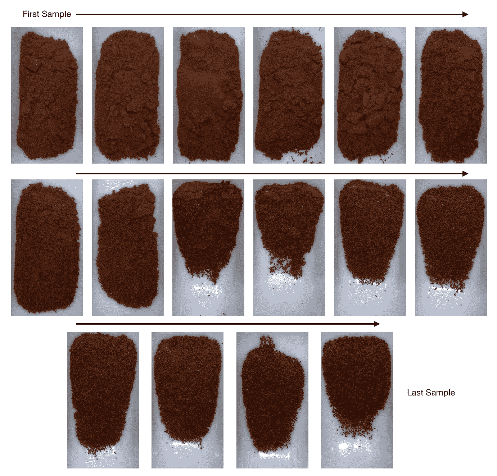
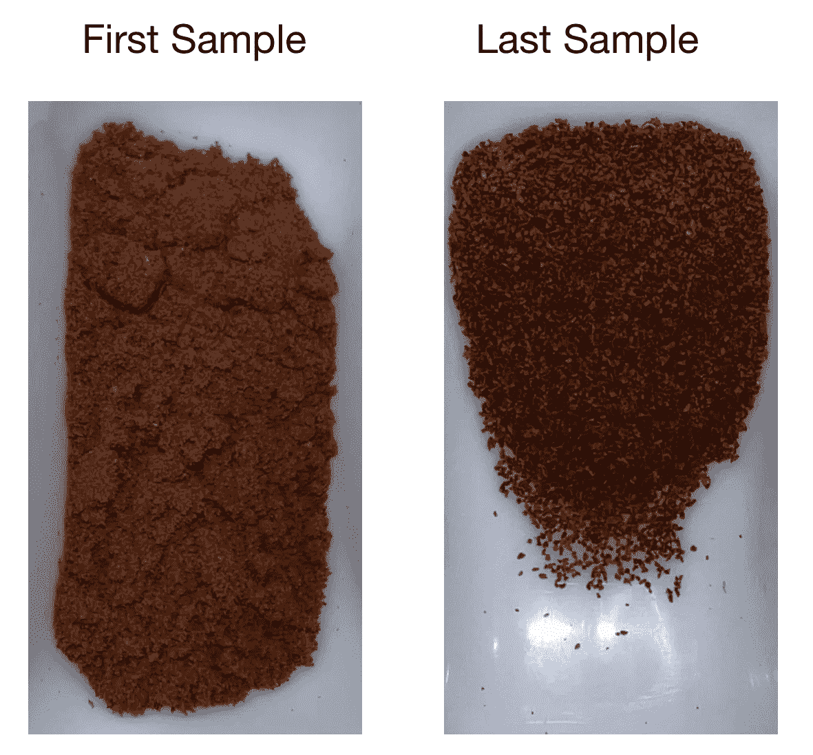
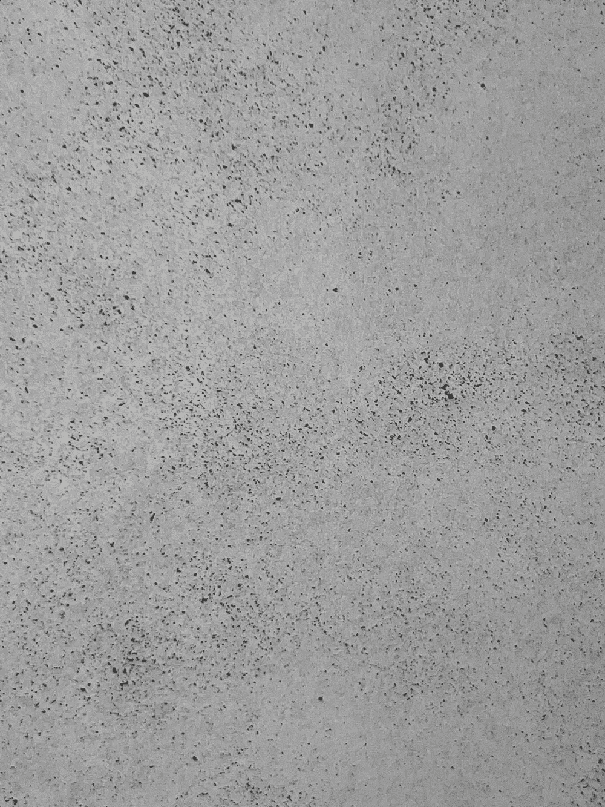
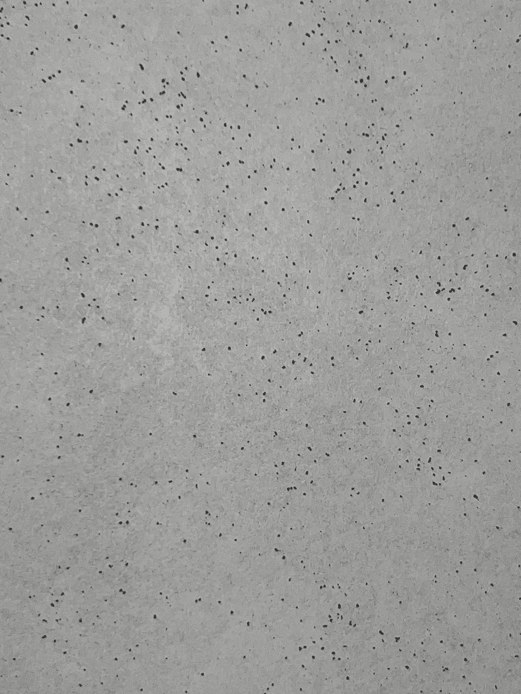
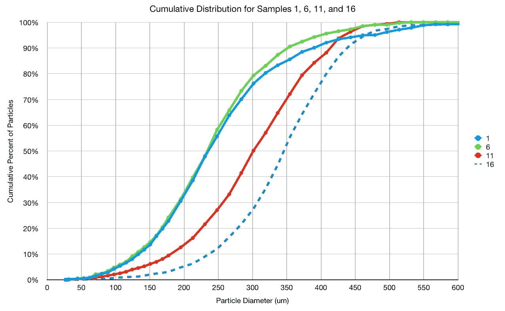
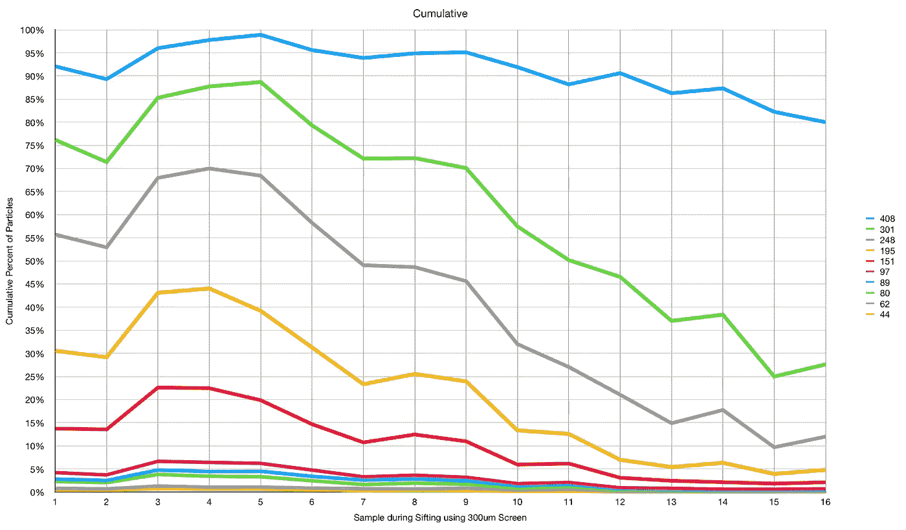
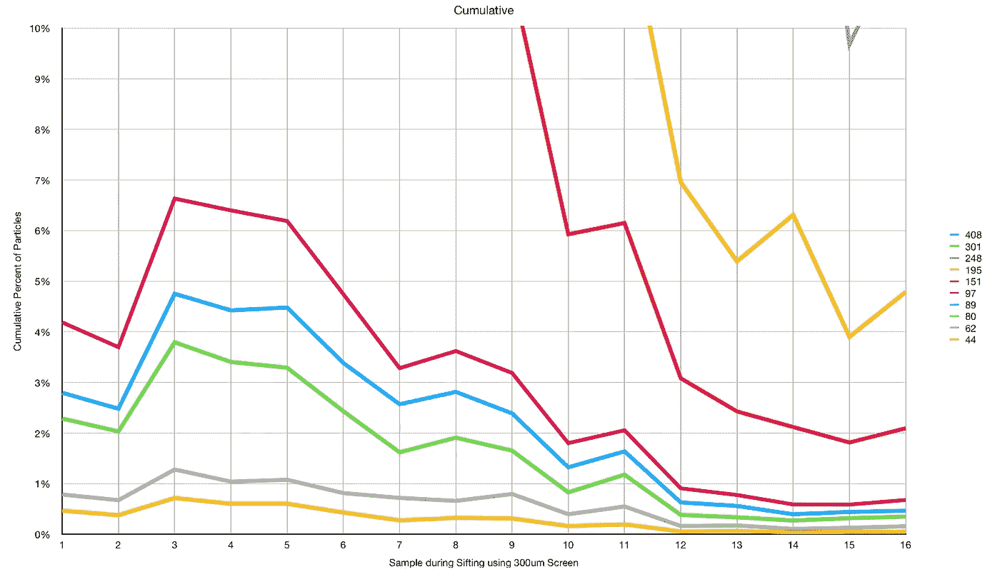

# 意大利香肠筛咖啡

> 原文：<https://towardsdatascience.com/salami-sifting-coffee-17024b484e34>

## 咖啡数据科学

## 对粒子如何自我组织的探索

我筛了很多咖啡。到目前为止，我很有可能已经手工筛过了大部分咖啡。然而，我仍然在寻找更多关于筛选咖啡的信息，因为我仍然缺乏对咖啡豆的了解。

正如我在调查内部粉末时发现的那样，咖啡豆不是同质的。

我注意到在用 300 微米的筛子筛咖啡时，开始和结束时会产生不同的粉末。所以我决定用意大利香肠筛，用粒子分布来研究研磨物。

所有图片由作者提供

我为每一个都拍了照片，你可以从头到尾看到，粒子似乎变得越来越粗糙。

最简单的比较是第一个和最后一个样本。

然后我给每个样本拍了照片。

左:第一个样本，右:最后一个样本

然后我用[图像处理](https://medium.com/nerd-for-tech/measuring-coffee-grind-distribution-d37a39ffc215)根据每个颗粒的面积来测量颗粒大小。有 16 个样本，我在这里只画了 4 个:

有一个明显的转变，但不是马上就开始出现。让我们来看一下每一项的累积分布。例如，第一行是 408 微米，所以每个点是小于或等于 408 微米的粒子的百分比。

301 微米及以下的颗粒减少，这意味着在筛分结束时，较粗的颗粒被更频繁地筛分。

观察小于 100 微米的非常细小的颗粒，它们也会减少，到研磨结束时，95%的颗粒在 195 微米以上，而开始时只有 70%。

这个简短的研究表明，即使是筛选也不是均匀的。这也告诉我，我可以筛选出一定比例的粉末，将较大的粉末留在不同的层中，以制作断续浓缩咖啡。我很好奇，想进一步研究这些粉末在显微镜下是什么样子，并想知道为什么所有的粉末不能均匀地过筛。

如果你愿意，可以在[推特](https://mobile.twitter.com/espressofun?source=post_page---------------------------)、 [YouTube](https://m.youtube.com/channel/UClgcmAtBMTmVVGANjtntXTw?source=post_page---------------------------) 和 [Instagram](https://www.instagram.com/espressofun/) 上关注我，我会在那里发布不同机器上的浓缩咖啡照片和浓缩咖啡相关的视频。你也可以在 [LinkedIn](https://www.linkedin.com/in/dr-robert-mckeon-aloe-01581595) 上找到我。也可以在[中](https://towardsdatascience.com/@rmckeon/follow)关注我，在[订阅](https://rmckeon.medium.com/subscribe)。

# [我的进一步阅读](https://rmckeon.medium.com/story-collection-splash-page-e15025710347):

[我的未来之书](https://www.kickstarter.com/projects/espressofun/engineering-better-espresso-data-driven-coffee)

[我的链接](https://rmckeon.medium.com/my-links-5de9eb69c26b?source=your_stories_page----------------------------------------)

[浓缩咖啡系列文章](https://rmckeon.medium.com/a-collection-of-espresso-articles-de8a3abf9917?postPublishedType=repub)

[工作和学校故事集](https://rmckeon.medium.com/a-collection-of-work-and-school-stories-6b7ca5a58318?source=your_stories_page-------------------------------------)