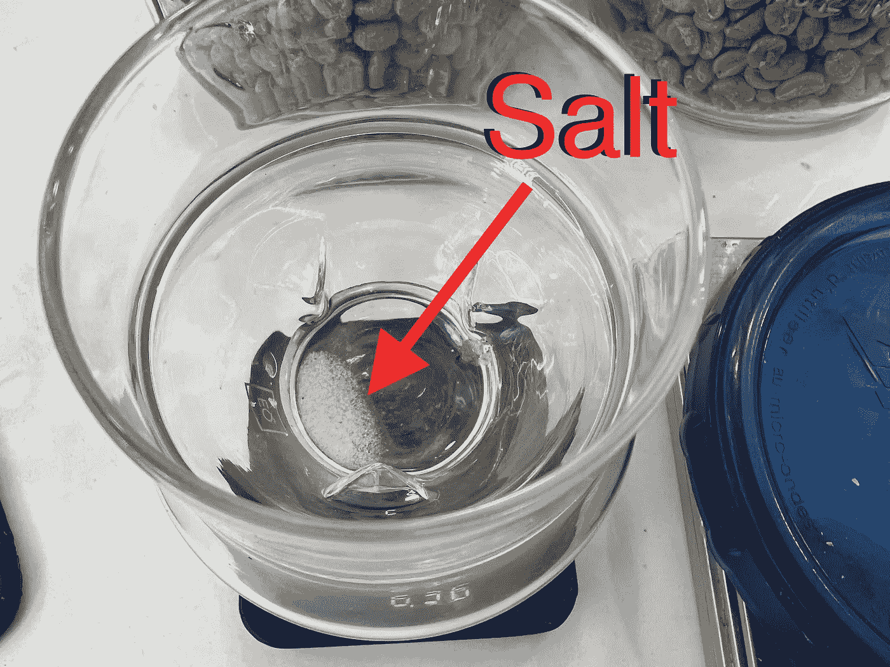
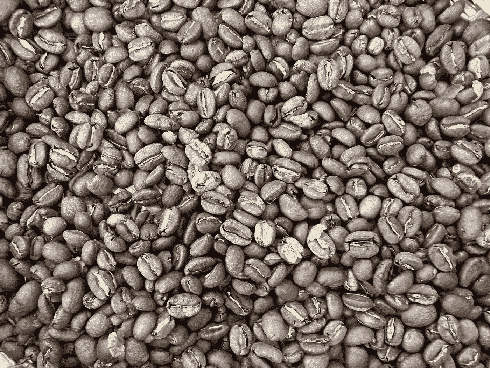
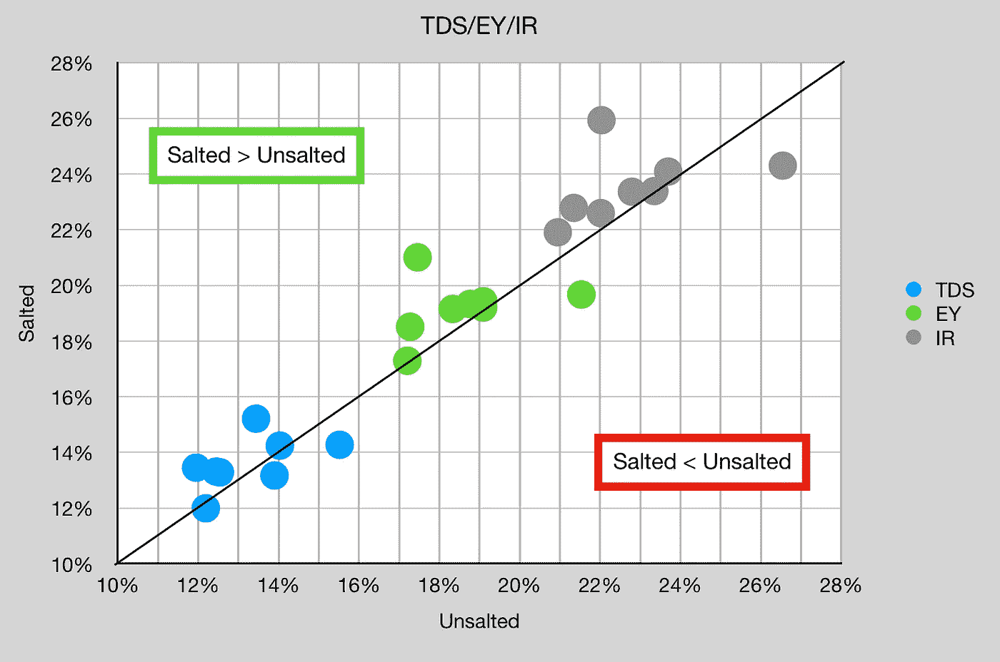
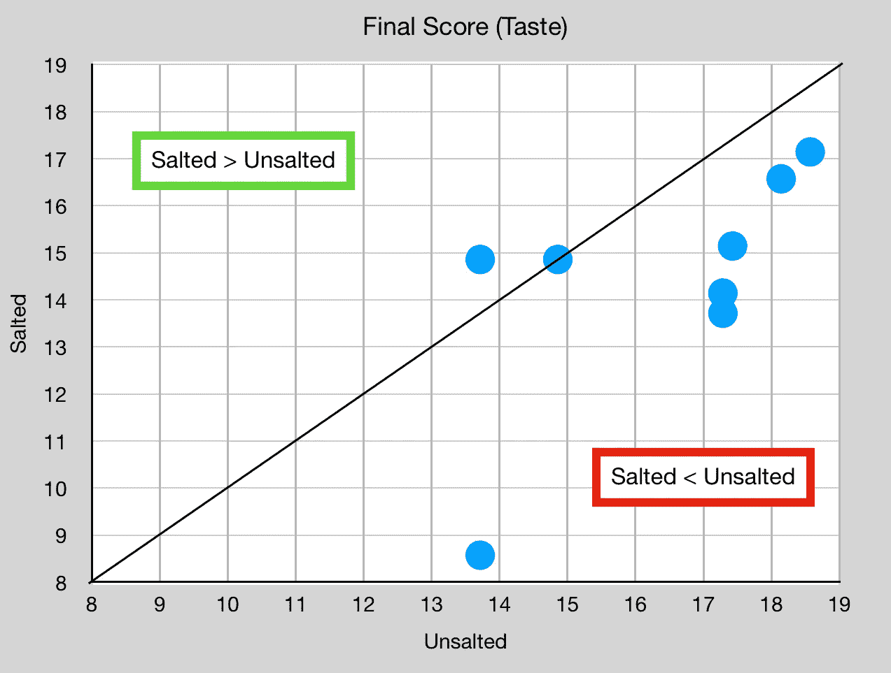
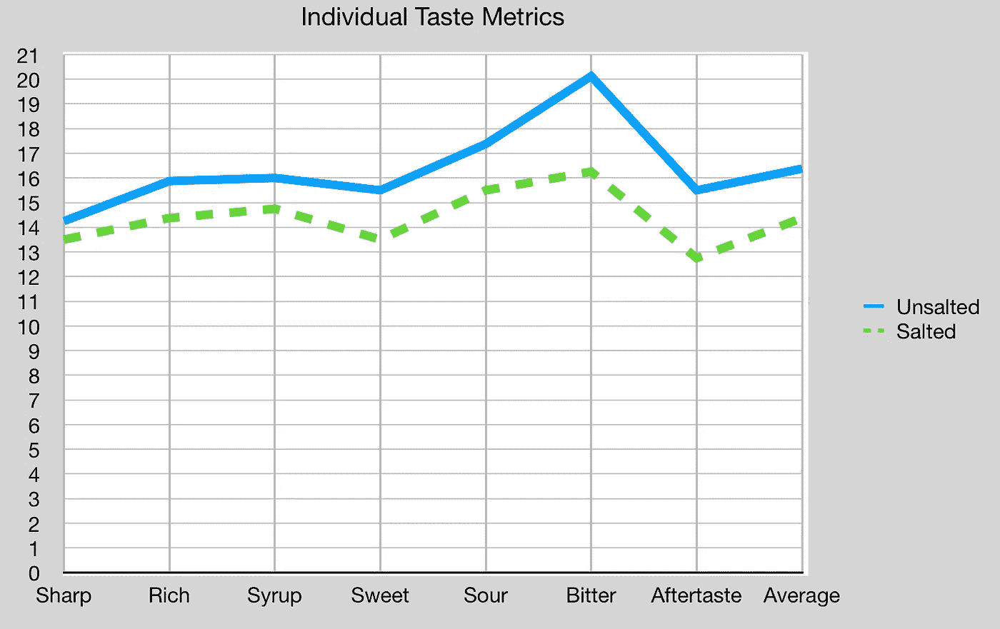

# 烘焙前腌制生咖啡豆

> 原文：<https://towardsdatascience.com/salting-green-coffee-beans-before-roasting-9c1c2ab2fc90>

## 咖啡数据科学

## 将烹饪应用于烧烤？

我一直在想水。我已经尝试过用我的水配方做实验，但是我仍然不知道该往哪个方向走，因为我的过滤水总是胜出。在水的讨论中，有关于使用蒸馏水，然后在注射后添加矿物质的讨论。这让我想起了烹饪。我过去常常在食物做好后加盐，但后来我学会了烹饪，发现你应该在烹饪前调味。

冲泡咖啡时，水中有一定量的盐，有的还在浓缩咖啡中加入了盐以减少苦味。我想知道，如果在冲泡咖啡时加盐调味，为什么不在烘焙之前试着把盐加入到咖啡豆中呢？我做了一次烘焙，以更好地理解绿色咖啡的腌制。

所有图片由作者提供

我开始放了少量的盐，只是一小撮。盐重 0.36 克，然后我把它加入 6 克水中。一旦它溶解了，我就把它混合在青豆里，等了一夜。我还在我的对照样品中加入了 6 克水，因为我知道加入水分会影响烘焙。

两种烘烤物(盐渍的和未盐渍的)具有相似的重量损失(87.6%和 88.5%)和相似的密度(0.395 和 0.404)。

# 设备/技术

[浓缩咖啡机](/taxonomy-of-lever-espresso-machines-f32d111688f1) : [像样的浓缩咖啡机](/developing-a-decent-profile-for-espresso-c2750bed053f)

[咖啡研磨机](/rok-beats-niche-zero-part-1-7957ec49840d) : [小生零](https://youtu.be/2F_0bPW7ZPw)

咖啡:[家庭烘焙咖啡](https://rmckeon.medium.com/coffee-roasting-splash-page-780b0c3242ea)，中杯(第一口+ 1 分钟)

镜头准备:[断奏夯实](/staccato-tamping-improving-espresso-without-a-sifter-b22de5db28f6)

[预灌注](/pre-infusion-for-espresso-visual-cues-for-better-espresso-c23b2542152e):长，约 25 秒

输液:[压力脉动](/pressure-pulsing-for-better-espresso-62f09362211d)

[过滤篮](https://rmckeon.medium.com/espresso-baskets-and-related-topics-splash-page-ff10f690a738) : 20g VST

其他设备: [Atago TDS 计](/affordable-coffee-solubility-tools-tds-for-espresso-brix-vs-atago-f8367efb5aa4)、 [Acaia Pyxis 秤](/data-review-acaia-scale-pyxis-for-espresso-457782bafa5d)

# 绩效指标

我使用了两组[指标](/metrics-of-performance-espresso-1ef8af75ce9a)来评估技术之间的差异:最终得分和咖啡萃取。

[**最终得分**](https://towardsdatascience.com/@rmckeon/coffee-data-sheet-d95fd241e7f6) 是记分卡 7 个指标(尖锐、浓郁、糖浆、甜味、酸味、苦味和回味)的平均值。当然，这些分数是主观的，但它们符合我的口味，帮助我提高了我的拍摄水平。分数有一些变化。我的目标是保持每个指标的一致性，但有时粒度很难确定。

</coffee-solubility-in-espresso-an-initial-study-88f78a432e2c>**用折射仪测量总溶解固体量(TDS)，这个数字结合咖啡的输出重量和输入重量用于确定提取到杯中的咖啡的百分比，称为**提取率(EY)** 。**

**[**【IR】**](/improving-coffee-extraction-metrics-intensity-radius-bb31e266ca2a)**强度半径定义为 TDS vs EY 控制图上原点的半径，所以 IR = sqrt( TDS + EY)。这一指标有助于标准化产量或酿造比的击球性能。****

# ****数据****

****我最后得到了 9 对照片，它们在 TDS/EY/IR 上非常相似。盐腌的看起来稍微高一点，但是味道告诉了一个不同的故事。****

********

****从口感上来说，大部分盐拍的味道更差。它们尝起来盐味过重或味道太淡。它们是奇怪的品尝镜头。****

********

****我查看了个人得分指标，无盐在所有类别中都更好。****

********

****这个实验的方向是少放盐，但我没有注意到这个实验数据中有任何东西表明加盐的咖啡会改善特定的味道。我很高兴我试着给咖啡加盐，以防会有很大的不同。****

****如果你愿意，可以在推特、 [YouTube](https://m.youtube.com/channel/UClgcmAtBMTmVVGANjtntXTw?source=post_page---------------------------) 和 [Instagram](https://www.instagram.com/espressofun/) 上关注我，我会在那里发布不同机器上的浓缩咖啡照片和浓缩咖啡相关的视频。你也可以在 [LinkedIn](https://www.linkedin.com/in/dr-robert-mckeon-aloe-01581595) 上找到我。也可以关注我在[中](https://towardsdatascience.com/@rmckeon/follow)和[订阅](https://rmckeon.medium.com/subscribe)。****

# ****[我的进一步阅读](https://rmckeon.medium.com/story-collection-splash-page-e15025710347):****

****[我的书](https://www.kickstarter.com/projects/espressofun/engineering-better-espresso-data-driven-coffee)****

****[我的链接](https://rmckeon.medium.com/my-links-5de9eb69c26b?source=your_stories_page----------------------------------------)****

****[浓缩咖啡系列文章](https://rmckeon.medium.com/a-collection-of-espresso-articles-de8a3abf9917?postPublishedType=repub)****

****工作和学校故事集****