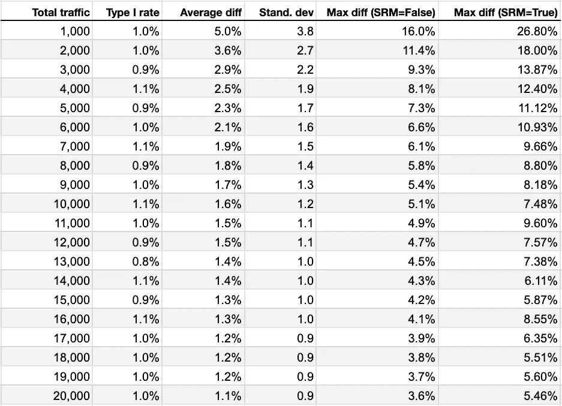
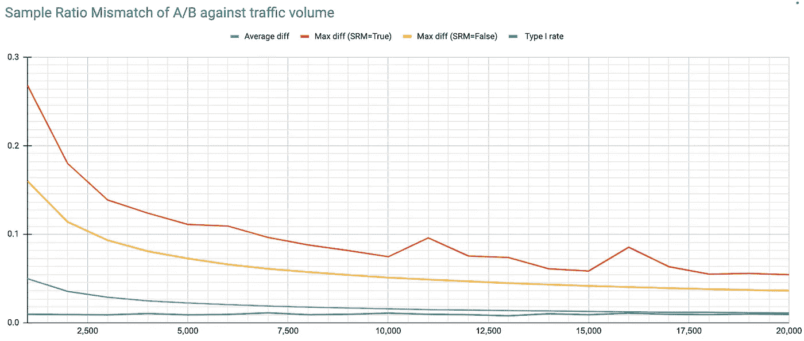
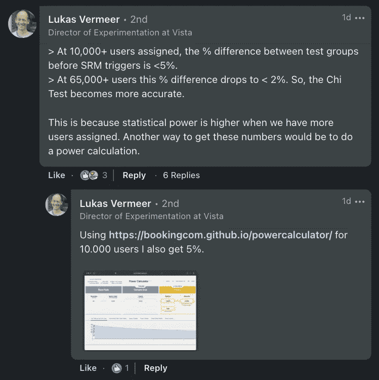
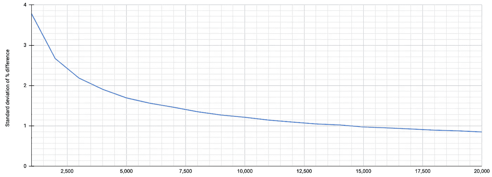

# 样本比例不匹配:这么多问题。怎么回答他们？

> 原文：<https://towardsdatascience.com/sample-ratio-mismatch-so-many-questions-how-to-answer-them-a86a1893e35>

## 没有什么比数据验证问题更能让 A/B 测试程序泄气了 SRM 是最具破坏性的问题之一。但是 SRM 的测试到底有多准确呢？


作者图片

假设您有一个 A/B 测试，您希望每个测试组中的用户各占一半。相反，控制组和变异组的误差在 7%左右。总共有 8，000 名用户被分配到该实验中。

我们应该停止测试吗？我是说，我们有多确定问题存在？我们可以使用我在上一篇文章中描述的 [Chi 测试。**如果** **Chi 测试为阴性**，我们可能会问:看到这么大的差异正常吗？**如果** **Chi 测试呈阳性**，我们会问:这是假阳性的几率有多大？](/the-essential-guide-to-sample-ratio-mismatch-for-your-a-b-tests-96a4db81d7a4)

停止测试是非常具有破坏性的，我们不希望不必要地这样做。我们需要确定我们做出了正确的决定。

我经常被问到的其他问题是:假阳性(I 型错误)的风险是什么样的？此外，什么样的流量最适合进行高度准确的 SRM 检查？

这些问题或许可以用简单的数学和正态分布曲线等来回答。但我觉得用模拟来代替会很有趣。模拟为我们提供了**真实的实验数据**，我们可以对其进行询问和探索。我发现用模拟数据来解释事情更容易。

我的目标是在一个实验中模拟各种不同的网页流量负载，并进行分配和统计。这意味着流量将被随机分配到两个桶:A 和 b。由于我们不期望两组之间有任何差异，我们可以将这些视为 A/A 实验，并使用它们来探索随机机会可能发生的情况。

希望这能帮助我们回答我之前提出的一些问题。最后还有一个额外的问题，我也将探讨:SRM 的持续检查

我将使用 Python。所以，请随意在 Jupyter 笔记本或类似的东西上跟我一起出去玩(或对我的发现进行同行评审)。如果你对代码不感兴趣，完全信任我(你怎么了)，那么你要么直接跳到**步骤 5** ，要么直接到我的**结论**文末回顾我的发现和结论。

# 阶段 1:模拟随机分配

我的第一个任务是模拟测试工具在两个测试组之间随机分配流量的方式。这是我们的函数:

```
from random import randintdef traffic_sim(**traffic**):
    a,b =0,0
    for x in range(**traffic**):
        if randint(0,1) == 0:
            a +=1
        else:
            b += 1
    return (a,b)
```

**traffic** 参数是我想要在两组( **A** 和 **B)** 之间分配的总流量。我使用 **randint(0，1)** 得到一个随机布尔值(0 或 1)。我用这个将我的假想用户分配到我的两个测试组。这有点像数字版的掷硬币。

这个函数的输出是一个元组(一个包含两个值的列表)。一个数字代表 A，另一个代表 b。

让我们用 100 个示例用户来运行它。

```
traffic_sim(**100**)
```

我的输出是:

```
(55, 45)
```

因此，我们在 A 中有 55 个用户，在 b 中有 45 个用户，我们期望的是 50/50。但这是我们得到的。不算太坏。

很明显，这个流量是超级低的。但这是测试这个功能的好方法。稍后我会以更高的音量回到这个话题。现在，我很好奇我的第一个例子 *(55，45)* 在使用 Chi 时是否有效。

# 步骤 2:使用 Chi 进行 SRM 检查

这里就不多解释这个功能了，因为[你可以看我之前提到的关于这个](/the-essential-guide-to-sample-ratio-mismatch-for-your-a-b-tests-96a4db81d7a4) *的文章(这是我最后一次链接文章了，老实说)*。

下面是功能。

```
from scipy.stats import chisquaredef srm_check(tup):
    diff = max(tup) - min(tup)
    total_traffic = (sum(tup))
    expected = sum(tup)/2
    perc_diff = (diff/(sum(tup)/2))*100
    chi = chisquare(tup, f_exp=expected)
    srm = False
    if chi[1] < 0.01:
        srm = True
    return ({"srm":srm, 'diff':perc_diff})
```

我传入一个值元组( **tup** )，它表示我的 A 和 B 流量分配，然后返回一个字典，其中包含 SRM 的 True 或 False。我还得到了各组之间的百分比差异。如果我传入我的元组(55，45)，我得到这个:

```
{'srm': False, 'diff': 20.0}
```

因此，即使差异为 20%，SRM 检查也是错误的。有道理。这么低的成交量，看到 20%的几率在预期的随机几率之内。

这很好。但是，同样，这是低流量。放松点。我们稍后会讨论更多的内容。

## 步骤 3:定义多个样本

为单个模拟测试运行 SRM 限制太多。我想**模拟成千上万次测试，以便更好地了解风险**。我想要一个函数，返回我能看到的可能分裂的数目。

这是我的函数:

```
def get_samples(**traffic**, **samples**):
    list_results = []
    for x in range(**samples**):
        list_results.append( **srm_check**( **traffic_sim**(traffic) ) )
    newlist = sorted(list_results, key=lambda d: d['diff']) 
    return newlist
```

此功能期望 ***流量*** 和 ***样本*** 参数。

*   ***交通量*** *—* 我们要使用的总交通量。到目前为止，我们一直使用 100
*   ***样本* —** 我们要生成多少个模拟样本。到目前为止，我们只使用了 1

该函数运行我的流量模拟和 SRM 函数，以获得我想要的样本数。我将对其他函数的调用设为粗体。

我返回的是一个测试结果列表，每个结果都详细说明了 SRM 是真还是假。结果按差异的升序排序(最小差异到最大差异)。

让我们运行这个函数来获得 **10** 个实验结果，每个实验分配有 **100** 个用户。

```
get_samples( traffic=100, samples= 10 )
```

我明白了。

```
[{'srm': False, 'diff': 0.0},
 {'srm': False, 'diff': 4.0},
 {'srm': False, 'diff': 8.0},
 {'srm': False, 'diff': 8.0},
 {'srm': False, 'diff': 12.0},
 {'srm': False, 'diff': 12.0},
 {'srm': False, 'diff': 16.0},
 {'srm': False, 'diff': 20.0},
 {'srm': False, 'diff': 20.0},
 {'srm': False, 'diff': 36.0}]
```

对于每个实验，我验证 SRM 是否存在，并得到两组之间的%差异。如果测试证实 SRM 为“真”,我们认为这是假阳性。

正如你在上面看到的，这里没有假阳性，尽管我看到其中一个有 36%的差异。哎哟。

*注意:我们看到如此大的差异的原因是因为我们的正态分布在这个体积上是宽的，这意味着在我们选择的概率范围内有可能得到各种各样的结果。*

尽管如此，这是低流量。冷静点。我们快到了。在我推出更多的流量之前，我还有几个函数要做…

# 第四步:获得假阳性率，等等

回顾十个实验的列表很容易。我想最终用成千上万的实验来完成这个测试。手动检查成千上万的测试是一项繁重的工作。

我想创建一个函数来告诉我实验样本的假阳性率。

*注意:由于我们使用的 p 值为< 0.01，我们预计这一比率约为 1%。让我们看看这是否成立。*

这是我的函数。它获取我从上面的 **srm_check** 函数生成的样本列表，并以百分比形式输出误报率。

```
def get_false_positive_rate(**list_dictionary**):
    false_positive = 0
    for item in list_dictionary:
        if item['srm'] == True:
            false_positive += 1
    return ( false_positive / len(list_dictionary) )*100
```

接下来，我想看看 A 和 B 赋值之间的平均差是多少。这将让我知道我可能会在我的样本实验之间看到什么样的差异:

```
def get_mean_diff(list_dictionary):
    my_list = []
    for item in list_dictionary:
        my_list.append(item['diff'])
    return (sum(my_list)/len(my_list))
```

接下来，我很好奇**在不触发 SRM 警报的情况下，A/B 组**之间的最大差异**是多少？**这将使我对声明 SRM 的最小可检测效果有所了解。

同时想知道**观察到的组间最大差异是多少？** ( *在这种情况下，SRM 将被声明为真。)*

下面这个函数可以处理上述两个问题。它接受样本列表和我们想要使用的 SRM 值(即真或假)。该函数返回在我的数据集中找到的最高数字。

```
def get_max_diff(**list_dictionary**, **srm_value**):
    my_list = [0]
    for item in **list_dictionary**:
        if item['srm'] == **srm_value**:
            my_list.append(item['diff'])
    return (max(my_list) )
```

接下来，让我们来看看我的数据的**传播**，并得到标准差。这将让我知道实验样本的正态分布曲线有多宽。下面的函数可以做到这一点:

```
def get_stdev(**list_dictionary**):
    my_list = []
    for item in **list_dictionary**:
        my_list.append(item['diff'])
    return statistics.stdev(my_list)
```

最后，我想将所有这些作为一个 **dataframe** 返回，这样我就可以很容易地在一个表格中浏览结果。该函数将执行以下操作:

```
import pandas as pddef get_dataframe(traffic, samples):
    results = []
    for item in traffic:
        list_dictionary = get_samples (item, samples)
        results.append({
            'Total traffic': item, 
            'SRM Type I rate':str(get_false_positive_rate(list_dictionary))+'%',
            'Avg diff (SRM=False)': str(get_mean_diff(list_dictionary))+'%',
            'Standard deviation': get_stdev(list_dictionary),
            'Max diff (SRM=False)': str(get_max_diff(list_dictionary, False))+'%',
            'Max diff (SRM=True)': str(get_max_diff(list_dictionary, True))+'%' 
        })
```

这个函数也将作为我的**主函数**。所以，我告诉这个函数:

*   我要模拟**多少流量作为列表** *。
*   我想运行的实验数量。我使用的实验(或样本)越多，我期望的准确度就越高。

这个主函数然后调用我的其他函数，为我提供一个漂亮的结果表。

[在这里看完整的 python 代码](https://gist.github.com/iqbalali/0ed8374185e3acd45a4b720ae5bc2130)。

**我使用的是流量列表，所以我可以一次发送多个流量。*

太好了。让我们来看看实际情况...

# 第五步:评估我的结果

我想模拟**10000 次实验**，检查它们的 SRM。实验将有不同的流量:**1000、2000、3000**等。一直到 **2 万总用户**。

```
traffic = [1000,2000,3000,4000,5000,
       6000,7000,8000,9000,10000,
       11000,12000,13000,14000,15000,
       16000,17000,18000,19000,200000]get_dataframe(traffic=traffic, samples=10000)
```

小心不要用这个弄坏你的机器。这是机器需要处理的核心任务。这是我的结果。您的结果可能略有不同，但应该不会相差太远:



**I 型比率**是我们的误报率，对于所有交通量，它大致保持在 **1%** 。这是意料之中的，因为我们使用的 p 值为 **< 0.01** 。

平均差异是事情变得有趣的地方。请记住，这是我们测试组之间的平均差异。越接近零越好。在低流量(1000 和 2000)时，平均差异较大(5.0%和 3.6%)。随着流量的增加，这种差异逐渐变小。

标准偏差是我们检查数据分布的地方。这告诉我们，在不同的交通流量条件下，我们的每个样本实验的差异有多大。

**最大差异(SRM =假)**是 SRM 警报跳闸前测试组之间的最大差异。接近零是最好的。我们可以看到，当流量较低(1，000 和 2，000)时，SRM 警报将在较高的差异百分比(16%和 11.4%)时触发。随着时间的推移，这种情况会逐渐减少。

**最大差异(SRM=True)** 是随机分配用户时观察到的最大差异。我们的 SRM 检查将触发这些值的正值。我们可以看到在低流量时有很高的百分比差异。不过，这些数字是不稳定的。每次我们运行模拟，我们得到非常不同的值，有时比你在表中看到的要大。

*Re:****Max difference(SRM = True)****。这实际上是有意义的，因为当其他数字通过使用 Chi 测试计算来控制时，最大差异(SRM=True)是我们由于随机机会而看到的最大差异，并且不受任何种类的花哨统计的控制。很少会看到这些数字，但是追踪异常值的趋势还是很有趣的。*

这是我们将结果绘制成线图时的样子。



图片作者。绘制流量增加时 A/B 测试的 SRM 图

我们的流量越多，我们能看到的偶然差异就越小。在分配了 10，000 多个用户的情况下，SRM 触发前测试组之间的百分比差异为<5%. At 65,000+ users this % difference drops to < 2%. So, the Chi Test becomes more accurate.

A quick note from Lukas Vermeer on this before we continue:



Lukas Vermeer’s note on LinkedIn: you can also use the power calculation.

Basically, you can run a power test to get a similar value as **最大差异(SRM=False)** 。这可能比运行这种昂贵的模拟更容易，但话说回来，我喜欢做困难的事情！

这是一张标准偏差图，展示了数据的分布如何随着流量的增加而减少:



图片由作者提供。标准偏差随着交通量的增加而减小

我们可以看到，在分配了 15，000 个用户时，标准偏差降至 1 以下。随着组间差异的扩大，总体标准偏差逐渐变好。

现在，我将是第一个承认这一切有点“嗯，废话。很明显。”但我在这里的目标是说明所有这些是如何工作的。它可能有助于点亮人们头脑中的灯泡。

但是等等，还有更多…

# 第六步:持续监控

所有这些都很好，但持续监控存在一个问题。以下是迈克尔·林顿为我们带来的更多信息:

> "..许多从业者通过**重复执行显著性测试**来错误地持续监控他们的实验，通常是以一种特别的方式，没有任何**多重性校正**，不知不觉地增加了他们出现 I 型错误的机会。

*引用 Michael Lindon 的文章:* [***测试样本比率不匹配(SRM)和验证实验实施的更好方法***](https://medium.com/engineers-optimizely/a-better-way-to-test-for-sample-ratio-mismatches-srms-and-validate-experiment-implementations-6da7c0d64552) ***。***

基本上，我们检查得越频繁，看到假阳性的风险就越高。正是因为这个原因，我们用一个 p 值 **<** **0.01** 来检测 SRM(再次使用[，详见我之前的文章](/the-essential-guide-to-sample-ratio-mismatch-for-your-a-b-tests-96a4db81d7a4))。 [Lukas Vermeer 的 SRM Chrome 扩展工具](https://www.lukasvermeer.nl/srm/)也使用了 **<** **0.01。**

这是更高的显著性标准，有望降低假阳性的风险。但是真的吗？

让我们通过快速修改我的脚本来找出答案:

```
def traffic_sim(**increment**, **checks**):
    traffic = []
    a,b =0,0
    for c in range(**checks**):
        for i in range(**increment**):
            if randint(0,1) == 1:
                a +=1
            else:
                b += 1
        traffic.append((a,b))
    return (traffic)
```

我有两个循环。我们使用这些循环来创建元组列表(针对 A 和 B 流量)。这个元组列表按值递增:“**递增”。**列表中的项目数量模拟了我们要做的**检查的数量**。

这应该模拟用户随着流量的增加反复检查 SRM。

例如，这里我模拟了 **10 次检查**，其中用户以 100 个用户的**增量进行检查。**

```
traffic_sim(100, 10)
```

输出:

```
[(46, 54),
 (97, 103),
 (151, 149),
 (210, 190),
 (257, 243),
 (310, 290),
 (359, 341),
 (417, 383),
 (467, 433),
 (516, 484)]
```

是的，是的，我知道。发送更多的流量。不仅如此，这只模拟了一个**单一实验**。为什么要同时增加我们的样本量和**检查 SRM 型**错误。

我们可以使用以下附加函数来实现这一点:

```
def get_false_pos_incremental(samples, increment, checks):
    list_dictionary = []
    for x in range(samples):
        traff = traffic_sim(increment, checks)
        for t in traff:
            list_dictionary.append( srm_check( t ) ) return ( get_false_positive_rate(list_dictionary) )
```

这是我要运行的“**样本”**数量的另一个循环。

我还运行 Chi 测试来检查 SRM(前面定义的同一个函数)。最后，我将结果传递到我之前定义的"**get _ false _ positive _ rate "**函数中，以获得误报的百分比。

[在这里查看完整的 Python 代码](https://gist.github.com/iqbalali/276cbe67fb6bfa807fb06e02c482eda8)。

我运行这个:

```
get_false_pos_incremental(samples=10000, increment=100, checks=1000)
```

也就是**10000 个实验者**，检查 SRM**1000 次**，而流量则以 **100 个总用户**递增。

那么，结果如何呢？当我们将 Chi 测试 p 值设置为< 0.01 时，像这样连续监测会有什么风险导致 I 型错误？

```
1%
```

根据我的结果，持续监测的风险是 1% —也就是说，与监测一次测试没有区别。

注意:我完全同意我的代码和随后的发现接受同行评审。所以现在，对这些发现要持保留态度，直到被证实。我希望我的逻辑没有出错。如果有，请告诉我，我会在 [*LinkedIn*](https://www.linkedin.com/in/iqbalhussainali/) *上更新这个帖子和消息，解释需要做出的更正。目前，我坚持这个结论。*

编辑:我错了！上述 1%基于所有 SRM 声明为真的流量检查。如果我要在测试级别模拟用户检查 SRM，代码将需要更新为以下内容:

```
def get_false_pos_incremental(samples, increment, checks):
    list_dictionary = []
    for x in range(samples):
        traff_increment_list = traffic_sim(increment, checks)
        srm = {'srm': False, 'diff': 0}
        for t in traff_increment_list:
            if (srm_check(t)['srm']):
                srm = srm_check(t)
        list_dictionary.append(srm)
    return ( get_false_positive_rate(list_dictionary) 
```

感谢罗尼·科哈维纠正我的错误。实际结果要高得多:17%左右！！这是否改变了我下面的结论？不完全是。必须始终检查 SRM，但要密切注意 tred。

# 结论

最后，让我们回顾一下你现在可能会问自己的一些问题(如果我错过了什么，请务必在这里或 LinkedIn 上给我打电话)。

## **流量低时运行 SRM 检查可靠吗？**

如果您使用 Chi 测试，那么什么时候运行检查并不重要。假阳性率总是 1%。但是，当流量较低时，您可能会看到较大的差异。

## **我应该何时开始运行 SRM 检查？**

您可以并且应该尽早运行 SRM 检查，但是使用 Chi 来确定 SRM。不要只看你观察到的百分比差异。

## 持续监控 SRM 是否有风险？

根据我的发现不是。持续监测 SRM 时出现 I 型错误的风险为 1%当卡方检验 p 值为<0.01.

EDIT: Correction! Yes, there is a risk of a false positive. In order to be mindful of this, we need to monitor each test for trends in SRM.

## **时，是否存在组间差异正常化的最佳分配数？**

随着时间的推移，组之间的差异百分比越来越小，SRM 检查的准确性也越来越好*(因为，它对较小的差异变得更加敏感)*随着流量的增加。

我不能给你一个标准化作业的最佳数量。这是一个渐进的过程。有关详细信息，请参见上面的“步骤 5”。

简而言之，尽早测试 SRM。经常测试。使用 Chi 测试，这很简单。您甚至可以在电子表格中运行它！详情见我之前的文章。

希望这些都有用。如果您有问题，请随时联系并询问。很高兴谈论它。

# 关于我这个“作者”

我是伊克巴尔·阿里。我帮助公司开展实验项目。这意味着设计、开发、培训和咨询他们，以便在内部建立有效的实验流程。

我也是一名[漫画作家](https://iqbala.com/) **，**train line 前优化主管， [A/B 决策工具](https://abdecisions.com/)的创造者。这里是我的 [**LinkedIn**](https://www.linkedin.com/in/iqbalhussainali/) 如果你想联系。或者跟随我来到这里。