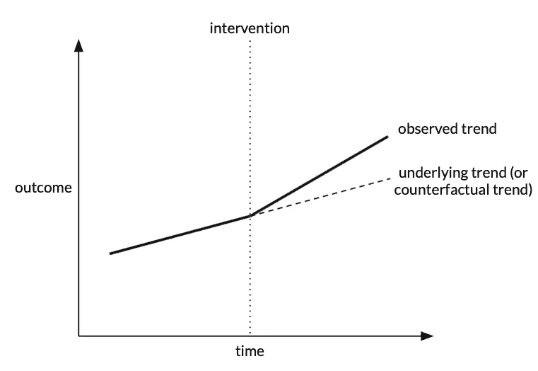
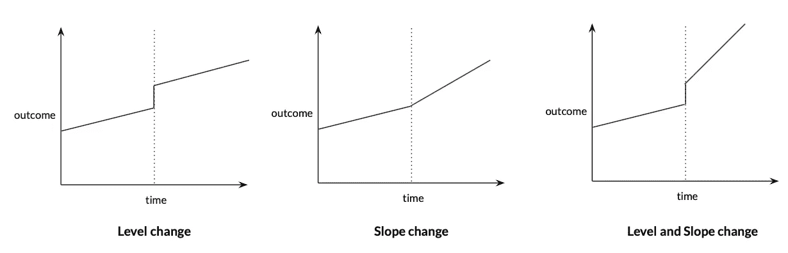
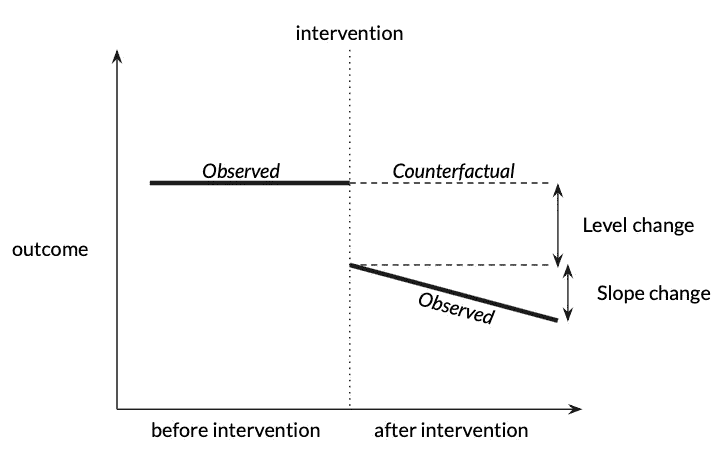

# 医疗保健中间断时间序列设计的样本容量规划

> 原文：<https://towardsdatascience.com/sample-size-planning-for-interrupted-time-series-design-in-health-care-e16d22bba13f>

## 这是最强的准实验设计之一。可以说，对研究的适当规划比分析本身更重要。

照片由 [STIL](https://unsplash.com/@stilclassics?utm_source=medium&utm_medium=referral) 在 [Unsplash](https://unsplash.com?utm_source=medium&utm_medium=referral) 上拍摄

# 为什么要中断时间序列设计？

循证实践是现代医学的基础。为了将机器学习(ML)模型集成到临床护理中，我们需要能够将观察到的健康结果和/或运营效率的影响归因于具有高置信度的模型。

预测 ML 模型主要是基于观察数据开发的。然而，从这些观察性研究中得出因果关系是误导性的。它们可以为进一步的测试生成假设，但很少用于评估我们的模型在现实世界中的有效性。

随机对照试验(RCT)被认为是评估医疗保健创新的黄金标准方法。然而，在许多情况下，由于实际或道德障碍，RCT 是不可能的。中断时间序列(ITS)设计是一种可能的选择，事实上是最强的准实验设计之一。

# 什么是间断时间序列设计？

在 ITS 中，通过比较在引入干预措施之前的几个时间点和之后的几个时间点获得的结果测量来评估干预措施(例如，部署的 ML 模型)的效果。目标是检测干预的效果是否大于潜在趋势。

作者图片

# 智能交通系统的功率和样本容量规划

规划智能运输系统应该如何实施是至关重要的，甚至可以说比分析更重要。设计糟糕的研究永远无法恢复，而分析糟糕的研究可以重新分析。如何设计研究也决定了如何分析数据。为了确保研究的有效性和足够的能力，我们需要仔细计划样本量应该有多大，这也与研究应该持续多长时间以及我们应该多久收集一次数据密切相关。没有精确的公式来计算 ITS 所需的最小样本量。相反，有各种因素需要集体考虑:

*   每个前段和后段中的时间点数量
*   每个时间点的平均样本量
*   时间点的频率(即每周、每月、每年等)。)
*   介入位置(即中间、1/3、2/3 等。)
*   预期效果大小

## 之前和之后的时间点数量

它依赖于一段时间内对一个结果事件的重复观察，通常间隔相等。这里，我们将对结果事件的观察称为时间序列分析中的**时间点**。ITS 设计中通常有两个**段**:干预前段和干预后段。

关于所需的最少时间点数量，存在相互冲突的建议。建议范围从每段 3 个时间点到每段 50 个时间点。许多对 ITS 进行系统综述的论文甚至不考虑每个片段少于 3 个时间点的研究，因为它们的有效性值得怀疑。

根据用于分析时间序列趋势的方法，需要不同数量的时间点。例如，如果使用普通的最小二乘法(OLS)，50 个时间点总体上可以被认为是一个长时间序列，但如果使用 ARIMA，50 个时间点是最小值。总的来说，可用的时间点越少，可以可靠地估计的相关结构越简单。

虽然在所需的最少时间点数量上没有黄金标准，但普遍的共识是较长的时间序列往往比较短的时间序列更有力量。

## 每个时间点的样本量

即使对于具有许多时间点的时间序列，如果只有少数受试者构成对结果事件的时间点的估计，由于噪音和可变性，也不太可能检测到真实的影响。构成每个时间点的大量受试者提供了更稳定的估计，从而减少了时间序列分析中的可变性和异常值。

## 时间点的频率

取决于时间间隔的选择，在时间点的数量和每个时间点的样本量之间存在权衡。为了优化研究能力，您可以牺牲每个时间点的样本量来增加时间点的总数，反之亦然。例如，平均每周有 10 个不同的主题可用于计算结果度量。你只能负担 6 个月的研究费用。如果选择时间点频率为每月，时间序列将由 6 个时间点组成，其中每个时间点的样本量为 40。如果选择频率为两周一次，则总共有 12 个时间点，每个时间点的样本量为 20。在大多数情况下，当以每个时间点的样本大小为代价延长时间序列时，只能获得很小的功率增益。当一个非常短的时间序列变长时，增益更明显。

如果可能，选择具有临床或季节性意义的频率，以便建立真正的潜在趋势。还要考虑是否可能存在延迟或减弱的干预效应，尤其是当影响逐渐发生时，可以据此选择频率。

## 干预的位置

您可以计划在时间序列的中间(最常见的情况)、时间序列的早期(例如，1/3 的时间点在干预之前)或时间序列的后期(例如，2/3 的时间点在干预之前)引入干预。只要每个时间段有足够的时间点，并且每个时间点都有足够大的样本量支持，那么早期或晚期干预的研究能力与中途干预相比没有太大差异。

## 预期效果大小

在开始实施你的研究之前，你应该假设如果干预有效的话会对结果产生怎样的影响。在 ITS 中，有两种主要类型的效果:

*   斜率变化:趋势梯度(或斜率)的逐渐变化
*   水平变化:水平的瞬间变化

作者图片

这两种效果不需要互相排斥。您可以更改高程、坡度或高程和坡度。这些变化也可能是暂时的，或者具有滞后性。

作者图片

效果大小是干预效果的大小。一般来说，检测大效果尺寸比检测小效果尺寸更容易。换句话说，当预期效应大小很大时，我们需要更少的时间点和每个时间点更小的样本量来确保足够的功效。

到目前为止，您可能已经注意到，本文没有为其提供任何简单的样本大小公式(抱歉！)因为没有。研究人员和数据科学家应该根据他们的具体场景考虑多种因素。本文中介绍的这些因素是为其设计的规划过程提供信息的最低要求集。