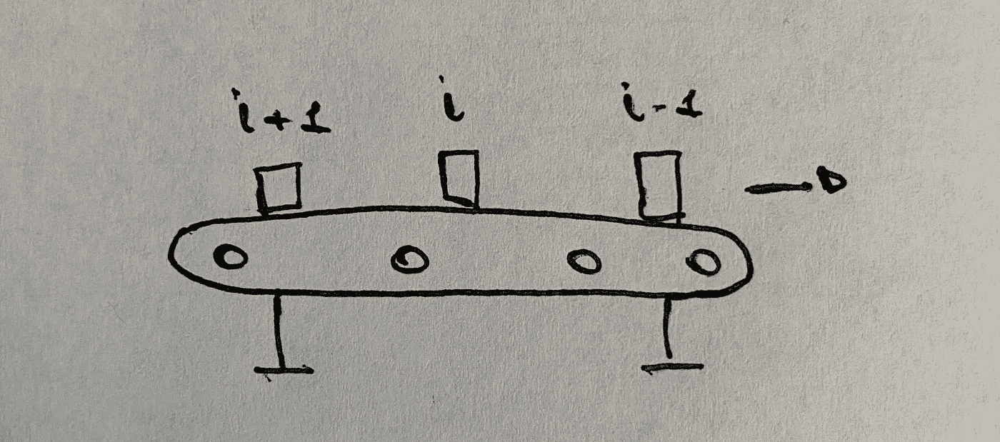
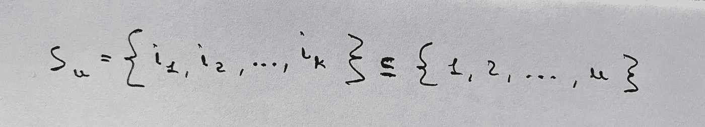
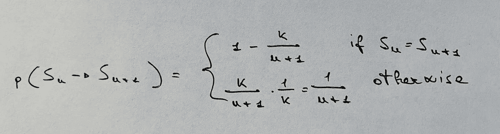
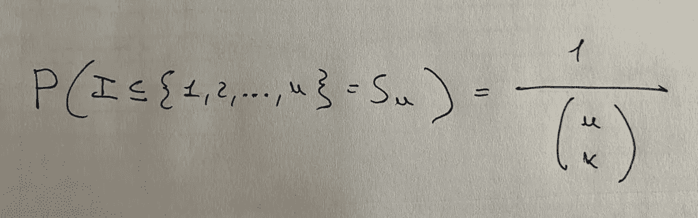
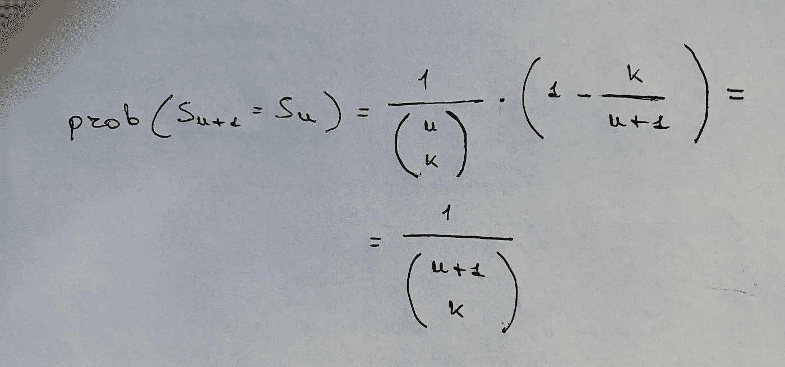
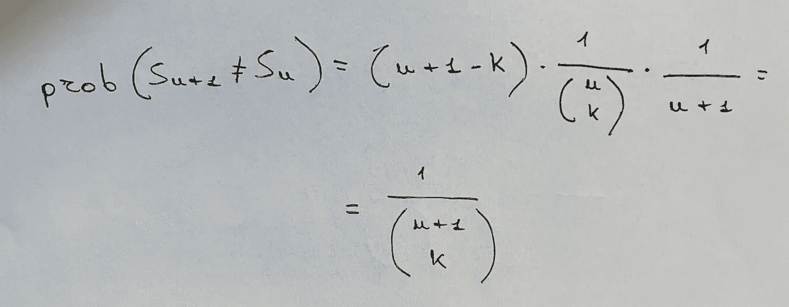
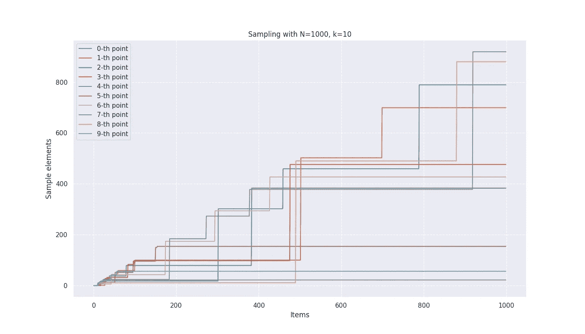

# 从未知规模的总体中抽样

> 原文：<https://towardsdatascience.com/sampling-from-a-population-of-unknown-size-1b48fbfb3b33>

## 流式项目的统一采样算法介绍


迪伦·诺尔特在 [Unsplash](https://unsplash.com/s/photos/lottery?utm_source=unsplash&utm_medium=referral&utm_content=creditCopyText) 上的照片

## 取样任务

鲍勃在一家电子元件工厂从事质量控制工作。在他的任务中，每天他必须检查不同的产品，以识别可能的缺陷，并评估生产过程的整体平稳性。必须随机选择产品，并遵循统一的抽取概率(即**统一抽样**)。

但是产品出厂的数量 *N* 每天都在变化，无法提前设定。此外，Bob 不能等待所有的 *N* 产品都出来:他必须在产品出来时进行检查，因此取样过程必须在线进行。



我们需要采样流项目——按作者排序的图像

显然，Bob 需要一个策略来有效地完成他的任务。我们正在讨论从未知规模的总体中均匀抽样的问题。

## 问题的定义

> 为了解决采样问题，我们需要一种算法，通过对先验未知的大小为 *n* 的群体进行一次遍历，能够随机采样 *k* 个对象而无需替换。

作为附加要求，我们还将假设:

*   *n* 是一个比 *k* ( *n≫ k* )大得多的数，因此不可能将所有 *n* 项存储在内存中并对其进行提取；
*   该算法无法提取已经通过的项目。

换句话说，该算法一次按顺序处理一个项目，并决定是否提取它。

## 该算法

这种算法是存在的，它包括以下步骤:

1.  最初，Bob 提取所有第一个 *k* 项目(记住*n≫k*)；
2.  然后，对于 *i > k+1* ，他以等于 *k/n.* 的概率提取第 *n 个*乘积
3.  当一个新项目被添加到样本中时，在当前样本中随机选择的另一个项目相应地被丢弃。

在此过程之后，每次迭代中提取的样本结果(以及一些近似值)在 *1* 和 *n* 之间均匀分布。

## 算法的证明


照片由 [Aaron Burden](https://unsplash.com/@aaronburden?utm_source=unsplash&utm_medium=referral&utm_content=creditCopyText) 在 [Unsplash](https://unsplash.com/s/photos/writing?utm_source=unsplash&utm_medium=referral&utm_content=creditCopyText)

有趣的是，我们可以把算法想象成一个**马尔可夫链**。按照这种方法，在步骤*的**状态**n*是包含到目前为止收集的项目的样本。处理新项目时，无论新项目是否添加到样本中，都会发生状态转换。



步骤 n 中的样本是介于 1 和 n 之间的自然数的子集-图片由作者提供

基于我们的算法如何工作，对于 *n > k* 的**转移概率**由下式给出:



步骤 k 后的转移概率-按作者分类的图像

现在我们需要证明对于每一步 *n≥k* 所有的状态都有相同的概率成为样本。我们可以通过**归纳**来证明。

因此，让我们假设在步骤 *n≥k* 所有子集 *Sn* 有相等的机会成为样本。因此，每个状态 *S* 成为步骤 *n* 的样本的概率为:



子集成为给定步骤中样本的概率-作者图片

在步骤 *n+1* 中，新样本 *S* 可以与之前相同，也可以包含新项目。在第一种情况下，我们有一个概率:



新样本与之前样本相同的概率-图片由作者提供

在第二种情况下，获得新样本的概率由下式给出:



新样本包含新项目的概率—按作者排序的图像

因子 *1/(n+1)* 作为*k/(n+1)*——即提取新项目的概率——和*1/k*——给定样本元素被新项目替换的概率的乘积来获得。

公式中的因子 *n-k+1* 考虑了样本中第 *i 个*项(以及该样本中不包含的 *n-k 个*项之一)被新项 *n+1* 替换的所有可能子集。


每个新样本都可以从以前的多个样本中派生出来——图片由作者提供

所以在每一步 *n≥k* 我们都有总的 *n-k+2* 个新的可能样本，并且它们中的每一个都有相同的概率被选中。

作为归纳基础，我们在 *n=k* 选取样本，根据我们的概率函数，选择概率为 1(这是正确的，因为我们这里只有一个可能的子集)。神盾局。

## 一个基本实现:算法 R


劳拉·奥克尔在 [Unsplash](https://unsplash.com/s/photos/gears?utm_source=unsplash&utm_medium=referral&utm_content=creditCopyText) 上的照片

记住了它的定义，就可以非常容易地编写一个工作算法，如下面的 Python 代码片段所示。

```
import numpy as np# Sampling parameters.
n_items = 1000
sample_size = 10sample = np.zeros(sample_size, dtype = int)
steps = np.arange(n_items)# Initial sample.
for nn in range(sample_size):
    sample[nn] = nnfor nn in range(sample_size, n_items):# Compute the current item.
    ii = np.random.randint(0, nn, dtype = int)if ii < sample_size:
    sample[ii] = nn
```

图中显示了 *n=1000* 和 *k=10* 的结果。我们可以看到，在项目被处理时，样本的元素随机地从一个索引迁移到另一个索引，尽管一些最早的元素可能会随着时间的推移而持续存在。



运行算法-按作者分类的图像

上面讨论的实现通常被称为**算法 R** ，最初由 A. Waterman 提出，并由 J. Vitter 在[3]中讨论。由于每一项都需要一次计算，无论是否保留，这个算法的复杂度都是 ***O(n)*** *。*

## 一个优化的变体:算法 L

算法 R 属于**储层取样**系列，该系列包括设计用于从未知数量 *n* 的总体中选择一个简单随机样本 *k* 项目的算法，无需替换。

所谓的**算法 L** 给出了算法 R 的优化变体。在【4】中讨论，该变量计算在下一个物品进入储槽之前有多少物品被丢弃:这是可能的，因为丢弃物品的数量根据**几何分布**分布，因此可以提前计算。这样一来，这个算法的复杂度降低到了***O(k(log(n/k)+1))***。

## 其他变体:带权重的随机抽样


照片由 [Piret Ilver](https://unsplash.com/@saltsup?utm_source=unsplash&utm_medium=referral&utm_content=creditCopyText) 在 [Unsplash](https://unsplash.com/s/photos/balance?utm_source=unsplash&utm_medium=referral&utm_content=creditCopyText) 上拍摄

还有其他处理加权项目的变体。在这种情况下，权重与每个权重相关联。例如，一个人可能需要对 Twitter 上的帖子进行抽样，这些帖子的权重基于收到的浏览量(或互动量)。

我们可以看看为每一步定义两个不同选择概率的权重:

1.  一个**未被选中的项目**被选中的概率与其权重与所有未被选中项目的权重之和的比值成正比；
2.  任何**项**被选中的概率与其权重和**所有权重之和的比值成正比。**

基于所使用的定义，已经开发了几种具有不同效率的算法。仅提及其中的一些，算法 **A-Res** 和 **A-ExpJ** 用于定义 1， **A-Chao** 和 **A-Chao 带跳转**用于定义 2。

对于这个问题的广泛评论，特别是从编程的角度，我推荐 Startin 的这个博客。

和往常一样，本文使用的代码可以在这里找到:[https://github.com/andrea-ci/misc-stuff](https://github.com/andrea-ci/misc-stuff)。

## 参考

[1]维基百科，[油藏取样](https://en.wikipedia.org/wiki/Reservoir_sampling)

[2] StackExchange，[从有限总体中抽取固定数量样本的算法](https://stats.stackexchange.com/questions/569647/algorithm-for-sampling-fixed-number-of-samples-from-a-finite-population)

[3] Vitter，Jeffrey S .，[“储层随机抽样”](http://www.cs.umd.edu/~samir/498/vitter.pdf)，1985 年

[4]李，金鸿，[时间复杂度为 O(n(1+log(N/n)))](https://dl.acm.org/doi/10.1145/198429.198435) ，1994

[5]理查德·斯塔廷，[油藏取样](https://richardstartin.github.io/posts/reservoir-sampling)