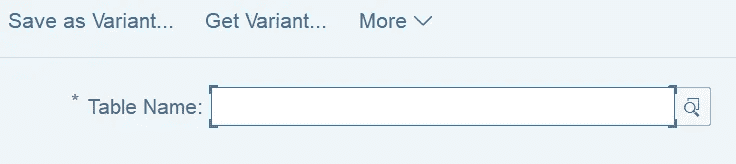
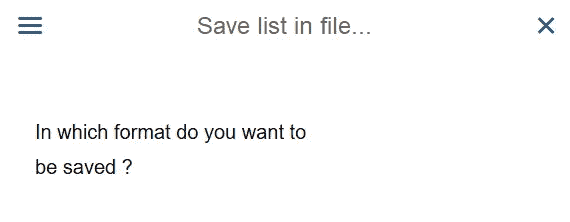
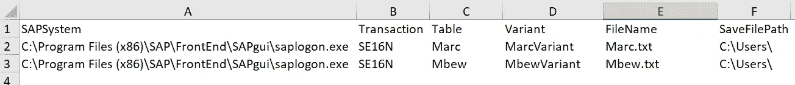
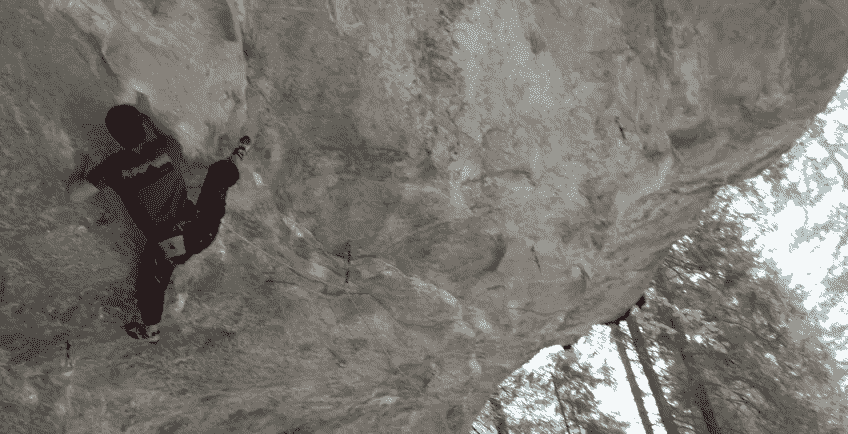

# SAP 查询智能机器人

> 原文：<https://towardsdatascience.com/sap-querying-intelligent-robot-12a4e301e876>

## 用 SQUIR 自动提取 SAP 的表

使用机器人为重要的任务保存你的能量

您是否经常运行 SE16N 事务来从 SAP 中提取表格？如果你想自动化，你可以在这里找到解决方案。Squir (SAP 查询智能机器人)是一个独立的应用程序。该程序由 Python，一个用于参数选择的 Excel 模板，以及机器人需要与之交互的截图组成。多亏了 Pyinstaller，即使您的非 Pythonist 爱好者同事也可以轻松地使用该应用程序从 SAP 中自动导出表格。Squir 可以做重复无聊的事情，这样你就可以专注于更重要的任务。

**解决方案:**

在之前的帖子中，我们学习了如何使用 Pyautogui 构建 RPA 来自动化重复性任务:

 [## 让机器人自动处理你的数据

### 使用 RPA、PyAutoGui 和 Pandas 来避免在 SAP 和您的数据仓库中进行重复的手动工作

towardsdatascience.com](/let-the-bot-automate-your-data-processing-e6ef26959d65) 

我们将对上面的代码做一个改进。不设置静态计时:

...我们将用一种更动态的方法取代静态计时器。机器人将不断筛选，一旦图像弹出，例如在 20 秒的循环内，机器人将立即与该对象进行交互:

我们为 Squir 提供所有必要的截图。例如，要在 SAP 中运行 SE16N，必须找到此按钮:

Squir 需要查找的事务。

之后，Squir 必须在该选择字段中输入所需的表名:

Squir 必须键入表格的名称，例如 MARC

最后 Squir 会将结果导出为 txt:

正是像 OpenCV 这样的包让机器人变得如此迷人！你可以在我的 Github 里找到所有需要的 SE16N 截图。如果您的 SAP 应该有不同外观的对象，您可以轻松地用自己的截图替换。只保留原来的 png 名称。

现在我们已经编写了一个 Python 机器人来为我们完成这项工作。下一步，我们将使用 Pyinstaller 将我们的脚本转换为可执行文件:

 [## 面向非 Python 爱好者的 Excel-Python 应用程序

### 让您的非编码同事预测 Python 在 Excel 中的威力(使用 Xlwings 和……

towardsdatascience.com](/excel-python-app-for-non-pythonists-68b4fec0fabf) 

由于 Pyinstaller，Python 文件转换为可执行文件

仍然缺少的是用户与机器人交互的简单方法。因此，我们提供了一个 Excel 模板，可以在其中输入所需的表格、变量、文件名等。在我们的示例中，您最多可以添加三个 SE16N 提取，机器人将运行这些提取:

您最多可以在此模板中输入三个表格

这意味着我们只需用一个循环稍微修改一下原始 RPA 代码，就可以从 Excel 中获取这些参数:

你可以在我的 github 中找到完整的 Python 代码。

祝贺您，现在您有了一个完整的独立应用程序来提取表格。您不再需要手动输入。只需将截图、exe 和 xls 文件全部保存在一个文件夹中，就可以开始运行可执行文件了。虽然这个例子是为 SAP 设计的，但是您当然也可以将代码调整到任何其他 ERP 上。

享受看斯奎尔现在为你做的工作。或者干脆不去管你的电脑，在新的空闲时间里做任何你想做的事情:

模拟仍然最摇滚(法国摇滚，作者图片)

非常感谢阅读，我希望这是支持。你可以在我的 [Github 库](https://github.com/DAR-DatenanalyseRehberg/Squir)里找到所有的截图、Python 代码和 Excel 模板。exe 文件存储在我的 [Google Drive](https://drive.google.com/drive/folders/18pixZgWdjVDsMY31dNq5qqlyENXZEIN6?usp=sharing) 里。欢迎在 [LinkedIn](https://de.linkedin.com/in/jesko-rehberg-40653883) 、 [Twitter](https://twitter.com/DAR_Analytics) 或[工作室(有或没有 VR)](https://jesko-rehberg.medium.com/virtual-reality-vr-for-education-a532aa5b6272) 与我联系。