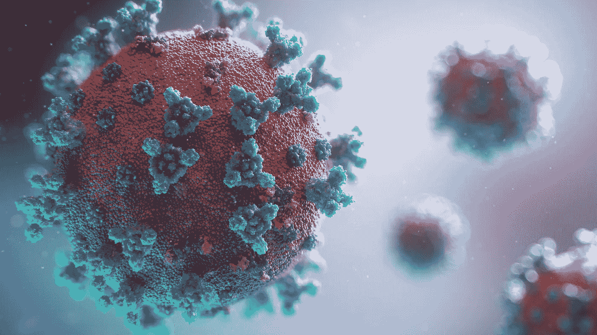
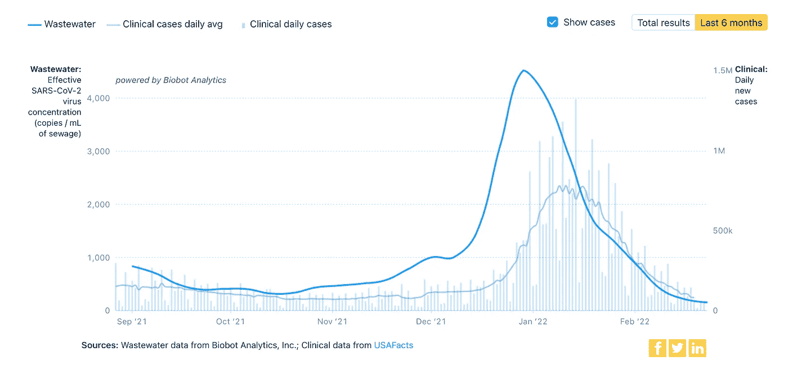

# 新型冠状病毒废水数据，增强

> 原文：<https://towardsdatascience.com/sars-cov-2-wastewater-data-enhanced-9717d8197f98>

## 将 CDC 的废水数据与新冠肺炎的疫苗接种、住院和死亡数据相结合



由 [Unsplash](https://unsplash.com/s/photos/virus-corona?utm_source=unsplash&utm_medium=referral&utm_content=creditCopyText) 上的[融合医学动画](https://unsplash.com/@fusion_medical_animation?utm_source=unsplash&utm_medium=referral&utm_content=creditCopyText)拍摄的照片

# 背景

最近有很多关于追踪废水(下水道系统)中导致新冠肺炎病的新型冠状病毒病毒的新闻报道。一周后，废水中病毒数量的激增和疾病数量的激增之间建立了强有力的联系。仅作为一个例子，该图显示了美国各种水处理设施的病毒信号(深蓝色)与已知的美国新冠肺炎病例(浅蓝色)。



图片来自 biobot.io/data/，经许可使用

最近，美国疾病预防控制中心的国家废水监测系统(NWSS)发布了关于他们收集的废水信息的公共数据。他们的[仪表板](https://covid.cdc.gov/covid-data-tracker/#wastewater-surveillance)提供了一个很好的数据总结和主题介绍。

NWSS 还提供了两个详细的数据集，显示了对废水进行的每一项实验室测试及其结果。这些数据集包含许多列信息，包括:

*   水处理设施的名称和位置
*   收集样本的日期和时间
*   排入下水道县和人口
*   对污水进行的测试类型
*   进行测试的实验室的身份
*   RNA 片段测试的数值结果

这些数据集可供签署数据使用协议的研究人员使用，以保护其中可能包含的机密个人信息。(有了一个小的下水道系统，就有可能推断出病人的名字。)

这两个详细数据集的不同之处在于，一个名为 **raw** 的数据集只包含事实，而另一个名为 **analytical** 的数据集包含许多列统计结果，这些结果可能有助于科学家分析数据。

# 一个问题

尽管详细的 CDC 废水数据很有价值，但它缺少一个关键领域——与其他真实世界新冠肺炎数据的相关性，如疫苗接种和疾病结果。数据集确实有该地区已知病例的信息，但简单的病例计数是出了名的不可靠。许多病人从未得到政府报告的聚合酶链式反应测试；测试的可用性每月都不同；当有可怕的新闻报道时，人们往往会冲出去进行测试；家庭测试也不向政府卫生部门报告。更准确的疾病严重程度的衡量标准是住院率、ICU 入院率和死亡率。

一种简单的方法是将废水样本采集当天的废水数据与疫苗接种率和疾病结果联系起来，但这不会有所帮助。在注射当天，接种疫苗不会降低疾病抵抗力。生病的人很少在出现症状的第一天去医院。不幸的是，当有人死于新冠肺炎时，这通常发生在他们进入医院几天之后。

为了了解疫苗接种如何影响废水中的新型冠状病毒，我们需要在收集废水的前几天(T0)观察不同的疫苗接种率(第一针、全程疫苗、加强疫苗)。为了了解废水是如何预测住院率的，我们需要看一下水测试后*的医院数据。为了将废水与死亡率联系起来，我们需要一个更长的时间增量。*

# 解决办法

我最近承担的一个数据工程项目解决了这些问题。它生成了一个增强版的 NWSS 详细数据集，包括该地区的疫苗接种、住院和死亡情况，这些事实的日期是在水测试之前或之后。例如，在描述 9 月 15 日在密歇根州 Arenac 县采集的水样的数据行中，添加了 9 月 5 日该县的完全疫苗接种率列，以及 9 月 29 日该县的 ICU 入院人数列。

推迟/提前日期很容易调整，并且可以很快重新生成数据集，例如，第一次接种推迟 21 天，死亡率提前 28 天。

我的数据集解决的另一个问题是，大多数美国新冠肺炎健康数据是在县一级(或州或国家)组织的。然而，水处理厂经常处理来自不止一个县的污水。我的代码重新格式化了 NWSS 的详细信息文件，以便每一行只显示一个县，从而更容易将数据集与可用的健康结果数据连接起来。

这是一个增强的行，显示了几个关键列，为了便于阅读，它们被垂直翻转:

```
**CountyFIPS** = 08069**pcr_gene_target** = n1**sample_collect_date** = 2022-01-20**pcr_target_units** = copies/l wastewater**pcr_target_avg_conc** = 490473.59**vax_date** = 2022-01-10\.  # 10 days before water sample**metrics.vaccinationsInitiatedRatio** = 0.724**metrics.vaccinationsCompletedRatio** = 0.656**metrics.vaccinationsAdditionalDoseRatio** = 0.324**cases_date** = 2022-01-27\. # 7 days after water sample**metrics.caseDensity100k** = 155.5**metrics.testPositivityRatio** = 0.214**hosp_date** = 2022-02-03\.  # 14 days after water sample**actuals.icuBeds.currentUsageCovid** = 13**actuals.hospitalBeds.currentUsageCovid** = 91**deaths_date** = 2022-02-10\.  # 21 days after water sample**actuals.newDeaths** = 2
```

增强的详细数据集的更大的匿名样本在我的 github 上，用于原始数据和分析数据。每个都有 1000 个随机的行和所有的列。

# 复制这个结果

要构建自己的增强型 NWSS 详细数据集:

*   下载或克隆 Python/熊猫[源代码](https://github.com/ChuckConnell/covid19_wbe/blob/main/make_enhanced_usa_wbe_file.py)。
*   向 NWSS 申请获取废水样本的详细数据集。数据所有者的联系信息在[数据描述](https://data.cdc.gov/Public-Health-Surveillance/NWSS-Public-SARS-CoV-2-Wastewater-Data/2ew6-ywp6)页面上。请注意，此页面描述了汇总的公共 NWSS 数据，但联系人是相同的。
*   下载新冠肺炎疫苗接种和结果数据，以及美国县人口，如源代码注释所示。这些将与 NWSS 详细数据集相结合，以制作增强版。

代码和样本数据是在 MIT 许可下发布的，只需要注明出处就可以重用或修改作品。

# 未来的工作

这个项目创建了这里描述的数据集，但是没有对它们进行任何特定的分析。显而易见，下一步是使用增强的数据集来寻找废水结果和 ICU 入院之间的相关性，或者第一次疫苗或完全疫苗接种是否对废水病毒有更大的影响，或者其中一个事件预测另一个事件的最佳时间增量。

这里讨论的数据是针对美国的。世界各地也有针对新型冠状病毒 RNA 的废水检测。进行这种检测的地点显示在[加州大学默塞德分校](https://ucmerced.maps.arcgis.com/apps/dashboards/c778145ea5bb4daeb58d31afee389082)和[全球水病原体项目](https://sphere.waterpathogens.org/map)的仪表盘上。我的工作的一个有价值的扩展是创建一个单一的全球数据集，该数据集结合了地图上显示的所有废水检测点，并通过病例、住院、ICU 和死亡率来增强该数据。换句话说，为整个世界创建上述相同的数据集。

# 数据注释

起初，有几个数据模型项目可能会令人困惑，因此在查看 NWSS 数据集时请记住以下几点:

*   在原始文件中， **sample_id** 字段有时会在多行中重复出现。当同一个水样被检测一个以上的基因目标时，例如 N1 和 N2，就会出现这种情况。
*   在分析文件中， **sample_id** 字段通常为空。当该日期在该位置没有水样时，就会出现这种情况，因此数据行用于保存当天的新冠肺炎病例统计数据。我的增强代码删除了这些空白的 **sample_id** 行，因为我使用样本的日期将案例结果信息直接添加到样本行中。

# 信用

感谢 [Amy Kirby](https://twitter.com/amylizk) 和疾控中心 NWSS 数据所有人的有益讨论和对详细数据集的访问，感谢 [Colleen Naughton](https://twitter.com/naughtoncc) 和 [Claire Duvallet](https://twitter.com/cduvallet) 的鼓励和对其他基于水的流行病学相关研究的指导，感谢 [Mimi Alkattan](https://twitter.com/WaterLabMimi) 的宝贵评论。

# 了解更多信息

*   [biobot.io/data/](https://biobot.io/data/)(生物机器人仪表盘)[biobot.io/blog/](https://biobot.io/blog/)(博客)
*   [twitter.com/COVIDPoops19](https://twitter.com/COVIDPoops19)(推特上关于通过加州大学默塞德分校和科琳·诺顿的废水追踪新冠肺炎的消息)