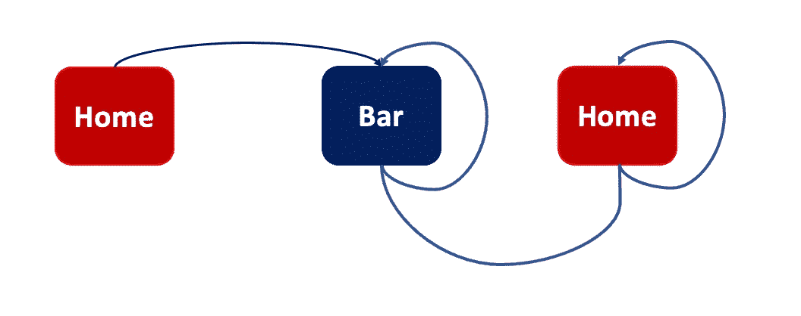
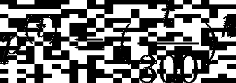
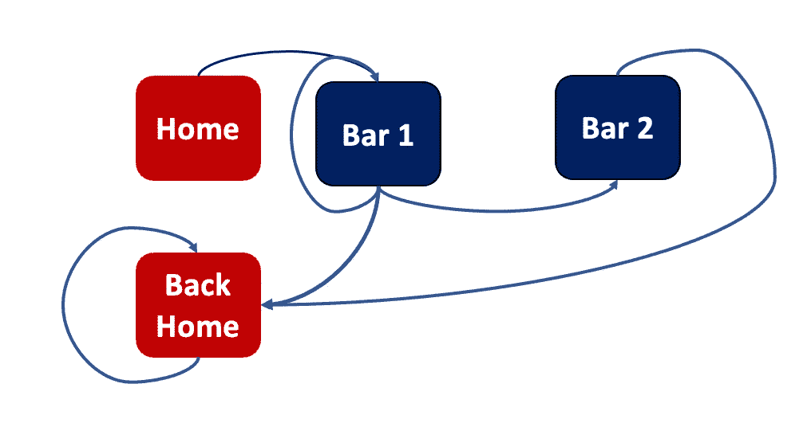

# 周六晚上使用马尔可夫链建模，使用 Python

> 原文：<https://towardsdatascience.com/saturday-night-modeling-using-markov-chains-with-python-a29188330a1e>

乔恩·泰森在 [Unsplash](https://unsplash.com/s/photos/saturday?utm_source=unsplash&utm_medium=referral&utm_content=creditCopyText) 上的照片

## 以下是我如何使用马尔可夫链和 Python，以一种现实的方式使用马尔可夫链为一个普通的周六晚上建模

6 个月前，当我来到美国开始我的研究工作时，我学到了一个新的英语术语:

> [“跳吧”](https://www.huffpost.com/entry/if-youve-never-been-bar-hopping-heres-how-it-usually_b_5a5d4955e4b0a233482e0e20)

我认为更具欧洲色彩的说法是“酒吧爬行”，但这个概念基本上是指在相距较近的不同酒吧(或酒吧)兜一圈，喝一杯，这样就不需要开车了，或者你可以用几美元去“优步”。

物理学学士学位期间，我学习了所谓的**马尔可夫链。**马尔可夫链是做出以下(非常简单)假设的模型:

> “从一种状态到另一种状态的概率只取决于你现在所处的状态，而不取决于以前的历史”

比如说**今天是晴天**。**今天是晴天**这一事实是你唯一需要知道的事情，以获得**明天将是晴天**的概率(你不在乎昨天是否是晴天)。

这个概念是疯狂的简单，但后果可能真的很有趣。
特别是当你考虑一系列随机变量时，它变得非常强大。通过这种方式，你实际上可以创建一个过程，并基于你的假设看到整个演变过程。技术上，我们将讨论**离散时间马氏链**。这意味着你看到了一步一步的进化，每一步都是一个“时间滴答”。

让我们在 Bar Hopping 场景中使用这些假设，并使用 Markov 链来玩一玩。:)

> 注:在这篇 [**文章**](/hands-on-markov-chains-example-using-python-8138bf2bd971) 中，我展示了一些最著名的马尔可夫链及其对应的代码。如果你觉得这个想法很有意思，并且想知道更多，就来看看吧！

# 0.图书馆

我们将把 Python 与一些不同的基础数据科学库一起使用:numpy**、matplotlib、seaborn** 和**熊猫:**

# 1.一小节时间独立模型

先从有史以来最简单的情况说起:**你只有一个酒吧，只有想出去才能去。**

我们将创建三个状态:

*   **首页**
*   **酒吧**
*   **回国**

从州**家**你只能出门。所以第一个假设是你必须出去才能去酒吧。很合理。

然后，从**栏**开始，对于每一个时间步，你都可以留在酒吧或者回家。假设在每个时间点，你有 50%的概率回家，50%的概率留下。

当你回到家时，你唯一能做的事就是呆在家里。意味着你不会再出去了。同样，非常合理。

我们将考虑 300 步，假设每一步是一分钟，这样我们将有一个 5 小时长的夜晚。

作者图片

所有这些信息被分组在一个所谓的 ***转移矩阵*** 中:

现在，这个函数计算给定的状态下的状态:

并且下面的函数描述了直到时间 **n(分钟 n)的整个过程:**

好了，现在我们来玩一玩吧。

我们考虑 1000 次实现同样的体验(假设 1000 个人出门)，n 步后看看我们在哪里(是否在家)，这里 n 从 2 到 5。让我们先定义完成这项工作的函数:

然后让我们画出结果:

因此，两步之后，大约 500 人在家，500 人仍在酒吧，而五步之后，超过 850 人在家，只有 150 人(大约)仍在酒吧。但别忘了，每一步都是一分钟。

那么它是一个好的模型吗？大概不会。
让我们用新的把事情变得更复杂:

# 2.一杆时间相关模型

真正让你回到家的东西只有一个:**时间。在酒吧呆了 150 分钟后，你可能想回家，而如果你只在酒吧呆了 5 分钟，你可能想留下来。在前一个模型中，没有时间依赖性，这是不好的。**

假设回家的概率如下:

我用[乳胶](https://latex2png.com/)制作的图像

这意味着当 k=1 时:

*   在时间 0 回家的概率为 0%
*   在时间**t = 300**(5 小时后)回家的概率为 100%
*   **在时间**t = 150**(2 个半小时后)回家的概率的 50%**

现在:

> 鉴于你的个人经历，你同意这个比率吗？

我不知道:这就是为什么 **k 是一个参数**。我马上会告诉你我的意思。

首先，让我们实现这个过程:

让我们将 **k=6** 定义为默认参数，并绘制结果:

所以，当 k=6 时，1000 人中有 720 人还在酒吧里。

你可能有自己的酒吧，找到不同的数字，并好奇的顺序，最匹配的数字，你已经找到了。为了验证您应该使用哪个顺序(k ),您可以像这样做:

**所以，例如，如果你相信 85%的人会在酒吧，你可以用 k=7。**

这种模式更好，但仍然局限于单个酒吧。我们能做得更好吗？

# 3.两杆距离独立模型

在这种情况下，我们将有 4 种状态:

*   **首页**
*   **杆 1**
*   **杆 2**
*   **回老家**

它是这样工作的:

*   从国家**回家**只能出门。所以第一个假设是你必须出去才能去酒吧。很合理。**等概率(50%)可以进 1 号杠和 2 号杠。**
*   从**酒吧 1，**你可以留在酒吧 1，去酒吧 2，或者回家。假设在每个时间点，你有 70%的概率呆在酒吧 1，20%的概率去酒吧 2，10%的概率回家
*   从**栏 2** 你可以以 70%的概率留在栏 2 或者以 30%的概率回家
*   还是那句话，当你回到 T21 时，你唯一能做的就是呆在家里。意味着你不会再出去了。同样，非常合理。

它是这样工作的:

作者图片

让我们来实现这个想法:

好吧，但是我们到底去了多少次 1 号酒吧？我们去了多少次酒吧 2？我们两个都去了几次？

让我们用下面的代码检查一下:

因此，51.5%的时间我们只去酒吧 2，17.0%的时间我们只去酒吧 1，31.5%的时间我们去酒吧 1 和酒吧 2。

> 另外，你可以玩概率数字，得到更接近你脑海中真实世界的例子:)

好的，但是我们需要多少时间回家？让我们画出分布图:

嗯…不是很理想，不是吗？我们看到的最佳数字是时间= 50…这是相当低的。

如果我们玩概率游戏，我们可以看到我们有更合理的数字:

> **附注:我刚刚更改了第 1 栏和第 2 栏的转换矩阵**

更好的是，即使我们仍然可以整合先前模型的时间相关假设，并可能获得更好的结果(对于低时间值，曲线仍然太高):

# 4.两杆距离相关模型

好的，但是你有 50%的概率去酒吧 1 或 2，这是不合理的，对吗？如果一家酒吧离你很近，而另一家却很远。如果一个酒吧坐满了女孩/男孩(而你是单身)，而另一个是空的。如果一家酒吧真的很贵，另一家很便宜。

我们可以定义一个所谓的“距离”,并改变从家到酒吧 1 或从家到酒吧 2 的概率。

这是怎么回事:

让我们做同样的分析:我们实际上去了多少次酒吧 1？我们去了多少次酒吧 2？我们两个都去了几次？

在这种情况下，我决定条形图 1 为 dist_1=1，而条形图 2 为 dist_2=5。**这就是为什么你会注意到“仅第 1 栏”比“仅第 2 栏”更有可能发生。**

# 4.结论

马尔可夫链的伟大之处在于它们是可以疯狂定制的。
你有很多旋钮可以用来获得与你的统计数据相符的结果，并找到建立数据集模型的最佳方式。在这个非常有趣的小例子中，我从一个非常简单的模型(1 个小节，时间无关，空间无关)开始到一个更复杂的模型(2 个小节，空间相关)。当然你可以从中得到乐趣，让这个模型更健壮，创建更复杂的代码。

如果你喜欢这篇文章，你想知道更多关于机器学习的知识，或者你只是想问我一些你可以问的问题:

A.在 [**Linkedin**](https://www.linkedin.com/in/pieropaialunga/) 上关注我，我在那里发布我所有的故事
B .订阅我的 [**简讯**](https://piero-paialunga.medium.com/subscribe) 。这会让你了解新的故事，并给你机会发短信给我，让我收到你所有的更正或疑问。
C .成为 [**推荐会员**](https://piero-paialunga.medium.com/membership) ，这样你就不会有任何“本月最大数量的故事”，你可以阅读我(以及成千上万其他机器学习和数据科学顶级作家)写的任何关于最新可用技术的文章。