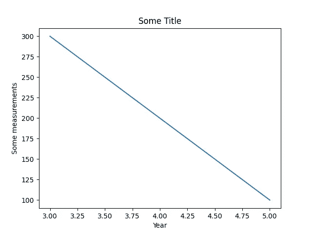

# 如何使用 Matplotlib 将绘图保存到图像文件

> 原文：<https://towardsdatascience.com/save-plots-matplotlib-1a16b3432d8a>

## 了解如何将 matplotlib 图形和绘图保存到图像文件


费尔南多·拉文在 [Unsplash](https://unsplash.com/s/photos/floppy-disk?utm_source=unsplash&utm_medium=referral&utm_content=creditCopyText) 上拍摄的照片

## 介绍

有时，您可能需要将在磁盘上创建的绘图和图形存储为图像文件。在某些情况下，您可能还希望在每次运行程序时，不要在屏幕上显示图形或数字。

在今天的文章中，我们将展示如何将`matplotlib`图形和情节保存到磁盘上的图像文件中。此外，我们将解释如何禁用交互模式，以便在执行代码时不显示图形。

首先，让我们用 matplotlib 创建一个虚拟图形，作为演示一些概念的例子。

```
import matplotlib.pyplot as pltplt.plot(
    [5, 4, 3], 
    [100, 200, 300] 
)
plt.title('Some Title')
plt.xlabel('Year')
plt.ylabel('Some measurements')
plt.show()
```

创建的图形如下所示:



测试图—来源:[作者](https://gmyrianthous.medium.com/)

## 将磁盘上的绘图保存为图像文件

现在如果你想通过编程将`matplotlib`图片保存为**图片文件**，那么你所需要的就是`[matplotlib.pyplot.savefig()](https://matplotlib.org/stable/api/_as_gen/matplotlib.pyplot.savefig.html)`函数。只需传递所需的文件名(甚至位置),该图就会存储在您的磁盘上。

```
import matplotlib.pyplot as pltplt.plot(
    [5, 4, 3], 
    [100, 200, 300] 
)
plt.title('Some Title')
plt.xlabel('Year')
plt.ylabel('Some measurements')**plt.savefig('my_plot.png')**
```

或者，当调用`plt.show()`时，您仍然可以通过点击显示在交互窗口底部的保存图标来保存图形

```
**plt.show()**
```


互动窗口—来源:[作者](https://gmyrianthous.medium.com/)

## 禁用交互模式

在某些情况下，图形仍然显示在交互模式中，即使在我们将图形保存在磁盘上后没有调用`plt.show()`。当你以一种迭代的方式生成多个图时，这就更令人讨厌了，因为当程序结束时，你会得到大量的开放图形。

您可以通过简单地调用确保图形窗口关闭的`[matplotlib.pyplot.close()](https://matplotlib.org/stable/api/_as_gen/matplotlib.pyplot.close.html)`方法来防止这种情况发生。

```
import matplotlib.pyplot as pltplt.plot(
 [5, 4, 3], 
 [100, 200, 300] 
)
plt.title('Some Title')
plt.xlabel('Year')
plt.ylabel('Some measurements')plt.savefig('my_plot.png')**plt.close()**
```

## 最后的想法

在今天的文章中，我们讨论了将`matplotlib`图形和绘图保存为图像文件，或者通过编程，或者使用我们调用`plt.show()`时弹出的交互窗口中提供的工具。

此外，我们展示了如何通过在本地存储文件后直接关闭图形窗口来防止图形显示在屏幕上。

[**成为会员**](https://gmyrianthous.medium.com/membership) **阅读介质上的每一个故事。你的会员费直接支持我和你看的其他作家。你也可以在媒体上看到所有的故事。**

[](https://gmyrianthous.medium.com/membership) [## 通过我的推荐链接加入 Medium-Giorgos Myrianthous

### 作为一个媒体会员，你的会员费的一部分会给你阅读的作家，你可以完全接触到每一个故事…

gmyrianthous.medium.com](https://gmyrianthous.medium.com/membership) 

**你可能也会喜欢**

[](/change-font-size-matplolib-480630e300b4) [## 如何更改 Matplolib 图中的字体大小

### 了解如何更改使用 matplotlib 生成的 Python 图中的字体大小

towardsdatascience.com](/change-font-size-matplolib-480630e300b4) [](/change-figure-size-matplotlib-11a409f39584) [## 如何在 Matplotlib 中改变图形的大小

### 讨论如何在 Python 中调整用 matplotlib 创建的图形的大小

towardsdatascience.com](/change-figure-size-matplotlib-11a409f39584)