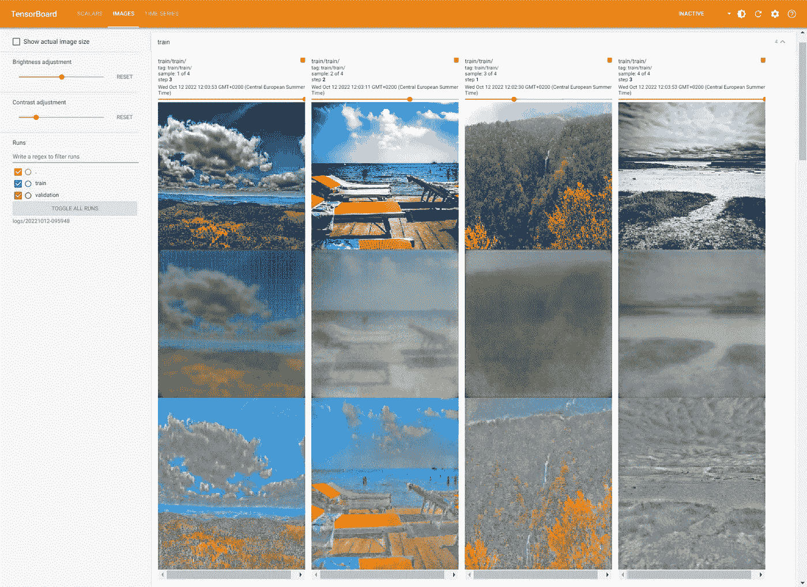
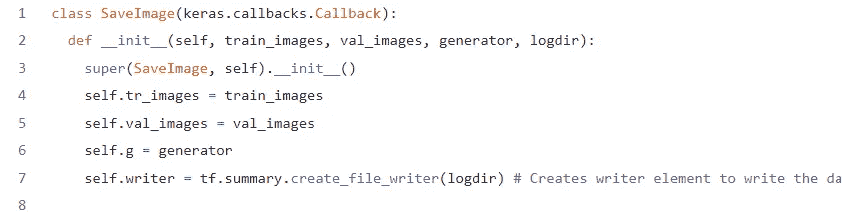
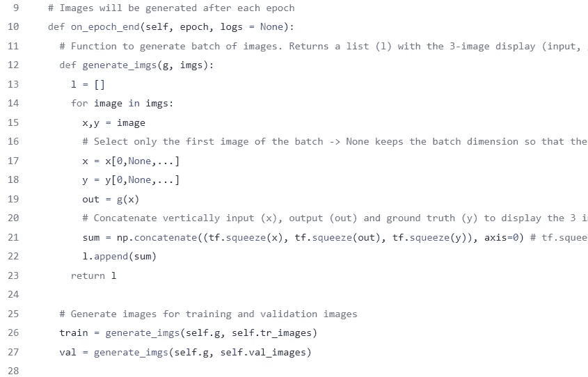
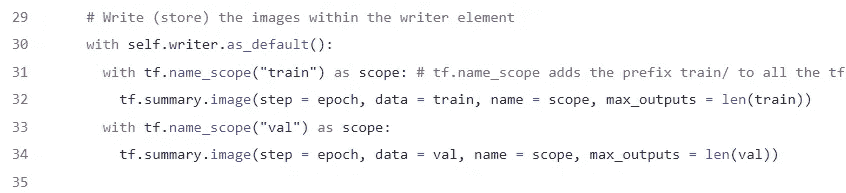
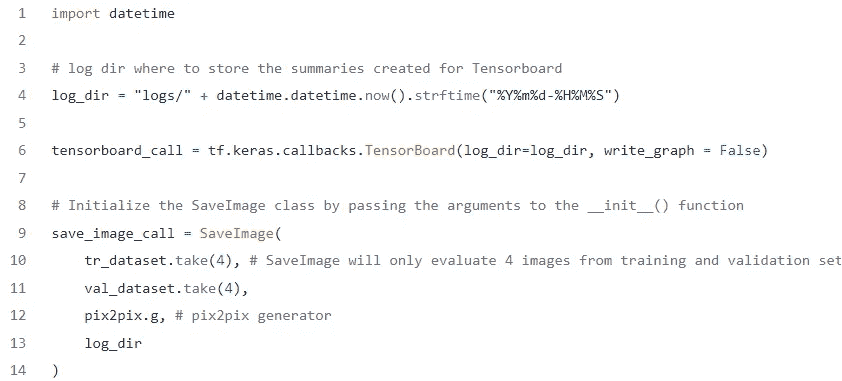
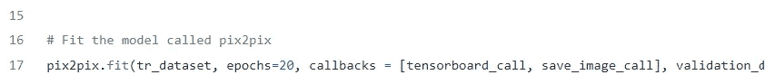

# 用 tf.summary.image 在 Tensorboard 中保存多个图像

> 原文：<https://towardsdatascience.com/saving-multiple-images-in-tensorboard-with-tf-summary-image-15df9c11d6c9>

## 如何在 Tensorboard 内存储多个图像，以查看您的神经网络的演变。GAN 模型的案例应用

桑尼·萨希尔在 [Unsplash](https://unsplash.com/collections/10458041/dashboard?utm_source=unsplash&utm_medium=referral&utm_content=creditCopyText) 上的照片。由作者编辑。

R 最近，我一直在开发一个图像生成模型，并且需要在 **Tensorboard** 中保存一些图像，以查看该模型在每个时代是如何发展的。

经过长时间的搜索和几个文档文件，我终于得出了您可以在图像中看到的结果:

截图取自 Tensorboard 项目。上面的图像是给予神经网络的输入，中间的图像是网络的输出(翻译的图像)，而下面的是基础事实(模型应该输出的内容)。图像顶部的进度条表示图像生成的时间。作者图片

在上面的例子中，这个模型使用 Pix2Pix 模型[ [链接到 paper](https://arxiv.org/pdf/1611.07004) ]，试图将给定的图像“翻译”成莫奈的艺术绘画。您可以在 Kaggle 存储库[ [链接](https://www.kaggle.com/datasets/shcsteven/paired-landscape-and-monetstylised-image) ]中找到您正在查看的数据集

**注 1** 。由于我只是想显示仪表板，模型被训练的时期数量非常少，所以结果看起来很差。

# 为什么使用 Tensorboard

**Tensorboard** 是一个可视化工具，它提供了分析神经网络性能的框架。它可以使用 *Tensorflow* 和 *Pytorch* 库进行集成，在您机器的本地端口上生成一个接口，用于投影损失函数的演变等指标或跟踪定制指标，如本例中生成的图像。

这些可视化对于神经网络模型的开发阶段来说是必不可少的**、允许我们检测关键问题，例如**过拟合/欠拟合**、测量和**比较多个模型**，或者提供关于哪些改变可以提高整体性能的见解**(超参数调整)**
例如，分析每个时期上生成的图像可以帮助我们检测生成器中的弱点，例如粒状模式的生成或模式崩溃导致的停滞，但这些是另一篇文章的主题**

想了解更多关于 Tensorboard 的信息，可以查看文档[这里](https://www.tensorflow.org/tensorboard/get_started)。

# 密码

我不想浪费你的时间，所以下面是保存图片的代码:

喀拉斯。回调子类。作者代码

接下来，使用自定义回调启动培训:

使用自定义回调训练 Pix2Pix 模型。作者代码

## 代码解释

对于那些不复制和粘贴代码的人，让我解释一下当你运行上面的代码时会发生什么。

第一步我们需要创建一个`keras-callbacks`子类，在那里我们可以定义我们的自定义回调。
回调是在训练过程中以指定的频率执行的功能[参见文档](https://www.tensorflow.org/api_docs/python/tf/keras/callbacks/Callback)。要告诉 Tensorflow 在训练时使用回调，我们只需以列表对象的形式将它们作为参数传递(参见第 5 步)

截图取自代码。作者图片

在我们的例子中，回调类接收来自训练集和验证集的一批图像、模型的生成器(这样我们就可以生成图像)和存储图像的路径(`logdir`)作为参数，这些图像将在 Tensorboard 中显示。

我们还定义了实例变量`self.writer`，它为给定的日志目录创建一个摘要文件编写器(我们将在这里存储信息，以便稍后在 Tensorboard 上显示)

【T22 日我们定义了 de 类方法`on_epoch_end`，顾名思义，它将在每个历元之后执行。

**注 2** 。接收此方法的参数以 Tensorflow 为前缀，所以不要试图更改它们。

在`on_epoch_end`方法中，我们还必须定义一个函数来生成图像(这样代码看起来更干净、更有条理)。

截图取自代码。作者图片

函数`generate_imgs`获取一组图像(来自 Tensorflow.data 的 TakeDataset 元素)和生成器( *g* )，并返回一个 3 显示图像的列表，该列表垂直连接输入图像`x`、由模型`out`翻译的图像和地面实况`y`。如果我们不连接这些图像，它们将显示在 Tensorboard 的不同卡片上。

**注 3** 。在连接之前，我们必须使用函数`tf.squeeze()`移除批量维度，以防止出现异常。

**第三**接下来，我们使用`tf.summary.image()`保存图像

截图取自代码。作者图片

第一行`self.writer.as_default()`告诉 Tensorflow 将接下来的操作存储在同一个图中(即*自写器*图)，这样回调在每个时期后生成的所有图像都将被记录在同一个文件中【check [doc](https://www.tensorflow.org/api_docs/python/tf/Graph#as_default) ， [link](https://stackoverflow.com/questions/56421878/why-do-i-need-as-default-to-write-instructions-in-a-tensorflow-graph) ]
接下来，`tf.name_scope()`函数将为每个图像的名称添加前缀“ *train/* 或“ *val/* ”， 因此，训练和验证生成的图像保存在工作目录的不同文件夹中(**在 Tensorboard 中，这反映为不同的部分**，但实际上两个文件的名称相同，属于同一个摘要文件)

**注 4** 。在这种情况下，我再次将图像的名称定义为范围，因此它们将被命名为“ *train/train/* 或“ *val/val* ”，但是对于进一步的项目，我建议更改它。

第四个**初始化类。回到我们创建模型的 train.py 文件，我们通过调用它来初始化这个类(第 9 行)。对于这个项目，我决定从训练集中取 4 张图片，从验证中取另外 4 张图片，每张图片来自不同的批次。接下来，我指定生成器(pix2pix 是一个 *keras.model* 所以我可以调用生成器作为方法)和保存摘要的 logdir。**

截图取自代码。作者图片

**注 5** 。有人可能会认为，如果我们将生成器作为参数传递，那么在训练期间，它们的权重不会更新，结果也不会正确。然而，Tensorflow 设法做到了这一点，因为我们正在传递一个指向所创建的类 pix2pix 的类实例`pix2pix.g`，即当 pix2pix 更新其权重时，它将应用于其所有实例。
我亲自检查了这一点(如果你不相信我，你也可以这样做),在自定义回调中添加了一行:

`print(self.g.get_weights()[0][0][0][0])`

结果是每个时期的第一个神经元权重的打印，因此您可以注意到修改。

**第五次**使用自定义回调训练模型

截图取自代码。作者图片

# 结论

能够在训练阶段可视化您的模型的演变对于良好的开发是至关重要的，并且提供关于采取什么方向来提高模型的准确性和性能的关键见解。

然而，**考虑评估我们的定制指标的成本**也很重要，因为对于训练模型来说，时间是一个重要的事实。在这个项目示例中，根据您的硬件和映像大小，打开映像包并测试生成器可能需要额外的几分钟时间，这大大降低了培训的速度。

解决这个问题的一个好办法是建立一个*频率变量*，它将与自定义回调类中的纪元编号进行比较，这样如果`epoch % frequency == 0`，我们就可以测试生成器并保存结果。

我希望这篇文章是有用和有帮助的，更多关于人工智能和数据科学的文章，你可以查看我的其他文章。