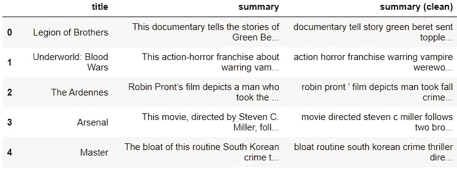
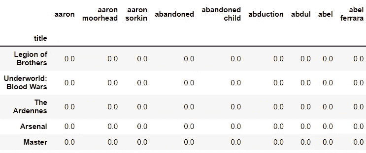
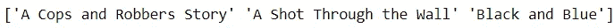

# 向推荐系统问好

> 原文：<https://towardsdatascience.com/say-hello-to-recommendation-systems-aee0488ff97>

## 最著名的数据科学应用之一的预览

照片由 Andrea Piacquadio 拍摄:[https://www . pexels . com/photo/thinking-female-secretary-picking-folder-in-workplace-3791242/](https://www.pexels.com/photo/pondering-female-secretary-picking-folder-in-workplace-3791242/)

推荐系统无处不在。当我说到处的时候，我的意思是到处都是 T2。

大多数数字服务提供商都包括为用户推荐附加内容的功能。事实上，如果你现在正在读这篇文章，你可能会看到一些推荐你接下来阅读的文章。

从电子商务到银行业，推荐系统已经渗透到每个领域。这看起来没什么大不了的，但是这个工具无处不在的事实证明了它的可用性。

推荐系统看起来简单明了，但它们给企业带来了太多好处，并改变了我们作为消费者的思维和行为方式。

在这里，我们简要介绍了推荐系统，并讨论了企业如何利用他们的数据为客户提供推荐。

## 为什么选择推荐系统？

银行、新闻媒体公司和零售商等实体都有自己独特的商业模式来满足他们的需求。然而，它们都以某种方式整合了推荐引擎。

那么，为什么这些系统如此受欢迎呢？

总之，推荐系统提供了以下好处:

**1。他们最大限度地留住客户**

许多企业(如社交媒体平台)有强烈的动机让用户尽可能长时间地参与他们的服务。在内容旁边提供推荐将确保用户继续使用该平台，而不是离开。

**2。他们最大限度地减轻客户负担**

许多企业现在提供多种选择来提高客户满意度，击败竞争对手。

不幸的是，这种做法导致了一种被称为信息过载的现象。简而言之，从众多选择中选择一个是耗费时间和精力的脑力劳动。在使用服务时不断做出决策的用户更有可能脱离服务提供商。

为了避免这种情况，企业依靠推荐来减少从一个内容到下一个内容的转换摩擦。

**3。他们识别“隐藏的宝石”**

我们，作为人，在提出建议的时候是相当直截了当的。对喜欢奇幻类型电影的朋友，我们推荐奇幻电影；对于喜欢烘焙的朋友，我们推荐烘焙食谱。不幸的是，我们无法有效地推荐人们之前没有表现出任何兴趣的项目。

另一方面，推荐系统能够透过表面层次来识别能够满足用户的项目。他们可以从用户的行为中挖掘出潜在的模式，并使用这些发现来展示用户自己不会考虑的内容。

## 推荐系统的数据

用于构建推荐系统的数据类型分为两类:

1.  **显式数据**

显性数据是指客户通过反馈直接提供的信息。

许多企业通过让客户表达他们对产品和服务的看法来收集这些数据，通常是以喜欢、评级和评论的形式。

**2。隐含数据**

隐性数据是指客户通过他们的行为提供的信息。这种类型的数据可以通过观察用户的交互来收集。

例如，网站可以通过记录用户访问的页面和购买的商品来跟踪用户行为，然后使用这些信息来了解他们的偏好。

## 推荐系统的类型

总而言之，在为客户产生建议时，有一些策略可以实施。

推荐系统中使用的这些主要方法是基于内容的过滤、协作过滤和混合过滤。

1.  **基于内容的过滤**

基于内容的过滤，通俗地说，就是根据内容的特征进行推荐的策略。通过检查用户消费的内容，推荐系统可以推断出用户最可能喜欢的其他内容。

基于内容的过滤遵循以下逻辑:

*   人 A 喜欢物品 X
*   项目 Y 类似于项目 X
*   因此，人 A 必须喜欢项目 Y

**2。协同过滤**

协作过滤是基于用户交互做出推荐的策略。正如“协作”一词所暗示的，这种方法需要使用多个用户的交互来为感兴趣的用户找到最佳项目。

协同过滤遵循以下逻辑:

*   人 A 喜欢项目 X
*   同样喜欢物品 X 的人 B 喜欢物品 Y
*   因此，人 A 必须喜欢项目 Y

**3。混合滤波**

企业还可以选择同时利用多种策略来创建基于混合的推荐系统，以利用每种方法的优点，同时最小化每种方法的缺点。

## 挑战

推荐系统本质上是复杂的，并对那些寻求建立它们的人提出了许多挑战和障碍。

1.  **他们需要初始数据**

不用说，推荐系统在向用户提供适当的建议之前需要足够多的数据。然而，当涉及到系统没有信息的新用户时，这可能是一个问题。这通常被称为*冷启动问题*。

**2。他们需要适应变化**

推荐系统需要考虑到顾客变化无常的本性。

一个人今天想要的不一定是明天想要的。由于客户的兴趣不断变化，推荐系统必须能够适应他们偏好的变化。

他们还必须考虑外部因素。在许多情况下，客户行为是由最近的趋势决定的。例如，服装业在提出建议时，必须跟上“流行”的潮流。

**3。他们促成了“富人越来越富”的现象**

推荐系统倾向于显示出对热门内容的偏好，因为它们拥有更多的评论和评级。这会导致系统将这些产品推给其他人，这进一步增加了它们的受欢迎程度。另一方面，不太受欢迎的产品可以被系统忽略，因此将接收很少的流量。

这种情况在许多社交媒体平台上很常见，这些平台受到了审查，因为它们的推荐算法忽视了新的内容创作者，尽管他们的材料质量很高。

**4。它们可能很难评估**

与机器学习的其他产品不同，推荐系统可能很难评估。

虽然有衡量推荐系统性能的指标，如精确度和均方误差，但它们并不是工具实际投入使用时性能的有力指标。

由于这些系统的有效性只能通过使用它们的客户的行为来真实地反映，因此评估它们的最佳方式是通过实验(例如，A/B 测试)。

## **案例研究**

真正的推荐系统是错综复杂的，并且要考虑无数的因素。然而，作为开始，使用一个简单的例子来展示如何使用数据来构建推荐系统是理想的。

在这里，我们使用 Python 构建了一个系统，根据用户已经看过的电影向用户推荐电影(基于内容的过滤)。

系统将通过执行以下操作来实现这一点:

1.  根据用户看过的电影创建用户档案
2.  将每部电影与用户档案进行比较
3.  识别与用户简档最接近的电影

这个案例研究中的数据是通过纽约时报电影 API 收集的。

代码输出(由作者创建)

每部电影将由其相应概要的矢量化形式来表示。在进行任何矢量化之前，每部电影的文本都需要经过预处理，包括去除停用词和词汇化。

代码输出(由作者创建)

对于这种情况，我们将使用 TF-IDF 算法对处理后的文本进行矢量化，并将矢量存储在数据帧中。

代码输出预览(由作者创建)

文本矢量化后，我们就可以建立用户档案，这个档案是由用户已经看过的电影决定的。在数学上，用户简档由所有这些电影向量的平均值来表示。

接下来，我们可以使用*余弦相似性度量*将该用户简档与表示其他电影的向量进行比较，较高的分数对应于较大的相似性。我们将推荐余弦相似度得分最高的 3 部电影。

下面的函数执行所有这些步骤。它输入用户看过的电影列表，并返回一个电影列表作为推荐。

作为一个例子，假设用户喜欢警察电影，并且已经观看了“别开枪”、“罪犯”和“人体摄像机”。

该函数以电影列表作为输入，将首先计算代表这些电影的向量的平均值，从而得到代表用户简档的向量。

接下来，该函数将用余弦相似性度量将该向量与表示剩余电影的所有向量进行比较。

最后，该函数将返回余弦相似度最高的 3 部电影。

代码输出(由作者创建)

自然，这个推荐系统过于简单，漏洞百出。电影不能仅凭其总结来评价。此外，使用 TF-IDF 这样的简单单词矢量化方法会产生许多假阴性(即应该推荐但没有推荐的电影)。

也就是说，这个案例研究应该让我们了解如何利用数据为客户提供建议。

## **结论**

照片由[普拉蒂克·卡蒂亚尔](https://unsplash.com/@prateekkatyal?utm_source=medium&utm_medium=referral)在 [Unsplash](https://unsplash.com?utm_source=medium&utm_medium=referral) 拍摄

直到今天，推荐系统仍然是一个主要的研究课题，这是理所当然的。有效地推出消费者感兴趣的商品的前景对任何企业来说都是诱人的。

如果阅读这篇文章激起了您对推荐系统的兴趣，我邀请您进一步探索用于构建这些系统的各种工具和技术。

你甚至可以通过建立自己的推荐系统来更上一层楼。这可能是一项艰苦的工作，但是利用您的数据科学技能来创建这样一个工具无疑将是一次令人满意和有益的经历。

我祝你在数据科学的努力中好运！