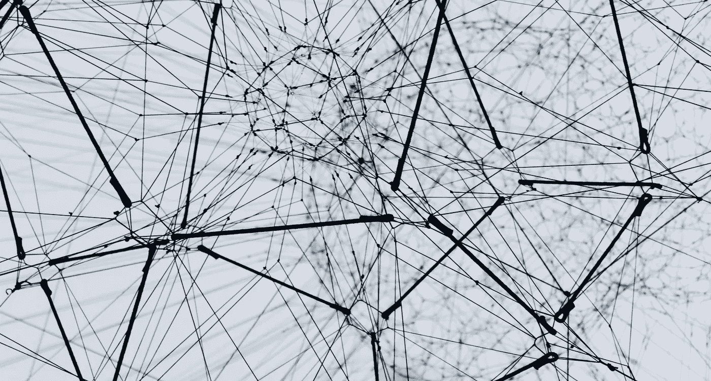
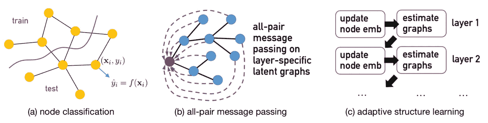
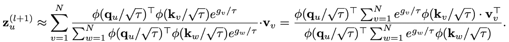
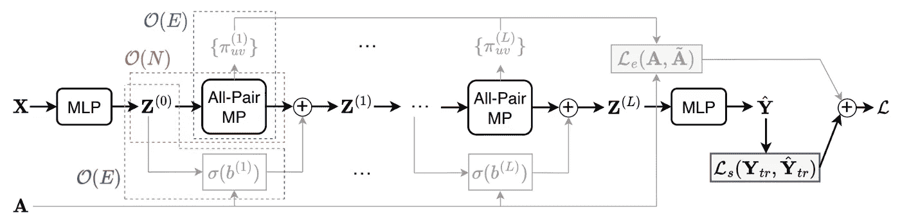
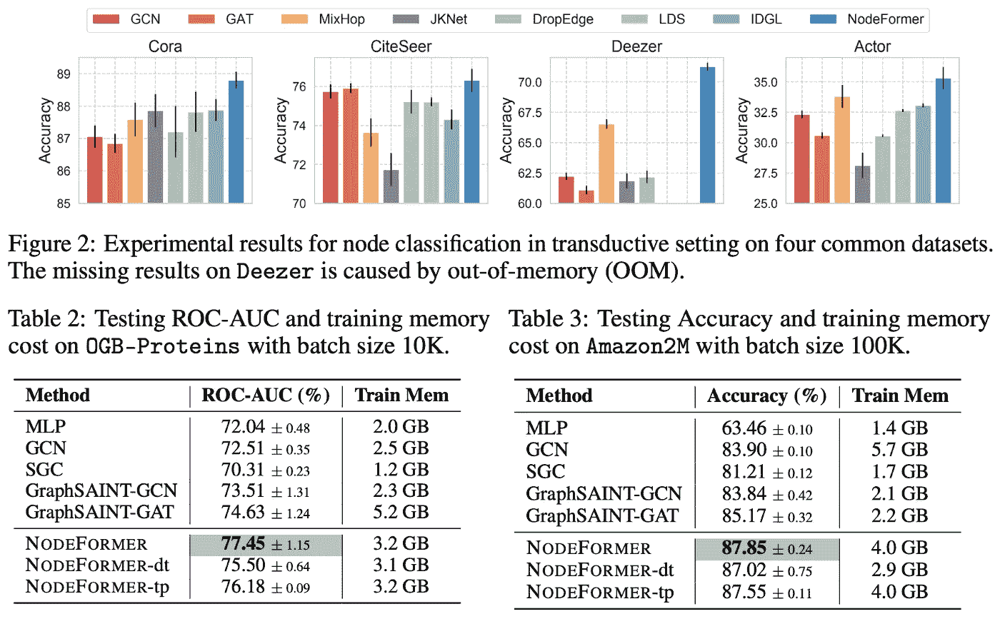
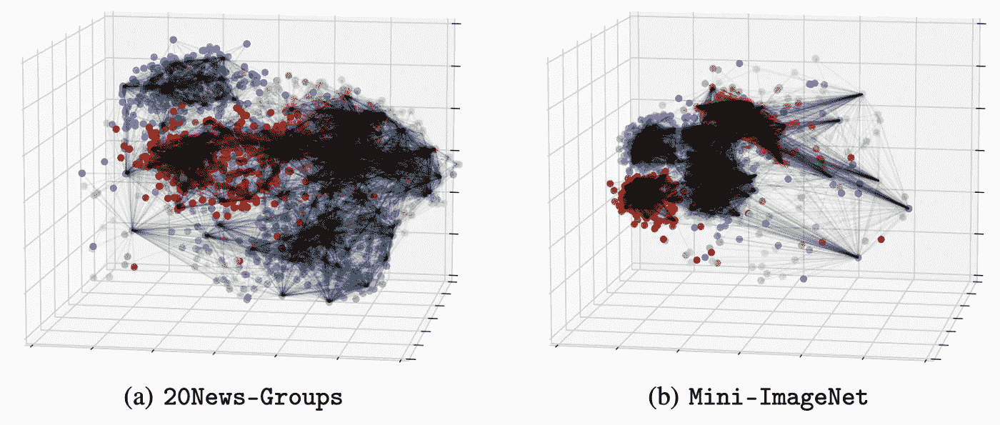

# NodeFormer:百万节点的可伸缩图转换器

> 原文：<https://towardsdatascience.com/scalable-graph-transformers-for-million-nodes-2f0014ceb9d4>

## 用 O(N)传递所有对消息

图片:Unsplash。

最近，建立用于处理图结构数据的变换器模型在机器学习研究社区中引起了广泛的兴趣。一个关键的挑战来自全球注意力的二次方复杂性，这阻碍了变形金刚扩展到大图。本博客将简要介绍 NeurIPS22 的最新研究成果:

> [NodeFormer:一个可扩展的图结构学习转换器，用于节点分类](https://openreview.net/pdf?id=sMezXGG5So)，其[公共实现](https://github.com/qitianwu/NodeFormer)可用。

**这项工作提出了一种可扩展的图转换器，用于大型节点分类图，其中节点数量可以从数千变化到数百万(甚至更多)**。关键模块是基于内核化 Gumbel-Softmax 的消息传递，它在 O(N)复杂度 (N 表示节点数)内实现 ***所有对特征传播。***

以下内容将总结这项工作的主要思想和成果。

# 图形转换器与图形神经网络

与依赖于在固定输入图拓扑上传递消息的图神经网络(GNNs)不同，图转换器可以通过每个传播层中的自适应拓扑更灵活地聚集来自所有节点的全局信息。具体来说，图形转换器有几个优点:

*   ***处理不完善的结构。*** 对于具有异质性、长程相关性和伪边的图形数据，GNNs 往往因其局部特征聚合设计而表现出能力不足。然而，变压器采用全局注意力，将来自所有节点的信息聚集在一层中，这可以克服输入结构的限制。
*   ***避免过度挤压。*** 当将信息聚合到固定长度的向量中时，GNNs 可能会指数地丢失信息，而图转换器利用全局注意力聚合，可以自适应地关注为目标节点的预测任务提供信息的主导节点。
*   ***无图任务的灵活性。*** 除了图的问题，还有各种各样没有图结构的任务。例如，图像和文本分类(每个图像可以被视为一个节点，但没有图形将它们连接起来)，以及物理模拟(每个粒子都是一个节点，但没有显式观察的图形)。虽然通常的做法是在输入特征上使用 k-NN 来构建用于消息传递的相似性图，但是这种人工创建的图通常独立于下游预测任务，并且会导致次优性能。转换器通过自动学习消息传递的自适应图结构来解决这个问题。

对于节点分类，转换器可以将来自所有其他节点的信息聚合到一个层中。Transformers 给出的分层更新规则可以看作是一步节点嵌入更新和图结构估计的组合(我们可以把注意力矩阵看作图邻接矩阵)

# 在大型图上构建变压器的挑战

有几个挑战使得在大型图上构建转换器成为一个不小的问题，特别是在节点数超过数千的图上。

*   ***全局注意力的二次复杂度:*** 用于所有对特征聚集的注意力计算需要 O(N)复杂度，这对于大图是禁止的，其中 N 可以是任意大的，例如从几千到几百万。具体来说，如果 N 大于 10K，一个 16GB 内存的普通 GPU 将无法在所有节点上运行这样的全局关注。
*   ***图稀疏性的调节:*** 与密集连接所有节点对的关注图(我们可以将关注矩阵视为加权图邻接矩阵)相比，真实世界的图通常是稀疏的。问题是当 N 变大时，在这样一个密集图上的特征传播可能会导致我们所说的过度规范化问题，这意味着来自不同节点的信息被其他节点所分散。在传播之前稀疏化可学习结构的合理补救措施。

# 基于内核化 Gumbel-Softmax 的消息传递

我们的工作节点形成器结合了[随机特征图](https://people.eecs.berkeley.edu/~brecht/papers/07.rah.rec.nips.pdf)和 [Gumbel-Softmax](https://arxiv.org/abs/1611.01144) 作为解决上述问题的统一模型。具体来说，Gumbel-Softmax 首先用于替换原始的基于 Softmax 的注意力特征聚合:

使用当前层的所有节点表示来更新下一层节点表示。Gumbel-Sofmtax 可以被视为对目标节点 u 的所有节点中的一个相邻节点进行采样的连续放松。实际上，可以采样 K 次，这产生一组采样的相邻节点。q、k、v 是来自结点表示的变换要素

上面的等式定义了需要 O(N)的节点 u 的计算，并且计算 N 个节点的表示需要 O(N)的复杂度，因为必须独立地计算所有对的注意力分数。为了解决这个困难，我们求助于 [Performer](https://arxiv.org/abs/2009.14794) 中的主要思想，并采用随机特征映射(RFM)来近似 gum bel-Softmax(Performer 中最初采用 RFM 旨在近似确定性 soft max 注意力，这里我们将这种技术扩展到具有随机噪声的 Gumbel-Softmax)。

使用建议的内核化 Gumbel-Softmax 的新更新规则。从 LHS 到 RHS 的推导是根据矩阵乘积的基本关联规则

重要的是，在新的计算中，即上述方程的 RHS 中，两个求和项(在 N 个节点上)由所有节点共享，并且在一层中只能计算一次。因此，这导致更新一层中 N 个节点的复杂度为 O(N)。

# 如何利用输入图

另一个重要的问题是如何利用输入结构(如果有的话),因为上面的全对消息传递忽略了输入图。我们另外提出两个简单的策略:

*   ***添加关系偏差:*** 我们另外假设一个可学习的标量项，如果在输入图中节点 u 和 v 之间存在边，则该标量项被添加到节点 u 和 v 之间的注意力得分中。
*   ***边缘正则化损失:*** 使用边缘(u，v)的关注分数作为估计概率，并为所有观察到的边缘定义最大似然估计(MLE)损失。直观地说，这种设计最大化了观察到的边缘的注意力权重。

但是输入图的重要性(或者说信息量)在不同的数据集之间是不同的。所以在实践中，需要调整权重(作为一个超参数),它决定了对输入图的重视程度。下图显示了 NodeFormer 的整体数据流。

节点形成器的数据流，其输入包含类似于普通 GNNs 的节点特征和图邻接。红色部分是通过内核化 Gumbel-Softmax 传递的所有对消息，绿色部分是关系偏差，蓝色部分是边缘正则化损失。如果输入图不重要或不可用，后两个部分可以省略。

# 实验结果

我们将 NodeFormer 应用于节点分类任务，并在八个数据集上取得了与常见的 GNNs 和最先进的图结构学习模型 [LDS](https://arxiv.org/abs/1903.11960) 和 [IDGL](https://proceedings.neurips.cc/paper/2020/hash/e05c7ba4e087beea9410929698dc41a6-Abstract.html) 相比极具竞争力的结果。

NodeFormer 和普通 GNN 模型的对比实验结果

除了节点分类，我们还考虑了图像和文本分类任务，其中输入图形丢失。我们使用具有不同 k(5，10，15，20)的 k-NN 来构建图，并且还考虑不使用节点形成器的输入图。有趣的是，后一种情况不会导致明显的性能下降，有时还会带来更好的性能。

节点嵌入和估计关注分数的可视化(过滤掉低权重的那些)。我们用一种颜色标记同一标签类的节点。全局注意力倾向于连接同一类中的节点，并且还增加了图的全局连通性

作为一个新的模型类，我们强调 NodeFormer 的一些优点:

*   ***容量:*** NodeFormer 通过各层的稀疏关注和来自所有节点的潜在聚合信息，自适应地学习图结构。
*   ***可扩展性:*** NodeFormer 支持 O(N)复杂度和小批量分区训练。在实践中，*它仅使用 4GB 内存就成功地扩展到具有百万个节点的大型图。*
*   ***效率:***node former 的训练可以通过基于梯度的优化以高效的端到端方式完成。例如，在 1000 个纪元中对 Cora 进行培训和评估只需要 1-2 分钟。
*   ***灵活性:*** NodeFormer 灵活用于归纳学习和处理无图情况。

我们还简要讨论了 NodeFormer 的潜在应用。一般来说，NodeFormer 可以用作图形结构数据的通用编码器，或者处理标准预测任务中实例之间的相互依赖。具体来说，它可以很容易地应用于两类问题:

*   **(大)图上的预测任务**，即目标是基于节点特征和图结构预测每个节点(或边)的标签。例如，预测大型社交网络中的用户活动。
*   **没有输入图和节点形成器的标准预测任务(分类或回归)**可用于开发数据集中实例之间的潜在相互依赖性。例如图像分类。

这篇博客介绍了一种新的图形转换器，它可以成功地扩展到大型图形，并显示出优于普通 gnn 的良好性能。变压器式模型具有一些固有的优势，可以克服 GNNs 在处理长程相关性、异质性、过度挤压、图形噪声和完全没有图形方面的局限性。尽管如此，构建强大的图形转换器作为下一代图形表示模型仍然是一个开放和未充分探索的问题，我们希望这项工作可以在这个方向上提供一些见解。

如果对这项工作感兴趣，人们可以阅读报纸了解更多的细节。

> 论文:[https://openreview.net/pdf?id=sMezXGG5So](https://openreview.net/pdf?id=sMezXGG5So)
> 
> 代号:【https://github.com/qitianwu/NodeFormer 

除非另有说明，所有图片均为作者所有。