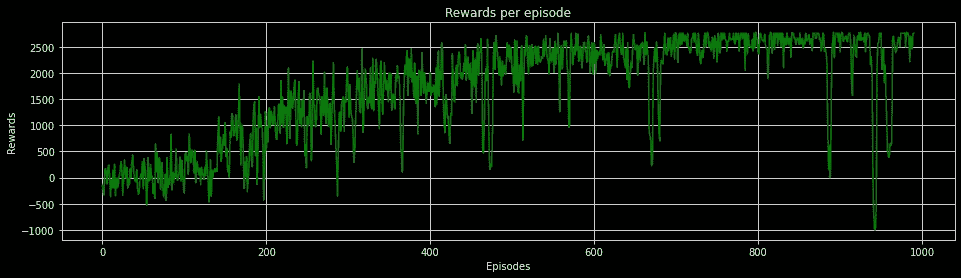
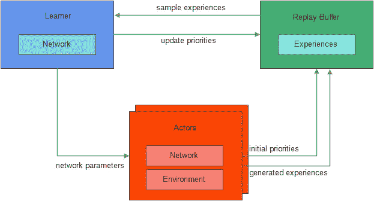
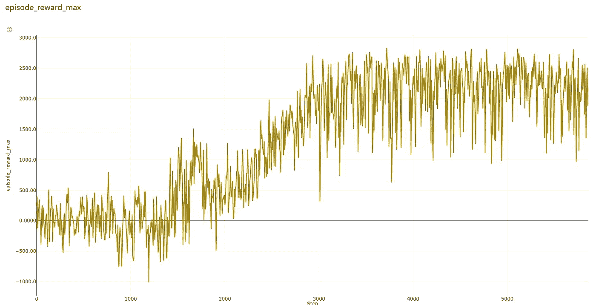

# 使用 Azure ML 和 Ray 的可扩展强化学习

> 原文：<https://towardsdatascience.com/scalable-reinforcement-learning-using-azure-ml-and-ray-654d9f5c26a0>

## 在 Azure ML 集群上使用 RLLIB 加速定制健身房环境中的深度 RL 训练。

单机和单代理 RL 训练有许多挑战，最重要的是回报收敛所需的时间。代理在 RL 培训中花费的大部分时间都用于收集经验。简单的申请需要几个小时，复杂的申请需要几天。像 Tensorflow 这样的深度学习框架支持分布式训练；这同样适用于 RL 吗？答案是肯定的。

本文通过一个实际例子关注单机训练的具体痛点，并演示 scaled RL 如何解决这个问题。本文假设读者对 RL、深度 RL 和深度学习有基本的了解；对于详细的解释和演练，请浏览页面底部的整个视频。

可扩展强化学习技术通过将学习与行动分离，解决了高维状态空间环境中训练时间增加的问题。遵循分布式深度学习的实践，可以通过跨模型分布梯度计算或通过分布数据累积过程来实现并行性。已经为分布式学习提出了各种各样的算法。

本文主要关注使用分布式经验轨迹收集的加速学习。

我们从以下内容开始:

*   理解问题陈述。
*   建立一个简单的 DQN 代理，并为培训持续时间和奖励创建一个基线。
*   创建一个分布式 RL 环境，以分布式方式运行实验，并将改进与上面的基线进行比较。

用于训练的代码工件的链接可以在[这里](https://github.com/sriksmachi/supercabs)([https://github.com/sriksmachi/supercabs](https://github.com/sriksmachi/supercabs))获得

# **自定义环境**

网上的许多示例演示了如何在内置的体育馆环境中使用分布式 RL，但是很少使用定制环境。在实践中，当选择 RL 来解决问题时，学习如何为分布式训练开发和注册定制的健身房环境是很重要的。这篇文章教如何创建一个自定义的健身房环境。出于本文和视频的目的，我们将使用下面定义的伪学习问题。

**问题**:我们处理的自定义环境叫做“Contoso Cabs”。Contoso Cabs 是一家虚构的出租车公司，希望通过增加每个司机每月的总工作时间来增加利润。它目前在 5 个州运营，提供全天候服务。为了实现利润最大化，Contoso Cabs 希望建立一个 RL 代理，帮助司机在出租车请求到达时做出正确的决策。由于利润与驾驶时间相关联，代理接受一次搭车以最大化累计折扣奖励，在这种情况下是总小时数。代理的目标是每集累积最大小时数(每集一个月)。下面的代码显示了本培训中使用的自定义健身房环境类。

# DQN 代理商

我们首先使用以下架构构建一个简单的 DQN 代理。

*   输入:编码状态空间的大小是 36(城市数量(5)+运行天数(7) +每天运行小时数(24))。
*   2 个尺寸为 36 的 FC 隐藏层。
*   动作空间表示为(源，目的)的元组，动作空间的大小为 5*5 = 25。为了简单起见，包含了具有相同源和目的对的元组，但是如果代理选择任何这样的动作，则增加了惩罚。实质上，我们向网络输入一批 64 个状态向量，每个状态向量的大小是 36。输出代表每个动作的 Q 值。

当一个 DQN 特工被训练后，奖励稳定在 1000 集 2500–3000 之间，如下图所示。这意味着现在我们有了一个模型，可以用来确保司机的收入在 2500-3000 之间。

DQN 培训结果。(图片由作者创作)

然而，挑战在于，对于一个简单的环境，代理需要大约 35 分钟才能收敛。这里考虑的状态空间仅包含 36 位(编码的)。在实时情况下，状态空间很容易高出 10 倍。

# 天蓝色上的光线 ML

在深入解决状态空间问题之前，让我们了解一下分布式 RL 算法、Ray、Azure ML 和 APEX 的关键要素。

分布式深度 RL 将动作(与 env 交互)与学习(从样本学习)解耦，这种解耦允许系统独立扩展。根据各种组件之间的交互如何发生以及 RL 方法学，已经发布了几种方法和算法，其中一些在我的文章[这里](/accelerate-training-in-rl-using-distributed-reinforcement-learning-architectures-b5a726b49826)中有所描述。

Ray 的 RLLIB 是一个优秀的开源库，支持大多数提出的算法。使用现有的或定制的健身房环境可以很容易地配置和运行培训作业。在任何分布式集群上启用 RLLIB 都很简单。

Azure ML 是 Azure(微软的云)提供的服务，充当运行 ML 实验的工作空间。使用 Azure ML，我们可以在交互模式或作业模式下运行 ML 实验，用于长期运行的实验。Azure ML 提供了一个自托管的 ML 集群，可以使用 CPU / GPU 核心进行配置，以运行分布式 ML 实验。为了安装和运行分布式 RL 作业，我们需要在 Azure ML 集群上安装 Ray。 [Ray-on-aml](https://github.com/microsoft/ray-on-aml) 是一个开源库，用于将 Azure ML 集群转换为 Ray 集群。

[APEX](https://arxiv.org/abs/1803.00933v1) 是一个大规模深度强化学习的分布式架构。它允许演员通过将表演与学习分离来有效地学习。APEX 中的参与者可以扩展到 1000 个工作节点，每个参与者使用自己的环境副本。这些体验被收集起来并与公共重放缓冲器共享。除了经验，演员还分享使用时间差误差计算的优先级。学习者模型采样优先化的经历并重新计算优先级。网络参数被周期性地更新到演员的模型。

下图显示了 APEX 的架构。

APEX 建筑(图片由作者创建)

与单个代理相比，上述架构允许学习者模型从丰富的经验集中学习。与均匀采样相比，优先化/重要性采样有助于更快的收敛。

下面的代码显示了在转换为 Ray 集群的 Azure ML 集群上执行的作业。这是在作业模式下使用 AML 执行的，有关 AML 作业的详细信息，请参见此处编写的代码([https://github . com/sriksmachi/super cabs/blob/master/run _ experiment . py](https://github.com/sriksmachi/supercabs/blob/master/run_experiment.py))

# 结果

使用上面解释的方法，在射线簇上用 10 个演员训练“Contoso Cabs”环境 3 次训练迭代。这个实验只用了 3 分钟训练 6K 集，收敛到最大奖励。

训练时间减少了 90%，同时，我们通过分配工作量运行了 6k 集。下图显示了所有剧集中每集的最高奖励。

APEX 每集奖励(图片由作者创建)

下面的视频详细解释了训练实验。如果你是 RL 新手，我建议你从头开始看视频。

代码演练:使用 Ray 的 RLLIB 和自定义 GYM 环境在 Azure ML 上分发深度 RL。

# 摘要

总之，真实环境中 RL 代理的单机训练是一个耗时的过程。分布式深度 RL 训练有助于改进训练时间并更快地达到收敛。RLLIB (Ray)是一个用于生产级分布式 RL 工作负载的强大框架，只需几行代码，Azure ML 集群就可以使用 ray-on-ml 转换为 Ray 集群。通过利用本文中提出的方法，可以大大减少培训时间。