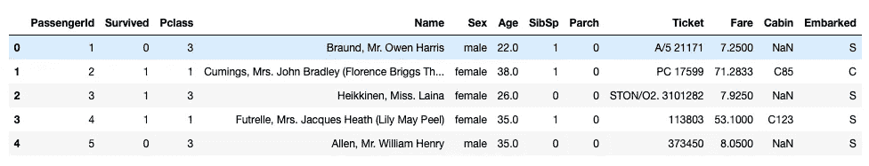
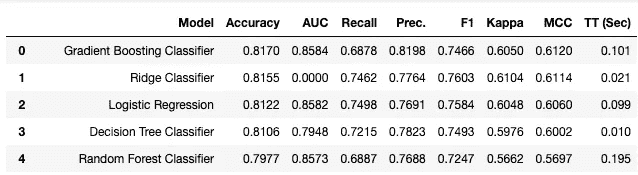
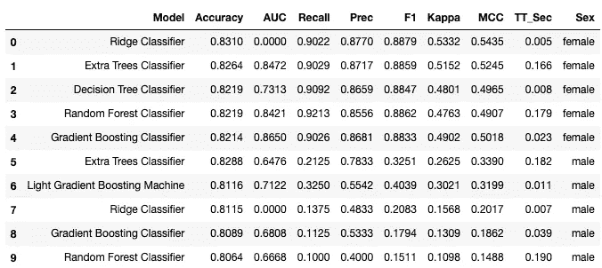

# 通过赋格用火花(或 Dask)缩放 PyCaret

> 原文：<https://towardsdatascience.com/scaling-pycaret-with-spark-or-dask-through-fugue-60bdc3ce133f>

# 通过赋格用火花(或 Dask)缩放 PyCaret

## 分布式地在每个数据分区上运行 PyCaret 函数

汉尼斯·艾格勒在 [Unsplash](https://unsplash.com?utm_source=medium&utm_medium=referral) 上拍摄的照片

PyCaret 是一个低代码机器学习框架，它自动化了机器学习管道的许多部分。只需几行代码，就可以在一个数据集上训练多个模型。在本文中，我们将探讨如何通过在 Spark 或 Dask 上以分布式方式运行几个 PyCaret 训练任务来扩展这种能力。

# PyCaret 模型分数网格示例

首先，我们看一个简单的 PyCaret 分类示例。大部分代码摘自 PyCaret 文档中的[本教程](https://www.pycaret.org/tutorials/html/CLF101.html)。重点是展示我们如何用几行代码生成模型排行榜。

我们通过使用`get_data`函数加载 Titanic 数据集。这是一个众所周知的分类数据集。

从 PyCaret 获取泰坦尼克号数据集

这将为我们提供以下数据。在这个例子中，我们关心的是创建一个模型来预测一个乘客是否幸存。

来自 Titanic 数据集的样本数据

现在我们可以使用 PyCaret 进行模型训练。下一个代码块中有三个函数调用来训练模型并为我们的数据集检索它们的指标。

PyCaret 比较模型

每个函数调用的简要说明:

*   `setup`初始化环境并创建要运行的转换管道。
*   `compare_models`运行几个模型训练运行，并用分层交叉验证对它们进行评分。这将返回基于`n_select`的顶级型号。值为 5 将返回前 5 个训练模型。
*   `pull`将为我们获取分数网格数据框架。下面是一个示例(前 5 行按准确度排序)。

泰坦尼克号数据集的评分网格

稍后，我们将看看如何使用 Spark 或 Dask 分布式并行运行多个`compare_models`调用。在此之前，我们将了解如何为 Spark 或 Dask 带来单独的功能。

# 包装 PyCaret 代码

[Fugue](https://github.com/fugue-project/fugue) 是一个开源框架，将 Python、Pandas 或 SQL 代码移植到 Spark 或 Dask。在这篇博客中，我们将看看`transform`函数。这采用单个函数，并在数据的每个分区**的 Spark 或 Dask 上执行它。**

我们首先将 PyCaret 代码封装在一个名为`wrapper`的函数中。这个`wrapper`函数将用于 Spark 中的每个数据分区。在`wrapper`里面基本上是我们之前所有的代码。唯一的新东西是重置索引和重命名列。这是因为 Fugue 需要列名不包含空格和句点，以便与所有后端兼容。

注意，函数的类型注释(pd。DataFrame)是神游所需要的，以便知道如何将函数带到 Spark 或 Dask。这是因为赋格可以处理更多的注释，比如`List[Dict[str, Any]]`或`Iterable[List[Any]]`。在`transform`函数中也需要模式，因为 Spark 和 Dask 需要显式模式(或从中受益匪浅)。

用赋格包装 PyCaret

现在我们有了一个基本功能，可以用在原生熊猫身上。调用`transform`函数将会得到与之前的分数网格相同的结果。通过在 Pandas 上测试它，我们知道当我们把它移植到 Spark 执行引擎上时，这个代码将会工作。但是在将它引入 Spark 之前，我们将在下一节中首先对数据进行分区。

# Spark 和 Dask 上的机器学习

大数据集上的机器学习有两种形式。Dask-ML [文档](https://ml.dask.org/)对此提供了很好的解释。第一个是内存限制问题，即数据集不适合单台机器。在这种情况下，一个大型模型正在整个集群中接受训练。第二个是与计算相关的问题，在这种情况下，多个模型根据适合单台机器的数据进行训练。群集用于并行化多个较小的模型训练作业。

当数据太大而不适合单台机器时，通常意味着可以使用数据的逻辑分组将问题分成几个更小的机器学习问题。在这个巨大的例子中，我们将按性别(男性或女性)分割数据，然后为每组数据运行 PyCaret `compare_models`。

# 将 PyCaret 代码移植到 Spark 和 Dask

下面的代码会把数据拆分成男性和女性，然后对每一组运行`compare_models`。这两个`compare_models`函数调用将在 Spark 上分布式运行。首先，我们将首先显示代码和输出，然后我们将进行修改以使我们的`wrapper`产生火花。

在 Spark 上分布式运行 PyCaret

这为我们提供了前 5 名模型和两组(男性和女性)的指标。对于这个特定的问题，我们看到性能略有提高。由于数据量的原因，这可能是有限的。然而，对于大数据集，与在整个数据集上训练一个大模型相比，这种方法通常可以产生显著的改进。

Spark 上的分布式培训结果

为了将 PyCaret 引入 Spark，我们必须对我们的`wrapper`函数进行如下修改:

*   将性添加到模式中。分布式计算框架对模式有严格的要求。
*   在结果中添加一个名为 Sex 的列。这是为了在我们收集所有结果时进行跟踪。因为数据是因为调用了`wrapper`函数而被预先分区的，所以我们保证在性别列中有一个统一的值(男性或女性)。

然后，我们对`transform`呼叫做了以下更改:

*   将原始数据帧中的 np.nan 替换为 None。Spark 很难解释同时具有 np.nan 和 string 值的列。
*   添加了一个按性别划分的分区，将数据分成两组
*   导入了 fugue_spark，并为 fugue 使用了“spark”执行引擎。

# 结论

在本文中，我们展示了如何利用 Spark 同时对多个数据分区执行 PyCaret 模型训练。自撰写本文以来，PyCaret 团队和 Fugue 团队正在致力于一个更加原生的集成，以便在 Spark 或 Dask 上分发`compare_models`功能。可以在 Github 上跟踪[的进展。](https://github.com/pycaret/pycaret/issues/2015)

# 数据许可证

Titanic 数据集由 PyCaret 在 MIT 许可下托管。