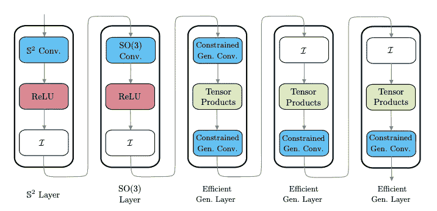
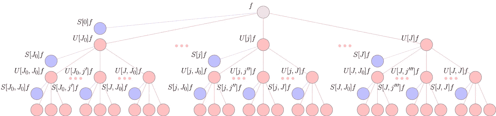
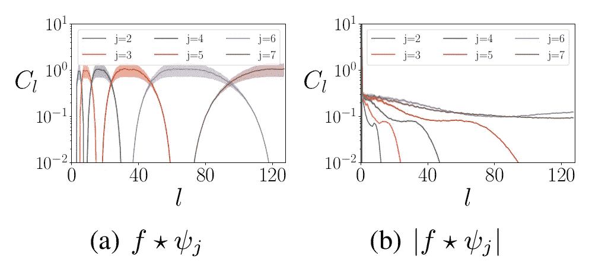
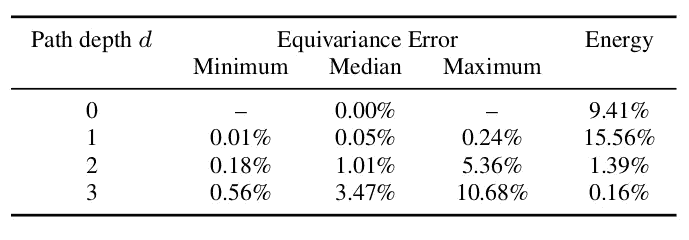
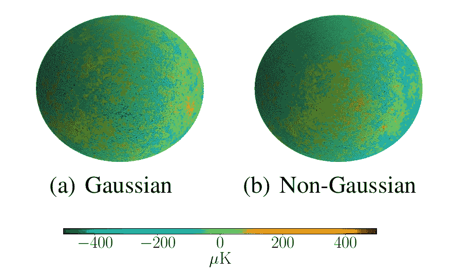

# 将球形深度学习扩展到高分辨率输入数据

> 原文：<https://towardsdatascience.com/scaling-spherical-deep-learning-to-high-resolution-input-data-a9f17b30b978>

## 可扩展旋转等变球形细胞神经网络的球上散射网络

常规球形细胞神经网络不可扩展到高分辨率分类任务。在本文中，我们将介绍球形散射层，这是一种新型的球形层，可以在保留相关信息的同时降低输入数据的维度，同时还具有旋转等变性。散射网络通过采用来自小波分析的预定义卷积滤波器来工作，而不是从零开始学习卷积滤波器。由于散射图层的权重是设计的而非学习的，因此散射图层可用作一次性预处理步骤，从而降低输入数据的分辨率。我们根据经验证明，配备初始散射层的球形 CNN 可以达到数千万像素的分辨率，这是以前传统球形 CNN 层难以实现的壮举。

这篇博文是与[奥古斯汀·马沃-帕克](https://self-supervisor.github.io/)合著的。

[杰瑞米·托马斯](https://unsplash.com/@jeremythomasphoto?utm_source=medium&utm_medium=referral)在 [Unsplash](https://unsplash.com?utm_source=medium&utm_medium=referral) 上拍照

# 以前的球形深度学习方法计算量很大

球形 CNNs，2，3]对于机器学习中的各种问题非常有用，因为许多数据源无法自然地在平面上表示(参见我们的[上一篇文章](/geometric-deep-learning-for-spherical-data-55612742d05f)的介绍)。球形 CNN 的一个关键属性是它们对于球形数据的旋转是等变的(在本文中我们主要关注旋转等变方法)。在实践中，这意味着球形 CNN 具有令人印象深刻的一般化属性，允许它们做诸如分类 3D 对象网格之类的事情，而不管它们如何旋转(以及它们在训练期间是否看到网格的不同旋转)。

我们最近[描述了](/efficient-generalized-spherical-cnns-1493426362ca)在 [Kagenova](https://www.kagenova.com/) 开发的一系列进步，以提高球形 CNN 的计算效率。我们的方法——高效的广义球形 CNN——保留了之前球形 CNN 的等方差特性，同时计算效率显著提高[1]。然而，尽管在计算效率方面取得了这些进步，球形 CNN 仍然局限于相对低分辨率的数据，这意味着球形 CNN 无法应用于通常涉及更高分辨率数据的令人兴奋的应用，如宇宙学数据分析和虚拟现实的 360°计算机视觉。在最近的一篇文章中，我们介绍了球形散射层网络，以扩展有效的广义球形 CNN 更高的分辨率[4]，我们在当前的帖子中进行了回顾。

# 支持高分辨率输入数据的混合方法

在开发高效的广义球形 CNN[1]时，我们发现构建球形 CNN 架构的混合方法非常有效。混合球形 CNN 在同一网络中使用不同风格的球形 CNN 层，允许从业者在不同的处理阶段获得不同类型层的好处。

示例混合球形 CNN 架构图。请注意这些层并不是单片的，而是不同风格的球形 CNN 层。【图由作者创作。]

球体上的散射网络延续了这种混合方法，并引入了一种新的球形 CNN 层，可以插入到现有的球形结构中。为了将有效的广义球形 CNN 扩展到更高维度，这个新层需要:

1.  计算可扩展
2.  将信息混合到低频，以允许后续层在低分辨率下工作
3.  旋转等变的
4.  提供稳定且局部不变的表示(即，提供有效的表示空间)

我们认为散射网络层具有满足所有这些特性的潜力。

# 球体上的散射网络

Mallat [5]首先在欧几里德环境中提出的散射网络可以被认为是具有从小波分析中得到的固定卷积滤波器的 CNN。散射网络已被证明对传统(欧几里德)计算机视觉非常有用——特别是在数据有限，因此学习卷积滤波器很困难的情况下。在这里，我们将简要讨论散射网络图层的内部工作方式，它们如何满足上一节中定义的要求，以及它们如何开发用于球面数据分析。

散射层内的数据处理由三个基本操作执行。第一个构建模块是固定的小波卷积，它类似于欧几里德 CNN 中使用的常规学习卷积。在小波卷积之后，散射网络将模数非线性应用于结果表示。最后，散射利用缩放函数，它执行一种形式的局部平均，与普通 CNN 中的池层有些相似。这三个构建模块的重复应用将输入数据分散到计算树中，在不同的处理阶段将结果表示(类似于 CNN 频道)从树中取出。这些操作的示意图如下所示。

球面信号 f 的球面散射网络。信号通过球面小波变换的级联传播，结合绝对值激活函数，用红色节点表示。散射网络的输出是通过将这些信号投影到球面小波尺度函数上给出的，从而产生由蓝色节点表示的散射系数。【图由作者创作。]

从传统深度学习的角度来看，分散网络的操作可能看起来有点模糊。然而，所描述的每种计算操作都有特定的目的——旨在利用小波分析的可靠理论结果。

仔细推导了散射网络中的小波卷积，以便从输入数据中提取相关信息。例如，在自然图像的情况下，小波被定义为专门提取与高频下的边缘和低频下的物体的一般形状相关的信息。因此，在平面设置中，散射网络滤波器可能与传统的 CNN 滤波器有些相似。这同样适用于球形设置，我们使用尺度离散小波(详见[4])。

由于小波滤波器是固定的，初始散射层只需要应用一次，而不是在整个训练中重复应用(像传统 CNN 中的初始层)。这使得散射网络在计算上可扩展，满足上面的要求#1。此外，散射层降低了其输入数据的维度，这意味着在训练下游 CNN 层时，只需要有限的存储量来缓存散射表示。

在小波卷积之后应用模数非线性。首先，这给网络注入了非线性。第二，模数将输入信号中的高频信息混合到低频，满足上面的要求#2。下图显示了这一点，图中显示了模数非线性之前和之后数据的小波表示的频率分布。

模运算前后不同球面频率 l 下小波系数的分布。输入信号中的能量从高频(左图)移动到低频(右图)。f 是输入信号，ψ是尺度为 *j* 的小波。【图由作者创作。]

在应用模数之后，产生的信号被投影到缩放函数上。缩放函数从表示中挑选出低频信息，类似于传统 CNN 中的池函数的操作。

我们根据经验测试了球形散射网络的理论等方差特性。测试是通过旋转信号并通过我们的散射网络进行的，然后将结果表示与输入数据通过散射网络并旋转的表示进行比较。在下表中，我们证明了给定深度的等方差误差是低的，因此满足要求#3(通常在实践中不会超过深度 2，因为大部分信号能量已经被捕获)。

不同深度球形散射网络的旋转等方差误差。

最后，从理论上证明了欧几里德散射网络对小的微分同胚或变形是稳定的[5]。这个结果已经扩展到紧致黎曼流形上的散射网络[6]，特别是球面上的散射网络[4]。在实践中对微分同胚的稳定性意味着，如果对输入进行轻微的改变，由散射网络计算的表示将不会有显著的不同(参见我们以前的帖子对[稳定性在几何深度学习中的作用的讨论](/a-brief-introduction-to-geometric-deep-learning-dae114923ddb))。因此，分散网络提供了一个表现良好的表示空间，后续学习可以在其上有效地进行，满足上面的要求#4。

# 可扩展和旋转等变球形 CNN

假设引入的散射层满足我们所有期望的属性，我们现在准备将它们集成到我们的混合球形 CNN 中。如前所述，散射层可以作为初始预处理步骤固定在现有架构上，以减少后续球形层处理的表示的大小。

散射层模块(虚线左侧)是一个**设计的**层，这意味着它不必被训练，而其余层(虚线右侧)是可训练的。这意味着散射层可作为一次性预处理步骤应用，以降低输入数据的维度。【图由作者创作。]

由于散射网络对于给定的输入具有固定的表示，所以散射网络层可以在训练开始时应用于整个数据集一次，所得到的低维表示被缓存用于训练随后的层。幸运的是，散射表示的维数减少了，这意味着存储它们所需的磁盘空间相对较低。给定这种新的球形散射层，有效的广义球形细胞神经网络可以用于高分辨率分类问题。

# 宇宙微波背景各向异性的分类

物质在整个宇宙中是如何分布的？对于宇宙学家来说，这是一个基本的研究问题，对我们宇宙的起源和演化的理论模型有着重大的影响。宇宙微波背景(CMB)辐射——大爆炸的残余能量——描绘了物质在整个宇宙中的分布。宇宙学家在天球上观测 CMB，这要求计算方法能够在球体上自然地进行宇宙学分析。

宇宙学家对分析 CMB 的方法感兴趣，这种方法能够检测整个空间中 CMB 分布的非高斯性，这可能对早期宇宙的理论有重要意义。这种分析方法还需要能够达到天文分辨率。我们通过以 *L* =1024 的分辨率将 CMB 模拟分类为高斯或非高斯，证明了我们基于散射的网络能够满足这些要求。基于散射的网络成功地以 95.3%的准确率对这些模拟进行了分类——这比分辨率较低的传统球形 CNN 的 53.1%好得多。

来自高斯和非高斯类别的 CMB 高分辨率模拟示例，用于评估球形散射网络扩展到高分辨率的能力。【图片由作者创作。]

# 摘要

球形散射层压缩其输入表示的维度，同时保留下游任务的重要信息。我们已经证明，这使得散射层对于高分辨率的球形分类任务非常有用。这开启了大量以前难以处理的潜在应用，如宇宙学数据分析和高分辨率 360°图像/视频的分类。然而，许多计算机视觉问题需要密集预测，如分割或深度估计，这就需要高维输出和高维输入。开发易处理的球形 CNN 层，可以增加其输出表示的维度，同时保持等方差，这是 Kagenova 当前研究的主题，将在即将发布的帖子中介绍。

# 参考

[1] Cobb，Wallis，Mavor-Parker，Marignier，Price，d'Avezac，McEwen，*高效广义球形 CNN*，ICLR (2021)， [arXiv:2010.11661](https://arxiv.org/abs/2010.11661#)

[2]科恩，盖格，克勒，韦林，*球形 CNN*，ICLR (2018)， [arXiv:1801.10130](https://arxiv.org/abs/1801.10130)

[3]埃斯特韦斯，艾伦-布兰切特，马卡迪亚，达尼利迪斯，*学习 SO(3)与球形 CNN 的等变表示*，ECCV (2018)， [arXiv:1711.06721](https://arxiv.org/abs/1711.06721)

[4] McEwen，Jason，Wallis，Christopher 和 Mavor-Parker，Augustine N. *，可扩展和旋转等变球形 CNN 的球上散射网络*，ICLR (2022)， [arXiv:2102.02828](https://arxiv.org/abs/2102.02828)

[5]布鲁纳、琼和斯特凡·马拉特，*不变散射卷积网络*，IEEE 模式分析和机器智能汇刊(2013)

[6] Perlmutter，Michael 等，*紧致黎曼流形上的几何小波散射网络*，数学与科学机器学习。PMLR (2020)， [arXiv:1905.10448](https://arxiv.org/abs/1905.10448)