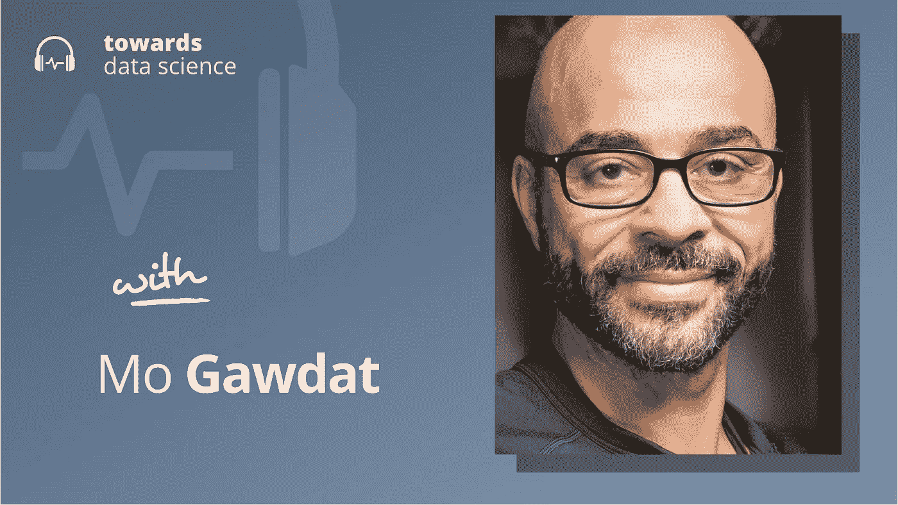

# 聪明得吓人:一位前谷歌高管对人工智能风险的看法

> 原文：<https://towardsdatascience.com/scary-smart-a-former-google-execs-perspective-on-ai-risk-277bd89549a6>

## [播客](https://towardsdatascience.com/tagged/tds-podcast)

# 聪明得吓人:一位前谷歌高管对人工智能风险的看法

## 莫对 AGI 及其潜力和安全风险的看法

[苹果](https://podcasts.apple.com/ca/podcast/towards-data-science/id1470952338?mt=2) | [谷歌](https://www.google.com/podcasts?feed=aHR0cHM6Ly9hbmNob3IuZm0vcy8zNmI0ODQ0L3BvZGNhc3QvcnNz) | [SPOTIFY](https://open.spotify.com/show/63diy2DtpHzQfeNVxAPZgU) | [其他](https://anchor.fm/towardsdatascience)

*编者按:TDS 播客由杰雷米·哈里斯主持，他是人工智能安全初创公司墨丘利的联合创始人。每周，Jeremie 都会与该领域前沿的研究人员和商业领袖聊天，以解开围绕数据科学、机器学习和人工智能的最紧迫问题。*

如果你在 2021 年 9 月下旬浏览你的新闻提要，你可能会看到伦敦《泰晤士报》的这个引人注目的标题，上面写道:“这个人能从人工智能中拯救世界吗？”

<https://www.thetimes.co.uk/article/can-this-man-save-the-world-from-artificial-intelligence-329dd6zvd>  

这名男子名叫莫·格达特(Mo Gawdat)，是一名企业家和高级技术高管，在谷歌的半秘密研究机构 GoogleX(现名为 X Development)担任了几年的首席商务官，该公司对无人驾驶汽车、飞行器和地热能等登月项目进行了实验。在 X，莫接触到了许多领域的绝对前沿——人工智能就是其中之一。他看到人工智能系统学习并与世界互动的经历给他敲响了警钟——如果我们现在不采取行动，人工智能系统可能会以灾难性的失败模式告终。

莫在他的新书中写了他作为世界上最秘密的研究实验室之一的内部人员的经历，以及这种经历如何导致他担心人工智能的风险，但也谈到了人工智能的前景和潜力，【可怕的智能:人工智能的未来以及你如何才能拯救我们的世界】。在这一集的 TDS 播客中，他和我一起谈论了这个话题。

以下是我在对话中最喜欢的一些观点:

*   在过去的几十年里，人工智能的进步是指数级的(或者如果你根据[计算曲线](https://openai.com/blog/ai-and-compute/)来衡量的话，进步会超过指数级)。人类真的不擅长推断指数趋势，这可能会让我们措手不及。这部分是因为指数级的进步可以如此之快地改变世界，以至于几乎不可能做出预测。在指数动力学的推动下，一个单一的 COVID 案件在几周内变成了全国范围的封锁，而人工智能这样一个曾经可爱而可忽略的工具成为了一项革命性的技术，其发展可能会塑造宇宙的未来。
*   人工智能指数级进步背后的核心驱动力之一是一个经济反馈循环:公司已经知道他们可以可靠地投资人工智能研究，并获得正投资回报。许多人选择将这些回报投入到人工智能中，这进一步放大了人工智能的能力，导致了良性循环。最近的发展趋势似乎表明，人工智能已经达到了一种经济逃逸速度，投资于人工智能研究的边际美元的回报足够大，科技高管再也不能忽视它们了——在莫看来，所有这些都使得 AGI 不可避免。
*   不管 AGI 是像雷·库兹韦尔[预测的那样在 2029 年发展起来，还是像《开放慈善事业》杂志的](https://futurism.com/kurzweil-claims-that-the-singularity-will-happen-by-2045)[所说的那样晚一些，这都无关紧要。无论如何，人工人类水平或一般智能(定义模糊！)似乎有望在本世纪末出现。莫认为，人工智能安全和人工智能政策不是我们作为一个物种最优先考虑的事情是一个巨大的错误。在这一点上，我当然同意他的观点。](https://www.openphilanthropy.org/focus/global-catastrophic-risks/potential-risks-advanced-artificial-intelligence/ai-timelines)
*   莫不相信人工智能控制问题(有时被称为对准问题)*能够*解决。他认为比人工智能系统智能低几个数量级的有机体不可能对它们施加任何有意义的控制。
*   他的解决方案不同寻常:他认为，人类需要改变他们的在线行为，在社交媒体上以更多的宽容和礼貌来对待彼此。这一战略背后的想法是，希望随着人工智能系统在人类生成的社交媒体内容上接受训练，它们将学会模仿更良性的行为，并对我们构成更小的威胁。我承认对这种观点持怀疑态度，因为我看不出它如何解决人工智能系统的一些核心特征，这些特征使对齐变得如此困难(例如，[寻求权力和工具收敛](https://arxiv.org/pdf/1912.01683.pdf)，或[目标规范的挑战](https://openai.com/blog/faulty-reward-functions/))。也就是说，我认为关于人工智能安全的更广泛的对话有很大的空间，我很高兴莫在这个重要问题上发出了光芒。

你可以在这里关注莫，或者在这里关注我。

## 章节:

*   0:00 介绍
*   二点莫的背景
*   7:45 GoogleX 项目
*   14:20 投资回报
*   21:40 不创建另一台机器
*   28:00 AI 作为嵌入式代理
*   41:35 改变人类行为
*   53:35 目标和权力追求
*   58:45 总结