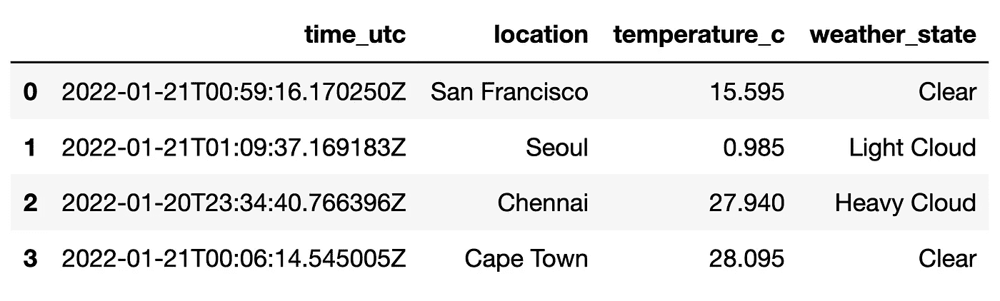
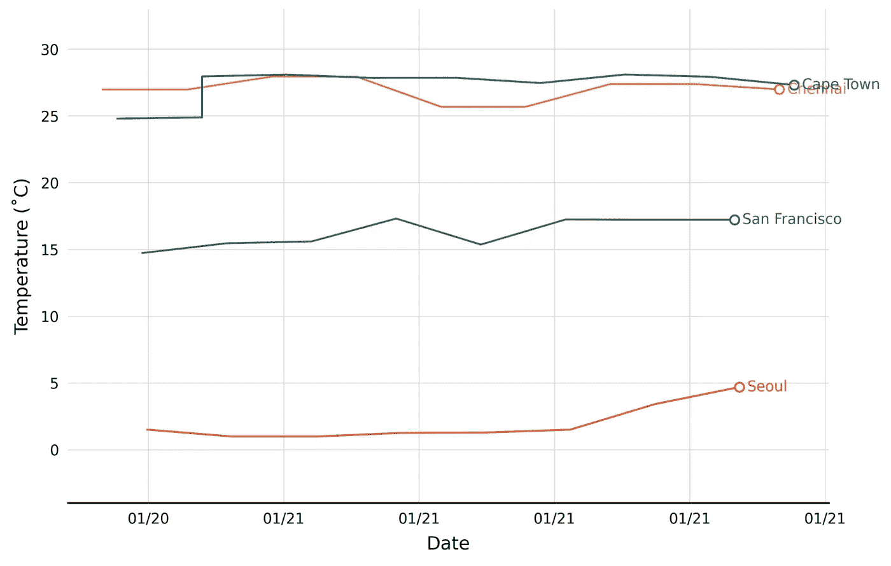
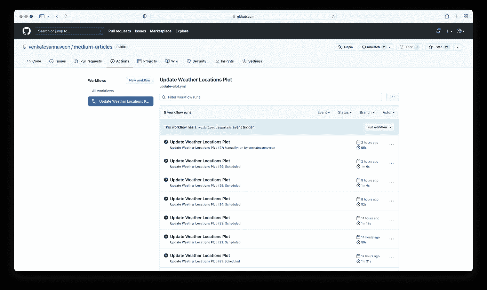

# 用 GitHub 动作安排笔记本和脚本运行

> 原文：<https://towardsdatascience.com/scheduling-notebook-and-script-runs-with-github-actions-cc60f3ac17f2>

## 使用 GitHub 操作来自动化工作流程，并从脚本和笔记本中运行和更新结果


在 [Unsplash](https://unsplash.com?utm_source=medium&utm_medium=referral) 上由[尹新荣](https://unsplash.com/@insungyoon?utm_source=medium&utm_medium=referral)拍摄的照片

假设我们已经对定期更新的数据流进行了一些很酷的数据分析，例如体育统计数据或当前天气状况。现在，我们将代码添加到 GitHub 上的版本控制中，但是如果我们可以用更新的数据更新它而不必再次运行它，那将会非常酷。一个解决方案是使用 Flask 这样的框架创建一个 web 应用程序(我以前写过一篇文章，这里有一个基本的例子)，但是如果我们想要一个更简单的、只需要很少额外编码的东西呢？我们可以使用 GitHub 动作来定期运行我们的脚本，并更新输出和绘图来完成这项工作。

我将通过编写一个简单的 Jupyter 笔记本来演示我们如何做到这一点，这个笔记本使用由[meta weather](https://www.metaweather.com/api/)【1】提供的免费 API 来获取城市列表中的当前天气。我们将把它设置为每 3 小时运行一次，并给我们的图添加点，这样，随着时间的推移，我们将开始构建天气趋势。所以，让我们开始吧！

# **设置虚拟环境**

当我们的笔记本按计划运行时，它将在虚拟机上完成，因此我们需要确保我们在本地计算机和云机器上都有一致的开发环境。我们首先为这个项目创建一个新的虚拟环境(我把我的虚拟环境放在一个文件夹`~/venvs`中，但是你可以选择任何你想要的文件夹，包括项目文件夹本身)。打开您的终端并运行以下命令:

```
**>** python3 -m venv ~/venvs/gh-actions
**>** source ~/venvs/gh-actions/bin/activate
```

您现在应该看到`(gh-actions)`出现在您终端的提示符之前，表明您在虚拟环境中。要脱离这个环境，只需输入命令`deactivate`。

这是一个干净的 Python 环境，没有安装依赖项，您可以通过运行`pip freeze`来确认。您应该看不到输出，因为您没有安装软件包。

对于我们的笔记本，我们将使用一个名为`requests`的库来获取数据。在收到我们的 API 响应后，我们将使用`pandas`来管理我们的数据，并用`matplotlib`来绘制它。此外，我们显然需要`jupyter`。因此，让我们按如下方式安装我们的依赖项:

```
**(gh-actions) >** pip install --upgrade pip
**(gh-actions) >** pip install requests pandas matplotlib jupyter jupyterlab
```

为了捕获最终运行我们笔记本的虚拟机所需的所有依赖关系，我们需要创建一个`requirements.txt`文件，用于复制我们的本地环境。

```
**(gh-actions) >** pip freeze > requirements.txt
```

您现在应该有一个名为`requirements.txt`的文件，它列出了安装在您的虚拟环境中的所有包及其版本，GitHub Actions 稍后可以使用它们。

好了，既然这已经不碍事了，让我们继续写一些代码吧！

# 获取天气数据

我们将使用 [MetaWeather API](https://www.metaweather.com/api/) [1]来查询城市列表的当前天气——在本例中，我们将选择旧金山、首尔、钦奈和开普敦。为此，我们必须首先导入相关的库:

```
**# Import Packages**
import requests
```

我们需要一个 WOE(究竟在哪里)ID 来查询我们各个城市的天气。让我们首先用所有 WOE IDs 的`None`值初始化一个字典，我们接下来将查询它:

```
**# Initialize dictionary of cities**
cities = {
    "San Francisco": None,
    "Seoul": None,
    "Chennai": None,
    "Cape Town": None
}
```

现在，我们可以向 API 发出查询来获取城市 id。我们有了基本端点 URL，并用`requests`包发出请求，并用`.json()`将响应转换成字典。为了让我们的查询工作，我们必须将城市全部改为小写，并用`+`替换空格，我们在下面也这样做了。响应是一个字典列表——我们将从列表中的第一个元素开始索引`woeid`键-值对，以获得每个城市的 WOE ID。

```
**# Endpoint to query for IDs** BASE_URL_LOCATION = "[https://www.metaweather.com/api/location/search/?query=](https://www.metaweather.com/api/location/search/?query=)"**# Query for WOE ID values** for city in cities.keys():
    payload = requests.get(
        BASE_URL_LOCATION + city.lower().replace(" ", "+")
    ).json()

    cities[city] = payload[0]["woeid"]>> cities{'San Francisco': 2487956,
 'Seoul': 1132599,
 'Chennai': 2295424,
 'Cape Town': 1591691}
```

现在我们已经有了所有城市的 WOE IDs，我们可以继续向 API 请求使用这些 ID 值来获取天气。返回的有效载荷是未来几天的天气预报，第一个是今天的天气预报，全部包含在键值对`consolidated_weather`中。从这里，我们想要提取三个值`created`(天气预报的时间)`the_temp`(当前温度)和`weather_state_name`(当前天气状态——例如，多云、晴朗等。).然后，我们将数据存储为一个字典列表，接下来我们可以很容易地将其转换为一个`pandas`数据帧。

```
**# Endpoint to query for weather** BASE_URL_WEATHER = "[https://www.metaweather.com/api/location/](https://www.metaweather.com/api/location/)"**# Query weather data**curr_weather = []for city, woe_id in cities.items():
    payload = requests.get(BASE_URL_WEATHER + str(woe_id)).json()
    curr_weather.append(
        {
            "time_utc": payload["consolidated_weather"][0]["created"],
            "location": city,
            "temperature_c": payload["consolidated_weather"][0]["the_temp"],
            "weather_state": payload["consolidated_weather"][0]["weather_state_name"]
        }
    )
```

现在，让我们看看我们刚刚查询的数据:

```
pd.DataFrame(curr_weather)
```



作者图片

# **向文件追加数据**

我们将把我们的每个天气点存储在同一个目录下的一个`.csv`文件中，我们将使用`pandas`来操作它。我们将添加一些代码来打开当前的`.csv`文件，添加新记录并保存新的`.csv`。为了确保我们的代码在第一次运行时工作，我们将添加一个`try/except`，这样它就不会抛出异常。此外，我们将在保存文件之前删除重复的行。

```
**# Import pandas** import pandas as pd**# Add entry to CSV file**
try:
    df = pd.read_csv("weather_locations.csv")
    df = df.append(pd.DataFrame(curr_weather))
except Exception:
    # Create DataFrame on first run
    df = pd.DataFrame(curr_weather)

**# Drop duplicate rows**
df = df.drop_duplicates()

**# Save new CSV** df.to_csv("weather_locations.csv", index=False)
```

# **动态加载字体**

由于我们将在虚拟机上渲染我们的绘图，我们也不知道默认缓存中将会有什么字体。幸运的是，我们实际上可以从 TTF 文件中动态加载字体。在这种情况下，我从 [Google Fonts](https://fonts.google.com/specimen/Lato) 下载了字体 Lato，并将文件`Lato-Regular.ttf`放在同一个工作目录下一个名为`fonts/`的文件夹中。现在，要将字体直接从 TTF 文件添加到目录中，我们需要以下代码:

```
**# Import matplotlib font manager** import matplotlib.font_manager as fm**# Dynamically load font** font_path = "./fonts/Lato-Regular.ttf"fm.fontManager.addfont(font_path)
fm.FontProperties(fname=font_path)
```

# **标绘结果**

现在我们已经加载了数据源和字体，我们可以继续绘制结果了。我之前已经写了一篇文章详细描述了一些基础知识，所以我将跳过一些解释，直接进入我们将用来产生我们的图的代码。我们利用`transforms`在绘图的最后一个点之后添加城市名称，首先转换为像素，添加 40 像素的横向填充，然后转换回数据坐标。

```
**# Plot Parameters**
plt.rcParams["font.family"] = "Lato"
plt.rcParams["font.size"] = 16
plt.rcParams["axes.linewidth"] = 2
plt.rcParams["xtick.major.size"] = 0
plt.rcParams["xtick.major.pad"] = 10
plt.rcParams["ytick.major.size"] = 0
plt.rcParams["ytick.major.pad"] = 10**# Colors**
colors = {
    "San Francisco": "#363b6e",
    "Seoul": "#cd2e3a",
    "Chennai": "#ff9933",
    "Cape Town": "#007749"
}**# Create figure and axis**
fig = plt.figure(figsize=(15, 10), dpi=300, facecolor="white")
ax = fig.add_subplot(111)
ax.grid(color="#d3d3d3")
ax.spines["top"].set_visible(False)
ax.spines["left"].set_visible(False)
ax.spines["right"].set_visible(False)**# Load DataFrame** df = pd.read_csv("weather_locations.csv")**# Convert date column to datetime** df.time_utc = df.time_utc.apply(lambda t: pd.to_datetime(str(t)))**# Sort values by time** df = df.sort_values("time_utc")**# Convert data to pixels** DC_to_FC = ax.transData.transform
FC_to_DC = ax.transData.inverted().transform**# Plot Data** for city in cities.keys():
    df_temp = (
        df[df["location"] == city].reset_index(drop=True).copy()
    ) ax.plot(
        mdates.date2num(df_temp["time_utc"]),  
        df_temp["temperature_c"], 
        color=colors[city],
        lw=2, 
        markevery=[-1], 
        marker="o", 
        ms=10, 
        mew=2, 
        mfc="white"
    )**# Add labels**
for city in cities.keys():
    df_temp = (
        df[df["location"] == city].reset_index(drop=True).copy()
    )
    coords_original = [
        mdates.date2num(df_temp.iloc[-1].time_utc),  
        df_temp.iloc[-1].temperature_c
    ]
    coords_transformed = DC_to_FC(coords_original)

    **# Pad 40 pixels between last point and label**
    coords_transformed[0] += 40
    coords_new = FC_to_DC(coords_transformed)
    ax.text(
        coords_new[0], coords_new[1], 
        city, ha="left", va="center", 
        color=colors[city]
    )**# Tick Label Format**
ax.xaxis.set_major_formatter(mdates.DateFormatter("%m/%d"))**# Axis Labels**
ax.set_xlabel("Date", labelpad=10, size=20)
ax.set_ylabel("Temperature (˚C)", labelpad=10, size=20)**# Axis Limits**
ax.set_ylim(
    min(df.temperature_c.round(0)) - 5, 
    max(df.temperature_c.round(0) + 5)
)plt.savefig("weather_locations.png", dpi=300, bbox_inches="tight")
plt.show()
```



作者图片

我已经运行了几次，以生成一些初始数据，但还没有很多点。然而，久而久之，随着收集的数据越来越多，这个图表会慢慢变得完整。

现在，最重要的部分——自动运行这个笔记本和上传新的情节！

# **设置 GitHub 动作**

要设置笔记本的自动运行，我们必须使用 YAML 文件定义一个工作流，这是一种可读性很强的标记语言。我们首先从我们的*库*的基础层创建文件`/.github/workflows/update-plot.yml`。

```
GitHub Repo
|
+-- .github
|   |
|   +-- workflows
|       |
|       +-- update-plot.yml
|
+-- Project Files/Folders
```

我们需要做的第一件事是为我们的工作流命名，在我们将它添加到 repo 后，它将出现在 GitHub 的 UI 中，并添加我们希望它运行的时间表，我们将每 3 小时这样做一次，从午夜开始。

```
name: Update Weather Locations Ploton:
  schedule:
    - cron: '0 0-21/3 * * *'
  workflow_dispatch:
```

时间表是用一个`cron`表达式表示的，你可以通过这个[链接](https://crontab.guru/every-12-hours)了解更多，但它基本上是说每 12 小时在第 0 分钟运行。运行的时间将是 UTC，所以在创建您的`cron`表达式时请记住这一点。此外，添加`workflow_dispatch`可以让你随时从 GitHub UI 手动运行工作流。

现在，我们需要列出需要在我们的工作流中运行的具体任务。我们首先将所有这些步骤放入一个名为`update_plot`的整体作业中，该作业将在最新版本的 Ubuntu 上运行:

```
jobs:
  update_plot:
    name: Update plot with location weather data
    runs-on: ubuntu-latest
```

我们现在将定义我们工作中的不同步骤。我们必须做的第一件事是检查我们的存储库，这可以通过一个名为`actions/checkout@v2`的内置动作来完成。

```
steps:
  - name: Checkout
    uses: actions/checkout@v2
```

接下来，我们必须在 Ubuntu 虚拟机上设置 Python，这可以使用一个名为`actions/setup-python@v2`的内置动作来完成。我们将使用 Python 3.7，并将`pip`设置为缓存依赖关系的缓存，以便更快地进行后续设置。

```
- name: Setup Python
  uses: actions/setup-python@v2
  with:
    python-version: '3.7'
    cache: 'pip'
```

现在，我们安装来自`requirements.txt`的依赖项

```
- name: Install Dependencies
  run: pip install -r requirements.txt
```

为了运行我们的笔记本，我们将首先使用`jupyter nbconvert`将其转换成一个脚本，然后使用 Python 直接运行该脚本。这些命令的结果应该是更新的`weather_extremes.csv`和`weather_extremes.png`。

```
- name: Run Script and Update Plot
  run: |
    jupyter nbconvert --to script weather_locations.ipynb
    python weather_locations.py
```

最后，我们需要提交并把对上面两个文件的更改推送到存储库，这非常像我们在本地计算机上做的那样。

```
- name: Commit and Push Changes
  run: |
    git config --local user.email "actions@github.com"
    git config --local user.name "GitHub Actions"
    git add weather_locations.csv weather_locations.png
    git commit -m "Updated plot on `date` with GitHub Actions"
    git push origin master
```

将所有这些放在一起，我们完成的 YAML 文件将如下所示:

```
name: Update Weather Locations Ploton:
  schedule:
    - cron: '0 0-21/3 * * *'
  workflow_dispatch:jobs:
  update_plot:
    name: Update plot with new extreme weather data
    runs-on: ubuntu-latest
    steps:
      - name: Checkout
        uses: actions/checkout@v2 - name: Setup Python
        uses: actions/setup-python@v2
        with:
          python-version: '3.7'
          cache: 'pip' - name: Install Dependencies
        run: pip install -r requirements.txt - name: Run Script and Update Plot
        run: |
          jupyter nbconvert --to script weather_locations.ipynb
          python weather_locations.py - name: Commit and Push Changes
        run: |
          git config --local user.email "actions@github.com"
          git config --local user.name "GitHub Actions"
          git add weather_locations.csv weather_locations.png
          git commit -m "Updated plot on `date` with GitHub Actions"
          git push origin master
```

一旦您将 YAML 文件提交并推送到 GitHub，您现在应该能够转到 GitHub Repo 上的`Actions`选项卡，并且能够看到您刚刚创建的工作流！



作者图片

由于我们将`workflow_dispatch`添加到了我们的工作流中，如果您愿意，您应该可以选择现在手动运行更新。否则，请高枕无忧，让您的文件每天自动更新两次！通过将情节放入您的`README`中，您还可以在每次访问存储库时看到变化。

# **结论**

感谢您阅读本教程，学习如何使用 GitHub 操作来自动运行您的笔记本和脚本！本文中的所有代码都可以在这个 [Github 资源库](https://github.com/venkatesannaveen/medium-articles)中获得。

感谢您的阅读！我感谢任何反馈，你可以在 [Twitter](https://twitter.com/naveenv_92) 上找到我，并在 [LinkedIn](https://www.linkedin.com/in/naveenvenkatesan/) 上与我联系以获取更多更新和文章。

# **参考文献**

[1][https://www.metaweather.com/api/](https://www.metaweather.com/api/)