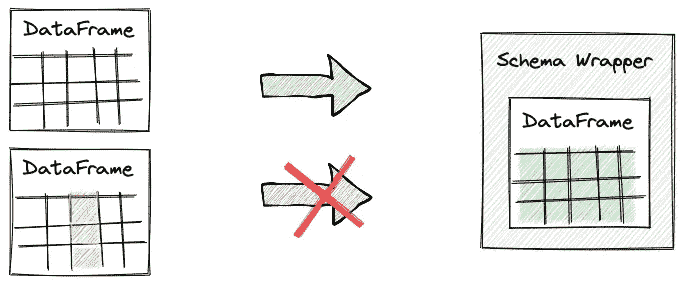
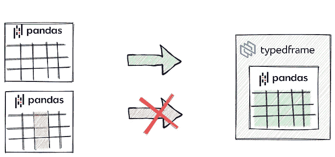

# 熊猫数据框架的模式规范

> 原文：<https://towardsdatascience.com/schema-specification-for-your-pandas-dataframes-c8b34d1eb37d>

## typedframe 简介—一种为数据帧编写模式以用于文档和运行时验证的简单方法

Pandas 是一个很好的工具，但是它是为现场编码实验而设计的，并且它引入了许多关于使用中的数据的隐含假设。这些假设分散在整个代码库中。只要违反了其中的任何一条，系统就会失败，并出现难以调试的错误。

为了解决这个问题，前段时间我写了**typed frame**——一个轻量级的库，它允许你显式地记录和验证关于熊猫数据帧的假设。

如果你不喜欢拐弯抹角，请随时查看下面的链接:

*   [文档](https://typedframe.readthedocs.io)
*   [GitHub 资源库](https://github.com/areshytko/typedframe)

作者图片

**问题 1:** *看你的一个同事写的函数，你不知道它期望什么作为输入，返回什么作为输出。*

这个问题在动态类型语言中很常见。在强类型语言中，函数签名已经是穷人的函数文档了。在 Python 或 Javascript 中，您所拥有的只是参数的数量及其名称。但是让我们假设你的团队有高水平的工程文化，你在你的代码库中使用类型提示，甚至可能使用静态类型检查器。对于熊猫数据框，即使这种做法也帮不了你多少。您仍然注定要深入函数逻辑，找出作为参数传递或作为输出返回的数据帧的确切格式。

**问题 2:** *你为对方团队生产数据，却不知道他们的数据契约。*

假设您正在实现一个生产者服务(可能是 ETL 或 ML 管道中的一个步骤)，而由另一个团队开发的消费者服务已经启动并运行，正在等待您的数据。为了成功集成这两个组件，您需要知道消费者期望的数据格式。通常，找到答案的唯一方法是与团队中的某个人交谈。我见过这样的情况，我们不得不在团队中创建临时聊天，其中两个团队同步他们的数据合约。我见过这样的情况，甚至组件作者都很难弄清楚他们组件的确切数据契约。

**问题 3:** *一个管道在你的数据上工作得很好，但是当发布到生产中时，它不断地失败，出现各种难以调试的错误。*

您已经在验证数据集上使用推理 ML 管道一段时间了，一切都运行良好。但是实时生产数据不断引入新的不可预料的可变性，每次数据中出现新的异常时，您都要花费大量时间进行调试。

# 熊猫的问题

谈到实时交互编码，Pandas 是一个很好的工具。它是专门为它设计的。它不是为生产系统而构建的。但是很多时候，熊猫代码变得可重用，并被移植到那里。数据科学家和分析师在处理表格数据时大量使用熊猫。然后在移交给工程团队的过程中，将 pandas 的逻辑重写为其他东西通常是不可行的。因此，工程师们通过微小的重构将其复制到生产代码库中。

但是熊猫给生产带来了很多问题。在我看来，它们中的大部分来自于数据帧是一种开放数据类型这一事实。数据类型本身概括了内部的基本数据格式，没有固定的规范。两个数据帧可以代表完全不同的东西。关于具体数据框架布局的假设在许多方面是隐含的。

让我们看一个过于简化的预处理代码，如下所示:

这里有什么问题？

即使我们在函数中添加了类型提示，用户仍然不知道如何使用它。他必须挖掘函数的内部逻辑，找出关于输入和输出的所有假设。它违反了核心软件开发原则之一——封装。

这些假设是什么？

## 必需的列及其数据类型

*sensory _ data*data frame 必须有一个 *col1* 列*，*，该列必须是数字数据类型。

## 索引名称和类型

DataFrame 应具有不带名称的日期时间索引。

## 分类列

根据 *sensory_data* 和*reports*data frames*中的 *alarm_category* 是否具有完全相同的类别集，上述结果会有所不同。*

*尽管我们的示例管道简单得不切实际，但上述所有场景都可能导致各种极易发生的错误。*

*同时，这些错误可能很难调试。因为实际的错误通常发生在离根本原因非常远的地方——根本原因是违反一些假设的数据。*

*考虑到这些问题，不久前我在 pandas 数据框架上制作了一个轻量级包装器，并将其打包成一个库。在过去的几年里，我们已经在多家公司的几个项目中使用了这个库，它已经被证明是我们的数据科学家和 ML 工程师的一个有用的工具。*

# *typedframe*

*极简主义是图书馆的主要设计目标。它应该提供最少的功能，而不会给用户带来额外的代码和复杂性。*

**

*作者图片*

***typedframe** 引入了类型化数据帧的单一概念。一个类型化的数据框架是在你的熊猫数据框架之上的一个极简的包装。通过子类化一个*类型数据框架*并指定*模式*静态变量来创建它。然后，您可以通过将它传递给类型化的 DataFrame 构造函数，将您的 DataFrame 包装在其中。构造函数将进行运行时模式验证，您可以通过包装器的 *df* 属性访问原始数据帧。*

*这个包装器有两个用途:*

*   ***数据框架假设的正式文件。您可以使用您的类型化数据框架模式定义作为一种文档形式，与他人交流您的数据接口。这种方法与 Python 类型提示结合起来非常有效。***
*   ***运行时模式验证。**如果您使用这种类型化的数据帧来保护您的管道，您将能够及早发现错误——更接近根本原因。如果违反了任何数据契约，您将得到一个解释确切原因的异常。*

**

*作者图片*

*让我们看看如何用 typedframe 库改进上面的代码。*

## *快速入门示例*

*安装库:*

**pip 安装型框架**

*为输入和输出定义三个模式类:*

*并修改代码以使用这些模式定义:*

*并将函数调用代码更改为:*

*如您所见，我们可以指定哪些列是必需的，以及它们期望具有什么类型。对于分类列，我们显式指定所有可能的类别。我们可以为索引定义预期的模式。我们可以继承我们的模式规范以避免代码重复。*

*我们已经从使用数据帧切换到了上面在函数接口中定义的类。所以现在，在将数据帧传递给预处理函数之前，需要将它们“包装”在这些类中。这是运行时验证发生的地方。该函数的用户可以看到函数的输入和输出。*

# *使用类型化数据帧的最佳实践*

*在您的代码库中，使用类型化数据帧包装器的最佳位置是什么？*

*我们在几个项目中使用 **typedframe** 库的经验表明，在以下场景中使用它是最合理的:*

## *团队边框*

*类型化数据帧有助于在团队之间建立数据契约。它们也有助于在早期发现由沟通错误或不一致的系统演化所导致的错误。每当一些数据集在团队之间传递时，用它的规范定义一个类型化的 DataFrame 类是有意义的。*

## *公共函数和方法*

*类型化数据框架与类型提示结合使用效果很好。因此，一个公共函数或方法，作为一个参数/返回一些熊猫数据帧，是一个很好的使用它的地方。*

## *数据管道的源和汇*

*在数据管道的开始和结束时提供模式定义和运行时验证是一个很好的实践。即，在从外部存储器读取之后和写入之前，这里也可以使用类型化数据帧。*

# *关于我*

**

*人工智能是我的激情所在。除此之外，我还对构建和理解复杂系统、管理知识和人员以共同实现新的宏伟目标感兴趣。我相信全球化，相信智慧和协作会战胜热力学第二定律:)*

*我正在努力提高我的写作技巧，与你分享我的想法或我学到的东西。*

*如果你发现我们有共同的兴趣，请不要犹豫在这里或在[推特](https://twitter.com/areshytko)、 [Instagram](https://www.instagram.com/areshytko/) 或 [LinkedIn](https://www.linkedin.com/in/areshytko) 上联系[。](https://medium.com/@areshytko)*