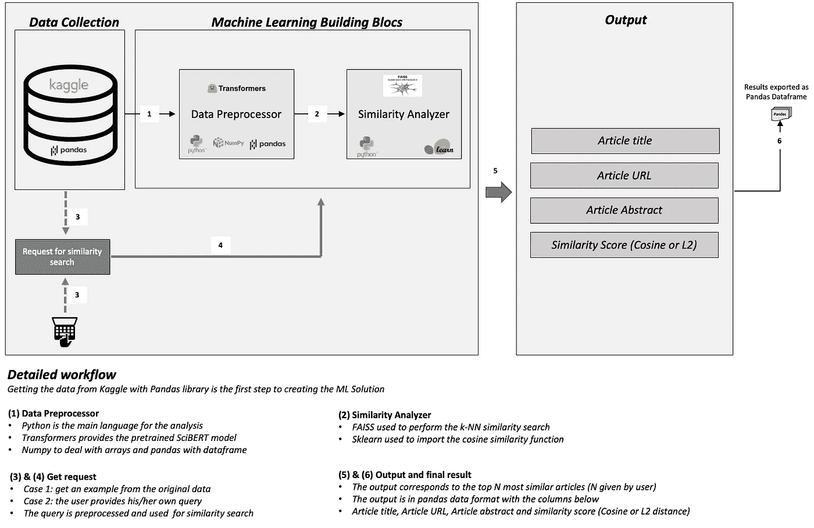
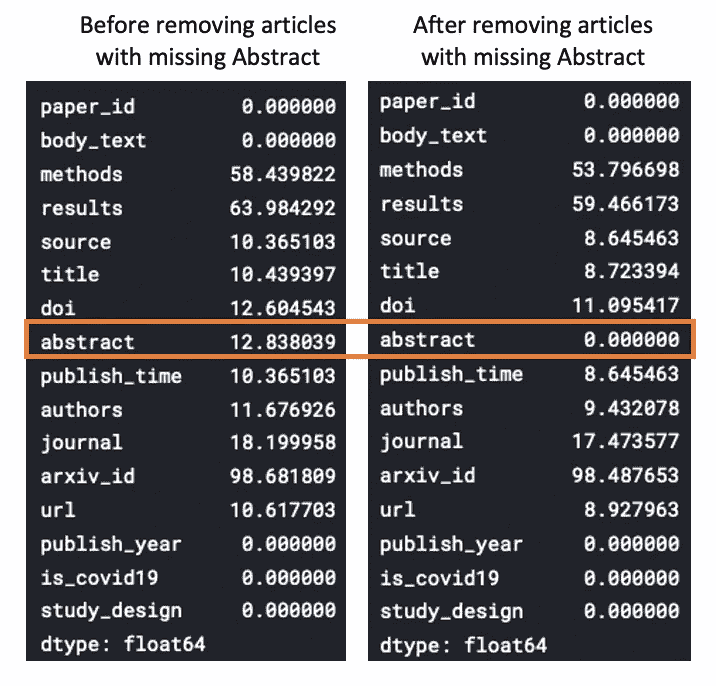
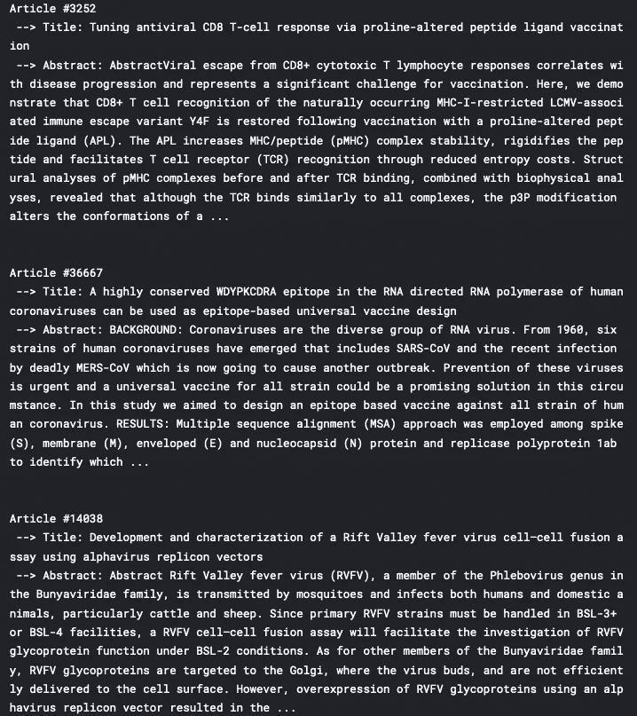
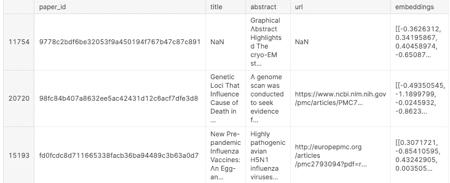
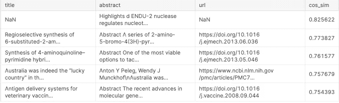
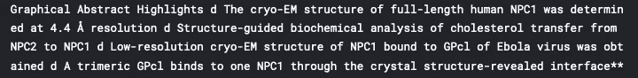
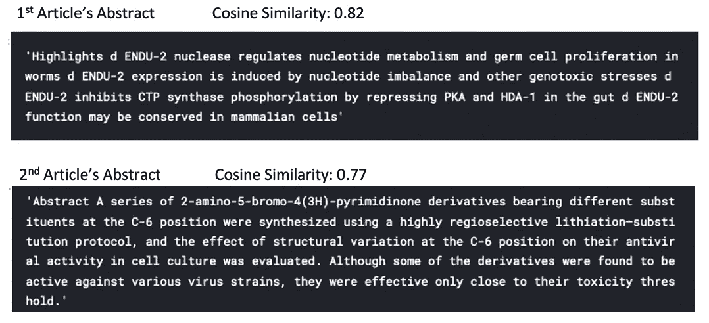
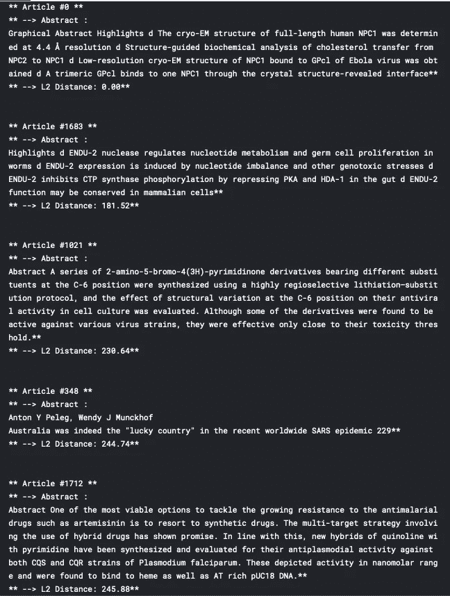

# 使用变形金刚进行深度学习的科学文档相似性搜索(SciBERT)

> 原文：<https://towardsdatascience.com/scientific-documents-similarity-search-with-deep-learning-using-transformers-scibert-d47c4e501590>

## 这篇文章是一个全面的概述，为具有 k-NN 和余弦相似性的文档构建一个语义相似性搜索工具

Maksym Kaharlytskyi 在 [Unsplash](https://unsplash.com/photos/Q9y3LRuuxmg) 上的照片

# 介绍

当阅读一篇有趣的文章时，您可能希望从大量数据中找到相似的文章。手动处理显然不是我们应该采取的策略。那么，为什么不利用人工智能的力量来解决这类问题呢？从这篇文章中，你将能够使用 SciBERT 和两种不同的相似性方法(余弦和 k-NN)来找到与你的特定查询在意义上最相似的科学文章。

***注意:嵌入*** 和 ***向量*** 将在整篇文章中互换使用，表示同一件事。

下面的工作流程给出了构建我们的工具的所有步骤，从数据提取到推荐类似的文章。

正在解决的解决方案的一般工作流程(图片由作者提供)

# 关于数据

*   这是 CORD-19 数据集，包含超过 59，000 篇学术文章，包括超过 48，000 篇关于新冠肺炎、新型冠状病毒和相关冠状病毒的全文。
*   这些数据由白宫和一个领先的研究团体联盟免费提供，以帮助全球研究产生见解，支持正在进行的抗击这种传染病的斗争。
*   它可以从 Kaggle 的[页面下载。](https://www.kaggle.com/keitazoumana/scientific-document-similarity-search-with-scibert/data)
*   关于数据集的更多细节可在此[页面](https://www.kaggle.com/danielwolffram/discovid-ai-a-search-and-recommendation-engine/data)中找到。

在继续下一步之前，重要的是考虑导入以下对项目成功至关重要的库。

有用 _libs.py

## 收集数据

数据从 Kaggle 下载并保存在一个名为 ***input 的文件夹中。*** 使用 shape 函数我们得到(47110，16)，意思是它包含 47110 篇文章，每篇有 16 列。

load_data_scibert.py

16 个专栏——但哪一个最重要？

以下是关于数据中缺失信息百分比的一些详细信息。

关注抽象列的数据中缺失值的百分比(图片由作者提供)

为了简单起见，我们将把我们的分析集中在**摘要**列，它也是 0%缺失数据的列。但是您可以使用其他文本列，比如**body _ text**；由你来决定。此外，为了加快处理速度，我们将使用 2000 个观察值的子集。

**数据中的文章摘要**

让我们看看一些随机的文章。这里我们将打印限制在前 100 个单词，因为有些单词很长。

show_random_articles.py

三篇随机文章的数据摘要(作者图片)

# 数据处理和矢量化

这一步旨在对文章的摘要文本进行矢量化，以便我们可以执行相似性分析。因为我们处理的是科学文档，所以我们将使用 SciBERT，这是一种用于科学文本数据的预训练语言模型。你可以在[语义学者](https://www.semanticscholar.org/paper/SciBERT%3A-A-Pretrained-Language-Model-for-Scientific-Beltagy-Lo/5e98fe2163640da8ab9695b9ee9c433bb30f5353)上找到更多关于它的信息。

这一部分涉及的主要步骤是:

## 加载模型工件

加载预训练的模型和标记器。在加载模型时，我们需要将 ***输出 _ 隐藏 _ 状态*** 设置为**真**，这样我们就可以提取嵌入了。

load _ 模型 _ 工件. py

## 将文本数据转换为嵌入内容

这个函数***convert _ single _ abstract _ to _ embedding***大多是受 Chris McCormick 的 BERT Word[embedding 教程](https://mccormickml.com/2019/05/14/BERT-word-embeddings-tutorial/#3-extracting-embeddings)的启发。它旨在使用预先训练的模型为给定的文本数据创建嵌入。

嵌入 _from_text.py

**对单个文本数据进行测试**

这里我们在第 30 篇文章上测试函数。你可以选择任何你想要的数字，只要它存在于数据中。

测试 _ 嵌入. py

***第 6 行*** 显示**嵌入形状:(768，)。**这意味着一个向量由 768 个值组成。最后，我们可以使用***convert _ overall _ text _ to _ embedding***函数将转换过程应用于数据中的所有文章。但是，在此之前，我们将使用***get _ min _ valid _ data***函数从数据中删除一些列，以便在最终的查询搜索结果中有更少的列。

使用前面的帮助器函数，我们可以创建一个新的列，为每篇文章包含其对应的抽象嵌入。

创建最终版本

带有嵌入列的前 3 行数据(作者提供的图片)

到目前为止，一切顺利！一切终于为相似性搜索设置好了。

# 相似性搜索

现在，我们可以执行给定的 ***查询*** 向量和所有嵌入向量之间的相似性分析。 ***查询*** 处理将类似于余弦和 k-NN。下面是负责这个的函数。

流程查询. py

## 余弦相似性搜索

两个文档嵌入之间的余弦相似性度量这些文档的相似程度，而不考虑这些嵌入的大小。它测量在多维空间中投影的两个向量之间的角度的余弦。

*   ***余弦相似度为 1*** 表示两个文档 100%相似
*   ***余弦相似度为 0*** 意味着两个文档有 0%的相似度

以下函数返回与查询文本相似的前 N 篇文章(N 是要返回的相似文章的数量)。

余弦 _ 建议. py

现在我们可以调用函数来获取前 5 篇最相似的文章。

余弦 _ 结果. py

以下是前一个查询的结果

与查询最相似的前 5 篇文章(作者图片)

为了更好地理解，我们可以只看前两篇最相似的文章。

**下面的*查询正文*下面的**

从原始数据帧中查询文本数据

***最相似的两篇文章来自前面的 top_articles 数据帧***

从推荐的数据框架中摘录最相似的两篇文章(图片由作者提供)

## 基于 KNN 和 Faiss 的相似性搜索

FAISS 是由脸书人工智能研究所开发的库。根据他们的[维基页面](https://github.com/facebookresearch/faiss/wiki):

> Faiss 是一个用于高效相似性搜索和密集向量聚类的库。它包含在任意大小的向量集中搜索的算法，直到那些可能不适合 RAM 的向量

下面是使用之前构建的嵌入来构建搜索算法的步骤

*   创建平面索引。该索引使用 L2(欧几里德)距离度量来测量查询向量和所有向量(嵌入)之间的相似性。
*   将所有向量添加到索引中
*   定义我们想要的相似文件的数量
*   运行相似性搜索以获得结果

faiss_setup.py

我们使用相同的查询文本数据对 k-NN 部分执行搜索。您可以随意将其更改为另一个值。

faiss_run_search.py

*   ***I*** 包含所有同类文章的索引
*   ***D*** 包含所有相似文章的 L2 距离值。距离越小，文章与查询越相似。

注意:我决定故意分解所有的步骤，以确保你能正确理解它们。但是你可以把所有的东西放在一个函数里。

faiss_show_recommendations.py

与查询最相似的 5 篇文章(图片由作者提供)

**观察**

*   第一个文档的 L2 = 0，这意味着 100%相似。这是显而易见的，因为查询是与其自身进行比较的，但是我们可以简单地将其从分析中删除。

# 结论

在本文中，我们研究了使用 SciBERT 嵌入、余弦和 k-NN 相似性方法实现语义相似性搜索工具的整个过程。同时，我也希望它对你有所帮助！

您可以在下面找到更多资源来进一步学习。在 YouTube 上关注我，了解更多互动会话！

# 额外资源

[GitHub 上的文章源代码](https://github.com/keitazoumana/SciBERT-Document-Similarity-Search)

[SciBERT:科技文本的预训练语言模型](https://www.semanticscholar.org/paper/SciBERT%3A-A-Pretrained-Language-Model-for-Scientific-Beltagy-Lo/5e98fe2163640da8ab9695b9ee9c433bb30f5353)

[伯特单词嵌入教程](https://mccormickml.com/2019/05/14/BERT-word-embeddings-tutorial/#3-extracting-embeddings)

[脸书人工智能研究](https://research.facebook.com/research-areas/facebook-ai-research-fair/)

再见🏃🏾