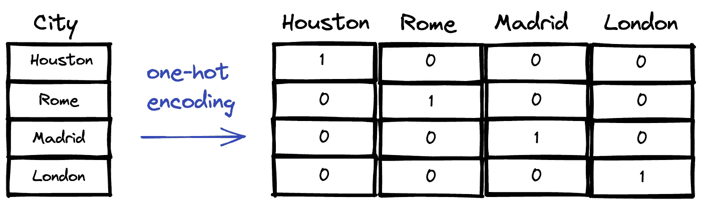
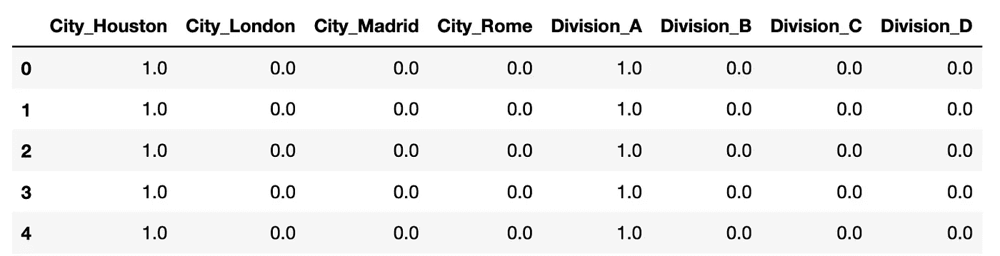
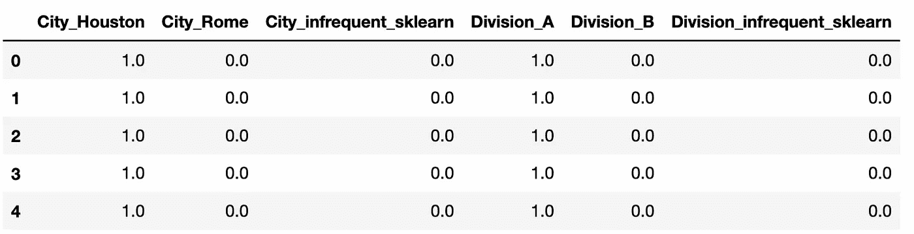

# Scikit-learn 1.1 附带了一个改进的 OneHotEncoder

> 原文：<https://towardsdatascience.com/scikit-learn-1-1-comes-with-an-improved-onehotencoder-5a1f939da190>

## 一个简单但非常实用的功能


照片由 [Unsplash](https://unsplash.com/s/photos/new?utm_source=unsplash&utm_medium=referral&utm_content=creditCopyText) 上的[尼克·费因斯](https://unsplash.com/@jannerboy62?utm_source=unsplash&utm_medium=referral&utm_content=creditCopyText)拍摄

Scikit-learn 是数据科学生态系统中最常用的 Python 库之一。它作为一个完整的工具，用于从数据预处理到模型评估的机器学习任务。

表格数据集中的要素很少使用，因为它们出现在原始数据中。在用作机器学习模型的输入之前，它们通常需要额外的数据预处理步骤。

[OneHotEncoder](https://scikit-learn.org/stable/modules/generated/sklearn.preprocessing.OneHotEncoder.html) 就是这些转变的一个例子。它对分类特征进行编码。下图说明了一键编码在分类要素上的工作方式。



(图片由作者提供)

这是一些机器学习算法的必需操作，因为它们期望所有的特征都是数字的。除非我们使用基于树的算法，比如随机森林，否则分类特征需要转换成数字特征。

如上图所示，一键编码为每个类别创建了一列。在分类变量有很多不同值的情况下，我们将有一个非常高维的特征空间。

如果有些类别与其他类别相比出现的次数很少，那么最好将它们分组。为这些类别创建单独的列可能会增加模型的计算和内存负担，而不会提供显著的价值。

Scikit-learn 1.1 附带的新 OneHotEncoder 允许对不常用的类别进行分组。让我们做一个例子来演示它是如何使用的。

在我们开始之前，让我们确保您有正确的版本。

```
import sklearn
sklearn.__version__
**# output**
'1.1.2'
```

如果您有 1.1 之前的版本，可以使用 pip 更新它。

```
pip install --upgrade scikit-learn
```

让我们创建一个具有两个分类特征的样本数据框架。

```
import pandas as pddf = pd.DataFrame({ "City": ["Houston"] * 25 + ["Rome"] * 30 + ["Madrid"] * 3 + 
          ["London"] * 2,

  "Division": ["A"] * 30 + ["B"] * 25 + ["C"] * 1 + ["D"] * 4})df["City"].value_counts()
**# output**
Rome       30
Houston    25
Madrid      3
London      2
Name: City, dtype: int64--------------------------------------
df["Division"].value_counts()
**# output** A    30
B    25
C     1
D     4
Name: Division, dtype: int64
```

在城市列中，有 3 个马德里和 2 个伦敦值，比其他两个城市少得多。除法列中值的分布也类似。

下一步是对这两个特征进行编码。

```
from sklearn.preprocessing import OneHotEncoder**# create an encoder and fit the dataframe**
enc = OneHotEncoder(sparse=False).fit(df)
encoded = enc.transform(df)**# convert it to a dataframe**
encoded_df = pd.DataFrame(
     encoded, 
     columns=enc.get_feature_names_out()
)encoded_df.head()
```



(图片由作者提供)

因为我们没有对不经常出现的值进行分组，所以编码数据中有 8 列。让我们用分组来尝试一下，这可以使用 **min_frequency** 参数来完成。出现次数少于指定最小频率的类别将被分组。

```
**# create an encoder and fit the dataframe**
enc = OneHotEncoder(min_frequency=5, sparse=False).fit(df)
encoded = enc.transform(df)**# convert it to a dataframe**
encoded_df = pd.DataFrame(
     encoded, 
     columns=enc.get_feature_names_out()
)encoded_df.head()
```



(图片由作者提供)

我们现在有一个包含 6 个特征的数据框架。当处理具有大量不同值的类别时，这种差异会更加明显。

假设一个特性有 20 个不同的值，95%的值属于 4 个不同的值。剩下的 5%属于 16 个不同值的组合。在这种情况下，有效的策略是将这 16 个值分组到一个组中。

*你可以成为* [*媒介会员*](https://sonery.medium.com/membership) *解锁我的全部写作权限，外加其余媒介。如果你已经是了，别忘了订阅*<https://sonery.medium.com/subscribe>**如果你想在我发表新文章时收到电子邮件。**

*感谢您的阅读。如果您有任何反馈，请告诉我。*