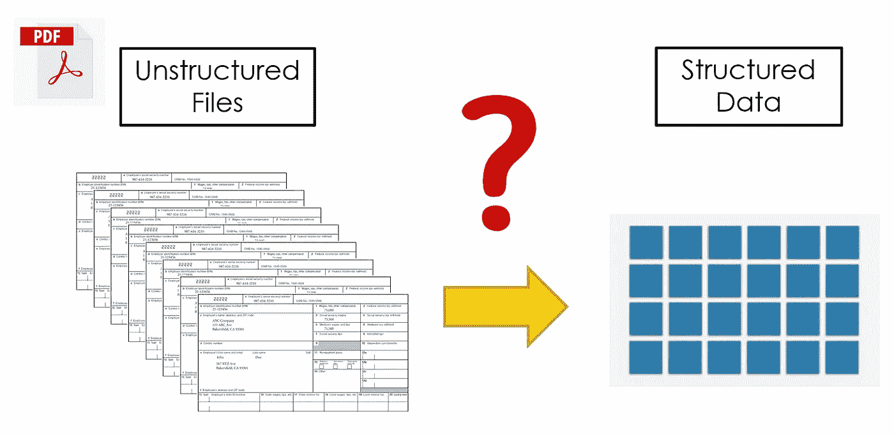
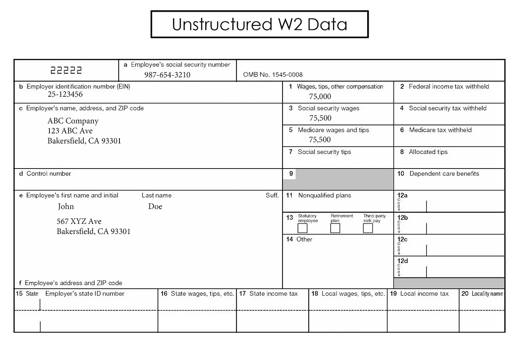
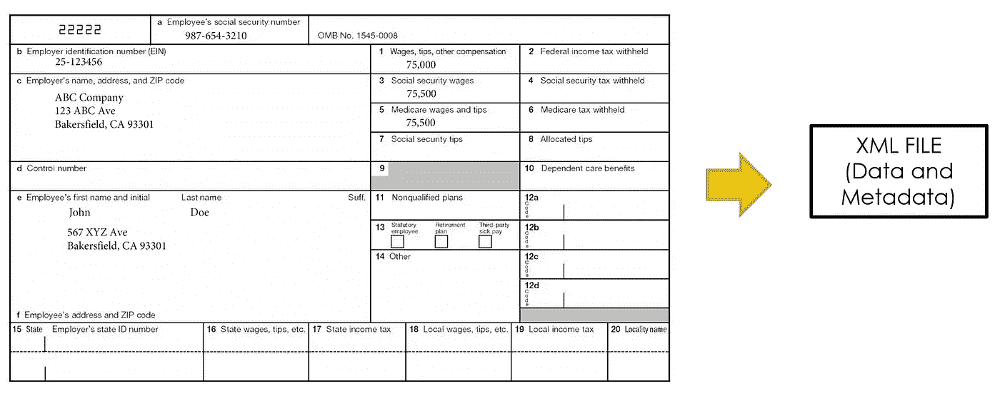
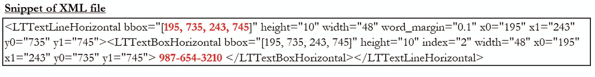
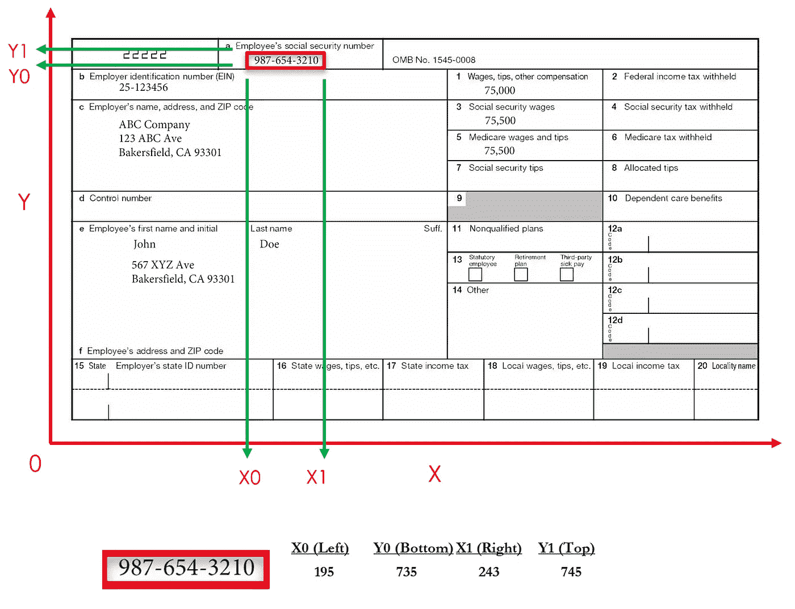
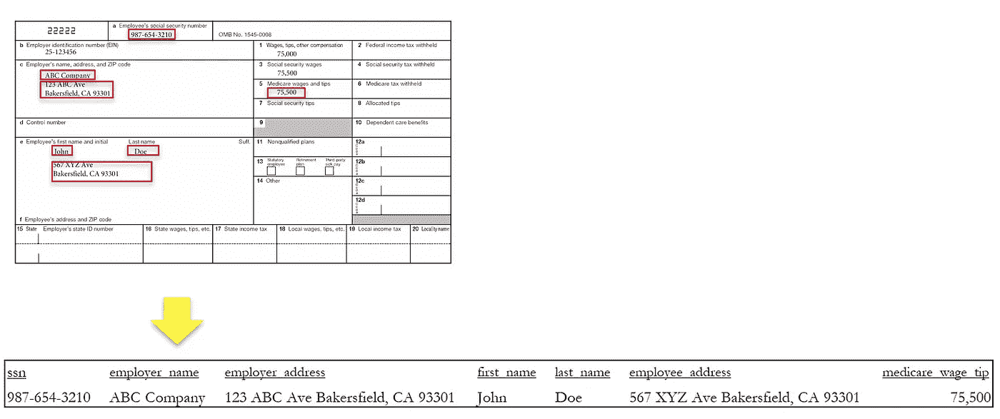
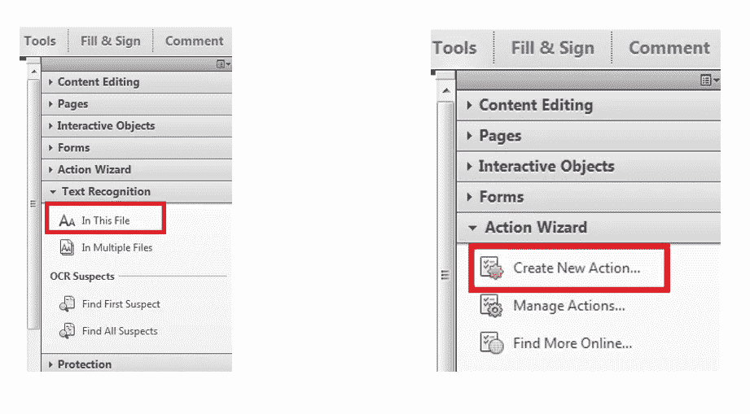

# 如何使用 Python 和 PDFQuery 从 PDF 文件中抓取数据

> 原文：<https://towardsdatascience.com/scrape-data-from-pdf-files-using-python-and-pdfquery-d033721c3b28>

## 有效地从 PDF 文件中提取数据



作者图片

# 背景

在 [**之前的文章**](/scrape-data-from-pdf-files-using-python-fe2dc96b1e68) 中，我谈到了如何使用 Python 中的 [**tabula-py**](/scrape-data-from-pdf-files-using-python-fe2dc96b1e68) 和 **Pandas** 从 PDF 文件中的**结构化**和**非结构化**数据中抓取数据。在本文中，我将介绍一种从 PDF 文件中抓取数据的替代方法: **PDFQuery** 。

## 必需的库

*   **PDFQuer** y:从 PDF 文件中抓取文本
*   **熊猫**:构建和操作我们的面板数据

## 安装库

```
pip install pdfquery
pip install pandas
```

## 导入库

```
import pdfquery
import pandas as pd
```

# 方法 1:使用文本框坐标抓取 PDF 数据

让我们做一个简单的例子，下面的 PDF 文件包含了**非结构化格式**的 W2 数据，其中我们没有典型的**行列结构**。相反，相关信息(如员工的 SSN、姓名、地址、雇主、工资等。)都是以这种 W2 的形式分散的。



作者图片

首先，我们需要将 PDF 转换成可扩展标记语言(XML)，其中包含给定 PDF 页面的数据和元数据。



作者图片

```
pdf = pdfquery.PDFQuery('file.pdf')
pdf.load()
pdf.tree.write('pdfXML.txt', pretty_print = True)
```

XML 定义了一组规则，用于以人类可读和机器可读的格式对 PDF 进行编码。以下是雇员 SSN 的 XML 片段。它包括数据(987–654–3210)和元数据(例如，文本框坐标、高度、宽度等。)



作者图片

代码片段中文本框内的值[195，735，243，745]是指文本框的“左、下、右、上”坐标。你可以用 X-Y 坐标来思考 pdf 页面。X 轴横跨 PDF 页面的宽度，Y 轴横跨页面的高度。每个元素都有由 4 个坐标组成的边界框定义的边界。这些坐标(X0，Y0，X1，Y1)代表文本框的左侧、底部、右侧和顶部，这将为我们提供我们在 PDF 页面中感兴趣的数据的位置。



作者图片

接下来，使用 XML 文件中的文本框坐标，我们可以使用相应的文本框坐标分别提取每条相关信息，然后将所有收集到的信息合并到单个观察中。下面，我们编写一个函数来使用“pdf . pq(' lttextline horizontal:overlaps _ bbox(" #，#，#，#，# ")”。text()"来提取每个文本框中的数据，然后使用 pandas 来构造一个 dataframe。

```
def pdfscrape(pdf):
    # Extract each relevant information individually
    ssn              = pdf.pq('LTTextLineHorizontal:overlaps_bbox("195, 735,  243, 745")').text()
    employer_name    = pdf.pq('LTTextLineHorizontal:overlaps_bbox("48,  686,  300, 696")').text()
    employer_address = pdf.pq('LTTextLineHorizontal:overlaps_bbox("48,  649,  300, 684")').text()
    first_name       = pdf.pq('LTTextLineHorizontal:overlaps_bbox("48,  590,  150, 601")').text()
    last_name        = pdf.pq('LTTextLineHorizontal:overlaps_bbox("175, 590,  280, 601")').text()
    employee_address = pdf.pq('LTTextLineHorizontal:overlaps_bbox("48,  543,  260, 577")').text()
    medicare_wage_tip= pdf.pq('LTTextLineHorizontal:overlaps_bbox("370, 662,  430, 672")').text()
# Combined all relevant information into single observation
    page = pd.DataFrame({
                         'ssn': ssn,
                         'employer_name': employer_name,
                         'employer_address': employer_address,
                         'first_name': first_name,
                         'last_name': last_name,
                         'employee_address': employee_address,
                         'medicare_wage_tip': medicare_wage_tip
                       }, index=[0])
    return(page)
```



作者图片

如果后续页面中的信息以类似的方式显示，我们可以使用 for-loop 自动完成这个过程。在下面的代码中，我们可以使用“pdf.doc.catalog['Pages']得到页数。resolve()['Count']”。要从特定页面提取数据，我们可以使用“pdf.load(#)”。

```
pagecount = pdf.doc.catalog['Pages'].resolve()['Count']master = pd.DataFrame()
for p in range(pagecount):
    pdf.load(p)
    page = pdfscrape(pdf) 
    master = master.append(page, ignore_index=True)

master.to_csv('output.csv', index = False)
```

# 方法 2:使用邻近的关键字抓取 PDF 数据

另一种提取数据的方法是找到相邻关键字的坐标。更直观的方法是寻找我们感兴趣的关键词，然后提取与关键词相关的数据。

在 PDFQuery 中，我们可以使用“pdf . pq(' lttextline horizontal:contains(" { } ")。format("keyword "))"来定位关键字。然后用“keyword.get('x0|y0|x1|y1 '，0)”提取关键字的“左、下、右、上”坐标。一旦我们有了关键字**的坐标，我们就可以通过增加或减少坐标**中的值来移动文本框。例如，在 PDF 页面中，“987–654–3210”在关键字“社会安全号码”下，我们可以将 y0 和 y1 减去某个值，表示 10，以将文本框下移。在实践中，你将通过反复试验来学习使用什么值。最后，我们可以使用“pdf . pq(' lttextline horizontal:overlaps _ bbox(" #，#，#，# ")”。text()"来提取与关键字相关联的数据。

```
keyword =  pdf.pq('LTTextLineHorizontal:contains("{}")'.format("social security number"))[0] 
x0 = float(keyword.get('x0',0)) 
y0 = float(keyword.get('y0',0)) - 10
x1 = float(keyword.get('x1',0)) 
y1 = float(keyword.get('y1',0)) - 10
ssn = pdf.pq('LTTextLineHorizontal:overlaps_bbox("%s, %s, %s, %s")' % (x0, y0, x1, y1)).text()
```

# 光学字符识别

OCR(光学字符识别)是一种将图像转换为机器编码文本的过程，它允许计算机解释文件的文本，以便可以搜索、复制和擦除文本。

有时，如果您打开 PDF 并且无法选择文本，可能是因为 PDF 没有经过 ocr。如果一个 PDF 不是 OCRed，我们将需要在 Adobe Acrobat 中做一些额外的步骤来为 PDF 抓取做准备。

在 Adobe Acrobat 中，转到工具->文本识别->在此文件中。Adobe Acrobat 应该开始对 PDF 文件进行 OCR。如果您有多个 PDF 文件，我们可以设置一个“操作向导”来自动处理和 OCR 所有的 PDF 文件。



作者图片

如果你想继续探索 PDF 抓取，请查看我的其他文章:

*   [**使用 Python 和 PDFQuery 从 PDF 文件中抓取数据**](/scrape-data-from-pdf-files-using-python-and-pdfquery-d033721c3b28)
*   [**使用 Python 和 tabula-py 从 PDF 文件中抓取数据**](/scrape-data-from-pdf-files-using-python-fe2dc96b1e68)
*   [**如何使用 Python 和 Pytesseract 将扫描文件转换为可搜索的 PDF**](https://python.plainenglish.io/convert-scanned-files-to-searchable-pdf-using-python-and-pytesseract-3ee31ee6f01f)
*   [**使用 Python 和 Pytesseract**](/pdf-text-extraction-while-preserving-whitespaces-using-python-and-pytesseract-ec142743e805) 提取 PDF 文本，同时保留空白

# 感谢您的阅读！！！

如果你喜欢这篇文章，并且想**请我喝杯咖啡，**请[点击这里](https://ko-fi.com/aaronzhu)。

您可以注册一个 [**会员**](https://aaron-zhu.medium.com/membership) 来解锁我的文章的全部访问权限，并且可以无限制地访问介质上的所有内容。如果你想在我发表新文章时收到电子邮件通知，请订阅。