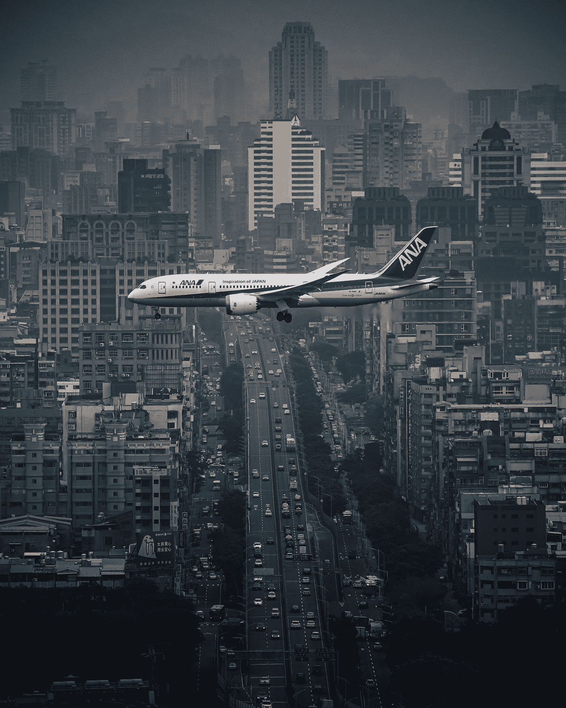
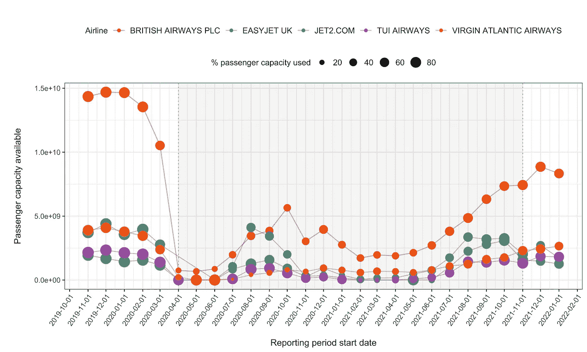
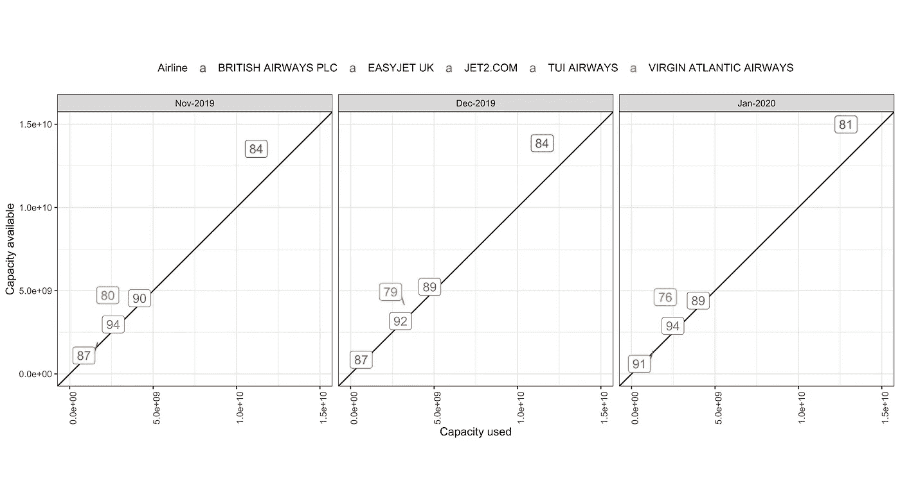
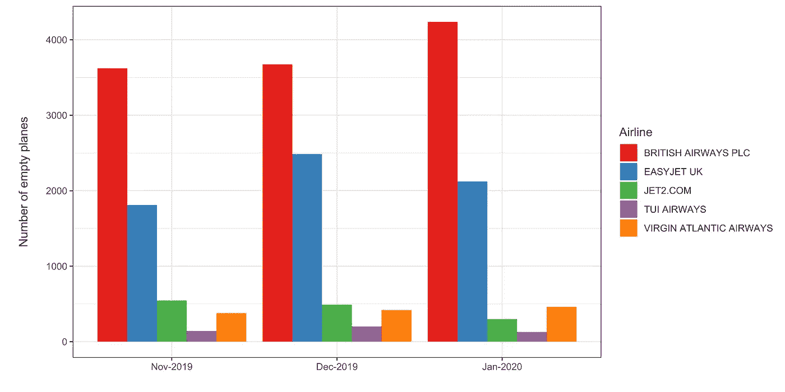
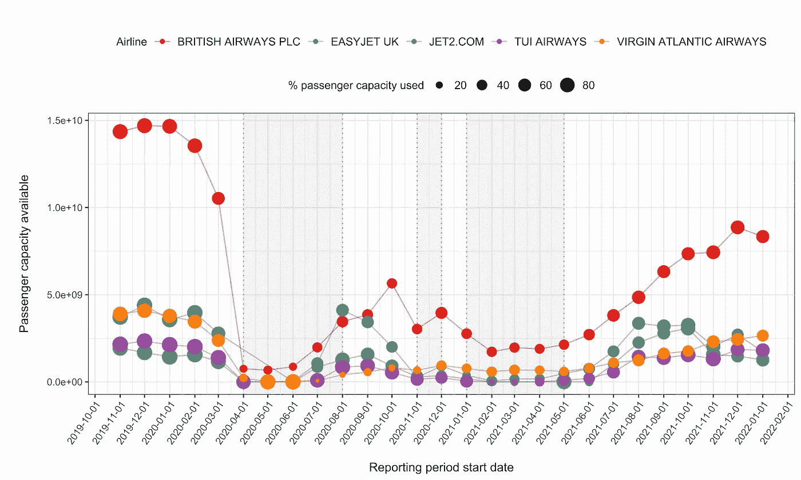
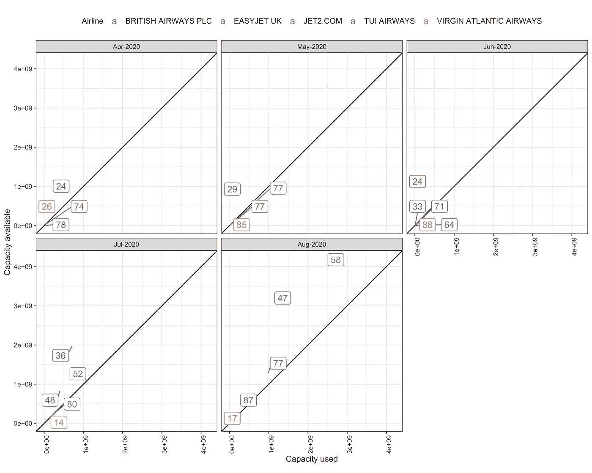
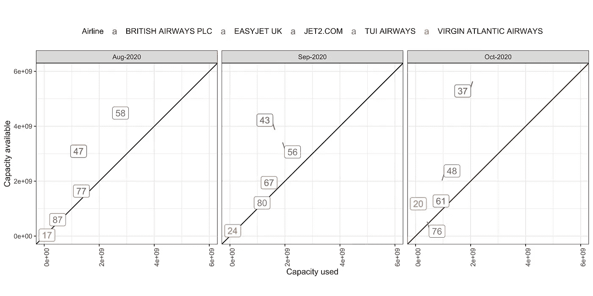
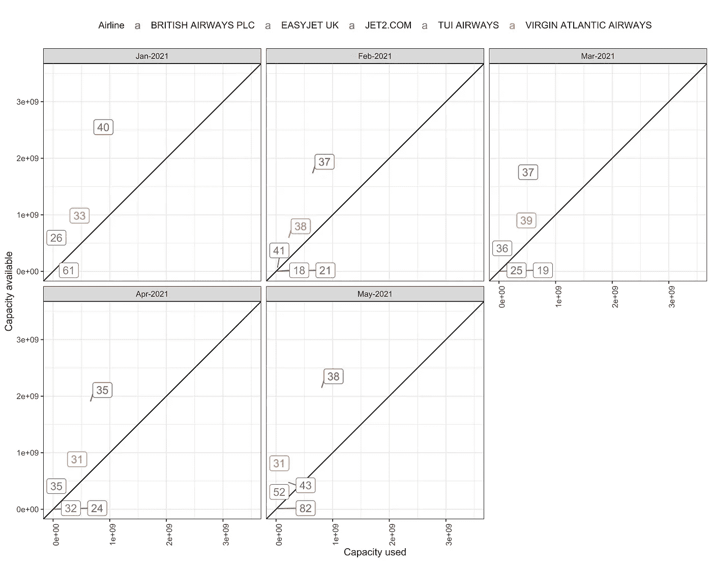
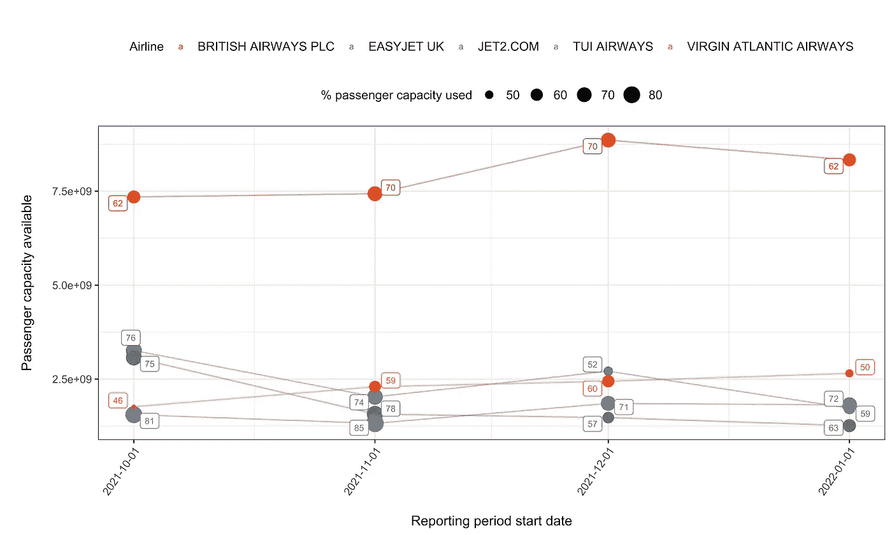

# 通过可视化公共航空数据审视航空公司效率

> 原文：<https://towardsdatascience.com/scrutinising-airline-efficiency-by-visualising-public-aviation-data-f736112571f7>

## 可视化英国航空公司数据，了解效率的驱动因素，并强调航空对环境的影响



jet dela cruz 在 [Unsplash](https://unsplash.com?utm_source=medium&utm_medium=referral) 上拍摄的照片

**源代码:** [**github**](https://github.com/ainefairbrother/ghost_flights)

最近在听《卫报》的《今日聚焦》时，我被这一集[“英国幽灵航班的丑闻”](https://www.theguardian.com/news/audio/2022/mar/07/the-scandal-of-britains-ghost-flights-podcast)迷住了，其中《卫报》的环境编辑达米安·卡林顿讨论了他对“幽灵航班”的调查工作。根据这篇文章的定义，幽灵航班是指载客量不到 10%的航班，据《卫报》报道，在 2020 年 3 月至 2021 年 9 月期间，15000 架幽灵航班从英国机场起飞。目前还不完全清楚为什么会出现这种情况，但一个主要原因被认为是机场的“插槽”规则。这些是最低活动阈值，激励航空公司运行其大部分定期航班，以便留在给定的机场。

在新冠肺炎疫情的过程中，由于感染的威胁，国家封锁和旅行限制，英国人基本上留在原地。这导致了航空乘客数量的急剧下降，为了支持苦苦挣扎的航空业，政府放弃了舱位规则。这意味着从 2020 年 4 月起，航空公司可以以 0%(而不是 80%)的比例运营，并且仍然保留其机场席位。

尽管如此，在他获得的英国出境航班数据中，卡林顿观察到，即使在这一新的 0%规则下，航空公司仍在继续运营幽灵航班，这表明插槽规则只是这里的一部分难题。

航空业对环境有着巨大的影响。一小时的飞行释放出大约 250 公斤的二氧化碳，这比某些国家的人在 T2 一整年释放的二氧化碳还要多。因此，对于航空公司来说，运行幽灵航班是一种荒谬的浪费行为，在没有必要的情况下排放大量的碳。与将全球变暖保持在 1.5 摄氏度以下所需的经济和政治体系的重大转变相比，解决这一问题似乎是减排的唾手可得的成果，也许是可以通过提高效率来解决的具体问题。

我想进一步研究这个问题，看看是否有任何数据可以让我更好地理解这个问题。我的第一站是查看卡灵顿在这一集中提到的[民航局英国航空公司数据](https://www.caa.co.uk/data-and-analysis/uk-aviation-market/airlines/uk-airline-data/)。这是每月发布的每家航空公司的可用容量、乘客数量、航班号和飞行公里数。然而，为了复制或扩展卡灵顿的发现，我需要每次飞行的数据。所以我向民航局提交了一份 FOI，要求的正是这个…

> *我可以确认 CAA 掌握的信息在您最初的查询范围内。然而，民航局的立场是，所要求的信息[……]免于发布。*

…立即遭到拒绝。据我所知，这些数据是保留的，但是民航局没有得到航空公司的许可来发布这些数据。我很沮丧，但对这个结果并不感到惊讶，因为卡灵顿需要利用一个议会联系人来获得他所获得的有限数据。

为了不被繁文缛节打败，我决定看看我能得到的数据，并试图收集一些关于航空公司效率的有用见解，而不必通过信息公开机构和利用高调的联系。如果可以使用这些数据来审查航空实践，这代表了一种让这些问题为人所知的可行方法，并为公众提供了追究航空公司、机场和监管机构责任所需的信息。

# 数据

我从英国民航局网站下载了英国航空公司的活动数据。每个月的数据都以单独的表格形式提供，所以我下载了 table 03-All services . CSV-其中包含了 2019 年 11 月至 2022 年 1 月(含)每个月所有进出英国的航班。该数据包括每个航空公司 15 个变量的月度总量。下面是显示其中三列的数据示例:airline_name、seat_km_used 和 seat_km_available。

```
+------------------------+-------------------+--------------+|      airline_name      | seat_km_available | seat_km_used |+------------------------+-------------------+--------------+| AIRTANKER SERVICES LTD |          71854000 |     18314000 || AURIGNY AIR SERVICES   |            881000 |       103000 || BA CITYFLYER LTD       |            972000 |        21000 || BLUE ISLANDS LIMITED   |            580000 |       149000 || BRITISH AIRWAYS PLC    |         750959000 |    179433000 || CATREUS AOC LTD        |            104000 |        19000 || EASTERN AIRWAYS        |           3592000 |      1185000 |+------------------------+-------------------+--------------+
```

我将 seat_km_used 和 seat_km_available 确定为本次分析的主要指标。seat_km_available 是一个[标准航空业对航空公司](https://airlinegeeks.com/2015/12/28/airline-metrics-available-seat-kilometers/)载客量的衡量标准，它考虑了座位的数量和这些座位可以飞行的距离。例如，如果一家航空公司有一架波音 737–800(载客量 189)，并且有一个从伦敦到爱丁堡的定期航班(大约。500 公里)，那么它的可用座位公里数将等于 189 * 500 = 94500。

这一指标非常有用，因为它可以直接比较不同旅程类型(长途/短途)的航空公司的运力，以及其机队中不同机型的飞机。在整篇文章中，我将把可用座位公里数称为航空公司的“容量”。与此相关的重要定义如下:

*   **可用能力:**计划载客能力。
*   **已用载客量:**已用载客量——即已用座位。
*   **%已用产能:**已用产能占可用产能的百分比。

# 分析

在这个分析中，我主要关注平均可用容量最高的五家航空公司。为了了解过去三年航空公司的运力，我绘制了每家航空公司的可用运力，用点的大小显示了已用运力的百分比(图 1)。为了跟踪这些变量对时隙规则变化的响应，我使用了从疫情之前(2019 年 11 月)到现在(2022 年 1 月)的数据，使用阴影表示 0%规则的时间跨度。



**图一。**显示一段时间内(2019 年 11 月至 2022 年 1 月)五家英国航空公司可用载客量的时间进程。已用容量百分比由点大小表示(较大的点表示已用容量百分比高，较小的点表示已用容量百分比低)。阴影表示 0%时隙规则覆盖的时间。

在没有在图上标记大流行相关事件的情况下，疫情的影响在数据中清晰可见。随着航空公司收缩业务，航空公司的可用容量将在 2020 年初下降，在接下来的几年里，航空公司试图在低乘客数量下增加容量，这与疾病控制措施相对应。为了了解航班时刻规则的变化如何影响航空公司的运力，并考虑到封锁的影响，我将分析分为三个部分:疫情之前、疫情和“疫情之后”(当然，我指的是封锁之后的时期，在此期间不再有法律强制执行社会距离和疾病控制措施)。

没有在图上标记大流行相关事件，疫情的标记在数据中是可见的。随着航空公司收缩业务，航空公司的可用容量将在 2020 年初下降，在接下来的几年里，航空公司试图在低乘客数量下增加容量，这与疾病控制措施相对应。为了了解航班时刻规则的变化如何影响航空公司的运力，并考虑到封锁的影响，我将分析分为三个部分:疫情之前、疫情和“疫情之后”(当然，我指的是封锁之后的时期，在此期间不再有法律强制执行社会距离和疾病控制措施)。

## 1.疫情之前(80%规则)

我首先查看了疫情之前的时期——在那个时期，时段规则被设定为 80%——来衡量基线航空公司的运力和使用情况。图 1 显示了 2019 年 11 月至 2020 年 2 月之间的这段时间，其特点是可用容量高。

为了更好地了解这几个月的运力指标，我绘制了可用运力与已用运力的对比图，用已用运力百分比作为每个航空公司的标签(图 2)。



**图二。**显示 5 家英国航空公司已用运力和可用运力的关联图。每个航空公司的标签上都标明了%已用容量。

在图 2 中，完美匹配的航空公司供给和需求位于对角线上。总体而言，航空公司在疫情危机前的运营能力只有 80%。12 月份，维珍大西洋航空公司的使用率低于这一数字，到 1 月份，使用率降至 76%,而英国航空公司的使用率为 81–84%。

英国航空公司、易捷航空公司、Jet2 航空公司、途易航空公司和维珍大西洋航空公司的这些已用运力百分比分别为 17%、11%、12%、7%和 18%。也许这些看起来是微不足道的未用容量，但是让我们用绝对的术语来描述。我通过将航班数量乘以未使用的运力百分比，将未使用的运力转化为空航班的绝对数量，得出如果所有其他飞机都满员，每月可能完全空着的航班数量(图 3)。



**图 3。**柱状图显示 2019 年 11 月至 2020 年 1 月(含)期间，如果所有空容量都转换为航班，各航空公司将运营的空航班数量。

对于最大的航空公司英国航空公司来说，这种未使用的运力相当于每月大约 3500-4000 个完全空着的航班到达或离开英国机场。这是对真实情况的简化。很可能这种未使用的运载量的大部分将由低或中等低运载量的航班组成，一部分来自实际的幽灵航班。但我确实认为这描绘了一幅航空浪费的可怕画面，并提出了是什么在推动这一现象的问题。让我们来看看当 80%槽规则被放弃时会发生什么。

## 2.疫情——0%规则

到 2020 年 3 月，新冠肺炎病例迅速增加，2020 年 3 月 26 日，第一次封锁开始实施。与此同时，对航空旅行的需求直线下降，使得航空公司无法运行 80%的预定活动。因此，政府放弃了位置规则，这意味着航空公司可以在 0%的情况下运营，仍然保留他们的机场位置。在分析这段时间时，考虑英国封锁*的时间很重要，因此我在图 4 中用阴影表示了这些。



**图四。**时间进程如图 1 所示，但阴影表示英国三个国家的封锁。

我将把这部分分析进一步细分为三个部分，代表 0%规则的三个“阶段”——第一次锁定、锁定间阶段和第三次锁定——绘制每个阶段的已用容量和可用容量的月度相关性。

## 2.1 第一次锁定(2020 年 4 月—2020 年 8 月)



**图五。**显示 5 家英国航空公司已用运力和可用运力的关联图。每个航空公司的标签上都标明了%已用容量。

第一次封锁是航空公司的不稳定时期，反映在可用容量的波动上。图 5 显示 tu1 和 Jet2 在很大程度上保持了低容量，并在很大程度上填充了它。鉴于这种反应，令人惊讶的是，英国航空公司从 4 月到 8 月一直保持 24-36%的使用容量，而维珍大西洋航空公司尽管在 5 月和 6 月达到了疫情前的%使用容量，但在 7 月和 8 月下降到 14%和 17%。

## 2.2 相互锁定阶段(2020 年 8 月—2020 年 10 月)



**图六。**显示 5 家英国航空公司已用运力和可用运力的关联图。每个航空公司的标签上都标明了%已用容量。

在这个封锁期内，0%规则的延续和封锁后航空旅行需求的略微增加，维珍大西洋航空公司和英国航空公司似乎再次大大超出了其可用容量。前者是灾难性的，在此期间的四个月中仅使用了其可用容量的 17-24%。

## 2.3 第三次锁定(2021 年 1 月—2021 年 5 月)



**图 7。**显示 5 家英国航空公司已用运力和可用运力的关联图。每个航空公司的标签上都标明了%已用容量。

第三次封锁再次让航空公司以非常低的已用运力百分比运行。英国航空公司、维珍大西洋航空公司和 Jet2 在<40% for the majority of this period, with EasyJet fluctuating between 26% and 43%. Despite this, as can be seen in figure 4, available capacity was maintained, seemingly unresponsive to these figures.

## 3\. Post-restrictions — 50% rule

In November 2021, the slot rule was re-introduced, but set to 50% rather than 80%. Let’s look at this transition period on the time course plot.



**运行。**时间进程如图 1 所示，但仅限于 2021 年 10 月至 2022 年 1 月，添加了标签，以可用容量的百分比表示已用容量。

随着时隙规则的引入，大多数航空公司增加了他们的可用容量。对于 EasyJet、TUI 和 Jet2 而言，这导致已用运力百分比下降，因为它们增加了可用运力以达到 50%的活动配额，但没有乘客需求来保证这一点。在这里，我们看到了迫使航空公司运营的空位规则的直接证据，并产生了未使用的容量。

**根据政府消息来源，开始日期是明确的，但由于限制的逐步取消，结束日期不太明确，因此我根据* [*英国政府路线图*](https://www.instituteforgovernment.org.uk/sites/default/files/timeline-coronavirus-lockdown-december-2021.pdf) *将大多数混合限制的取消作为大致的结束日期。*

# 结论

这一分析强调了以下几点:

*   在前疫情时代，通过迫使航空公司达到活动阈值，时隙规则导致了未使用的航空公司容量。以英国航空公司为例，这个数字相当于每月 3500-4000 次空飞。
*   50%时段规则的重新引入，以及航空公司可用容量的增加伴随着%已用容量的下降，进一步证明了时段规则对未用航空公司容量的贡献。
*   在英国关闭期间，乘客需求非常低，空位规则被取消。尽管这些事实表明，航空公司可以不那么活跃，或者实际上以更高的效率运营，但一些航空公司的利用率非常低，特别是英国航空公司和维珍大西洋航空公司。
*   0%规则数据表明，不仅仅是老虎机规则在起作用。然而，目前尚不清楚运营幽灵航班或低容量航班的动机是什么，尤其是在没有空位丢失风险的情况下。

起初，出于对幽灵航班的兴趣，我开始查看这些数据，但我开始更多地思考航空业惊人的浪费，以及它对环境的巨大影响。

这一分析表明，我们可以利用公共数据在一定程度上跟踪航空公司的效率。然而，需要提高数据透明度，以使监管机构和航空公司负起责任。审查效率是公众向航空业施加压力的一种方式，目的是迫使航空业减少其巨大的——以及[持续飙升的](https://ourworldindata.org/co2-emissions-from-aviation) —碳足迹。