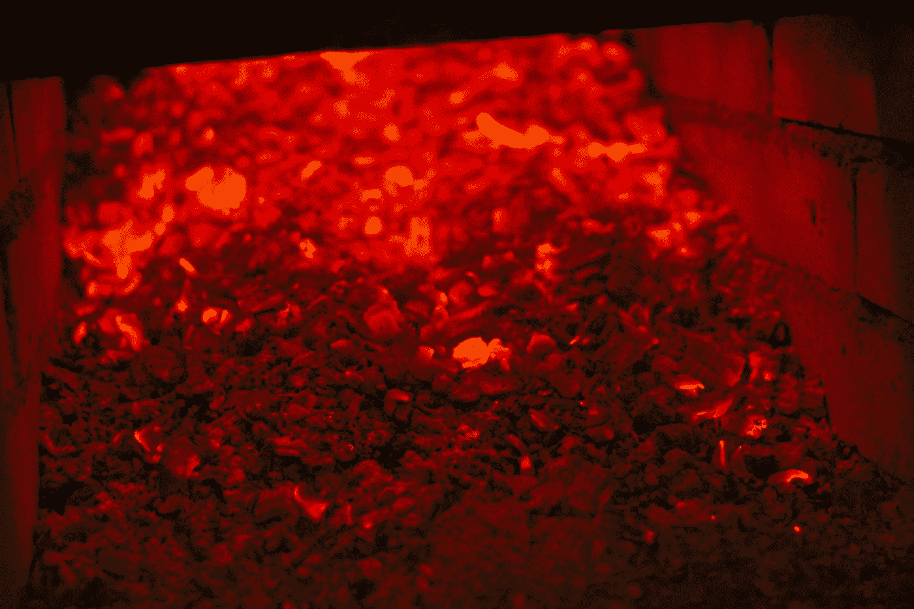
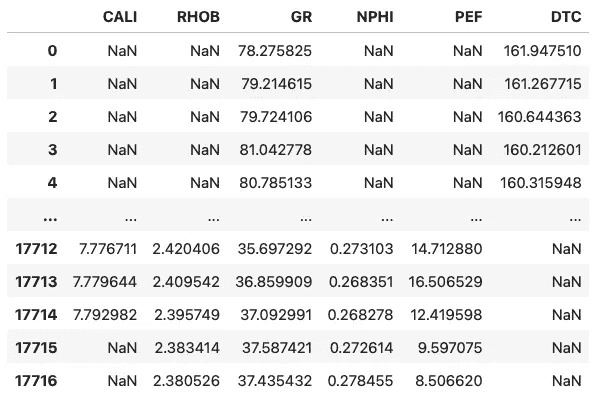
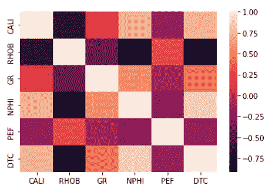
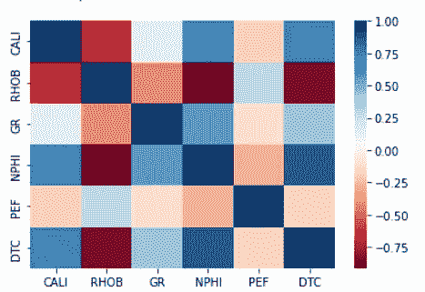
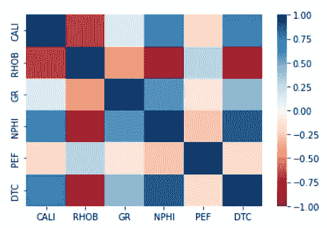
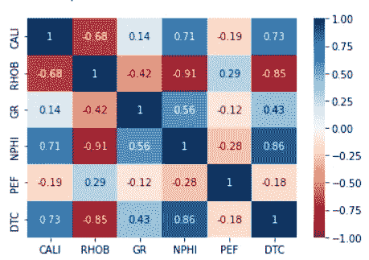
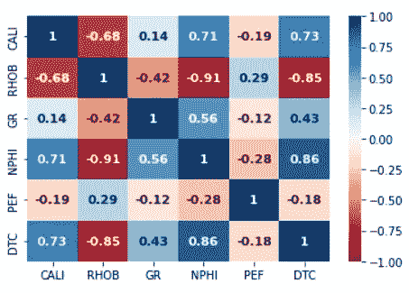
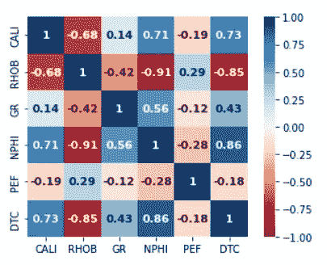

# 用于可视化数据相关性的 Seaborn 热图

> 原文：<https://towardsdatascience.com/seaborn-heatmap-for-visualising-data-correlations-66cbef09c1fe>

## 数据可视化| Seaborn

## 用一个简单的热图直观地展示各种特征之间的相互关系



[DDP](https://unsplash.com/@moino007?utm_source=medium&utm_medium=referral) 在 [Unsplash](https://unsplash.com?utm_source=medium&utm_medium=referral) 拍摄的照片

热图是创建美丽图形的伟大工具，可以为我们提供趋势方面的见解，并允许我们轻松识别数据集中的潜在异常值。

在本教程中，我们将了解热图的用途之一——关联矩阵热图。相关矩阵允许我们确定数据集中的要素之间的相关程度，以及这种相关是正相关还是负相关。

Python 中有许多数据可视化库，但是最流行和最容易使用的是 Seaborn 库。[只需一次函数调用和一个数据集，我们就能轻松创建热图。](https://seaborn.pydata.org/generated/seaborn.heatmap.html)

# 资料组

我们在本教程中使用的数据集是一个训练数据集的子集，该数据集用作 Xeek 和 FORCE 2020 *(Bormann 等人，2020)* 举办的机器学习竞赛的一部分。它是在挪威政府的 NOLD 2.0 许可下发布的，详细信息可以在这里找到:[挪威开放政府数据许可(NLOD) 2.0](https://data.norge.no/nlod/en/2.0/) 。

完整的数据集可通过以下链接获得:[https://doi.org/10.5281/zenodo.4351155](https://doi.org/10.5281/zenodo.4351155)。

竞赛的目的是利用测井测量从现有的标记数据预测岩性。完整的数据集包括来自挪威海的 118 口井。

# Seaborn 热图视频教程

我还在我的 YouTube 频道上发布了这个教程的视频版本，它用另一个数据例子进行了更详细的描述。

# 导入库和数据

对于本教程，我们将导入三个库。 [Pandas](https://pandas.pydata.org) 用于加载我们的数据，而 [seaborn](https://seaborn.pydata.org/index.html) 用于可视化我们的数据。

```
import pandas as pd
import seaborn as sns
```

一旦库被导入，我们就可以开始加载数据了。这是通过使用`pd.read_csv()`并传入文件的相对位置及其名称来完成的。

然后我们提取数据的一个子集。这让我们可以看到我们真正感兴趣的特性。在这种情况下:井径(CALI)、体积密度(RHOB)、伽马射线(GR)、中子孔隙度(NPHI)、光电因子(PEF)和声波压缩慢度(DTC)。

```
well_data = pd.read_csv('data/Xeek_Well_15-9-15.csv')
well_data = well_data[['CALI', 'RHOB', 'GR', 'NPHI', 'PEF', 'DTC']]
```

一旦数据加载完毕，我们可以通过调用`well_data.head()`来查看数据集的前五行



# 创建关联热图

现在，数据已经成功加载，我们可以开始创建我们的第一个热图。

我们首先需要创建一个相关矩阵。这很容易通过在我们的数据帧上调用`.corr()`方法来实现。

相关矩阵为我们提供了每个特征相互之间的相关程度的指示。返回值将介于-1 和+1 之间，较高的相关性倾向于这些端点，较差的相关性倾向于 0。

然后，我们可以使用`sns.heatmap()`并传递相关矩阵(`corr`)来调用 seaborn 热图。

```
corr = well_data.corr()
sns.heatmap(corr)
```

我们得到的是第一张热图。



使用 Seaborn 和相关矩阵生成的初始热图。图片由作者提供。

然而，它不是非常实用或视觉上吸引人。默认选择的颜色让人很难理解什么是高度相关的，什么不是。尽管我们有肤色歧视。

# 更改 Seaborn 热图颜色

通过为`cmap`参数提供调色板，我们可以很容易地改变热图的颜色。你可以在这里找到全套调色板。

因为我们对以 0 为中心的高值和低值都感兴趣，所以我强烈推荐使用不同的配色方案。

```
sns.heatmap(corr, cmap='RdBu')
```

当我们运行它时，我们得到了下面的热图。趋向暗红色的数值负相关，趋向深蓝的数值正相关。颜色越浅，值越接近 0。



指定自定义颜色图后，相关矩阵的 Seaborn 热图。图片由作者提供。

如果我们看一下图右侧的颜色条，我们可以看到它从顶部的 1 开始，下降到底部的-0.8 左右。

我们可以通过使用`vmin`和`vmax`参数并将它们分别设置为-1 和+1 来控制这个范围，使其相等。

```
sns.heatmap(corr, cmap='RdBu', vmin=-1, vmax=1)
```

返回的热图现在具有在正值和负值之间平衡的颜色值。



为色彩映射表指定 vmin 和 vmax 值后，Seaborn heatmap 用于关联矩阵。图片由作者提供。

# 向 Seaborn 热图添加数字

如果我们在颜色条上查找某个特定细胞的颜色，我们可能得不到准确的读数。然而，如果我们将数字添加到热图中，我们可以立即看到数值，并且仍然保留颜色的变化。

要将数字添加到热图中，我们只需添加`annot=True.`

```
sns.heatmap(corr, cmap='RdBu', vmin=-1, vmax=1, annot=True)
```

我们得到的是一个很好的注释热图。



将数字添加到每个单元格后的 Seaborn 热图。图片由作者提供。

需要注意的一点是，当我们这样做时，文本的颜色会根据单元格的颜色自动改变。所以没有必要指定任何字体颜色。

## 在 Seaborn 热图上自定义注释字体属性

如果我们想要控制注释的字体大小和字体粗细，我们可以调用`annot_kws`并传入一个字典。在这个例子中，我将`fontsize`改为 11，并将`fontweight`设为粗体。

```
sns.heatmap(corr, cmap='RdBu', vmin=-1, vmax=1, annot=True, 
            annot_kws={'fontsize':11, 'fontweight':'bold'})
```

这使得我们的数字更加突出。



更改注记属性后的 Seaborn 热点图。图片由作者提供。

## 使热图单元格成为真正的正方形

最后一个例子很简单，但是如果我们希望每个单元格都是正方形而不是矩形，我们可以传入`square`参数并将其设置为`True`。

```
sns.heatmap(corr, cmap='RdBu', vmin=-1, vmax=1, annot=True, 
            annot_kws={'fontsize':11, 'fontweight':'bold'},
           square=True)
```

当我们执行这段代码时，我们得到了一个比例很好的热图。



# 摘要

热图是直观总结表格数据的好方法。只需看一眼颜色，我们就可以轻松识别数据集中的趋势和异常值。在 Python 中创建热图非常容易，尤其是当我们使用 Seaborn 库时。

*感谢阅读。在你走之前，你一定要订阅我的内容，把我的文章放到你的收件箱里。* [***你可以在这里做！***](https://andymcdonaldgeo.medium.com/subscribe)**或者，您也可以* [***注册我的简讯***](https://fabulous-founder-2965.ck.page/2ca286e572) *免费将更多内容直接发送到您的收件箱。**

*其次，你可以通过注册成为会员来获得完整的媒介体验，并支持我和成千上万的其他作家。它每个月只花你 5 美元，你可以完全接触到所有令人惊叹的媒体文章，也有机会用你的写作赚钱。如果你用 [***我的链接***](https://andymcdonaldgeo.medium.com/membership) ***，*** *报名，你直接用你的一部分费用支持我，不会多花你多少钱。如果你这样做了，非常感谢你的支持！**

# *参考*

*博尔曼，彼得，奥桑德，彼得，迪里布，法哈德，曼拉尔，投降，&迪辛顿，彼得。(2020).机器学习竞赛 FORCE 2020 井测井和岩相数据集[数据集]。芝诺多。[http://doi.org/10.5281/zenodo.4351156](http://doi.org/10.5281/zenodo.4351156)*