# Seaborn Pairplot:通过一个单独的图增强您对数据的理解

> 原文：<https://towardsdatascience.com/seaborn-pairplot-enhance-your-data-understanding-with-a-single-plot-bf2f44524b22>

## 在 Python 中使用 Seaborn 的 Pairplot 的简短指南


图片由 Pixabay 的 Pexels 提供。

[Seaborn Pairplot](https://seaborn.pydata.org/generated/seaborn.pairplot.html) 允许我们绘制数据集中变量之间的成对关系。这创造了一个很好的视觉效果，通过在一个图中总结大量数据来帮助我们理解数据。当我们探索数据集并试图熟悉它时，这是必不可少的。

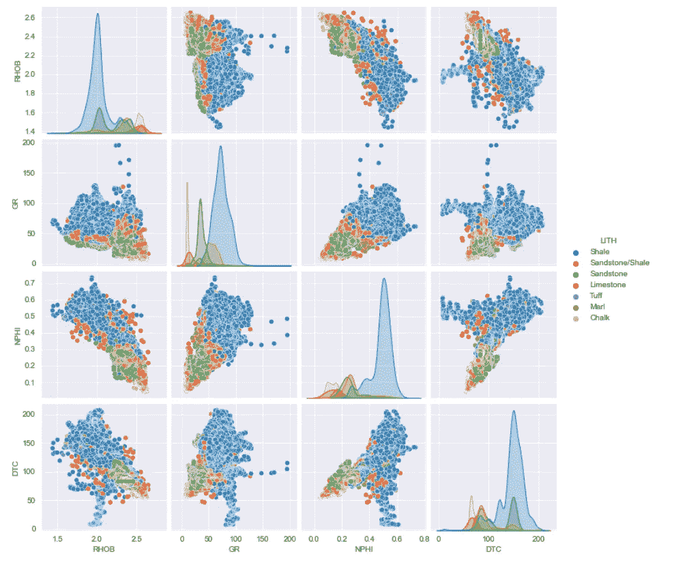

显示不同地质岩性的 Seaborn pairplot 示例。图片由作者提供。

俗话说，一图胜千言。

在这个简短的指南中，我们将介绍如何使用 [Seaborn](https://seaborn.pydata.org/index.html) 创建一个基本的 pairplot，并控制它的美学，包括图形大小和样式。

# 资料组

我们在本教程中使用的数据集是一个训练数据集的子集，该数据集用作 Xeek 和 FORCE 2020 *(Bormann et al .，2020)* 举办的机器学习竞赛的一部分。它是在挪威政府的 NOLD 2.0 许可下发布的，详细信息可以在这里找到:[挪威开放政府数据许可(NLOD) 2.0](https://data.norge.no/nlod/en/2.0/) 。

完整的数据集可以通过以下链接获得:[https://doi.org/10.5281/zenodo.4351155](https://doi.org/10.5281/zenodo.4351155)。

竞赛的目的是利用测井测量从现有的标记数据预测岩性。完整的数据集包括来自挪威海的 118 口井。

此外，您可以从 GitHub 资源库下载本教程中使用的数据子集以及笔记本:

[](https://github.com/andymcdgeo/Andys_YouTube_Notebooks)  

# Seaborn Pairplot 视频教程

我还发布了下面的视频，你可能会感兴趣。

# 导入库和数据

第一步是导入我们将要使用的库。在这种情况下，我们将使用 [Seaborn](https://seaborn.pydata.org/index.html) 和 [pandas](https://pandas.pydata.org) ，前者是我们的数据可视化库，后者将用于加载和存储我们的数据。

```
import seaborn as sns
import pandas as pd
```

为了设计 Seaborn 图的样式，我将样式设置为`darkgrid`

```
# Setting the stying of the Seaborn figure
sns.set_style('darkgrid')
```

接下来，我加载了一些来自 Force 2020 机器学习竞赛的测井数据，该竞赛侧重于从测井测量中预测岩性。如果您不熟悉这个数据集，请不要担心，因为我将要展示的内容可以应用于几乎任何其他数据集。

```
df = pd.read_csv('Data/Xeek_Well_15-9-15.csv')# Remove high GR values to aid visualisation
df = df[df['GR']<= 200]
```

除了加载数据，我还移除了 200 API 以上的伽马射线(GR)值，以帮助可视化这些数据。理想情况下，您应该在移除这些点之前检查这些点读数高的原因。

# 创建所有数据的 Seaborn Pairplot

现在数据已经加载完毕，我们可以开始创建我们的第一个 pairplot 了。为了获得数据集中所有数值变量的配对图，我们只需调用`sns.pairplot`并传入我们的 dataframe — `df`。

```
sns.pairplot(df)
```

一旦运行，我们会得到一个包含许多支线剧情的大图。

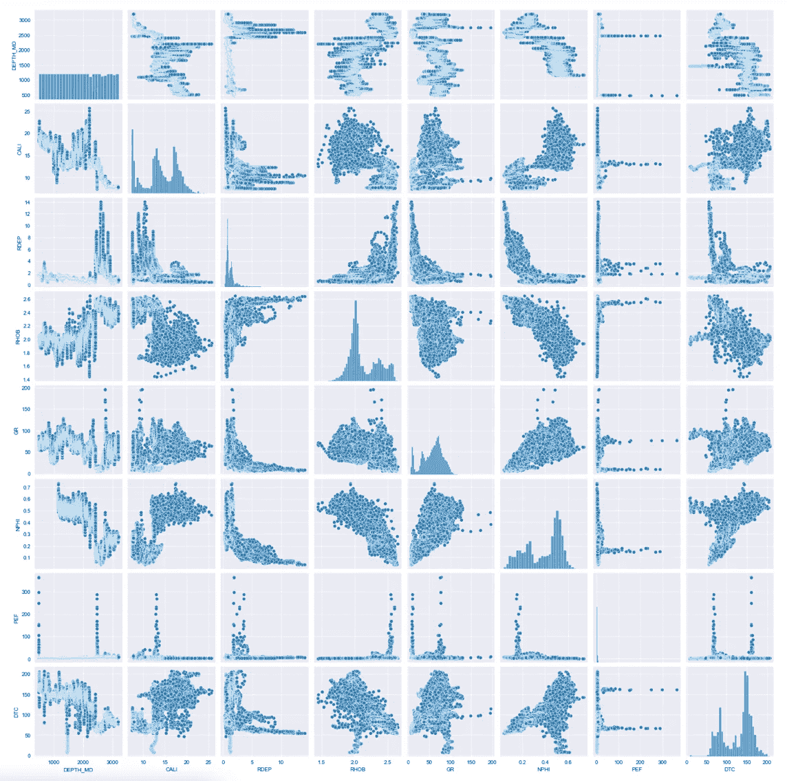

显示相关性和数据分布的测井测量的 seaborn pair 图。图片由作者提供。

如果我们仔细看看生成的图形，我们可以看到所有的变量都显示在 y 轴和 x 轴上。沿着对角线，我们有一个直方图显示每个变量的分布。

很快我们就有了一个单一的数字，可以用来提供我们数据集的一个很好的压缩摘要。

# 绘制特定列

如果我们只想显示数据框架中的一些变量，我们首先需要创建一个我们想要研究的变量列表:

```
cols_to_plot = ['RHOB', 'GR', 'NPHI', 'DTC', 'LITH']
```

在上面的例子中，我创建了一个新变量`cols_to_plot`，并把它赋给了一个包含`RHOB, GR, NPHI, DTC and LITH`的列表。其中前四个是数字，最后一个是分类，后面会用到。

然后，我们可以调用我们的 pairplot，并传递带有该列表的数据帧，如下所示:

```
sns.pairplot(df[cols_to_plot])
```

当我们运行这个时，我们得到一个更小的数字，其中只有我们感兴趣的变量。

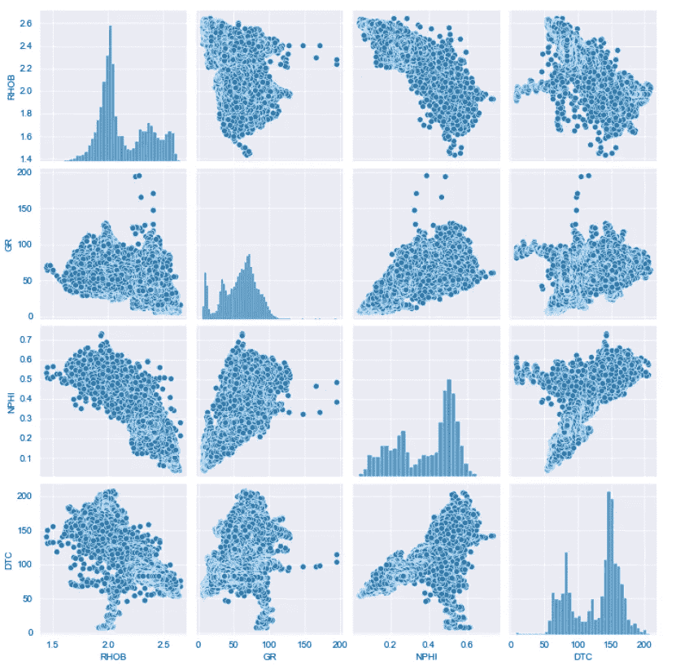

主数据框架中测井测量子集的 Seaborn Pairplot。图片由作者提供。

# 将对角线从直方图更改为 KDE

我们可以用核密度估计(KDE)代替沿对角线的直方图，这为我们提供了另一种查看数据分布的方式。

为此，我们只需添加关键字参数:`diag_kind`等于`kde`，如下所示:

```
sns.pairplot(df[cols_to_plot], diag_kind='kde')
```

这将返回下图:

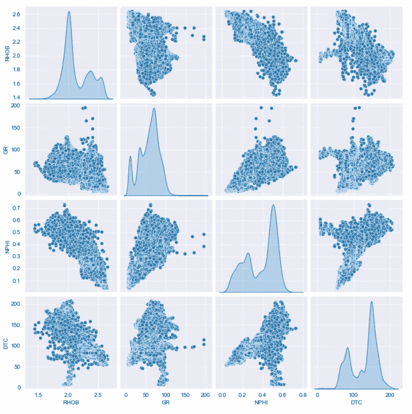

Seaborn pairplot 显示沿对角线的核密度估计图。图片由作者提供。

# 向散点图添加回归线

如果我们想确定散点图中的关系，我们可以应用线性回归线，只需添加关键字:`kind`并将其分配给`'reg'`即可。

```
sns.pairplot(df[cols_to_plot], kind='reg', diag_kind='kde')
```

当我们运行它时，我们现在会看到在每个散点图上都出现了一条部分线

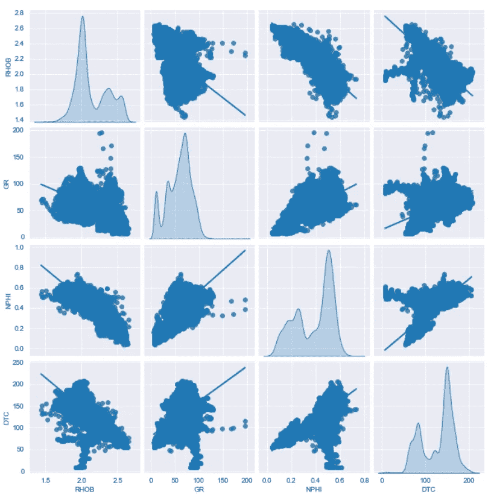

有回归线的 Seaborn pairplot。图片由作者提供。

然而，由于线的颜色和点的颜色是一样的，我们需要改变这一点，使其更加明显。

我们可以通过添加关键字`plot_kws`来做到这一点，然后我们需要传入一个字典，它将包含`line_kws`，然后为我们的`color`传递另一个字典对象，我们将它设置为红色。

```
# Use plot_kws to change regression line colour
sns.pairplot(df[cols_to_plot], kind='reg', diag_kind='kde',
             plot_kws={'line_kws':{'color':'red'}})
```

当我们运行代码时，我们会得到一个带有红线的 pairplot，这样更容易看到。

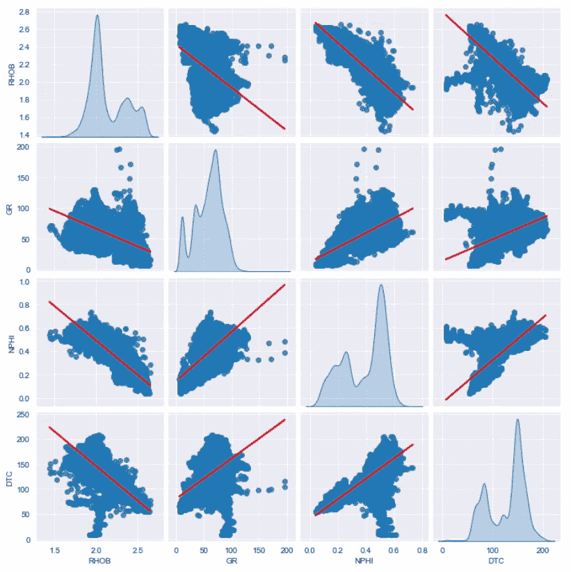

Seaborn pairplot 在改变颜色后带有回归线。图片由作者提供。

# 按类别着色

如果我们的数据框架中有一个分类变量，我们可以使用它来直观地增强图表，并查看每个类别的趋势和分布。

在这个数据集中，我们有一个名为 LITH 的变量，它代表从测井测量中识别的不同岩性。

如果我们使用数据帧的子集，我们需要确保`cols_to_plot`行包含我们想要用来给数据着色的变量。

要使用这个变量，我们所做的就是添加一个`hue`参数，并从我们的列表中传递`'LITH'`列，然后运行代码。

```
sns.pairplot(df[cols_to_plot], hue='LITH')
```

我们得到的是一个 pairplot，由该变量中的每个类别着色。


Seaborn pairplot 显示了不同的地质岩性。图片由作者提供。

如果我们仔细观察数据，我们会看到蓝色的页岩、绿色的砂岩和红色的石灰岩，从这些数据中我们可以获得一些见解。例如，我们看看页岩，我们可以看到在大约 100 API 处有一个 GR 变量的大峰，在大约 25 API 处有一个较小的粉红色峰。所以我们马上就能知道每种岩性的范围。

既然我们已经介绍了 pairplot 的基础知识，现在我们可以进入下一个层次，开始设计我们的绘图。

# 设计对角线图的样式

首先，我们将从改变对角线直方图的属性开始。我们可以通过使用`diag_kws`关键字并传入我们想要更改的内容的字典来更改对角线样式。

在这个例子中，我们将通过传入一个`color`关键字并将其设置为红色来改变颜色。

```
sns.pairplot(df[cols_to_plot], diag_kws={'color':'red'})
```

当我们运行这个时，我们得到如下的图:

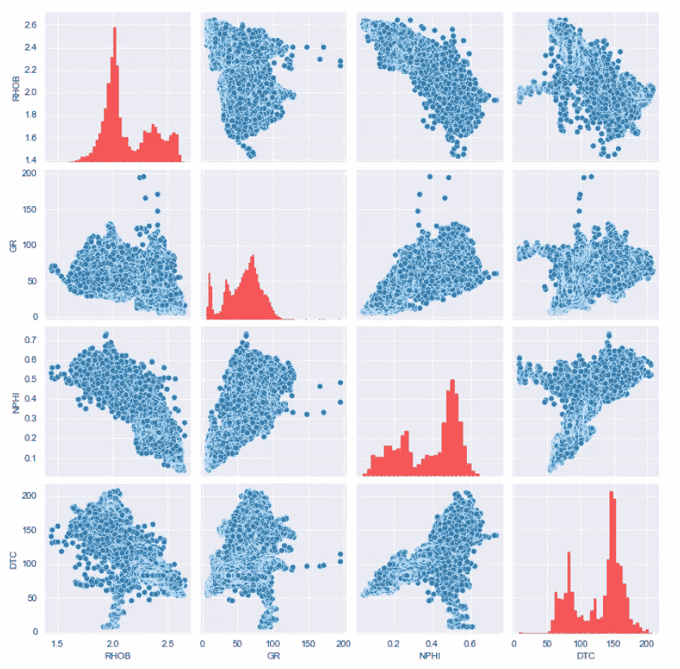

更改对角线直方图属性后的 Seaborn pairplot。图片由作者提供。

由于这是一个直方图，我们还可以更改显示的箱数。同样，这是通过传入包含我们想要更改的属性的字典来完成的，在本例中是`bins`。

我们将它设置为 5 并运行代码。

```
sns.pairplot(df[cols_to_plot], diag_kws={'color':'red', 'bins':5})
```

它返回这个数字，有五个箱，数据用红色表示。

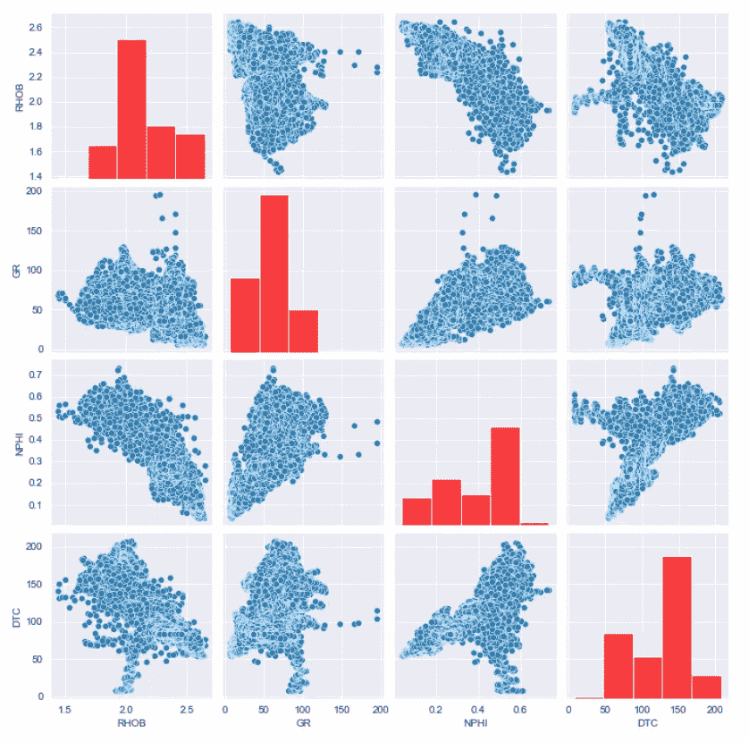

更改对角线直方图柱属性后的 Seaborn pairplot。图片由作者提供。

# 设计点的样式

如果我们想要样式化这些点，我们可以使用`plot_kws`关键字，并传入包含`color`的字典，我们将把它设置为绿色。

```
sns.pairplot(df[cols_to_plot], diag_kws={'color':'red'}, 
            plot_kws={'color':'green'})
```

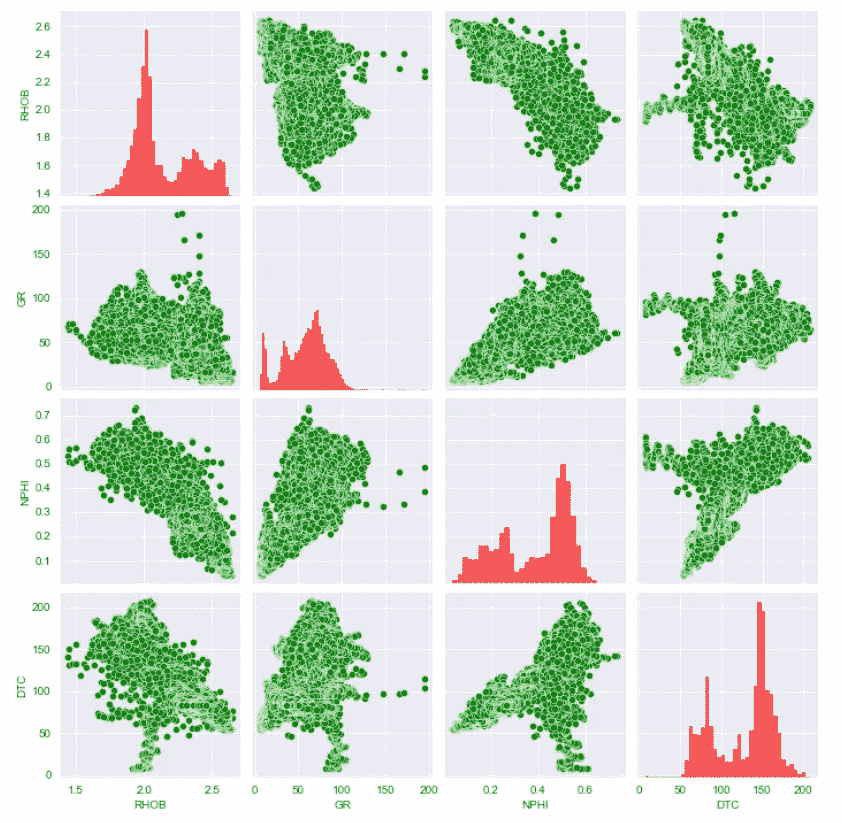

更改散点图颜色属性后的 Seaborn pairplot。图片由作者提供。

如果我们想改变点的大小，我们只需将关键字`s`添加到字典中。这将减少点的大小。

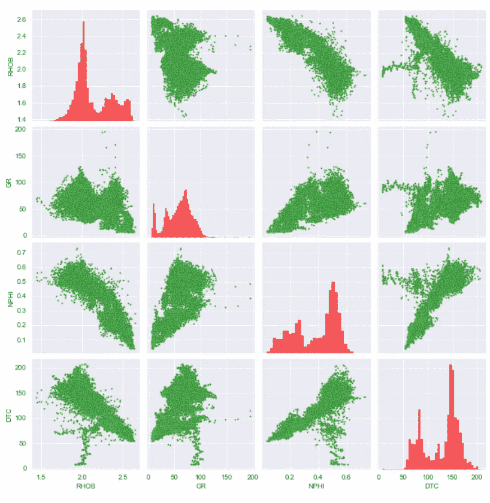

更改散点图大小属性后的 Seaborn pairplot。图片由作者提供。

# 更改 Seaborn Pairplot 图形大小

最后，我们可以通过添加关键字参数`height`以一种非常简单的方式控制图形的大小，在本例中，我们将该参数设置为 2。当我们运行这段代码时，我们会看到现在有一个小得多的图。

```
sns.pairplot(df[cols_to_plot], height=2)
```

我们也可以使用`aspect`关键字参数来控制宽度。默认情况下，它被设置为 1，但是如果我们将其设置为 2，这意味着我们将宽度设置为高度的两倍。

```
sns.pairplot(df[cols_to_plot], height=2, aspect=2)
```

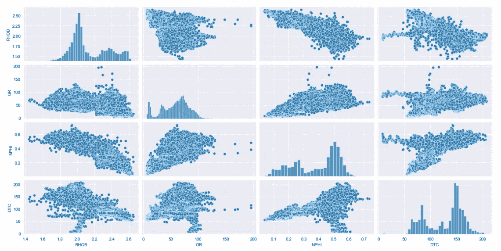

使用高度和纵横比更改图形大小后的 Seaborn pairplot。图片由作者提供。

# 摘要

Seaborn Pairplot 是一个很棒的数据可视化工具，可以帮助我们熟悉我们的数据。我们可以在单个图形上绘制大量数据，并获得对它的理解以及开发新的见解。这绝对是你的数据科学工具箱中的一块园地。

*感谢阅读。在你走之前，你一定要订阅我的内容，把我的文章放到你的收件箱里。* [***你可以在这里做！***](https://andymcdonaldgeo.medium.com/subscribe)**或者，您可以* [***注册我的简讯***](https://fabulous-founder-2965.ck.page/2ca286e572) *免费获取更多内容直接发送到您的收件箱。**

*其次，通过注册会员，你可以获得完整的媒介体验，并支持我自己和成千上万的其他作家。它每个月只花你 5 美元，你可以完全接触到所有令人惊叹的媒体文章，也有机会用你的写作赚钱。如果你用 [***我的链接***](https://andymcdonaldgeo.medium.com/membership)**报名，你直接用你的一部分费用支持我，不会多花你多少钱。如果你这样做了，非常感谢你的支持！***

# **参考**

**博尔曼，彼得，奥桑德，彼得，迪里布，法哈德，曼拉尔，投降，&迪辛顿，彼得。(2020).机器学习竞赛 FORCE 2020 井测井和岩相数据集[数据集]。芝诺多。[http://doi.org/10.5281/zenodo.4351156](http://doi.org/10.5281/zenodo.4351156)**