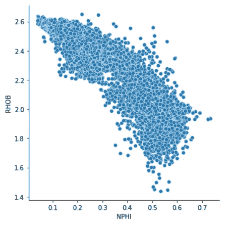
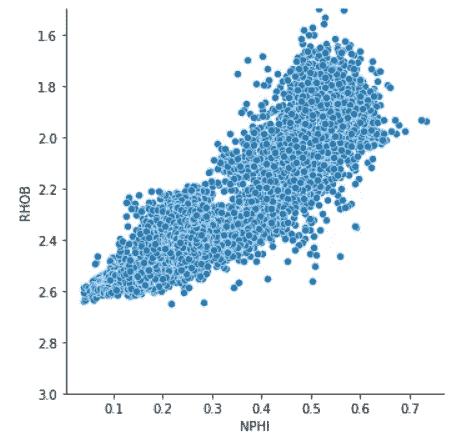
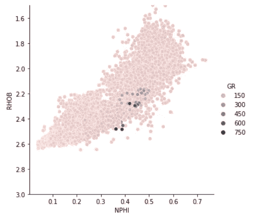
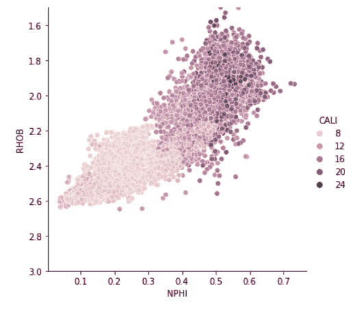
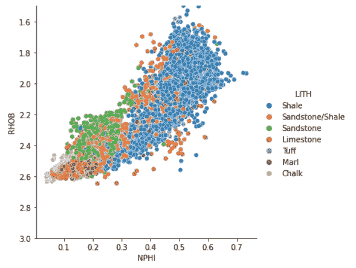
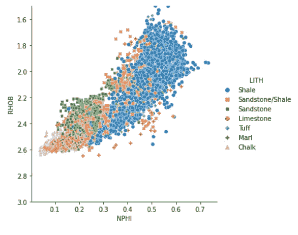
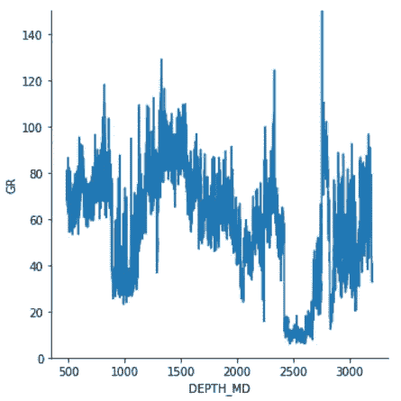
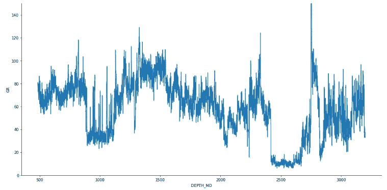
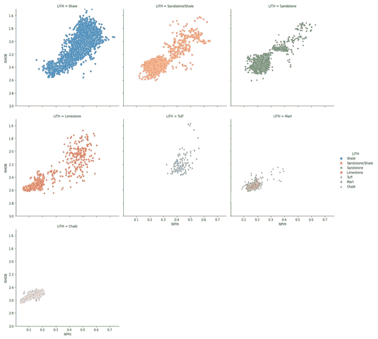
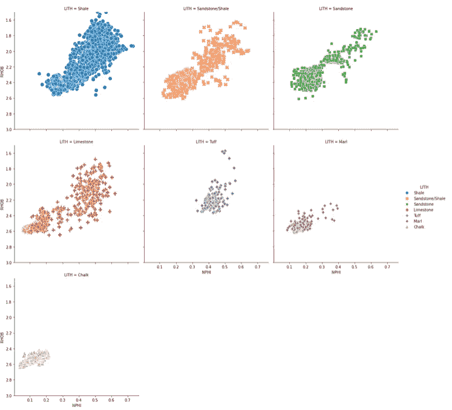

# Python 中的 Seaborn Relplot:可视化数据中的关系

> 原文：<https://towardsdatascience.com/seaborn-relplot-in-python-visualising-relationships-in-data-ee39138d53aa>

## 使用 Seaborn 的重新绘图可视化测井数据


照片由[沙哈达特·拉赫曼](https://unsplash.com/@hishahadat?utm_source=medium&utm_medium=referral)在 [Unsplash](https://unsplash.com?utm_source=medium&utm_medium=referral) 上拍摄

[Seaborn 关系图(relplot)](https://seaborn.pydata.org/generated/seaborn.relplot.html) 允许我们可视化数据集中的变量之间的关系。数据可视化是任何数据分析或机器学习工作流的重要组成部分。它可以让我们深入了解我们的数据。正如那句名言所说，“一幅画胜过千言万语”。

在这个简短的教程中，我们将了解如何使用来自 [Seaborn](https://seaborn.pydata.org/index.html) 的 [relplot 函数](https://seaborn.pydata.org/generated/seaborn.relplot.html)在散点图和线图上显示测井数据。

## 数据源

本教程的数据来源于以下 GitHub 知识库，并构成了旨在根据测井测量预测岩性的机器学习竞赛的一部分。

鲍曼，奥桑德，迪里布，迪辛顿，曼拉尔，2020。强制机器学习竞赛。[https://github . com/bolgebrygg/Force-2020-机器学习-竞赛](https://github.com/bolgebrygg/Force-2020-Machine-Learning-competition)

## 通过视频跟进

在我的 YouTube 频道上也有这篇文章的视频版本，你也可以在这里看到:

# 导入库和数据

项目的第一步是导入我们将要使用的库。这些是海豚和熊猫。Seaborn 允许我们用几行代码创建非常强大的图形，pandas 允许我们从 CSV 文件加载数据并将其存储在 dataframes 中。

```
import seaborn as sns
import pandas as pd
```

导入库之后，我们可以开始使用`pd.read_csv()`从 CSV 文件导入数据

```
df = pd.read_csv('Data/Xeek_Well_15-9-15.csv', na_values=-999)
```

# 使用 Relplot 创建散点图

现在数据已经加载，我们可以开始使用 Seaborn 的 Relplot 函数创建我们的第一个散点图。岩石物理学中常见的散点图是[中子孔隙度(NPHI)](https://wiki.seg.org/wiki/Dictionary:Neutron_log) 对[密度(RHOB)](https://wiki.seg.org/wiki/Dictionary:Density_log) 图。

```
g = sns.relplot(data=df, x='NPHI', y='RHOB');
```

当我们执行这段代码时，我们得到了一个非常简单的散点图，其中已经为我们分配了轴标签。



使用 seaborn rel 图创建的中子孔隙度与体积密度散点图。图片由作者提供。

使用中子-密度散点图时，我们通常以相反的顺序查看[密度](https://wiki.seg.org/wiki/Dictionary:Density_log)轴，因此孔隙度随着两个轴的增加而增加。

我们可以通过调用`g.set`，然后设置`ylim`参数来做到这一点。

```
g = sns.relplot(data=df, x='NPHI', y='RHOB')
g.set(ylim=(3, 1.5));
```

这将返回下面的图，在进行岩石物理分析时，该图看起来更有吸引力。



使用 seaborn rel 图创建的中子孔隙度与体积密度散点图。图片由作者提供。

# 定制散点图

## 用连续变量着色

Seaborn Relplot 允许我们指定多个参数来定制我们的绘图。其中之一是`hue`参数，它允许我们指定另一个变量来给我们的图着色。

在这个例子中，我们可以选择[伽马射线(GR)](https://wiki.seg.org/wiki/Dictionary:Gamma-ray_log_(GR)) 数据，这些数据可以用来指示我们地层的[泥质](https://wiki.seg.org/wiki/Dictionary:Shaliness)。

```
g = sns.relplot(data=df, x='NPHI', y='RHOB', hue='GR')
g.set(ylim=(3, 1.5));
```

当代码运行时，我们得到如下图。



中子孔隙度与体积密度的散点图，用伽马射线着色。使用 seaborn relplot 创建。图片由作者提供。

当我们看这个图时，我们可以看到我们有一个问题。由于异常高的值，该图似乎被洗掉了。

如果这些值被认为是真正的异常值，我们可能会从数据中删除它们，或者我们可以重新调整绘图。

我们经常绘制的另一个变量是井径(CALI)。这给了我们钻孔冲刷程度的指示。这一点很重要，因为与地层相比，如果读取更多的井内流体，许多测量可能会受到严重影响。

```
g = sns.relplot(data=df, x='NPHI', y='RHOB', hue='CALI')
g.set(ylim=(3, 1.5));
```

当我们执行这段代码时，我们可以看到生成了下面的图。从中我们可以看出，一些较低的 RHOB 和较高的 NPHI 读数要么来自钻孔的冲刷部分，要么是在较大井段获得的。对卡尺曲线和位尺寸曲线的进一步研究将揭示哪一个是最可能的情况。



中子孔隙度与体积密度的散点图，用测径器着色。使用 seaborn relplot 创建。图片由作者提供。

## 用离散变量着色

除了用连续特征着色，我们还可以用分类特征着色。在这个例子中，我们将看到[体积密度(RHOB)](https://wiki.seg.org/wiki/Dictionary:Density_log) 和[中子孔隙度(NPHI)](https://wiki.seg.org/wiki/Dictionary:Neutron_log) 如何随着不同的地质岩性(LITH)而变化。

在这个例子中，我们只是简单地将`LITH`列放在`hue`参数中。

```
g = sns.relplot(data=df, x='NPHI', y='RHOB', hue='LITH')
g.set(ylim=(3, 1.5));
```

从返回的图中，我们可以看到页岩(蓝色)具有高的[中子孔隙度](https://wiki.seg.org/wiki/Dictionary:Neutron_log)和大范围的[体积密度](https://wiki.seg.org/wiki/Dictionary:Density_log)值。我们还可以看到其他岩性以及与测量值相关的落差。



中子孔隙度与体积密度的散点图，由岩相着色。使用 seaborn relplot 创建。图片由作者提供。

## 设定标记的样式

除了能够控制每种岩性的色调，我们还可以通过将`LITH`传递给`style`参数来改变样式。

```
g = sns.relplot(data=df, x='NPHI', y='RHOB', hue='LITH', style='LITH')
g.set(ylim=(3, 1.5));
```

在返回的地块上，我们现在可以利用颜色和形状来识别不同的岩性。如果图表是黑白打印的，这尤其有用。



中子孔隙度与体积密度的散点图，由岩相着色。使用 seaborn relplot 创建。图片由作者提供。

# 线形图

relplot 不仅限于散点图，我们还可以生成线图。我们所要做的就是将参数`kind='line’`添加到 [relplot](https://seaborn.pydata.org/generated/seaborn.relplot.html) 调用中。

```
g = sns.relplot(data=df, x='DEPTH_MD', y='GR', kind='line')
g.set(ylim=(0, 150));
```

使用深度测量和伽马射线特征(GR ),我们可以生成一个非常简单的数据与深度的对数图。



Seaborn relplot 用于绘制伽马射线与深度的线形图。图片由作者提供。

## 用高度和纵横比设置图形大小

上面的图看起来有点压扁，很难看出发生了什么。在 [seaborn](https://seaborn.pydata.org/index.html) 中有多种方法可以改变图形的大小，在 [relplot](https://seaborn.pydata.org/generated/seaborn.relplot.html) 中最方便的方法就是这样指定一个`height`和一个`aspect`。

在这个例子中，高度设置为 7，宽度将是它的 2 倍。

```
g = sns.relplot(data=df, x='DEPTH_MD', y='GR', kind='line', height=7, aspect=2)
g.set(ylim=(0, 150));
```

这允许我们像这样延伸我们的情节。



Seaborn relplot 用于绘制伽马射线与深度的线形图。图片由作者提供。

# 将图形分割成支线剧情/小平面

如上图所示，当不同类别(岩性)相互重叠时，很难区分它们。解决这个问题的一个方法是创建多个子情节，每个类别一个(岩性)。

有了[重新绘图](https://seaborn.pydata.org/generated/seaborn.relplot.html)，这变得非常容易。我们简单地通过一个新的论点叫做`col='LITH'`。

```
g = sns.relplot(data=df, x='NPHI', y='RHOB',
           hue='LITH',
           style='LITH',
           col='LITH')
g.set(ylim=(3, 1.5));
```

当我们运行它时，我们得到了下面的一系列散点图，所有的都是相同的比例，并按我们的类别(岩性)分开。然而，由于我们有几个类别，不放大很难看到。


使用 seaborn relplot 创建多个支线剧情。图片由作者提供。

## 包装列

为了使图更具可读性，我们可以应用一个列换行值。一旦达到该值，绘图将创建一个新行，并继续下一个类别。

这是通过传入`col_wrap=3`实现的。这个数字可以是您想要的任何数字，但是 3 在这个例子中非常适用。

```
#Wrapping the columnsg = sns.relplot(data=df, x='NPHI', y='RHOB',
           hue='LITH',
           style='LITH',
           col='LITH',
           col_wrap=3)
g.set(ylim=(3, 1.5));
```

现在我们的 [relplot](https://seaborn.pydata.org/generated/seaborn.relplot.html) 可读性更好，也更容易解释。



使用 seaborn relplot 创建多个支线剧情。图片由作者提供。

## 更改磅值

如果我们想要增加点的大小，我们可以通过在 [relplot](https://seaborn.pydata.org/generated/seaborn.relplot.html) 调用中为标记大小参数传递一个值:`s=100`来实现。

```
#Changing size of pointsg = sns.relplot(data=df, x='NPHI', y='RHOB',
           hue='LITH',
           style='LITH',
           col='LITH', col_wrap=3, 
           s=100)
g.set(ylim=(3, 1.5));
```

当我们运行这个时，我们可以看到我们现在有了更大的点，从而使图形更具可读性。



使用 seaborn relplot 创建多个支线剧情。图片由作者提供。

# 摘要

在这个简短的教程中，我们看到了如何使用强大的 Seaborn [relplot](https://seaborn.pydata.org/generated/seaborn.relplot.html) 在散点图和线图上可视化测井数据，而无需分别调用它们。这可以使我们的代码更整洁，更容易阅读。 [relplot](https://seaborn.pydata.org/generated/seaborn.relplot.html) 还允许我们将数据分类，或者用连续或离散数据给点着色。

*感谢阅读。在你走之前，你一定要订阅我的内容，把我的文章放到你的收件箱里。* [***你可以在这里做！***](https://andymcdonaldgeo.medium.com/subscribe)

其次，通过注册会员，你可以获得完整的媒介体验，并支持我自己和成千上万的其他作家。它每个月只花你 5 美元，你可以完全接触到所有令人惊叹的媒体文章，也有机会用你的写作赚钱。如果你用 [***我的链接***](https://andymcdonaldgeo.medium.com/membership) ***，*** *报名，你会直接用你的一部分费用支持我，不会多花你多少钱。如果你这样做了，非常感谢你的支持！*