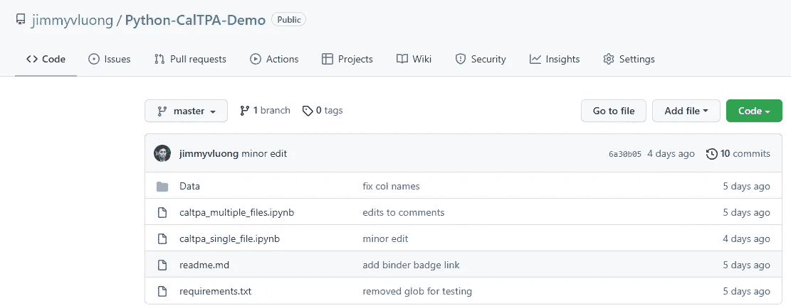
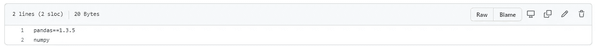
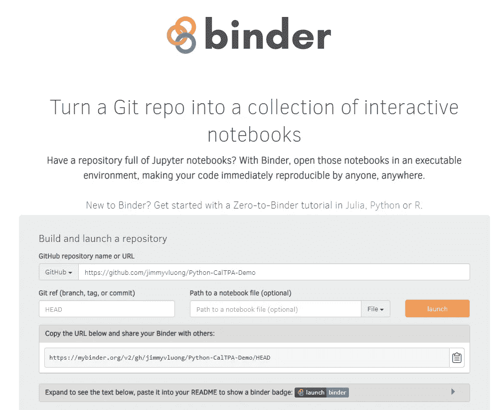
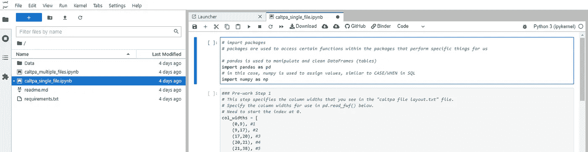

# 使用 Binder 与同事无缝共享编码演示

> 原文：<https://towardsdatascience.com/seamlessly-share-coding-demos-to-colleagues-using-binder-bbea9a823505>

## 在云端共享 Jupyter 笔记本的无缝方式。

有 Jupyter 笔记本可以分享吗？分享给 Binder！萨凡纳·维克菲尔德在 [Unsplash](https://unsplash.com/s/photos/binder?utm_source=unsplash&utm_medium=referral&utm_content=creditCopyText) 上拍摄的照片

一位同事最近问我如何在日常工作流程中使用脚本语言来清理和准备数据。她感兴趣的是向她的团队展示采用脚本语言可以如何使她的团队受益，并帮助他们自动化一些目前在 Excel 中执行的任务。

我选择使用[活页夹](https://mybinder.org/)来展示他们可以节省多少时间，以及如何通过使用 Python 来清理他们的数据，使他们的流程更不容易出错。下面以案例研究的形式介绍了这一点。

> 拥有一个装满 Jupyter 笔记本的存储库？使用 Binder，在一个可执行的环境中打开这些笔记本，让任何人、任何地方都可以立即复制您的代码。—mybinder.org

本文的目标是讨论 Binder 的优点和使用案例！

您还可以选择:

*   使用 Python 的一些数据清理技术
*   与同事分享你所学的灵感

您可以将 Binder 用于许多不同的语言，比如 Julia、Python 或 r。

> **注:**在云端运行 Jupyter 笔记本有很多免费选择。来自数据学校的凯文·马卡姆在讨论每个选项的利弊方面做得很好。我选择 Binder 是因为我希望我的用户不必创建帐户或与商业工具交互。下面的案例研究也是一个轻量级应用程序，没有性能考虑或敏感数据。

**使用活页夹的好处**

*   在网络浏览器中轻松共享交互式 Jupyter 笔记本
*   机器上不需要安装 Julia、Python 或 R
*   与 git 一起运行，因此它受益于版本控制

**我个人的活页夹使用案例**

1.展示脚本语言或方法的实用性和有用性

2.讲授环境和包或库的版本的重要性

3.与同事分享知识

4.构建我的数据科学投资组合，逐步演示我如何进行分析案例研究

你还能想到更多的用例吗？请在评论中分享！

**装订要求:**

一个可用的准系统绑定器服务需要一个 Github repo:

1.  Jupyter 笔记本，也就是代码将运行的. ipynb 文件
2.  一个 **requirements.txt 文件**，包含运行代码所需的 Python 依赖项(。yaml 文件也是可用的)
3.  【可选】**数据文件**或包含数据的文件夹
4.  [可选]一个 **readme.md** 文件(包括良好实践)

**案例分析:**

加州州立大学系统的一些分析师希望了解在清理一些标准化学生评估数据时，使用 Python 或 R 等语言如何帮助他们节省时间。我用样本评估数据模拟了一个活页夹，并展示了 Python 如何节省大量时间，否则这些时间将花费在加载和操作 Excel 中的数据上。我在这里浏览这个例子。请看下面的互动活页夹！

 [## GitHub:jimmyvluong/Python-CalTPA-Demo/HEAD

### 单击运行此交互式环境。来自活页夹项目:可复制、可共享、交互式计算…

mybinder.org](https://mybinder.org/v2/gh/jimmyvluong/Python-CalTPA-Demo/HEAD) 

**目标:**

此任务的最终目标是将评估数据读入这些分析师正在使用的数据库中。幸运的是，所有分析师都要求数据采用完全相同的格式。

**数据背景:**

样本评估数据。如果纯粹在 Excel 中完成，这将需要在每次读入数据时指定每个列宽。对于 22 个校园中的每一个，每年至少有 20 多个文件需要处理。

文件夹中的多个文件包含没有数据错误的学生评估数据。该文件夹包含一个指定字段名称和字段宽度的自述文件。

**方法:**

读入文件，将它们组合成一个单一的数据帧，然后将数据帧调整成最终所需的结构。我不会在这里深入讨论这些方法，但是你可以[运行 Binder](https://mybinder.org/v2/gh/jimmyvluong/Python-CalTPA-Demo/HEAD) 中的代码来查看工作流程。

对 github repo 进行 Binderize 所需要的一切。最起码，您需要一个包含要运行的代码的. ipynb 和一个包含所需依赖项的 requirements.txt 文件。

看一下 requirements.txt 文件。只需要 2 个依赖项。熊猫版是指定的。Binder 会自动下载 numpy 的最新版本。

一旦你的 github 回购被创建，只需将回购的 URL 粘贴到 mybinder.org 网站的第一行，如下所示:

然后，您可以使用创建的 URL 共享活页夹！

Binder 将需要几分钟时间启动，然后生成一个交互式工作区，如下所示:

一个工作，互动 Jupyter 笔记本，所有必需的文件和依赖关系。呜哇！

**结果:**

我的同事欣喜若狂地看到这一评估数据可以被操纵得如此之快！我们将在接下来的几周会面，讨论如何从 Excel 跳到 Python。

由于这个演示取得了成功，我联系了加州州立大学系统的其他分析师和数据科学家，看看我们可以互相学习什么。我预计我们会非常频繁地使用 Binder

> 如果你想提升自己，那就提升别人。