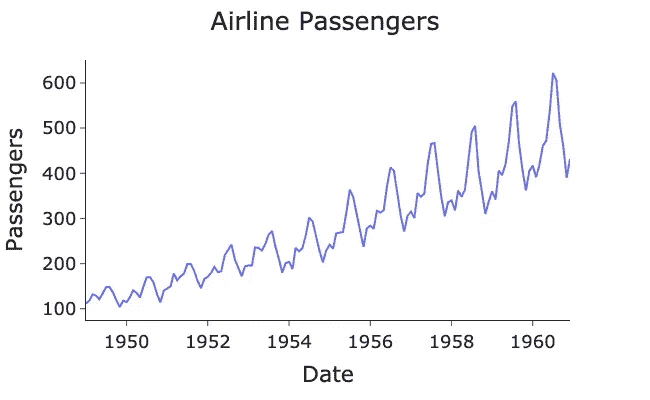
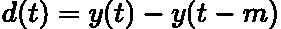
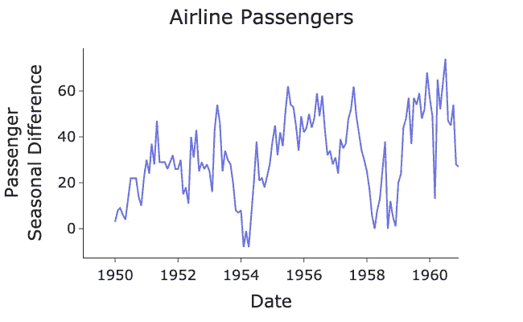

# 时间序列的季节性

> 原文：<https://towardsdatascience.com/seasonality-of-time-series-5b45b4809acd>

## 对季节性如何影响时间序列分析的直觉


杰克·希尔斯在 [Unsplash](https://unsplash.com?utm_source=medium&utm_medium=referral) 上的照片

# 介绍

[**季节性**](https://otexts.com/fpp2/tspatterns.html) 是 [**时间序列**](https://en.wikipedia.org/wiki/Time_series) 分析的一个重要方面。由于时间序列在时间上是向前索引的，它们会受到季节波动的影响。例如，我们预计冰淇淋销售额在夏季较高，在冬季较低。

季节性可以在不同的时间间隔出现，如几天、几周或几个月。时间序列分析的关键是了解季节性如何影响我们的序列，从而使我们对未来做出更好的预测。

在本帖中，我们将回顾一个季节性数据的例子，然后展示如何删除它。我们想要删除它的原因是为了使我们的时间序列 [**平稳**](https://www.itl.nist.gov/div898/handbook/pmc/section4/pmc442.htm) ，这是大多数预测模型的要求。如果你想了解更多关于平稳性的知识，请点击这里查看我以前的帖子:

[](/time-series-stationarity-simply-explained-125269968154)  

# 观看季节性

我们可以在下图中观察到 1948-1960 年间美国航空客运量的季节性:

> 数据[来源于拥有 CC0 许可证的 Kaggle](https://www.kaggle.com/datasets/ashfakyeafi/air-passenger-data-for-time-series-analysis) 。

作者代码要点。



作者用 Python 生成的图。

数据按月索引，我们可以清楚地看到每年的季节性模式，乘客数量在夏季达到高峰。随着时间的推移，乘客数量也呈现出超常规增长的趋势。

# 消除季节性

我们可以使用 [**差分**](https://www.statistics.com/glossary/differencing-of-time-series/) **，**来消除数据中的季节性，它计算当前值与前一个季节的值之间的差异。这样做的原因是为了使时间序列稳定，使其统计特性随时间保持不变。当我们处于特定的季节时，季节性会导致时间序列的平均值不同。因此，它的统计特性不是恒定的。

季节性差异在数学上被描述为:



作者在 LaTeX 中生成的方程。

其中 ***d(t)*** 为时间 ***t*** ， ***y(t)*** 为序列在 ***t*** ， ***y(t-m)*** 为上一季数据点的值 ***m* 在我们的例子中 ***m=12*** ，因为我们有每年的季节性。**

我们可以使用 pandas[**diff()**](https://pandas.pydata.org/docs/reference/api/pandas.DataFrame.diff.html)方法计算季节差异并绘制出结果序列:

作者代码要点。



作者用 Python 生成的图。

每年的季节性现在已经消失了，然而我们现在观察到一些 [**周期**](https://otexts.com/fpp2/tspatterns.html) 。这是另一个共同的特征时间序列，类似于季节性，但通常是在一个更长的时间尺度上，如这里所观察到的。

我们可以使用**扩展的 Dickey-Fuller (ADF)测试来测试结果序列是平稳的。****本检验的零假设是序列是非平稳的。 [statsmodels](https://www.statsmodels.org/dev/generated/statsmodels.tsa.stattools.adfuller.html) 包提供了执行 ADF 测试的功能:**

**作者代码要点。**

**输出:**

```
ADF Statistic:  -3.3830207264924805
P-Value:  0.011551493085514982
Critical Values:
        1%: -3.48
        5%: -2.88
        10%: -2.58
```

**[**P 值**](https://www.scribbr.com/statistics/p-value/) 低于 **5%** 和 **10%** 阈值，但高于 **1%** 阈值。因此，根据你的显著性水平，我们可以从统计上确认或否认我们的序列是平稳的。**

**我们还可以执行一些进一步的规则差分(相邻值之间的差)来进一步降低 P 值。然而，在这种情况下，我认为数据足够稳定，因为它低于 **5%** 阈值。**

**稳定方差也是最佳实践，因为这是平稳性的条件之一。为了实现这一点，我们本来可以使用 [**框考克斯变换**](https://en.wikipedia.org/wiki/Power_transform) **。如果你想了解更多关于稳定方差的知识，请查阅我以前的文章:****

**[](/box-cox-transform-for-time-series-cc45f26082c6)  

# 最后的想法

在这篇文章中，我们已经展示了什么是季节性，以及它看起来像什么。我们可以通过差分来消除季节性，并使用 ADF 检验来确认结果序列是否平稳。

本文的完整 Python 脚本可以在我的 GitHub 中找到:

[](https://github.com/egorhowell/Medium-Articles/blob/main/Time%20Series/Time%20Series%20Tools/seasonality.py)  

# 参考资料和进一步阅读

*   *预测:原理与实践:*[https://otexts.com/fpp2/](https://otexts.com/fpp2/)
*   [https://people . duke . edu/~ rnau/decision 411 _ 2007/class 10 notes . htm](https://people.duke.edu/~rnau/Decision411_2007/Class10notes.htm)

# 和我联系！

*   要在媒体上阅读无限的故事，请务必在此注册！T17*💜*
*   [*要想在我发帖注册时得到更新的邮件通知就在这里！*](/subscribe/@egorhowell) 😀
*   [*LinkedIn*](https://www.linkedin.com/in/egor-howell-092a721b3/)*👔*
*   *[*推特*](https://twitter.com/EgorHowell) 🖊*
*   *[*github*](https://github.com/egorhowell)*🖥**
*   **[](https://www.kaggle.com/egorphysics)**🏅****

> ***(所有表情符号都是由 [OpenMoji](https://openmoji.org/) 设计的——开源的表情符号和图标项目。执照: [CC BY-SA 4.0](https://creativecommons.org/licenses/by-sa/4.0/#)*****