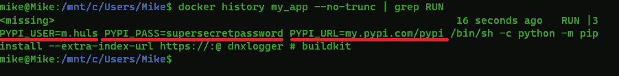
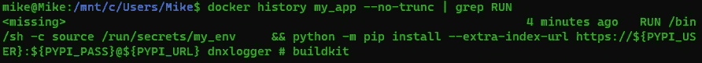

# 使用 Docker 机密保护您的 Docker 图像

> 原文：<https://towardsdatascience.com/secure-your-docker-images-with-docker-secrets-f2b92ec398a0>

## 添加 docker 秘密，以防止您的 docker 图像泄露密码


用秘密锁住你的 Docker 图片(图片由 [olieman.eth](https://unsplash.com/@moneyphotos) 在 [Unsplash](https://unsplash.com/photos/RcvQHQB9zgA) 上提供)

当您将机密信息泄漏到 docker 文件中时，您就将您的映像暴露给了各种攻击者，他们可以窃取您的凭据、控制您的容器，或者将恶意代码注入到您的容器中。这篇文章的重点是为您的 Dockerfile *提供机密信息，而不要在生成的图像中留下任何痕迹。*

当您按照本文中的简单步骤操作时，您的映像中不会有任何机密信息。我们将讨论一个完整的示例，最后您将获得一个实现该解决方案的完整 Dockerfile 文件。我们来编码吧！

***TL；博士？*** *向下滚动到“正确的方式——docker 的秘密”* ***不熟悉 Docker？*** *查看* [***此文***](https://mikehuls.medium.com/docker-for-absolute-beginners-what-is-docker-and-how-to-use-it-examples-3d3b11efd830)

## 我们在解决什么问题？

有时，您需要为 Dockerfile 提供像 API 密钥、凭证或证书这样的机密信息，例如 git 克隆一个私有存储库。

我们需要提供这些信息，而不是将其“烘焙”到图像中。如果您将凭证硬编码到 docker 文件中，或者将您的`.env`文件复制到映像中，那么您的映像就会被滥用；例如，攻击者可以提取您的凭证或获得对您的容器的访问权限。即使您在 docker 文件中使用了某个文件后将其删除；它仍然存在于图像层中，我们稍后会发现。

## 解决方案:码头工人的秘密

Docker secrets 允许您在 Docker 文件中使用机密信息，而不会留下任何痕迹。我们将在下一节探讨这是如何工作的以及为什么工作。首先，我们将设置我们的演示。

# 安装演示

对于本文，我们有一个真正简单的应用程序:`myapp.py`，它只包含一行代码:`print('hello’)`。当我们对这个脚本进行 Dockerize 化时，我们的 Dockerfile 可能如下所示:

*如果上面的 docker 文件你似乎不熟悉，请先阅读* [***这篇文章***](https://mikehuls.medium.com/docker-for-absolute-beginners-what-is-docker-and-how-to-use-it-examples-3d3b11efd830) *关于 docker 的基础知识。*

我们将使用`docker build . -t "my_app"`构建图像，并使用`docker run my_app`运行容器。这只是在[命令行](https://mikehuls.medium.com/terminals-consoles-command-line-for-absolute-beginners-de7853c7f5e8)上打印“hello”。太好了！一切正常。来介绍一下我们的问题。

## 添加私人内容

假设我们的 python 应用程序想要使用我们放在私有 pypi 上的名为`privatestuff`的包。我们可以用下面的 pip 命令安装这个包。

我们如何在 docker 文件中安装这个包？

## 不好的方法——硬编码

您可能想到的第一件事就是将您的凭证硬编码到 docker 文件中。千万别这样，这只是自找麻烦。

如你所见，我们只在第 4 行增加了一行。在这里，我们指定要安装来自`my.pypicom/pypi`的`privatestuff`包。除了将凭证放入我们的映像中，我们还将它们公开给每个有权访问 docker 文件的人。想象一下把这个项目(包含这个 Dockerfile)推给 github 每个人都可以看到您的凭据！

## 也是不好的方法——构建参数

尽管这看起来是个不错的选择，但它也非常糟糕。查看扩充的 Dockerfile 文件:

如您所见，我们需要三个参数，我们将通过下面的命令提供这些参数:

这将把参数传递给我们的 docker 文件，但是很容易从图像的层中提取它们。当我们检查 docker 图像的历史时，我们甚至可以看到这些值:

上面的命令在我们的映像(名为“my_app”)的 docker 历史中进行搜索。我们用 grep 提取包含单词 PYPI_PASS 的所有文本行。这会以纯文本形式向我们显示我们的凭据！



Docker 历史将显示您的构建参数(图片由作者提供)

## 稍微好一点，但仍然不好—使用和删除文件

您可能会想到复制并删除带有凭据的 a 文件。在下面的例子中，我们复制了`.netrc`；pip 将使用该文件中的凭证。然后我们再次删除文件。

[https://gist . github . com/Mike-huls/79633 DD 8 ef 466d 040 f 8 c 7c 97 B1 D1 CD 22](https://gist.github.com/mike-huls/79633dd8ef466d040f8c7c97b1d1cd22)

在 Docker 中，删除文件实际上并不会将它从映像中删除。因为 Docker 兑现了它的层；所有以前的层仍然存在于图像中。这意味着恶意用户可以轻松提取您的`.netrc`文件。


照片由[蒂姆·莫斯霍尔德](https://unsplash.com/@timmossholder?utm_source=medium&utm_medium=referral)在 [Unsplash](https://unsplash.com?utm_source=medium&utm_medium=referral) 上拍摄

# 正确的方法——码头工人的秘密

我们将通过这里的方法不仅是唯一安全的，而且非常容易实现！因为我是`.env`文件的忠实粉丝，所以我们将在这个例子中使用一个。使用机密有三个简单的步骤:

## 1.创建一个。环境文件

很简单。我们创建一个名为`.env`的文件，并赋予它以下内容:

```
PYPI_URL=my.pypi.com/pypi
PYPI_USER=m.huls
PYPI_PASS=supersecretpassword
```

*更多信息在使用环境文件* [***这里***](https://mikehuls.medium.com/keep-your-code-secure-by-using-environment-variables-and-env-files-4688a70ea286) ***。*** *更多关于用 Docker* [***使用 env 变量文件的信息在这里***](https://mikehuls.medium.com/a-complete-guide-to-using-environment-variables-and-files-with-docker-and-compose-4549c21dc6af) *。*

## 2.定义我们的 docker 构建命令

我们使用这个命令来构建我们的映像。在这里，我们将步骤 1 中的文件作为秘密传递给 docker files*。*

```
docker build -t "my_app" --secret id=my_env,src=.env .
```

你可以看到上面的命令:加载`.env`文件，并给它一个名为`my_env`的键。我们可以在下一步使用这个键来访问`.env`。

## 3.修改 Dockerfile，以便它装载机密

这里我们获取并使用我们在`docker build`命令中传递的文件:

如你所见，我们只是在 docker 文件中添加了一行额外的代码。我们`mount` a `secret`指定 id `my_env`(我们已经在步骤 2 中指定了)。接下来我们将`source`的内容作为变量加载到`.env`中。这就是为什么我们可以使用 pip 安装中指定的——extra-index-URL 中的变量。

这种方法的美妙之处在于，`.env`文件的内容只能在引用它的`RUN`命令中访问。这就是为什么我们必须使用`&&`将支架和 pip 安装在一起。RUN 命令完成后，秘密被丢弃，容器中不会留下任何存在的证据。Docker 历史也不会包含任何信息，如下所示。



# 额外收获:这也是一个正确的方法，但更难实现

您也可以使用两阶段构建；这将首先在一个阶段建立你的形象，然后只复制相关的东西到最后一个，留下所有不需要的信息，包括证书等。查看 [**这篇文章**](https://mikehuls.medium.com/using-multi-stage-builds-to-make-your-docker-image-almost-10x-smaller-239068cb6fb0) 了解 Docker 中多阶段构建的更多信息。

# 结论

在这篇文章中，我们已经经历了 3 种不处理 docker 图像中的秘密的方法和一种更简单、正确、安全的方法。硬编码凭证是非常愚蠢的，build-args 不会救你，甚至删除图像中的凭证文件也会在删除后留在层中。

Docker secrets 是一种非常安全且易于使用的机密信息，一旦使用，就可以将其删除。通过这篇文章，我希望你的 docker 图片更加安全。如果您有建议/澄清，请评论，以便我可以做出改进。同时，看看我的 [**其他关于各种编程相关主题的文章**](http://mikehuls.com/articles) ，比如:

*   [Docker 适合绝对初学者](https://mikehuls.medium.com/docker-for-absolute-beginners-what-is-docker-and-how-to-use-it-examples-3d3b11efd830)
*   [Docker 为绝对初学者编写](https://mikehuls.medium.com/docker-compose-for-absolute-beginners-how-does-it-work-and-how-to-use-it-examples-733ca24c5e6c)
*   [把你的代码变成一个真正的程序:使用 Docker 打包、运行和分发脚本](https://mikehuls.medium.com/turn-your-code-into-a-real-program-packaging-running-and-distributing-scripts-using-docker-9ccf444e423f)
*   [创建并发布自己的 Python 包](https://mikehuls.medium.com/create-and-publish-your-own-python-package-ea45bee41cdc)
*   [创建您的定制私有 Python 包，您可以从您的 Git 库 PIP 安装该包](https://mikehuls.medium.com/create-your-custom-python-package-that-you-can-pip-install-from-your-git-repository-f90465867893)
*   [Python 中的高级多任务处理:应用线程池和进程池并进行基准测试](https://mikehuls.medium.com/advanced-multi-tasking-in-python-applying-and-benchmarking-threadpools-and-processpools-90452e0f7d40)
*   写你自己的 C 扩展来加速 Python x100
*   【Cython 入门:如何在 Python 中执行>每秒 17 亿次计算
*   [用 FastAPI 用 5 行代码创建一个快速自动归档、可维护且易于使用的 Python API](https://mikehuls.medium.com/create-a-fast-auto-documented-maintainable-and-easy-to-use-python-api-in-5-lines-of-code-with-4e574c00f70e)

编码快乐！

—迈克

页（page 的缩写）学生:比如我正在做的事情？[跟我来](https://mikehuls.medium.com/membership)！

[](https://mikehuls.medium.com/membership) [## 通过我的推荐链接加入 Medium—Mike Huls

### 作为一个媒体会员，你的会员费的一部分会给你阅读的作家，你可以完全接触到每一个故事…

mikehuls.medium.com](https://mikehuls.medium.com/membership)