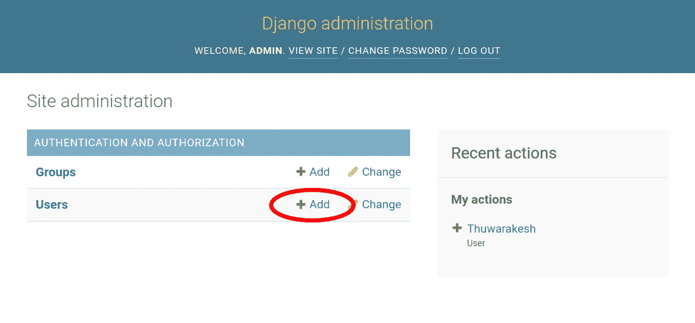
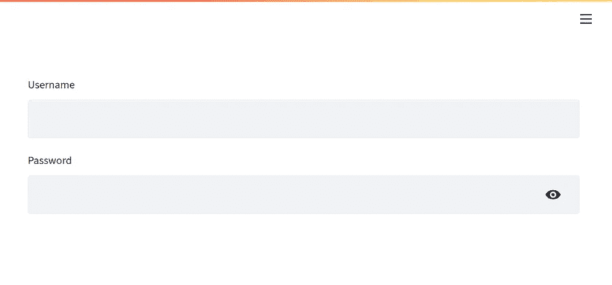
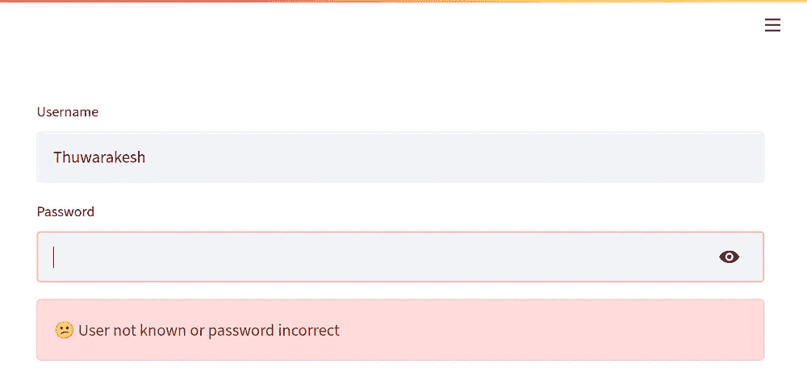

# 使用 Django 保护您的 Streamlit 应用

> 原文：<https://towardsdatascience.com/secure-your-streamlit-app-with-django-bb0bee2a6519>

## 围绕你的机器学习 web 应用建立一个灵活的认证系统


使用 Django 认证系统保护 Streamlit 应用程序。——照片由来自 [Pexels](https://www.pexels.com) 的蒂姆[莫斯霍尔德](https://www.pexels.com/photo/black-and-white-wooden-sign-behind-white-concrete-3690735/)拍摄

对于数据科学家来说，Streamlit 是一个将他们的工作转化为网络应用的优秀工具。

在之前的一篇文章中，我讨论了围绕 [K-Means](/running-election-campaigns-with-k-means-clustering-ecc40a91135a) 聚类创建应用的基础。用户可以更改参数，如集群的数量，并可视化组的变化。

你可以阅读下面的帖子，并访问这个 [GitHub repo](https://github.com/ThuwarakeshM/Streamlit-Intro) 的源代码。

[](/how-to-create-stunning-web-apps-for-your-data-science-projects-c7791102134e) [## 如何为您的数据科学项目创建出色的 Web 应用程序

### 数据科学家不必学习 HTML、CSS 和 JavaScript 来构建网页。

towardsdatascience.com](/how-to-create-stunning-web-apps-for-your-data-science-projects-c7791102134e) 

在这篇文章和以后的几篇文章中，我想分享一些令人兴奋的方法，我已经解决了一些关于 Stramlit 的挑战性问题。这篇文章解释了如何围绕你的 Stramlit 应用建立一个认证系统。

# Streamlit 的认证系统有什么问题？

在使用 [Django](https://www.djangoproject.com/) 之前，让我先说说 Streamlit 的内置认证选项。

Streamlit 还年轻，还在进步。它有一个使用`secrets.toml`文件认证应用的[建议方法。](https://docs.streamlit.io/knowledge-base/deploy/authentication-without-sso)

您在一个 [TOML](https://toml.io/en/) 文件中指定应用程序的用户及其密码，并将其上传到部署环境。然后在应用程序中，放入代码片段进行查找，并匹配密码进行身份验证。

我认为这种方法有三个主要缺点。

首先，**在文件中存储密码是不安全的**。任何有权访问部署环境的人也可以访问密码。

二是有**无**[密码哈希](https://auth0.com/blog/hashing-passwords-one-way-road-to-security/) 。存储散列密码是一个好习惯。如果经过哈希处理，即使有人能够读取密码，它也将是原始密码的加密版本。入侵者应该知道使用的散列算法和另一个密钥来解码它。另一个密钥通常很难突破[强力方法](https://www.kaspersky.com/resource-center/definitions/brute-force-attack)，因为它是一个很长的字符串——通常大约 64 个字符。

最后，我们需要一个**接口来管理用户**到平台。在 Streamlit 建议的方法中，如果新用户需要访问系统，开发人员应该将他的凭证添加到 TOML 文件中。

除了这三个原因，无法管理访问控制是我们需要复杂的认证系统的另一个原因。

Django 有一个默认的管理界面来管理用户。它有一个[认证机制](https://docs.djangoproject.com/en/4.0/topics/auth/)，通过密码哈希将用户存储在数据库中。所以，让我们利用它。

[](/plotly-dashboards-in-python-28a3bb83702c) [## 这就是我如何纯粹用 Python 创建令人眼花缭乱的仪表盘。

### Plotly dash 应用程序是用 python 构建生产级仪表板的最快方式。

towardsdatascience.com](/plotly-dashboards-in-python-28a3bb83702c) 

# 让我们为 Streamlit 构建一个 Django 验证器。

在本教程中，我将遵循我在上一篇文章中使用的相同项目。您可以使用下面的代码从 GitHub 存储库中克隆它。

```
git clone [git@github.com](mailto:git@github.com):thuwarakeshm/Streamlit-Intro.git streamdj
cd streamdj# This will create the following project files
.
├── quickstart.py
├── README.md
└── requirements.txt
```

同样，让我们创建一个虚拟 env 并安装需求。

```
**$** virtualenv env**$** source env/bin/activate # On Linux
**$** source env\Scripts\activate # on Windowspip install -r requirements
```

现在让我们在文件夹中创建一个 Django 应用程序。文件夹结构将如下所示。

```
**$** django-admin startproject config .# The project structure will look like this now
.
├── config
│   ├── asgi.py
│   ├── __init__.py
│   ├── settings.py
│   ├── urls.py
│   └── wsgi.py
├── manage.py
├── quickstart.py
├── README.md
└── requirements.txt
```

让我们继续创建一个超级用户来管理所有其他用户。

```
**$** python manage.py migrate
**$** python manage.py createsuperuser# Follow the on-screen instructions to create the user
```

让我们用`**python manage.py runserver**`启动服务器，并通过`[http://localhost:8000/admin/](http://localhost:8000/admin/)`登录到管理门户。

让我们也创建几个用户来测试我们的应用程序。点击用户旁边的小+按钮，添加几个。



通过 Django 管理界面添加新用户来访问我们的 Streamlit 应用程序。—[作者](http://thuwarakesh.medium.com)截图。

现在，我们的用户已经准备好了。下一步是使用 Django 认证框架，让用户访问 Steramlit 应用程序的私人页面。

# 向 Django 认证 Streamlit 应用程序。

Django 的 WSGI 应用程序实例应该在我们的 Stramlit 应用程序中运行，这样才能工作。这是 Django 建立数据库连接和认证所必需的。

现在我们需要另一个函数来显示用户名和密码输入字段。我们可以通过将内容`wsgi.py`复制到运行 Streamlit 的 quickstart 文件中来实现。

由[作者编写的代码片段。](https://thuwarakesh.medium.com)

这个函数还将调用 Django 的 authenticate 函数。

由[作者编写的代码片段。](https://thuwarakesh.medium.com)

我们现在需要调用这个函数，并且只有当它返回 True 时才继续执行 Streamlit 应用程序的其余部分。

```
if if check_password(): # Our regular Streamlit app.
```

这里是`quickstart.py`文件的完整版本。

由[作者编写的代码片段。](https://thuwarakesh.medium.com)

# 测试身份验证流程

我们的应用现在是安全的。我们需要启动 streamlit 应用程序。让我们试一试。

```
**$** streamlit run quickstart.py
```

上述命令应该会启动服务器，并在默认浏览器中打开应用程序。现在，您将看到以下登录页面，而不是您的 Streamlit 应用程序。



基于 Django 认证后端的 Streamlit 登录屏幕——截图由[作者提供。](https://thuwarakesh.medium.com)

您还可能会看到密码不正确或为空的错误消息。您必须输入正确的用户名和密码组合才能登录并查看您的 streamlit 应用程序。

# 最后的想法

Streamlit 是数据科学家的绝佳解决方案。它允许围绕他们的机器学习模型创建 web 应用程序，而不用担心 HTML、CSS、JavaScript 和其他 web 开发复杂性。

但是工具还很年轻。因此它的认证特性需要改进。我相信该工具背后令人惊叹的开发团队将很快构建它。

但是目前，为了安全地部署我们的 Streamlit 应用程序，我们可以从一个成熟的 web 开发框架中借用身份验证功能。

在这篇文章中，我们使用 Django 认证来保护 Streamlit 应用。它解决了 Streamlit 建议的方法中缺少的一些关键特性。Django 将密码散列存储在数据库中。此外，我们有一个网络界面来管理用户。

没有访问控制这还不完整。但那是为了以后的帖子。

> 感谢阅读，朋友！在[**LinkedIn**](https://www.linkedin.com/in/thuwarakesh/)[**Twitter**](https://twitter.com/Thuwarakesh)[**Medium**](https://thuwarakesh.medium.com/)上跟我打招呼。看来你和我有许多共同的兴趣。

还不是中等会员？请使用此链接 [**成为会员**](https://thuwarakesh.medium.com/membership) 因为，在没有额外费用的情况下，我为你引荐赚取一小笔佣金。

[](/advanced-pandas-plots-e2347a33d576) [## 在一行代码中创建令人惊叹的可视化熊猫数据框架

### 一个简单的技巧，使您的图表具有交互性和视觉吸引力

towardsdatascience.com](/advanced-pandas-plots-e2347a33d576)