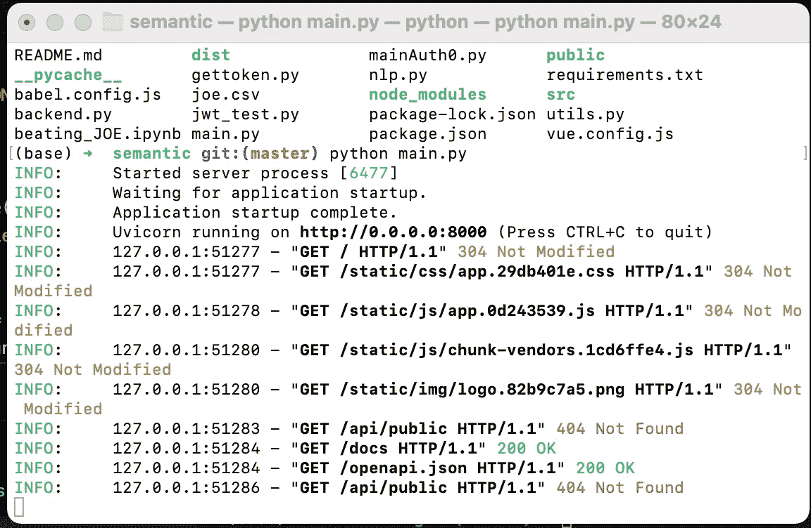
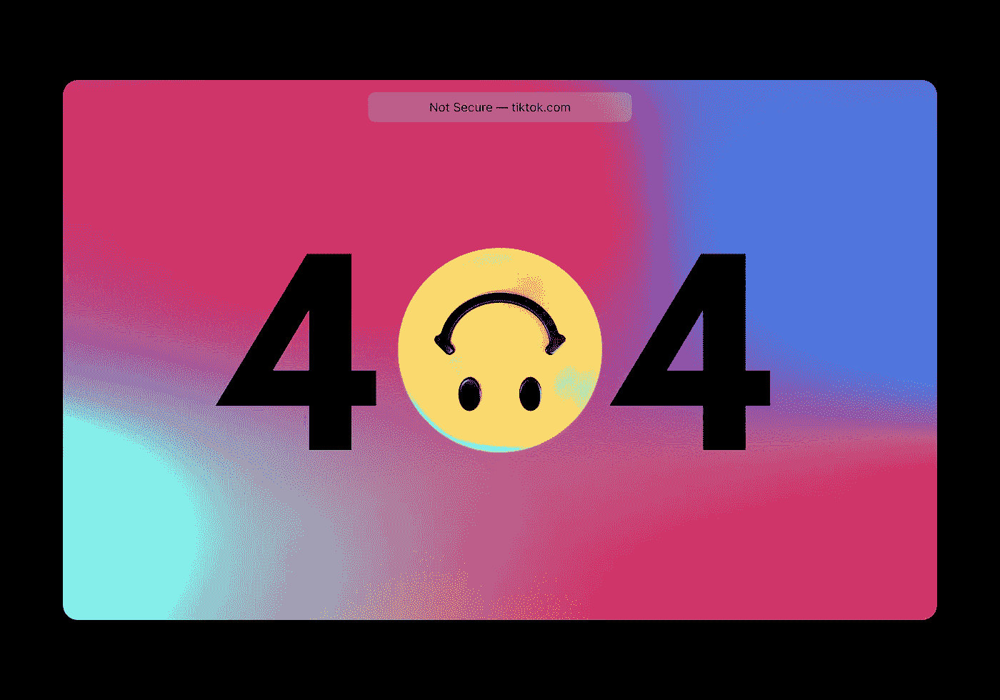
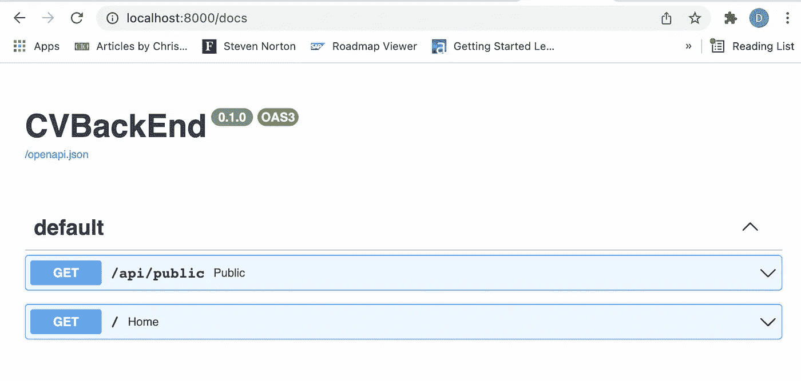
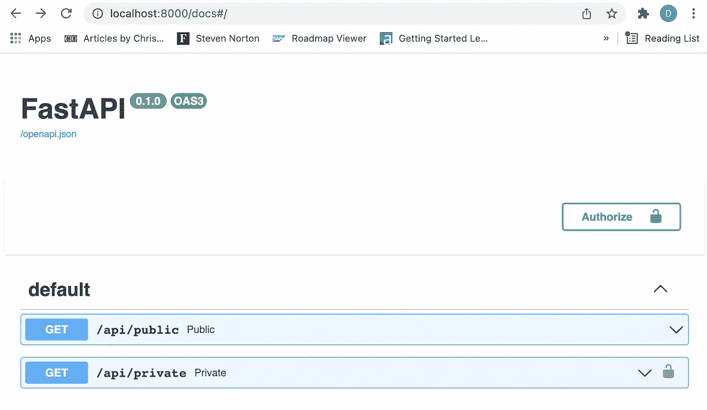
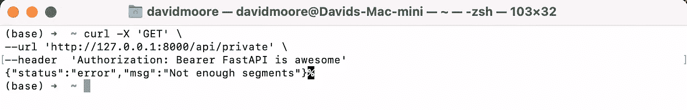
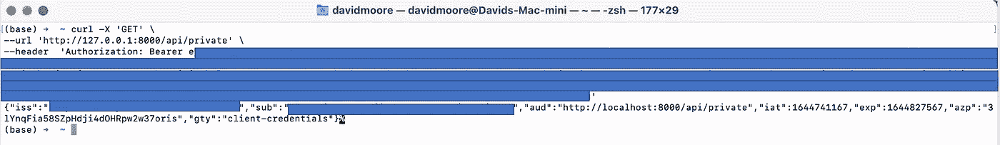

# 保护我们的原型

> 原文：<https://towardsdatascience.com/securing-our-prototypes-2d1f9b21798f>

## 锁定我们的数据科学原型和隐私概念证明


照片由[飞:D](https://unsplash.com/@flyd2069?utm_source=medium&utm_medium=referral) 在 [Unsplash](https://unsplash.com?utm_source=medium&utm_medium=referral)

网络安全和信息保护成为焦点，因为看起来像是[不断传来的](https://www.itgovernance.co.uk/blog/list-of-data-breaches-and-cyber-attacks-in-december-2021-219-million-records-breached)网络攻击和数据泄露。小型原型或概念验证应用程序可能成为攻击目标，并涉及数据泄露。我们继续一系列关于帮助求职者将他们的简历与招聘信息相匹配的文章。该项目可以同时处理 [**个人数据**](https://www.itgovernance.eu/blog/en/the-gdpr-what-is-sensitive-personal-data) 和**敏感个人数据**。我的全新 NLP 和数据科学支持的简历服务的第一个重要特征是安全性。

这是到目前为止的整个系列，还有更多。这些文章涵盖了孕育这个想法所需的研究和原型制作工作。

*   [利用 NLP 改善简历](/ai-is-working-against-your-job-application-bec65d496d22):对职位描述进行关键词匹配和文本分析。一篇有很多参与和讨论的受欢迎的文章。
*   [使用 Python 后端](/using-a-python-back-end-b9e4f9ac5d):用于 NLP 的 Python Flask 和 Vue.js。用 Vue.js 前端构建 Flask 后端服务器，避免 CORS 和 docker 容器编排问题。
*   [语义高亮](https://medium.com/towards-data-science/semantic-highlighting-d2fba3da2822):为 NLP 构建并添加一个用户界面，使用 vue-text-highlight 节点包在屏幕上高亮显示给定的文本。思考过程是为用户突出关键词或关键句子，以帮助更新简历。
*   向求职者展示自然语言处理:一个简短的演示，演示如何从前端获取一段文本，执行关键词提取，并为用户突出显示关键词。
*   [处理非结构化数据](https://medium.com/towards-data-science/handling-unstructured-data-feaeec2a6231):考虑到数据量和高需求，我们讨论如何使用 Apache Tika 编排工作流并从更广泛的文档中提取文本。
*   [法斯塔皮对弗拉斯克:](/fastapi-versus-flask-3f90adc9572f#cd73-dbd440d31c27)这是怎么回事？我们不是已经有姜戈了吗！。考虑 web 框架、微服务和后端 API，什么是服务 NLP 例程的最佳架构？

本文将展示我在原型中经常使用的一种提供身份验证的技术。身份验证发生在前端，只有经过授权的用户才能调用后端 API 端点。由 [@vivekmadurai](http://twitter.com/vivekmadurai) 撰写的文章[认证 Web 应用程序](https://medium.com/@vivekmadurai/different-ways-to-authenticate-a-web-application-e8f3875c254a)的不同方法为认证提供了一个很好的解释。然而，我更喜欢使用第三方访问(OAuth，API-token)方法，使用 [Auth0](https://auth0.com/) 。

## 网络安全

Web 应用程序安全性是一个重要的话题，有各种各样的过程和方法来保护应用程序和 API 免受不良分子的攻击。认证就是这样一种验证个人身份的过程。授权是另一个方面，它是通过指定的角色和权限来控制用户访问的过程。我们需要验证所有用户，仔细检查权限，并在处理个人或敏感个人数据时快速注销非活动会话。这类数据有很多问题，尤其是静态或传输中的加密。

有许多关于身份验证的文章，我倾向于将这些方法分为两个不同的类别

*   从头开始创建用户数据库、登录、注销和注册过程，或者使用特定 web 框架的可用扩展。
*   使用第三方提供商。

从头开始开发身份验证方法似乎是一个完全的目标置换。然而，请记住，我的兴趣是为我的潜在客户构建 NLP 服务。因此，我使用一个第三方提供商，提供我正在使用的语言所需的 SDK(Python 和带有 Vue.js 的 Node)，对我来说是 Auth0。

## 将 Auth0 集成到 FastAPI 和 Vue.js 中

由于我很难宣称自己是安全专家，能力甚至是一种延伸；我使用了一篇博客文章、可用的代码示例和 python 的 SDK。

[](https://auth0.com/blog/build-and-secure-fastapi-server-with-auth0/) [## 使用 Auth0 构建和保护 FastAPI 服务器

### FastAPI 是一个相对较新的 Python 框架，使您能够非常快速地创建应用程序。这个框架…

auth0.com](https://auth0.com/blog/build-and-secure-fastapi-server-with-auth0/) 

vue.js 有一个入门应用程序，就像放入一个安全的基础，然后在上面构建组件、服务和视图，这非常有吸引力。科学不是重新发明轮子！

[](https://auth0.com/blog/complete-guide-to-vue-user-authentication/) [## 使用 Auth0 进行 Vue.js 用户认证的完整指南

### 了解如何通过实现用户身份验证来保护 Vue.js 应用程序，这包括用户登录、注销和…

auth0.com](https://auth0.com/blog/complete-guide-to-vue-user-authentication/) 

鉴于这些文章的质量，我觉得我没有必要写太多，除了在处理第一部分时反思我的经历。

## 保护 NLP 操作的 FastAPI 端点

没过多久我就遇到了阻碍，我花了很多时间来找出我做错了什么。 [Github 库](https://github.com/CognitiveDave/semantic)包含代码，还有三种不同后端方法的文件:-

*   烧瓶与 vue 通过预建的 dist 文件夹( [backend.py](https://github.com/CognitiveDave/semantic/blob/master/backend.py) )
*   FastAPI 带 vue 带预建策略( [main.py](https://github.com/CognitiveDave/semantic/blob/master/main.py) )
*   带有 Auth0 和预建 vue 策略的 FastAPI([main auth 0 . py](https://github.com/CognitiveDave/semantic/blob/master/mainAuth0.py))

该问题在下图中显而易见



运行 main.py(未经身份验证的 FastAPI 按作者分类的图像

Main.py 定义了两条路由。一个是对“/”调用进行 FileResponse，然后是一个不安全的端点“/API/public”，它应该返回一个 JSON 响应对象。但是服务器对于不安全的端点返回 ***404 Not Found*** ，对我来说一点意义都没有。



由[视觉效果](https://unsplash.com/@visuals?utm_source=medium&utm_medium=referral)在 [Unsplash](https://unsplash.com?utm_source=medium&utm_medium=referral) 上拍摄的照片

经过一段时间的反复试验，我发现了这个问题

```
app.mount("/", StaticFiles(directory="./dist",html=True), name="static")
```

app [mount](https://fastapi.tiangolo.com/advanced/sub-applications/) 似乎已经产生了使实例成为子应用程序并将其限制为静态文件服务器的效果。即使文档中另有暗示，如下面的屏幕截图所示。



显示两个端点的 main.py 的 Swagger UI 视图——作者图片

我接受了这个设计，并试图调和 Flask 的显著差异，以绕过这个障碍。在 mainAuth0.py 中，我更改了子应用程序的概念来解决这个问题。

```
app = FastAPI()
appVue = FastAPI()
appVue.mount("/", StaticFiles(directory="./dist",html=True), name="static")@appVue.get("/")async def home():    
  return FileResponse("index.html")
```

子应用程序 appVue 是为前端 HTML 和相关的静态文件保留的，这看起来是一种简洁的方法。接下来，定义一个新的子应用 app，负责服务前端调用。

```
@app.get("/api/public")
def public():    
 ....
 return JSONResponse(content=json_compatible)
```

运行 mainAuth0.py 并访问 swagger UI



mainAuth0.py 显示两个端点的 swagger UI 视图

我们看到一个公共和私有端点。所以现在我们准备保护私有的。我仔细阅读了 Auth0 代码示例，只遇到了一个小问题。我拼错了我的一个秘密，让 Auth0 燃烧了更多的时间。以下是一些亮点

```
from fastapi.security import HTTPBearer  
token_auth_scheme = HTTPBearer()
```

这些行有助于从请求头中获取授权承载令牌。如果没有标头或承载令牌，HTTPBearer 将返回“未授权”

```
from utils import VerifyToken
result = VerifyToken(token.credentials).verify()
```

VerifyToken 是一个直接来自 Auth0 的类，代码显示了如何使用该类来验证给定的令牌。

综上所述，我们看到了一个安全的端点。您需要一个 Auth0 帐户，并且必须按照教程中的步骤注册一个 API。我使用 curl 从 Auth0 获取一个不记名令牌来测试我的安全端点。

首先，我尝试了一个无效的令牌，看看我得到了什么！

```
curl -X 'GET' \
  --url 'http://127.0.0.1:8000/api/private' \
  --header 'Authorization: Bearer FastAPI is awesome' 
```



终端窗口——使用 curl 向安全端点发送错误代码

向端点发送正确的令牌展示了期望的回报。



我使用 curl 测试了一个具有正确的 JWT 不记名令牌的安全端点。

NLP 项目现在使用 Auth0，我们可以保护 FastAPI 路由。在下面的文章中，我们将把 Vue.js 前端与 Auth0 连接起来，使用户能够注册、登录、注销、检索令牌，并在授权头中将令牌传递给后端。

一个意想不到的 404 让我损失了很多时间，但是写这个我学到了很多。大多数情况下，复制粘贴比手工输入你的秘密要好。


在 [Unsplash](https://unsplash.com?utm_source=medium&utm_medium=referral) 上由 [Aron 视觉](https://unsplash.com/@aronvisuals?utm_source=medium&utm_medium=referral)拍摄的照片

[](https://cognitivedave.medium.com/membership) [## 通过我的推荐链接-大卫·摩尔加入媒体

### 作为一个媒体会员，你的会员费的一部分会给你阅读的作家，你可以完全接触到每一个故事…

cognitivedave.medium.com](https://cognitivedave.medium.com/membership)