# 使用 loc & iloc 轻松选择 Python Pandas 中的数据

> 原文：<https://towardsdatascience.com/select-data-in-python-pandas-easily-with-loc-iloc-c6e8bc979e3e>

## 计算机编程语言

# 使用 loc & iloc 轻松选择 Python Pandas 中的数据

## *5 分钟内掌握 Python 中的 loc 和 iloc*


塔妮娅·马雷·肖菲在 [Unsplash](https://unsplash.com/?utm_source=unsplash&utm_medium=referral&utm_content=creditCopyText) 上拍摄的照片

Python 的 Pandas 库是一个非常强大的处理表格数据的库。在 Python 中，表格数据存储在 Pandas DataFrame 中。时不时地，我们需要选择数据的某一部分供我们使用。

> 随时加入我的[**电子邮件列表**](https://medium.com/subscribe/@17.rsuraj) 获取**免费**每当我写了一个新的故事时都会收到通知！！⚡

`loc`和`iloc`是用于过滤、选择和操作数据的基本方法。它们快捷、快速、易读，有时还可以互换。

在本文中，我们将探索如何用`loc`和`iloc`执行数据选择。我们将讨论以下主题:

```
 · [Difference between loc() and iloc() in Pandas DataFrame](#7f03)
· [Select Multiple Rows and Columns](#2de7)
· [Slicing Rows](#9597)
· [Extract Subset of Pandas DataFrame based on Conditions](#eecc)
· [Create a New Column based on 1 condition](#7f15)
· [Create a New Column based on Multiple Conditions](#2b27) 
```

让我们使用 [data.world](https://data.world/makeovermonday/2021w37) 上可用的[太阳能发电厂](https://data.world/makeovermonday/2021w37)数据，并从用`read_excel()`读取熊猫数据框中的数据开始。为了方便起见，我还更改了一个列名。

```
import pandas as pd
url = '[https://query.data.world/s/xgoscc46yofwpqz6qzquyf6kd7bo33'](https://query.data.world/s/xgoscc46yofwpqz6qzquyf6kd7bo33')
df = pd.read_excel(url)df.rename(columns=
          {'MWp (Megawatts Peak Capacity)': 'MWp_Capacity'}
          ,inplace=True)df.head()
```

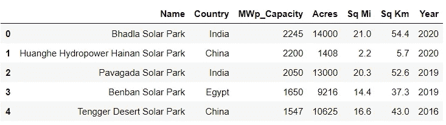

来自改头换面星期一的开源数据|作者图片

这是一个 20 行 x 7 列的小型数据集。这是一个来自 makeovermonday.co.uk 的开源数据，可以免费共享和用于项目。数据来源是维基百科。[https://www.makeovermonday.co.uk/data/](https://www.makeovermonday.co.uk/data/)安迪·克里贝尔将数据上传到 data.world。

# Pandas 数据帧中 loc()和 iloc()的区别

两者都用于数据切片，即从熊猫数据帧中提取数据子集。但是它们访问数据的方式有一个关键的区别，如下图所示！


作者图片

让我们从数据帧的 Name 列中获取前 5 行。

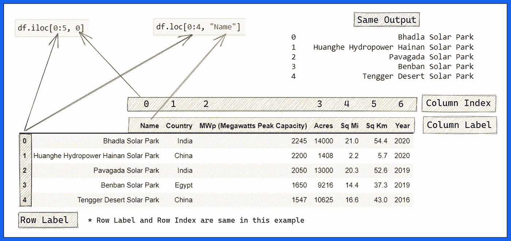

如何使用。loc()和。iloc()用于选择熊猫|作者图片中的数据

> 错过了什么？？🚩

另一个关键区别是，`**.iloc()**`方法不像`**.loc()**`那样包含传递给它的范围的最后一个元素

# 选择多行和多列

要选择多个行和列，我们可以将它们的索引列表传递给`.iloc()`，或者将它们的标签列表传递给`.loc()`

例如，从数据集中选择第 3、第 7、第 10 行和列`*Country*`和`*Year*`。

```
df.loc[[3,7,10], ["Country", "Year"]]
```

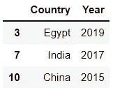

按作者选择子集|图像

通过用索引 1 和 6 分别替换列名 Country 和 Year，可以使用`**df.iloc()**`获得相同的输出。

另一个例子，从第 10 行到第 15 行，从第 3 列到第 5 列。这可以通过使用。`iloc()`，因为我们对特定索引处的行和列直接感兴趣。

```
df.iloc[9:15, 2:5]
```

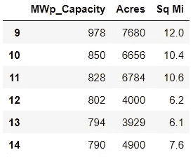

df.iloc() |作者图片

# 切片行

最健壮和一致的行切片方式是使用`**.iloc()**` ⚡

例如，可以通过简单地书写来选择前三行

```
df.iloc[:3]
```

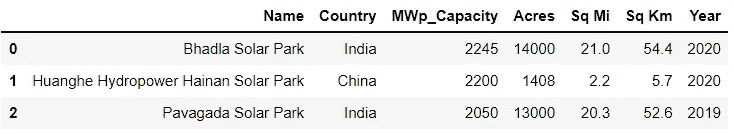

切片熊猫数据帧按行|图片按作者

因为我们没有为列传递任何索引，所以选择了数据帧中的所有列。

当然，这可以通过只写`df[:3]`来实现。

> 但是选择第一、第七和第八排的❗❗怎么样

在这种情况下,`df[0,6,7]`将抛出一个`KeyError`,但是`**df.iloc[[0,6,7]]**`将完成这项工作，如下所示。

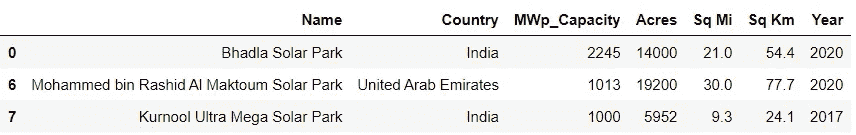

使用 df.iloc() | Image by Author 选择熊猫数据帧的子集

🚩请记住，在 Python 中，索引从 0 开始，即第一行或第一列的索引总是为 0，除非特别更改。

此外，还可以选择和提取第 1、第 3、第 5 等交替行。

```
df.iloc[1::2]
```

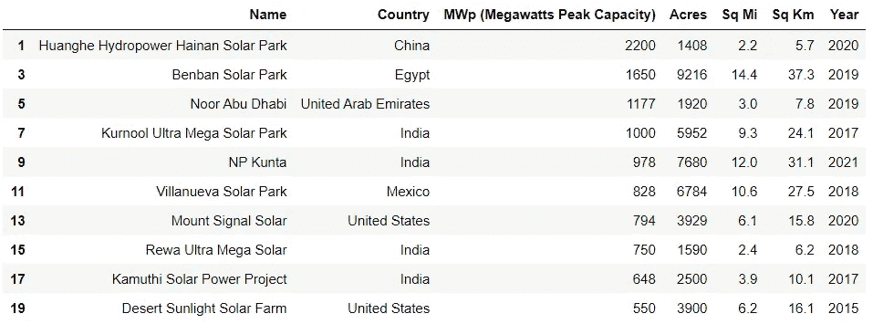

在 Python 中选择熊猫数据帧的交替行|作者图片

最终，您需要将行索引传递给`.iloc()`方法。

# 基于条件提取熊猫数据帧子集

通常，我们需要根据一个或多个条件提取数据帧的子集。使用`.loc()`可以轻松完成这项任务。⚡

如果是一个条件，我们可以将条件传递给如下所示的`.loc()`方法。

```
df.loc[**df["Acres"]>5000**]
```

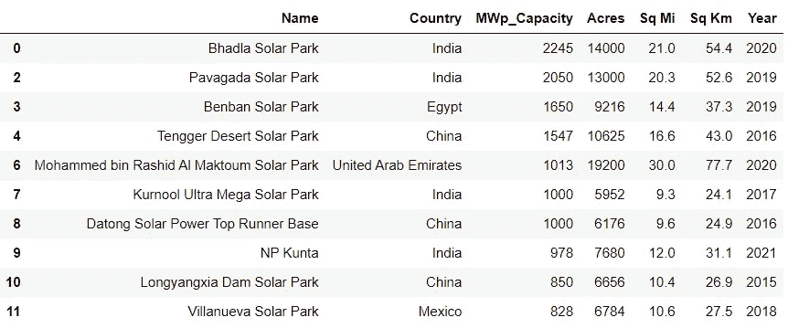

作者基于条件|图像提取数据帧的子集

如果单个列甚至多个列有多个条件，只需在用`**&**`分隔的`.loc()`中指定逻辑`**and**`和用`**|**`分隔的逻辑`**or**`即可。

🚩不要忘记用括号`**( )**`将每个条件括起来

例如，选择数据的子集，其中`*Acres*`中的值大于 5000 或者`*MWp_Capacity*`列中的值大于 2000。

```
df.loc[**(df["Acres"]>5000) | (df["MWp_Capacity"]>2000)**]
```

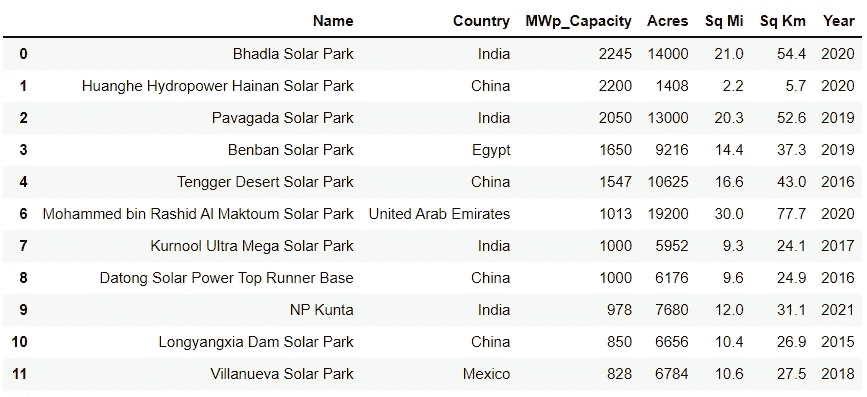

基于多种条件选择熊猫数据帧的子集|图片由作者提供

这是一个逻辑`**or**` 的例子。类似地，可以使用逻辑`**and**`提取子集。

# 基于 1 个条件创建新列

有时，您需要基于一列中的值创建一个新列。使用`.loc()`方法可以非常快速有效地完成这项工作。

语法非常简单明了。

```
Dataframe_name.loc[**condition, new_column_name**] = **new_column_value**
```

如果`.loc()`中的`**condition**`为**真**，则`**new_column_value**`为新列中分配的值。

例如，基于我们的熊猫数据框架中的`*Acres*`列创建一个列`*Size*`。

```
df.loc[df["Acres"]>5000, "Size"] = "Large"
df.head()
```

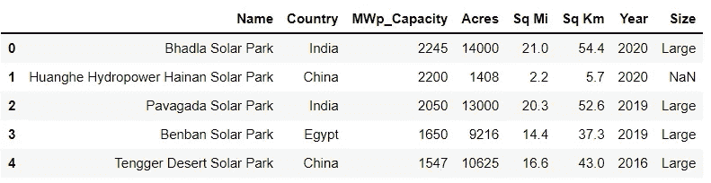

使用 df.loc() | Image by Author 创建新列

正如我们在上面的结果中看到的，对于条件，即`*Acres*`列中的值小于 5000 的行，在`*Size*`列中添加了`NaN`。

# 基于多个条件创建新列

故事并没有到此结束。

我们可以在`.loc()`方法中添加多个条件，并基于多个条件创建一个新列。

例如，基于`*Acres*`和 `*MWp_Capacity*`中的值创建一个名为`*Powerful*`的列

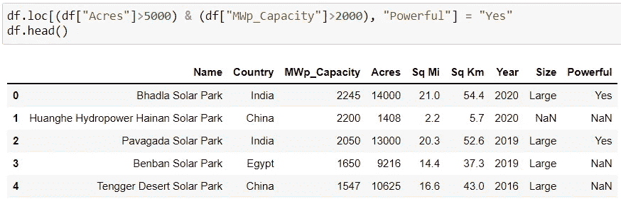

基于多个条件的熊猫数据框架中的新列|作者图片

所有缺失值，即`NaN`可使用`fillna()`单独处理。

仅供参考，缺失值可按如下方式填写。♻️

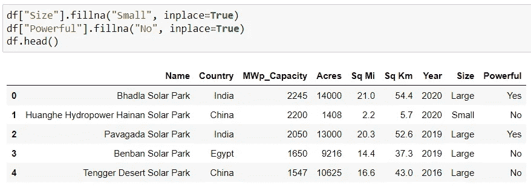

使用 fillna()在 Pandas DataFrame | Image by Author 中填充缺失值

尺寸栏中的`NaN`用“小”填充，强力栏中的`NaN`用“否”填充。

总结一下，

数据科学家最耗时的任务是清理和处理真实世界的数据。因此，在从数据帧访问数据时具有灵活性是很重要的。

**loc()** 和 **iloc()** 方法提供了我们在 Python 中提取熊猫数据帧的行和列所需的所有工具。

通过这五个例子，我试图涵盖用 Python 掌握熊猫数据帧切片的所有可能的方法。如果我错过了什么，请告诉我。

如果你喜欢阅读这样的文章，今天就成为 [**中的一员**](https://medium.com/@17.rsuraj/membership) 。只需每月 5 美元，你就可以无限制地访问 Medium &我将得到其中的一小部分。尽管如此，你可以随时免费订阅我的[**邮箱列表**](https://medium.com/subscribe/@17.rsuraj)*。*

## *感谢您的阅读和投资时间！！！*