# 通过音乐实现自我意识

> 原文：<https://towardsdatascience.com/self-awareness-2945ee7ead40>

## 作为指南针的音乐数据

通往真正觉知的道路是通过理解一个人的内在自我。今天就让这条路线通过耳朵。声波触发大脑中的神经元，这将改变大脑的体验…音乐移动，改变情绪，激发灵感。经历这些的人有福了。

我们开始吧。使用 Spotify API 从我的 Spotify 播放列表中提取了 697 首喜欢的歌曲，并用 Python 进行了分析。这是意识的第一步。几年前，当我作为一名 MBA 在全球各地推销产品和提出策略时，编程并不是一项技能。然后嘣。想要改变，所以戏剧性地变成了自学编码。今天的博客就是因为这个 reskill。

我的年龄是多少？

他们说你是由你所听的和从根本上联系的东西来定义的。不同的乐队这些年来的趋势，青少年时尚发生…和一些歌曲永远留在你身边。你可以根据人们唱的歌、卡拉 ok 和跳舞的时间来猜测他们的年龄。“宋发行年份”的权重很重要。

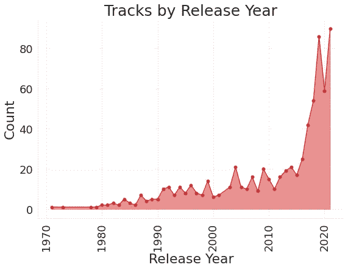

作者图片

那是我的，真令人惊讶。播放列表随着最新的出现而扩大。播放列表中的大多数歌曲都是最近几年发行的。那么我的年龄是多少？

**我前后一致吗？**

分析歌曲被添加到播放列表的顺序给出了一些指示。发行年份(Y 轴)真的不重要，因为它波动很大。我没有随波逐流，但我忠于音乐。这能叫外卖吗？宋的年龄并不重要，唯一的一致性是在添加什么歌曲连接。

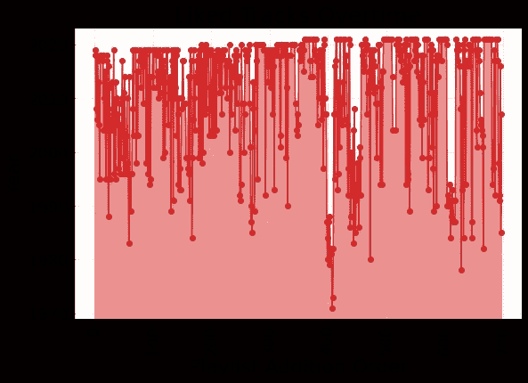

作者图片

**我在乎别人怎么想吗？**

歌曲像病毒一样传播开来，因为很多人都想和其他人一样听同一首歌，而且还有一首 FOMO！！！受欢迎很重要，因为那是风吹的地方。

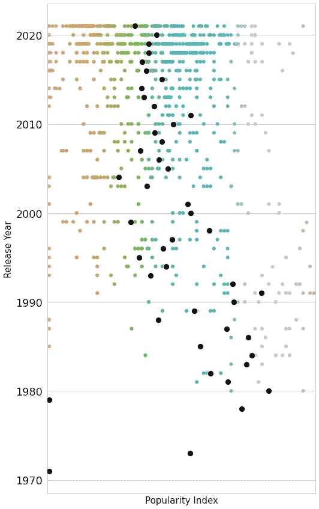

作者图片

我的播放列表中歌曲的受欢迎程度从“不太受欢迎”到“受欢迎”变化很大。我的播放列表中的平均受欢迎程度是 31.3，范围是 0-100，100 是最受欢迎的。明明不在乎什么流行，别人喜欢什么。

我喜欢的一些已经变得流行，如下所示…

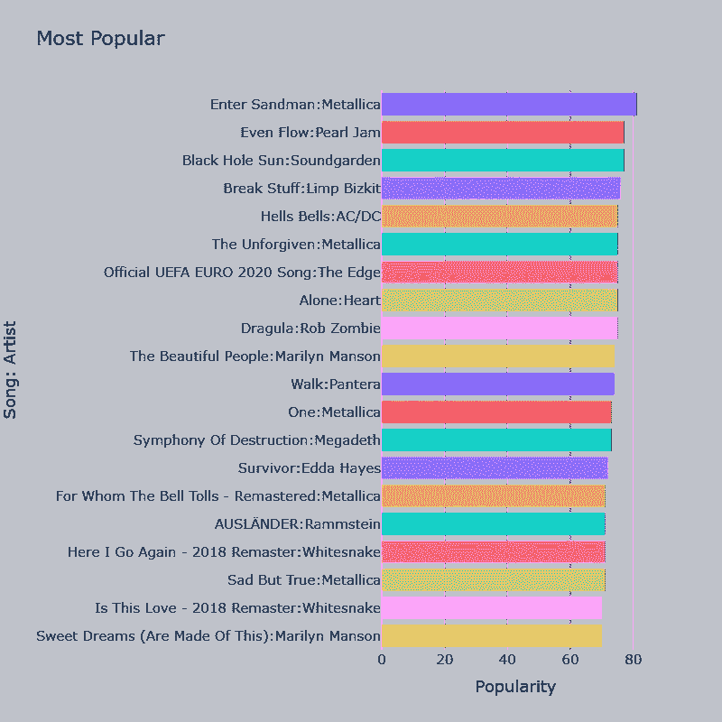

作者图片

我喜欢的一些歌曲得分为 0(在 0-100 分的范围内)…没关系…微笑&继续…听…跟随你的音乐之心。

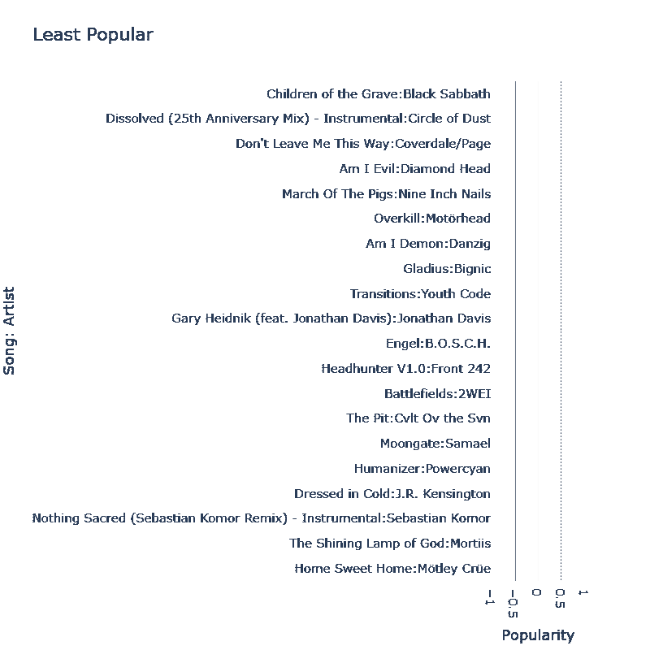

作者图片

多样性呢？

697 首歌曲跨越了 50 年间 341 位艺术家和 309 个流派。我是吗？…下面的图表有答案。

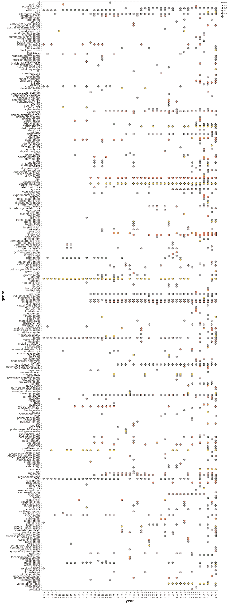

作者图片

思维的多样性增加了吗？

亲眼看看这些年来流派是如何变化的。明显增加。有些现实可能是因为流派是由听众/艺术家/社会在不断发展的文化中加入的。

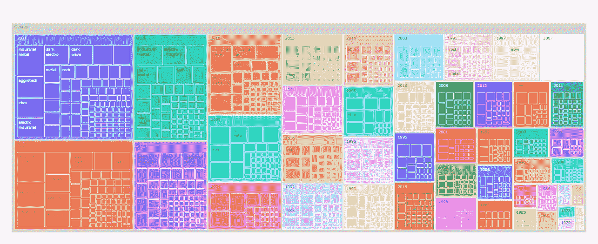

作者图片

**包容性呢？**

这些歌曲跨越了 24 个国家/语言，从斯堪的纳维亚到美国到拉丁美洲，一直到新西兰。音乐是一种很好的旅行方式，根据数据，我是一个包容的旅行者。

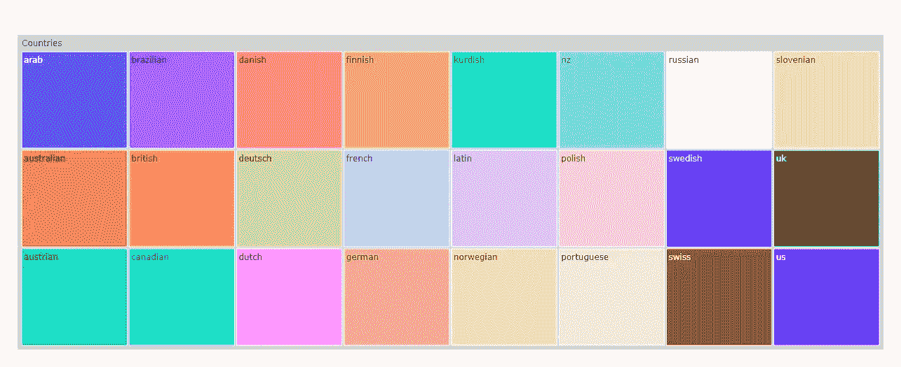

作者图片

内在的你……那么重要的是什么？

迄今为止的数据表明……不要在意其他人对流行度的看法，跨社会定义的流派/语言，这意味着这些都不重要。这些是什么适合什么的人为界限。那么什么才是重要的呢？

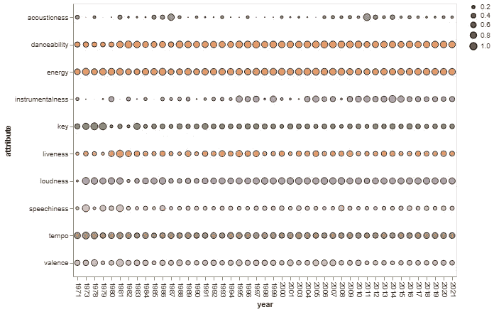

作者图片

歌曲的内在本质是由能量、可舞性、节奏、语速等特征来定义的。音乐因此而移动。

高节奏、活力、舞蹈性和响度对我来说很重要。句号。根据数据，这就是我的生活。年龄、类型、社会界限都无关紧要。

**有没有一个内在的矢量来指引？**

让我们看看这些方面，看看是否存在类似的东西。让我们把这首歌的内在特征集中起来。根据肘形法，4–5 是理想的集群数(肘形出现在下图中)。

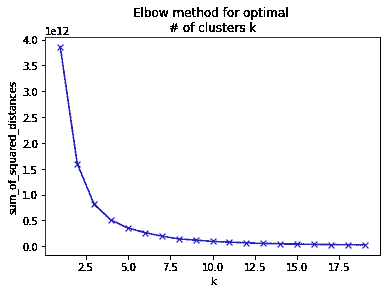

作者图片

让我们选择 4 个。这就是所有的歌曲如何落入 4 个集群。很明显。这是引导我的内在生命矢量。

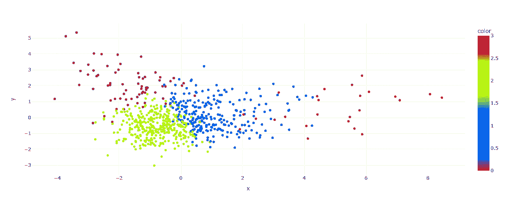

作者图片

让我们来计算哪些波段接近这些星团的质心。不同的波段属于这些集群。一些人将歌曲从工业歌曲切换到民谣歌曲时，会跳过集群。

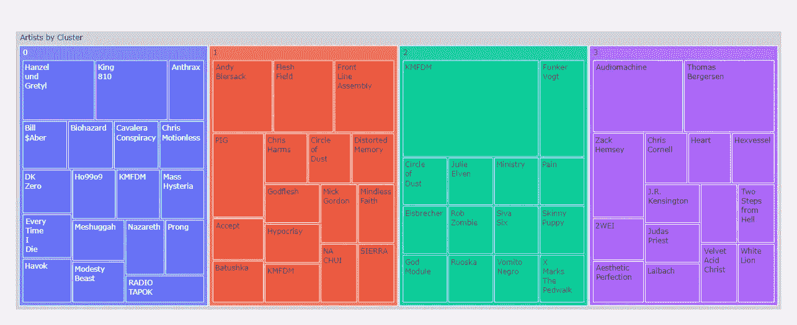

作者图片

**我的内心向导是一个矢量**

它是我喜欢的所有歌曲的向量。这指引着我。当听到这些确切的音符时，我的神经元被触发。这个向量反映在我的脑海中。每个人都有。

我使用人工智能，把我的矢量变成了一种艺术。社会将像矩阵一样定义严格的边界，然而生命的矢量是一个混乱的散点图，上面覆盖着相连的点。跟着那个。生活是一个向量。

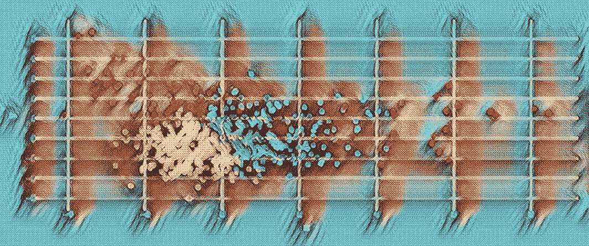

作者图片

> 生活是我们的，我们以自己的方式生活
> 
> 所有这些话，我不只是说
> 
> 其他的都不重要
> 
> -其他都不重要，金属乐队