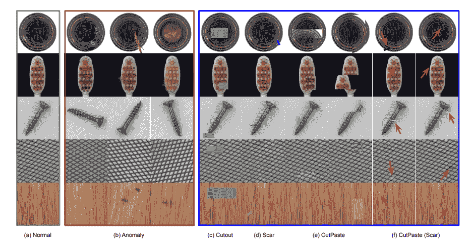
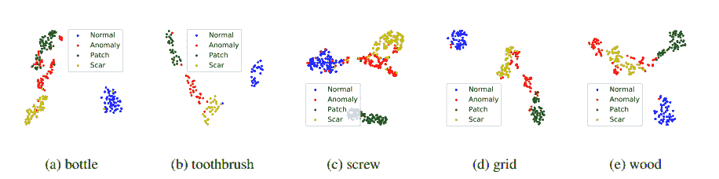
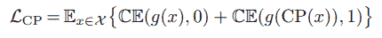

# Python 中异常检测的自我监督学习:第 2 部分

> 原文：<https://towardsdatascience.com/self-supervised-learning-for-anomaly-detection-in-python-part-2-5c918b12a1bc>

# Python 中异常检测的自监督学习:第二部分

## CutPaste:作为核密度估计改进的自我监督学习

兰迪·法特在 [Unsplash](https://unsplash.com?utm_source=medium&utm_medium=referral) 上的照片

[自我监督学习](/review-on-self-supervised-contrastive-learning-93171f695140)是现代深度学习研究中最热门的领域之一。正如 Yann Lecun 喜欢说的[自我监督学习是智能的暗物质](https://ai.facebook.com/blog/self-supervised-learning-the-dark-matter-of-intelligence/)和在人工智能系统中创造常识的方法。这种范式的思想和技术吸引了许多研究者尝试将自我监督学习的应用扩展到新的研究领域。当然，异常检测也不例外。

[**在本文的第 1 部分**](/kernel-density-estimation-for-anomaly-detection-in-python-part-1-452c5d4c32ec) 中，我们讨论了异常检测的定义和一种称为核密度估计的技术。KDE 是发现数据集中异常数据点的最流行和最简单的方法之一。它适用于表格数据。然而，我们对图像的实现感兴趣。视觉检测是一种非常受欢迎的应用，其重点是发现我们感兴趣的物体中的缺陷或异常值。

*那么，我们如何在不损失太多信息的情况下，通过降低计算成本对图像进行 KDE 呢？*

对许多人来说，答案可能是显而易见的:找到一个好的主干，它可以为我们提供图像的良好表示。然后我们可以用这些表象来指挥 KDE。

针对特定用例微调主干的最佳方式是自我监督学习。最近，世界上许多研究人员致力于将自监督学习技术与经典异常检测技术相结合。此外，研究人员提出了全新的转换方法，以改善用于异常检测的自监督学习的托词任务。

在文章的这一部分，我们将讨论 Google 的一种新的自我监督技术 CutPaste[1]，并了解一种新的创造性的数据转换方法如何提高训练结果。

剪切膏的主要成分包括:

1.  新改进的借口任务
2.  自监督模型结构

## **剪贴和疤痕剪贴**

一种非常流行的自我监督的借口任务被称为 Cutout。顾名思义，它从一幅图像中随机剪切出一小块矩形区域。这在许多自我监督的环境中工作得很好，并作为数据扩充。这似乎是异常检测用例的一个很好的模拟。

该论文的研究人员提出了这种技术的一种新变体，称为 CatPaste，它从图像中复制一小部分，并将其替换到其他地方。它产生局部不规则性，这似乎与异常检测问题设置完全一致。

这种托辞任务的另一种变体叫做剪切疤痕，它是对原始疤痕剪切技术的改进。在最初的疤痕剪切中，我们从图像中取出一个细长的矩形块，并用随机颜色替换它。在这种情况下，我们从图像中使用一个类似疤痕的矩形补丁，并再次将其随机插入图像中的其他位置。

[点击 GitHub 链接查看 PyTorch 中的 CutPaste 和 Scar-CutPaste 实现。](https://github.com/LilitYolyan/CutPaste/blob/main/cutpaste.py)

看起来像是托词任务定义的一个小变化。然而，实验结果表明，该方法提高了最终异常检测的结果。下图展示了一些剪贴和疤痕剪贴的例子。我们可以注意到，在某些情况下，它可能看起来像是物体中的真正缺陷。

图片来源于论文[1]。参见参考文献

这是否意味着从剪切粘贴中创建的缺陷是对原始缺陷的良好模拟？为了回答这个问题，作者展示了切割糊、疤痕切割糊、正常和异常样品的 t-SNE 图。下图显示，在大多数情况下，借口任务不会与异常重叠，因此我们可以说它不是真实异常的良好模拟。然而，训练结果表明，尽管存在分布差异，但这些变换有助于为异常检测创建更好的表示。

正常、异常、切割糊和疤痕切割糊样本的 t-SNE 图。图片来源于论文[1]。参见参考文献

## **自监督模型结构**

最初使用 ResNet-18 来创建模型。接下来，添加 MLP 投影头，然后是输出表示的最后一个线性层。

代码来自:【https://github.com/LilitYolyan/CutPaste 

进行了两种类型的实验:二元分类和三元分类。

在第一种情况下，模型使用原始图像，并使用 CutPaste 或 CutPaste-Scar 随机变换它。然后，原始图像和变换后的图像成为两个不同的类别，我们在此基础上进行二值分类。

接下来，是三向分类技术，其中我们不是随机使用 Cutpaste 和 CutPaste-Scar，而是将两者作为单独的类使用，并且我们添加 normal 类作为第三个类。最后，我们把它分为三类。

在本例中，我们的 CutPaste 对象可以根据分类类型返回转换后的图像:

代码来自:[https://github.com/LilitYolyan/CutPaste](https://github.com/LilitYolyan/CutPaste)

损失是交叉熵，其中 CP(.)是图像的剪切粘贴变换。

# 参考

[1]李，孙春亮，Kihyuk 和 Yoon，Jinsung 和 Pfister，托马斯.(2021). [CutPaste:用于异常检测和定位的自我监督学习。](https://arxiv.org/abs/2104.04015)

## 点击 Github 的[代码链接](https://github.com/LilitYolyan/CutPaste)

## 在这里可以找到文章的第 1 部分:[Python 中异常检测的核密度估计](/kernel-density-estimation-for-anomaly-detection-in-python-part-1-452c5d4c32ec)