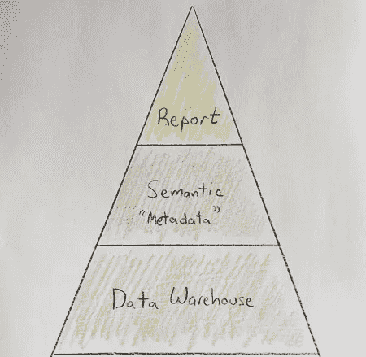

# “无语义”是商业智能的未来

> 原文：<https://towardsdatascience.com/semantic-free-is-the-future-of-business-intelligence-27aae1d11563>

## **度量和通用语义层支持无语义 BI**

不仅仅是语义(经作者许可)

一个*语义层*是数据的业务友好表示，允许用更简单的术语解释复杂的业务逻辑。在商业智能(BI)中，它被称为元数据层、语义模型、业务视图或 BI 模型。

大约 30 年前，当语义层首次引入 BI 工具时，它定义了表连接、指标聚合、用户友好的名称等，允许 BI 最终用户简单地将产品名称和销售额等字段拖放到报表上。哇，这是你的数据！是的，“无代码”BI 已经存在了至少 30 年。这使得早期的数据团队开始更战略性地考虑将业务逻辑放在哪里，但也带来了许多复杂的问题。作为一名 20 多年的商业智能顾问和 FlexIt Analytics 的创始人，这些问题在我心中已经存在很长时间了。

# 商业逻辑放在哪里？

对于一个*非常*简单的解释，业务逻辑存在于“BI 层”的三个地方之一:

双层，简化，非常简化(图片由作者提供)

在理想的情况下，通过转换(ETL/ELT 中的“T”)将尽可能多的业务逻辑放在数据仓库的最低层。这减少了重复(枯燥——不要重复自己),允许“单一的事实来源”,减少了供应商锁定，并简化了更高层次的消费。然而，这并不总是可行的。

数据仓库开发可能会很慢。如果需要更改业务定义，业务用户可能无法访问数据工程团队，或者他们可能会积压工作。因此，他们联系 BI 团队，让他们将逻辑放入 BI 语义层。如果 BI 团队也积压了工作，或者不愿意做出改变，该怎么办？然后，业务用户将逻辑放入报告中。如果他们没有 BI 工具的“创建者”权限，会发生什么？然后他们运行报告，导出到 Excel，并将他们的业务逻辑放在那里(*这是另一篇文章，或者一千篇文章*)。

我们知道在报告中填充业务逻辑会很快变得混乱。但是我们也知道，可以应用于数据仓库的业务逻辑的数量是有限的。例如，您不能很好地定义复杂的连接(*维度建模与非规范化“一个大表”是另一篇文章*)。另外，您通常不能分配像`label`、`format`、`aggregation`、`description`这样的列属性。因此，放置大部分业务逻辑的自然位置就成了 BI 工具语义层。语义层中放了多少业务逻辑，然后决定了它是**瘦**(很少)还是**粗**(很多)。

# 阶段 1:厚语义层

BI 工具语义层从中等厚度开始，允许您定义许多复杂的业务逻辑，但是它们的能力也有所限制。早期的工具(Business Objects，Cognos)当然属于这一类，甚至像 Tableau 这样的后继者也在过去几年中加入了加入连接的功能。然而，Looker 通过 LookML 创建了一个非常厚的语义层，具有高级代码和脚本功能。你可能会说类似的事情的权力毕的 MDX。

厚语义层是一个巨大的改进，允许复杂和可重用的业务逻辑。但是，它也与该工具隔离，其他工具或没有访问权限的用户无法使用。如果你是一个拥有一个工具的小组织，并且每个人都喜欢这个工具，那么这可能不是一个问题。但是，当 1)您发展并向堆栈中添加更多工具，或者 2)想要转移到不同的工具(即，供应商锁定)时，会发生什么呢？

就这一点而言，[2020 年商业智能趋势](https://wiiisdom.com/ebook/business-intelligence-trends-2020/)研究显示，67%的员工拥有不止一个 BI 工具，平均每家公司拥有 **3.8 个 BI 工具**。还有许多其他原因来避免厚语义层，其中一些在下面的帖子中有详细介绍:

<https://blog.transform.co/data-talks/why-business-metric-logic-shouldnt-live-in-bi-tools/>  

因此，现代 BI 迎来了下一个阶段，即薄语义层。

# 阶段 2:薄语义层

BI 工具中的薄语义层的想法是利用在 BI 工具和数据库之间构建语义层的其他工具。其中一些是度量层(又名无头 BI，度量存储)，如[转换](https://transform.co/)、[立方体](https://cube.dev/)和[度量 ql](https://metriql.com/) 。其他的，像 [dbt](https://www.getdbt.com/) (数据构建工具)，是数据转换工具，提供对度量的支持，以及其他语义层功能。

</a-brief-history-of-the-metrics-store-28208ec8f6f1>  

具有薄语义层的 BI 工具从无头语义层同步或提取大部分元数据，然后在其上定义一些额外的元数据。越来越多的 BI 工具采用了瘦语义层方法。这里有一篇关于超集的文章，详细介绍了一个薄语义层背后的思想:

<https://preset.io/blog/understanding-superset-semantic-layer/>  

薄语义层显然是 BI 的一大进步。但是现在，作为一个积极进取的人，你可能会想“为什么不更进一步呢”？除了度量和一些其他元数据，为什么不将更多的元数据，如名称/标签、描述、格式和同义词，下推到无头语义层呢？

# 阶段 3:无语义 BI

无语义 BI 的概念并不新鲜。它可以追溯到早期的 BI 工具，最初被认为是使用一个通用的(统一的)语义层，最近被称为“headless”。这个想法是，所有的数据消费者(BI、ML 和其他工具)可以通过访问一个应用了公共元数据语义的“真实的单一来源”来“说同一种语言”。与同步来自无头语义层的一些元数据的瘦语义 BI 工具不同，无语义 BI 工具只是保存对无头层中元数据的引用。BI 工具中没有元数据详细信息。从技术上讲，您可以在报表层更改一个属性，并将其称为语义层，但这不是我们所说的“语义层”。

像所有伟大的想法(悬浮滑板、飞行汽车、从里到外的奥利奥)一样，实现一个通用的语义层，实际上是可行的，值得投资的，仍然是难以捉摸的。前面提到的度量层解决方案(Transform、Cube、dbt、Metricql)正在获得越来越多的关注，但是有些特别关注度量。有充分的理由，它是通用语义层最重要的组成部分。在光谱的另一端，有完整的通用语义层产品，如 [AtScale](https://www.atscale.com/blog/what-is-a-universal-semantic-layer-why-would-you-want-one/) 和 [Kyligence](https://kyligence.io/unified-semantic-layer/) 。但是它们不是集中的度量层，它们是否会获得牵引力还有待观察。BI 和其他工具会努力与它们集成吗？与开源度量解决方案不同，AtScale 或 Kyligence 既不是开源的，也不是透明的。它们都没有定价页面，只列出最大的公司作为它们的客户，所以我认为可以说它们不是“通用的”统一语义层产品。

<https://www.atscale.com/blog/what-is-a-universal-semantic-layer-why-would-you-want-one/>  

对于各种形状和规模的数据团队，当前的产品可能非常适合一小部分组织。或许更小、更灵活的公司会发现无头 BI 产品非常合适。此外，“无语义”的 BI 可能对这些组织来说并不重要。另一方面，大型公司可能在 AtScale 或 Kyligence 等产品上取得了成功。太好了！然而，这篇文章实际上是为介于两者之间的 90%的人而写的。

# 我们如何实现无语义 BI？

为了实现这一目标，我认为这是一个三步走的方法:

1.  细化和合并度量和通用语义层的概念
2.  定义 BI 工具与无头层对话的标准
3.  达到支持无语义商业智能的商业智能工具的临界质量

度量和通用语义层几乎涵盖了一切，但需要走到一起并变得成熟。一旦发生这种情况，BI 工具需要很容易与这个无头语义层集成。如果没有一套与无头层对话的标准，每个 BI 工具都必须为每个层创建定制的连接器，这很可能会导致失败。如果框架既开放又简单，那么 BI 工具自然会采用无语义模型。然后，我们可以开始达到无语义 BI 的临界质量。

目前，我认为 dbt 在实现无语义 BI 方面处于领先地位，原因如下:

1.  它不是您堆栈中的另一个工具。作为增长最快的数据转换解决方案，它已经包含了您的大部分复杂业务逻辑。公司已经将他们的 LookML 向下移动了一层，进入 dbt。
2.  默认情况下，大量元数据自然内置于 dbt 模型中。
3.  dbt 的文档和对`meta`的支持已经实现了完整的数据编目能力。现在的问题是改进功能，让它更加活跃。
4.  `dbt-core`是开源和免费的，有一个充满活力的社区
5.  像数据血统和数据新鲜度这样的额外因素对 BI 来说是巨大的

虽然 dbt 不是真正的无头服务器，但他们目前正在开发无头度量产品。此外，dbt 认识到了改进的必要性，并高度重视指标和语义层:

<https://venturebeat.com/2022/02/28/dbt-labs-will-soon-add-a-semantic-layer-in-the-modern-data-stack/>  

现在，BI 工具可以并且正在与 dbt 集成，以提供瘦的和无语义的 BI 体验。 [FlexIt Analytics](https://learn.flexitanalytics.com/docs/dbt/) 和 [Lightdash](https://docs.lightdash.com/) 通过与 dbt 的集成已经具备了语义无关的能力。其他的像[超集](https://github.com/slidoapp/dbt-superset-lineage)和[元数据库](https://github.com/gouline/dbt-metabase)有同步工具，允许 dbt 模型的手动同步，以支持一个瘦语义层。鉴于 dbt 的受欢迎程度，许多其他产品，如 Thoughtspot(2022 年 8 月)和 [Holistics](https://docs.holistics.io/docs/dbt-integration) (现已提供测试版访问)即将推出，因此我们将在 2022 年的某个时候看到它们如何集成。最后，一些 BI 工具，如 [Mode](https://mode.com/get-dbt/) 给你一点(dbt 源代码新鲜度)，但在语义模型方面没有太多。

事情进展很快，制定一些标准变得非常重要。本文详细介绍了如何制定标准，并提供了一个 Github dbt 项目，说明如何与 dbt 集成以实现无语义 BI:

<https://medium.com/modern-business-intelligence/self-service-business-intelligence-powered-by-dbt-3b7e24a92e27>  

# 结束语

我们在支持各种类型的数据团队和数据消费者方面取得了长足的进步。在某些方面，我们才刚刚开始，但是无头语义产品和瘦或无语义 BI 工具的当前紧迫感和快节奏给了我希望，我们将很快到达那里。

我很想听听你的想法，或者联系安德鲁·塔夫特