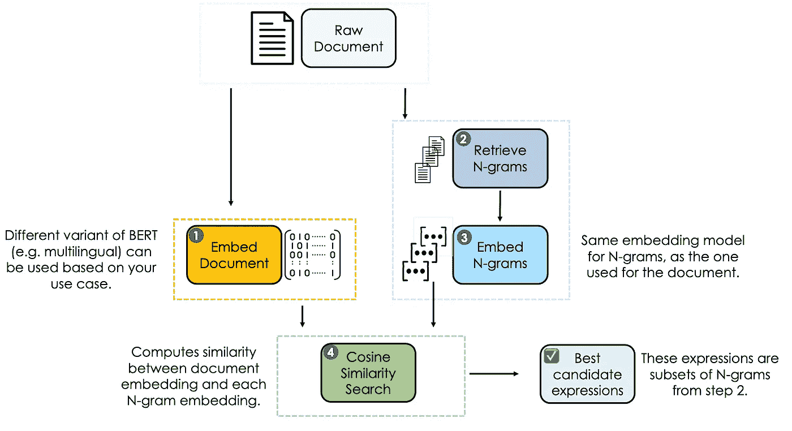
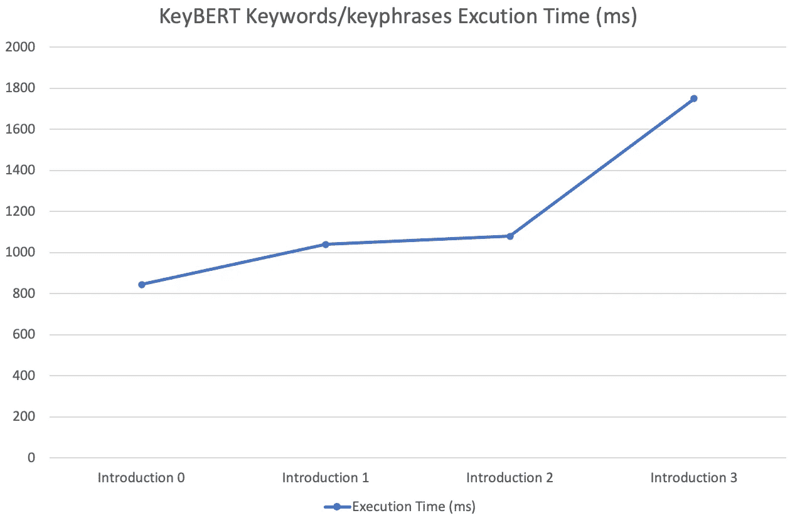

# 用 KeyBERT 提取语义关键词和关键短语

> 原文：<https://towardsdatascience.com/semantic-keywords-and-keyphrases-extraction-with-keybert-999234cab7f>

## 利用拥抱面部变形器和余弦相似性从文档中检索语义表达式

作者图片

# 介绍

无论您的工作是分析商业报告、社交媒体还是财务数据，我们大多数人都会提到数字能力，因为这是从这些文档中获得有意义见解的更快方式。寻找和提取能更好地描述文档的有见地的单词和表达式一直是一项挑战，尤其是对于较大的文档。

然而，使用最先进的自然语言处理方法可以增加找到那些有意义的单词和表达的机会。我们将尝试使用`**KeyBERT**`来解决这样一个任务:这是一个由[马腾·格罗腾多斯特](https://www.maartengrootendorst.com/)在 2020 年开发的简单的库。它利用变压器和余弦相似性来有效地提取更好地代表给定文档的关键字和关键短语。我们将首先理解 KeyBERT 是如何工作的，然后实现它，最后讨论它的时间执行复杂度。

# KeyBERT——那又怎样？

不同的工艺如[耙子](https://github.com/aneesha/RAKE)、[雅克！](https://github.com/LIAAD/yake)、 [TF-IDF](https://en.wikipedia.org/wiki/Tf–idf) 等。存在关键字提取。然而，KeyBERT 为表达式提取过程提供了语义值，这与前面所述的主要关注统计方法相反。

## KeyBERT 的主要组件

下图显示了 KeyBERT 算法的四个主要组件:

图 2: KeyBERT 主要组件(图片由作者提供)

**①。原始文档嵌入**:第一步是通过利用 BERT 来执行的，目的是获得输入文档的嵌入级表示。如果您想使用其他语言，也可以为多语言任务使用不同的嵌入模型。

**②。n 元语法单词/表达式检索**:从相同的先前文档中，使用 n 元语法方法提取关键词和关键短语。当 n-gram 范围为(1，1)时，我们得到关键字。另一方面，将范围增加到(1，2)或更高会得到关键短语。

**③。N-grams 嵌入:**这些 n-grams 中的每一个都使用与原始文档相同的嵌入模型进行嵌入。

**④。余弦相似性搜索**:在先前的单词/短语/表达集合中，使用余弦相似性度量选择与输入文档最相似的那些。这些最终被认为能更好地描述文档。

# 数据

我创建了一个列表，包含 2022 年 1 月期间发表的所有文章的介绍部分。因此，我们的分析将集中在这些信息上。

你可以在下面找到其中一个**介绍**的第一行。

> 我们生活在一个被大量文本信息包围的时代，如调查回复、社交媒体评论、推文等。找到满足个人需求的合适信息是一项挑战，尤其是在处理大量不同的数据时。多亏了主题建模，一个自然语言处理的时代通过将大量未标记的文本数据分组/聚类成主题来有效地分析它们…

还有，文章的所有源代码都可以在我的 [**Github**](https://github.com/keitazoumana/Medium-Articles-Notebooks/blob/main/Advanced_Topic_Modeling_BERTopic.ipynb) 上免费获得。

# 关键短语和关键词提取

以下三个步骤与从文档中提取关键字和关键短语相关:

**(1)** 安装并导入 KeyBERT 和句子转换器库

keybert_prereq.py

**(2)** 配置 KeyBERT 模型

config_keyBERT.py

*   `all-mpnet-base-v2`:这个[句子转换器](https://www.sbert.net/)模型将句子&段落映射到一个 768 维的密集向量空间。在撰写本文时，该模型在所有[可用的当前预训练模型](https://www.sbert.net/docs/pretrained_models.html)中具有最佳性能。
*   `keyBERT_model`:将用于表达式提取的 KeyBERT 实例。

**(3)** 计算关键词和关键短语提取

以下函数以 **(term，cosine_score)** 的格式返回最相关表达式的元组列表。余弦值越高，表达的相关性越好。

extract_terms.py

上一个函数中的大多数参数都是不言自明的。下面我们来试着理解一下:`use_mmr`和`diversity`。

*   `use_mmr`:设置为 **True 时，对应使用最大边际相关性。**它使得尽可能减少所选表达方式之间的相似性，以创造更多的多样性，这实际上是我们想要的。因为我们不希望我们所有的最终表达都是一样的。
*   `diversity`:用于设置分集阈值，取值范围为 0-1。这就像一个控制`use_mmr`的光标，一个更高的值产生的设置(比如在我们的例子中为 0.7)创建了不同的候选表达式/术语/关键字。

既然我们理解了这些参数，我们可以将该函数应用到所有的**简介**文档中。

terms_from_introductions.py

图 1:来自我一月份文章介绍部分的相关关键词/关键短语(图片由作者提供)

检索到的信息似乎准确地描述了每个相应的简介部分。例如，第一个包含 91 个单词的文档已经被总结为很少的几个表达式，这些表达式可以更好地描述整个文档。

# 执行时间分析

在构建模型时，记住与工业化方面相关的所有限制是很重要的。其中一个约束可能与管道的执行时间有关，根据您的用例，可以忽略这一点。

下表包含每个**简介**的关键词提取时间复杂度的所有指标，单位为毫秒(ms)。

表 1: KeyBERT 关键字/关键短语提取执行时间(毫秒)(图片由作者提供)

下面是相应的图形

图 2: KeyBERT 关键字/关键短语提取执行时间图(图片由作者提供)

正如您所看到的，表达式提取时间随着输入文档的长度而增加，并且很容易达到指数级的时间复杂度，这意味着无论 KeyBERT 的性能有多好，它都可能不适用于具有实时执行约束的应用程序。

## 感谢阅读！

你可以在下面找到更多的资源来加深你的理解。不要犹豫，在 LinkedIn 上加我，或者在 YouTube 和 Twitter 上关注我。讨论人工智能，人工智能，数据科学，自然语言处理的东西总是令人愉快的！

[Github 上的源代码](https://github.com/keitazoumana/Medium-Articles-Notebooks/blob/main/Advanced_Topic_Modeling_BERTopic.ipynb)

[KeyBERT Github](https://github.com/MaartenGr/KeyBERT)

[基伯特常见问题解答](https://maartengr.github.io/KeyBERT/faq.html)

再见🏃🏾