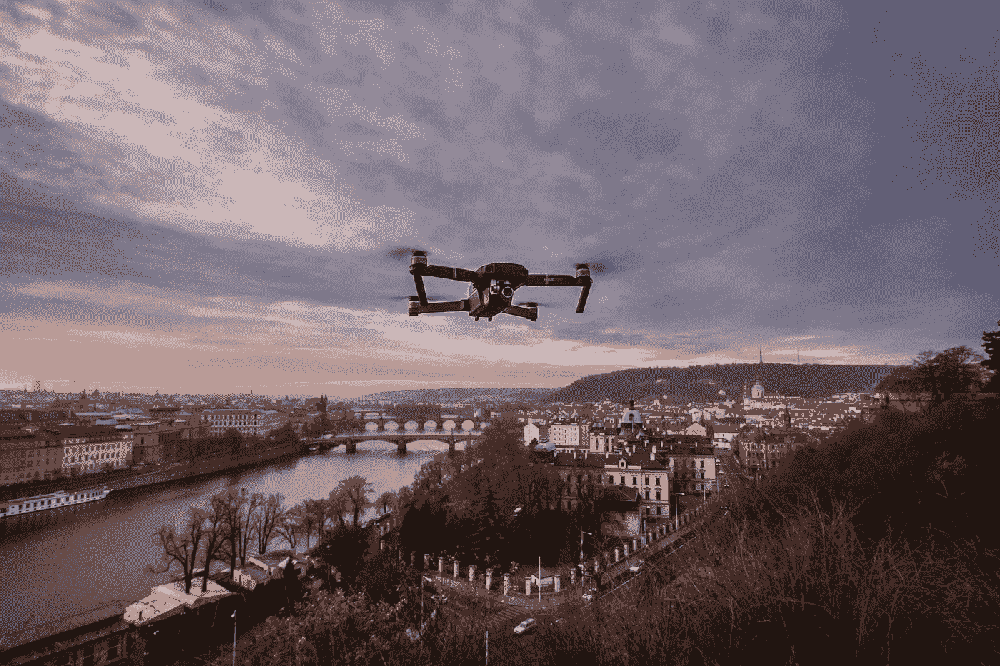
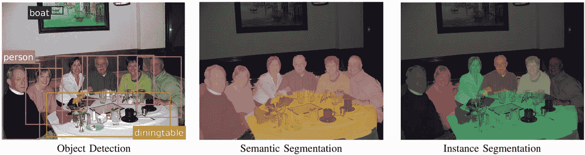
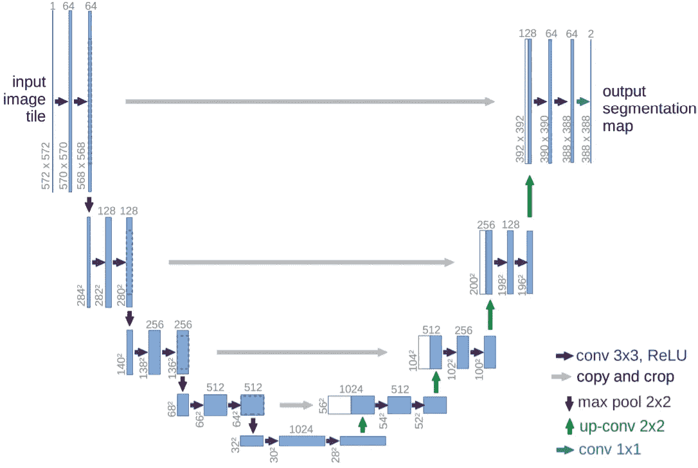
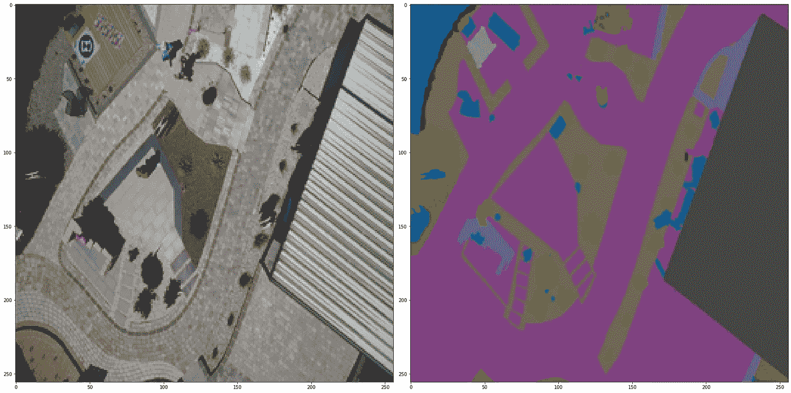
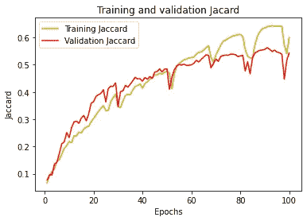
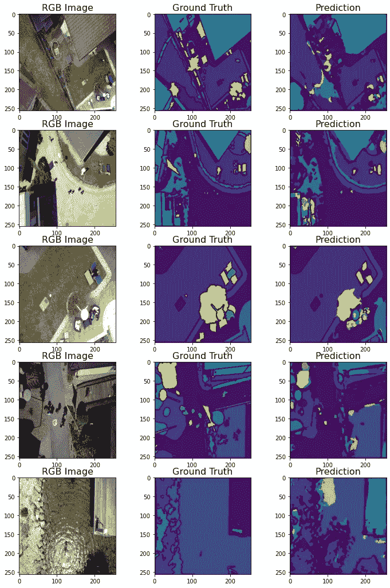
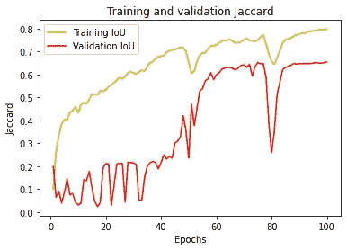
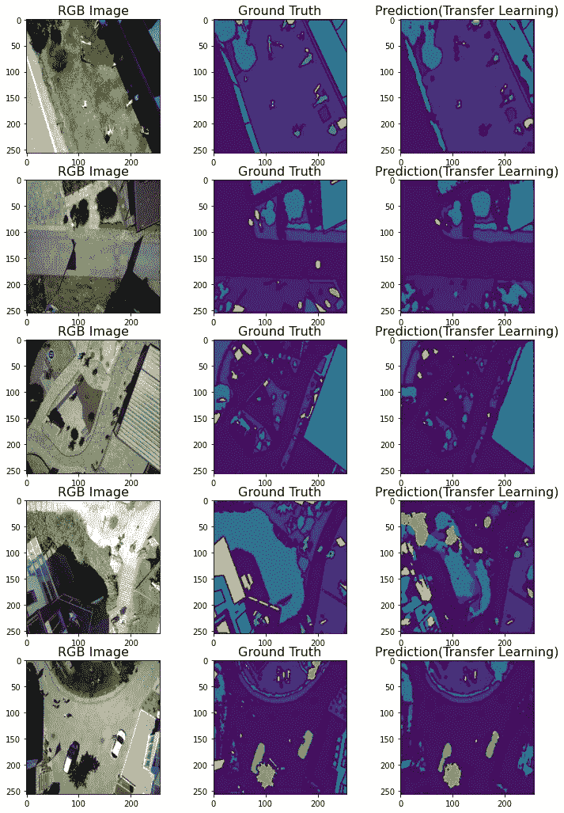
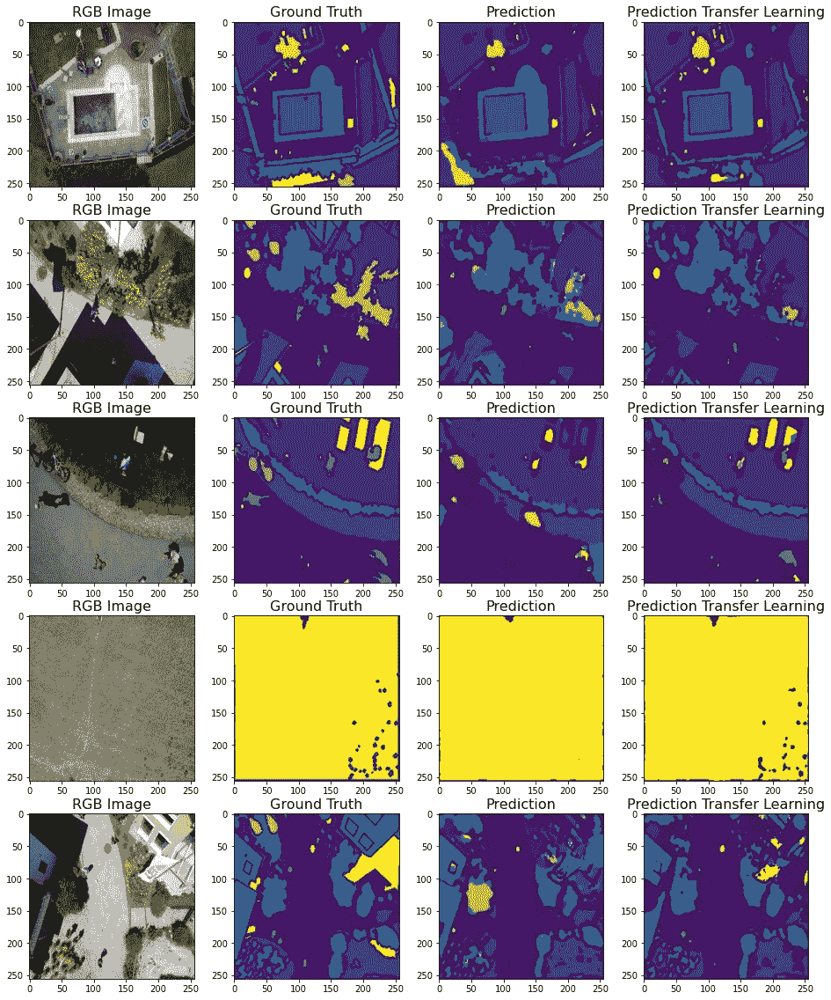

# 使用不同 U-Net 方法对无人机拍摄的航空影像进行语义分割

> 原文：<https://towardsdatascience.com/semantic-segmentation-of-aerial-imagery-captured-by-a-drone-using-different-u-net-approaches-91e32c92803c>

## 使用 python 从头开始实施配置的 U-Net 架构，并使用不同方法对无人机拍摄的航空影像进行语义分割

在机器学习中，模型通过各种应用进行训练，特别是在深度学习和图像数据集上。基于卷积运算的方法在许多领域得到了广泛的研究，尤其是增强现实中的手臂检测、自动驾驶汽车、无人机航拍图像、战争技术。人眼有能力很容易地分类和区分它所看到的东西。然而，这种能力在人工智能技术中的等价物，即理解图像的问题，在计算机视觉的标题下讨论。顾名思义(计算机视觉)，就是用计算机可以理解的方式引入(分类)图像，下一步就是通过使用不同的方法，使对这些图像的操作成为可能。本文解释了一种分割方法，即 U-Net 架构，它是为生物医学图像分割而开发的，并包括一个使用 U-Net 分割无人机拍摄的航空影像的真实项目。



Jaromír Kavan 在 [Unsplash](https://unsplash.com?utm_source=medium&utm_medium=referral) 上的照片

```
***Table of Contents* 1\. Semantic Segmentation
2\. U-Net Architecture from 
3\. Tutorial
3.1\. Data Preprocessing
3.2\. Semantic Segmentation using U-Net from scratch
3.3\. Semantic Segmentation using U-Net with Transfer Learning
4\. Conclusion
5\. References**
```

# 语义分割

图像是由数学数字构成的像素矩阵。在图像处理技术中，对这些数学数字进行一些调整，然后以不同的方式表达图像，并使其适合于相关的研究或解释。卷积过程是一种基本的数学像素运算，它提供了从不同角度评估图像的机会。例如，图像的边缘检测可以通过应用的过滤器来完成，或者图像可以通过将其从 RGB 格式转换为灰度从不同的角度来解释和使用。基于深度学习模型和卷积层，对图像内容进行了更全面的研究，如特征提取和分类。



图一。对象检测，语义分割，实例分割，[来源](http://A. Arnab et al., “Conditional Random Fields Meet Deep Neural Networks for Semantic Segmentation,” IEEE Signal Process. Mag., vol. XX, 2018.)

如上图所示，用包围盒检测图像内容中的物体称为 ***物体检测*** 。 ***语义分割*** 这是一种逐像素的标注操作，就是用一个标签，也就是颜色，来显示图片中同一类型的物体(天空、猫、狗、人、道路、汽车、山、海等)。 ***即时分割*** 每个实例都被单独标记，通过用不同的颜色显示来分隔每个对象。如上所述，在这些操作的背景下，为了不同的用途，已经开发了各种不同的 CNN 模型和复杂的模型。PSPNet、DeepLab、LinkNet、U-Net、Mask R-CNN 只是其中的一些模式。我们可以说，在自动驾驶汽车等基于机器学习的应用中，分割过程是项目的眼睛。下面的视频包含实时语义分割过程，该过程比较了人类视角和 PSPNet 视角。

> 简单来说，计算机视觉中的语义分割是一种像素级的标注方法。如果同一类型的对象用单一颜色表示，则称为语义分割，如果每个对象用唯一的颜色(标签)表示，则称为实例分割。

# U-Net 架构

U-Net 是一种特定类型的卷积神经网络架构，是 2015 年德国弗赖堡大学计算机科学系和生物信号研究 BIOSS 中心为生物医学图像(计算机断层扫描、显微图像、MRI 扫描等)开发的。文章—*“U-Net:用于生物医学图像分割的卷积网络”* —可在[**此处**](https://link.springer.com/chapter/10.1007/978-3-319-24574-4_28) 链接访问。当我们考虑技术思想时，该模型由**编码器(收缩)**和**解码器(提取)**组成，其中**编码器是*下采样*(大部分是迁移学习中预训练的权重)，而**解码器是*上采样*部分，由于其方案是如图 2 所示的 U 形，所以命名为 U-Net。该模型可根据不同的研究进行配置。



图二。U-Net 架构，[来源](http://O. Ronneberger, P. Fischer, and T. Brox, “LNCS 9351 - U-Net: Convolutional Networks for Biomedical Image Segmentation,” 2015, doi: 10.1007/978-3-319-24574-4_28.)

在以下教程中，U-Net 模型被配置用于航空影像的语义分割，如下所示:

如果我们一步一步地看上面的代码块和图 2(从左上到右上，跟随“U”字母的流程):

1.输入定义为 **256x256x3** 尺寸。

2.作为使用 16 个过滤器的`conv_1`的结果，获得了 **256x256x16** 尺寸。用`pool_1`中的 Maxpooling 减少到 **128x128x16** 。

3.使用过滤器号为 32 的`conv_2`得到 **128x128x32** 的尺寸，同样，使用`pool_2`得到 **64x64x32** 的尺寸。

4. **64x64x64** 的尺寸由`conv_3`用 64 号滤镜获得， **32x32x64** 用`pool_3`获得。

5.**32×32×128**的尺寸是用过滤数为 128 的`conv_4`得到的，作为`pool_4`的结果，得到了**16×16×128**。

6.对于滤波器数为 256 的`conv_5`，得到**16×16×256**的大小，上采样从这一点开始。在滤镜数为 128 和(2x2)的`u6`中，用`Conv2DTranspose`将`conv_5`转换为 **32x32x128** ，用`u6`、`conv_4`进行层叠。因此，`u6`更新为 **32x32x256** 。有了 128 个滤镜的`conv_6`，就变成了 **32x32x128** 。

7.通过应用于`conv_6`并将`u7` 与`conv_3`串联，滤波器编号为 64 和(2x2)的`u7`变为 **64x64x64** 。此操作的结果是，`u7`被定义为 **64x64x128** 并且变成带有`conv_7`的 **64x64x64** 。

8.通过应用于`conv_7`并将`u7` 与`conv_2`连接起来，具有 32 和(2x2)过滤器的`u8`变成 **128x128x32** 。该操作的结果是，`u8`被定义为 **128x128x64** 并变成带有`conv_8`的 **128x128x32** 。

9.通过应用于`conv_8`并将`u9`与`conv_1`连接起来，滤波器号为 16 且(2x2)的`u9`变成了 **256x256x16** 。该操作的结果是，`u9`被定义为 **256x256x32** 并且变成带有`conv_9`的 **256x256x16** 。

10.输出使用 *softmax 激活*完成分类过程，最终输出采用 **256x256x1** 的形式。

> 各种比率的下降用于防止过度拟合。

# 辅导的

在编码部分，可以用不同的方法训练数据集。在本研究中，当 *RGB(原始图像)*数据集被定义为 x 时，模型通过使用*地面实况*(分段标记图像)作为 y 来训练。在以后的文章中，还将讨论使用掩膜数据集的方法。RGB 图像和地面实况如图 3 所示。该研究旨在用这种方法训练数据集，并使外部呈现的图像能够像在训练数据中一样执行分割。



图 3。原始 RGB 图像(左)和地面真相(右)，作者提供的图像

它专注于编码架构部分，而不是实现高性能。这是由于处理图像数据集时涉及的计算复杂性。例如，虽然原始图像是 6000x4000 像素，但它已被转换为 256x256 像素，以避免计算复杂性。通过这样的操作，旨在通过放弃准确性来使编码架构正确工作。

***数据集链接:***[https://www.kaggle.com/awsaf49/semantic-drone-dataset](https://www.kaggle.com/awsaf49/semantic-drone-dataset)

***许可:*** CC0:公共域

## 数据预处理

1-导入库。`from architecture import multiclass_unet_architecture, jacard, jacard_loss`是从上一节定义并导入的。

具有 6000x4000 像素和相应标签的 2- RGB 原始图像被调整为 256x256 像素。

3- `MinMaxScaler`用于缩放 RGB 图像。

4-导入地面事实的标签。在地面实况数据集中检测到 23 个标签，并且基于像素值将标签分配给图像的内容。

5 标签数据集是用于分类的`one-hot-encoded`，数据被分为训练集和测试集。

## 使用 U-Net 的语义分割(从头开始)

6-准确性和 **Jaccard** 索引用于训练过程。优化器设置为`‘adam’`，损失设置为`‘categorical_crossentropy’`，因为这只是一个复杂的分类问题。模型符合这些设置。

7- `validation_jaccard`培训过程和损失被可视化。图 4 展示了 val_jaccard。



图 4。Jaccard 值按时代，图像按作者

8-测试数据集的 Jaccard 索引值计算为 **0.5532** 。

从测试数据集中选择 9- 5 个随机图像，用训练好的算法进行预测，结果如图 5 所示。



图 5。5 张随机测试图片的预测结果，图片由作者提供

## 基于迁移学习的 U-Net 语义切分

10-使用 **resnet34** 重新准备数据集。`“Adam”`设为优化器，`“categorical_crossentropy”`设为损失函数，训练模型。

11- `validation_jaccard`和培训过程的损失被可视化。图 6 展示了 val_jaccard。



图 6。Jaccard 值按时代，图像按作者

12-测试数据集的 Jaccard 索引值计算为 **0.6545** 。

从测试数据集中选择 13- 5 个随机图像，用训练好的算法进行预测，结果如图 7 所示。



图 7。5 张随机测试图片的预测结果，图片由作者提供

# 结论

提出了一种基于生物医学图像分割的 U-Net 的卫星图像语义分割方法。研究中考虑了两种主要方法。第一种方法涉及用从头开始的实现来训练已配置的 u-net 模型。第二种方法涉及用迁移学习技术训练模型，即预先训练的权重。在实现部分中，对应的地面真实图像被一热编码，并且该模型像分类过程一样被训练。Jaccard 指数用于衡量指标。

调整大小过程不是推荐的方法，因为在分割操作中大小变化会有不希望的偏移，但是由于计算复杂性，数据集从 6000x4000 调整到 256x256。因此，模型的成功率非常低。防止这种情况的一些主要方法是使用高分辨率数据集和/或使用`patchfying`(裁剪图像和相应的地面实况图像)。



图 8。两种方法的比较，图片由作者提供

使用调整后的数据集，评估了两种不同的方法，结果如图 8 所示。查看 Jaccard 指数值，使用迁移学习方法获得 0.6545，而使用临时构建的模型获得 0.5532。可以看出，用预训练模型获得的分割过程更成功。

> 不同的方法将在后续文章中用不同的编码方法来介绍。

[](https://ibrahimkovan.medium.com/machine-learning-guideline-959da5c6f73d) [## 机器学习指南

### 所有与机器学习相关的文章

ibrahimkovan.medium.com](https://ibrahimkovan.medium.com/machine-learning-guideline-959da5c6f73d) 

# 参考

O.Ronneberger，P. Fischer 和 T. Brox，“LNCS 9351-U-Net:生物医学图像分割的卷积网络”，2015 年，doi:10.1007/978–3–319–24574–4 _ 28。

A.Arnab *等*，“条件随机场遇上深度神经网络进行语义切分”， *IEEE 信号处理。玛格。*，第二十卷，2018。

J.陈永春，郭福荣，顾国辉，2020。2020.

J.Maurya，R. Hebbalaguppe 和 P. Gupta，“用于手势界面的头戴式设备上的实时手部分割”，Proc .— Int。糖膏剂图像处理。ICIP，第 4023–4027 页，2018 年，doi:10.1109/icip . 1455125367