# Python 中基于 U-Net 的航空影像语义分割

> 原文：<https://towardsdatascience.com/semantic-segmentation-of-aerial-imagery-using-u-net-in-python-552705238514>

## 使用 Python 中的 TensorFlow U-Net 模型对迪拜 MBRSC 航空影像进行语义分割

## 介绍

***图像分割*** *是在像素级对一幅图像进行分类的任务。*

每张数字图片都由**个像素值**组成，语义分割包括给每个像素加标签。

本文旨在演示如何使用 *TensorFlow* 中定义的 **U-Net** 模型对**航空影像进行语义分段。**


照片由[ZQ·李](https://unsplash.com/@zqlee?utm_source=medium&utm_medium=referral)在 [Unsplash](https://unsplash.com?utm_source=medium&utm_medium=referral) 上拍摄

## 资料组

**MBRSC** 数据集存在于 CC0 许可下，可供[下载](https://www.kaggle.com/humansintheloop/semantic-segmentation-of-aerial-imagery)。它由*迪拜*的航空影像组成，由 **MBRSC 卫星**获得，并在 *6 类*中标注了逐像素语义分割。有三个**主要挑战*与数据集相关联:*

1.  **类颜色*为十六进制**，而掩模图像为 RGB**。*****
2.  ***数据集的总容量为 *72 幅图像，分成六个较大的图块*。七十二幅图像是用于训练神经网络的相对**小数据集**。***
3.  ***每个图块都有不同高度和宽度的**图像**，并且同一图块中的一些图片大小可变。神经网络模型期望输入具有*相等的空间维度*。***

***图 1 描绘了一个训练集*输入图像*及其对应的*掩码*，带有叠加的类注释。***

***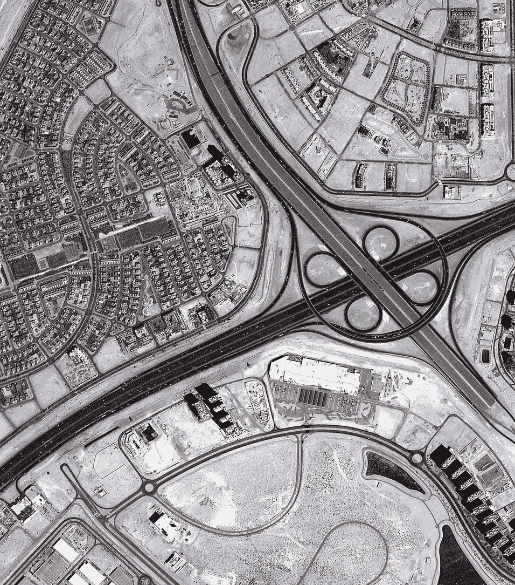******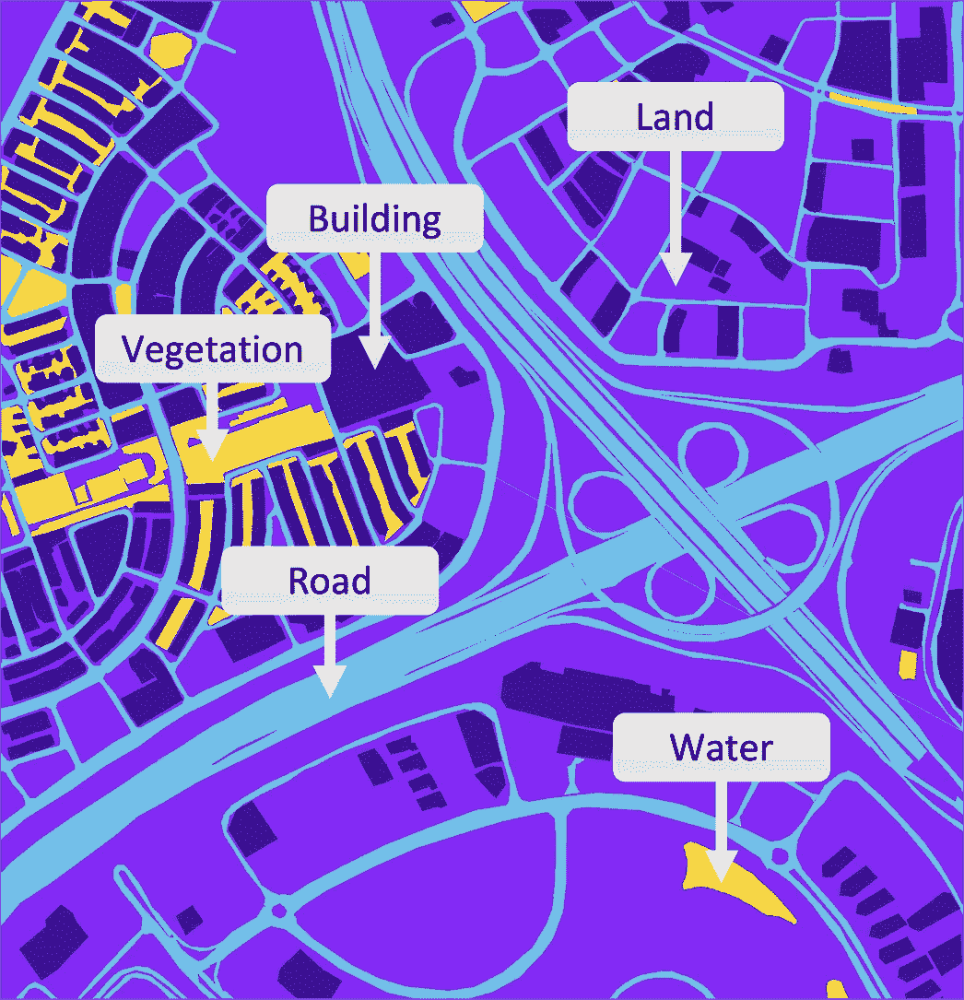***

***图 1-样本训练数据输入图像(左)和输出掩码(右)(图片由作者提供)***

***表 1 给出了每个*类名*，对应的*十六进制颜色*代码，以及转换后的 *RBG* 值。***

***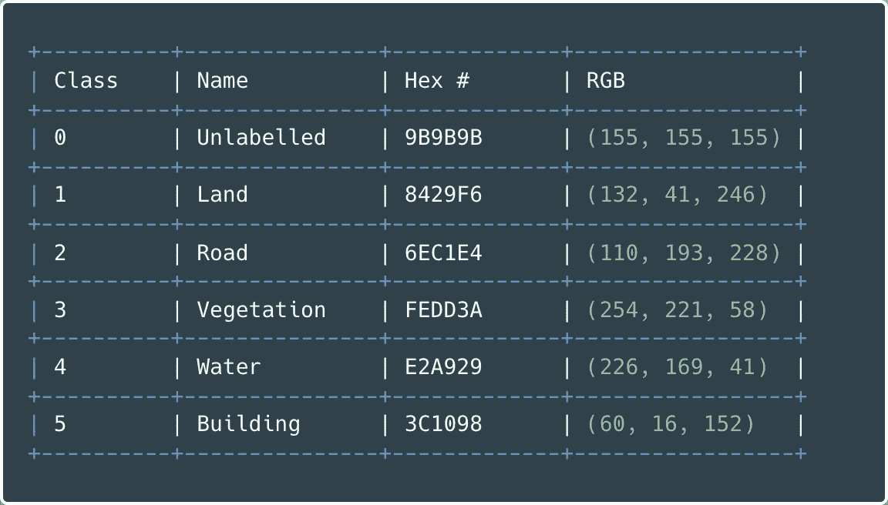***

***表 1-类别名称和遮罩颜色(图片由作者提供)***

## ***预处理***

****图像在输入神经网络的输入层时，尺寸必须相同*。因此，在模型训练之前，图像被分解成*个面片*。***

***选择的 **patch_size** 为 *160 px* 。没有理想的补丁大小；它作为一个超参数，可以进行性能优化试验。***

***从具有 *1817* 像素的*宽度*和 *2061* 像素的*高度*的*拼贴 7* 中获取图像，表达式 1 说明了如何计算创建的拼贴元的数量。***

***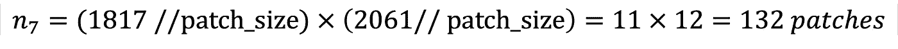***

***表达式 1——碎片尺寸= 160 px 的平铺 7 图像的碎片数量的计算***

***接下来，图像被裁剪至最接近的尺寸，可被 patch_size 整除，以避免 patch 与区域重叠。表达式 2 确定瓦片 7 图像的新的修整宽度和高度。***

******

***表达式 2-计算图像的裁剪宽度和高度，并除以补丁大小***

***图 2 阐明了单幅图像的**裁剪**和**修补**过程。***

***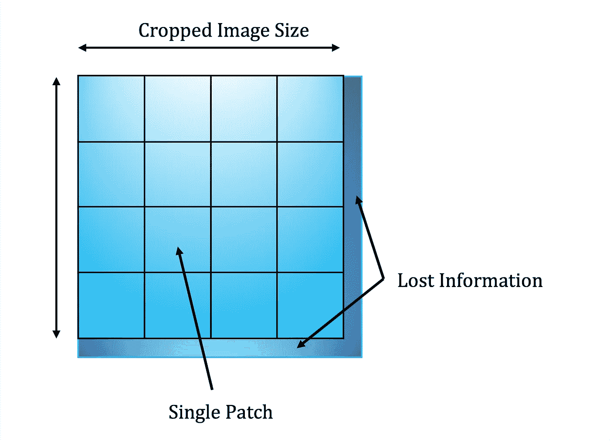***

***图 2-修补和裁剪的说明(图片由作者提供)***

***表 2 给出了*瓦片*；它们的*尺寸*是使用尺寸 **160 px** 创建的*补丁总数*。***

***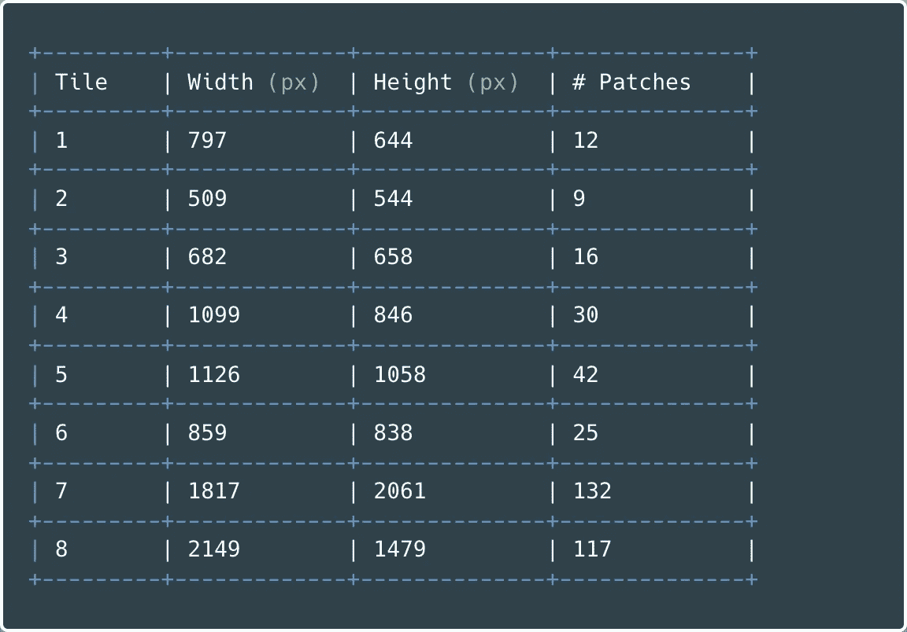***

***表 2 —瓷砖高度、宽度和补丁数量(图片由作者提供)***

***在`cropping`和`patchifying`之后， *3483 幅图像和掩模*组成了*输入数据集。*图 3 给出了*六个*随机选择的图像补片及其可比较的掩模。***

***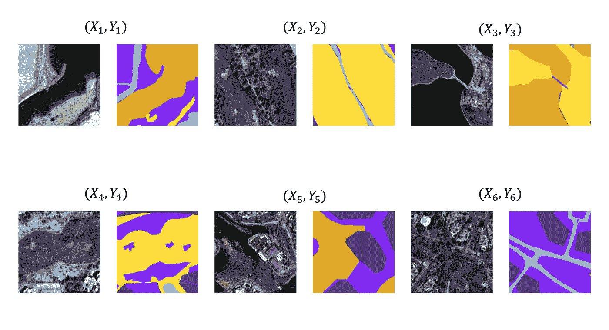***

***图 3 —修补的图像(作者提供的图像)***

***使用从 Gist 1 到*的 Python 代码从一个目录加载图像文件*并执行数据**预处理**，如上所述。***

***Gist 1 —从目录加载图像并返回裁剪的补丁的 Python 代码***

***掩码是形状`(160, 160, 3).`轴 3 的*张量*，或第三维，可解释为 8 位无符号整数*的 *NumPy* 数组。*这些值的范围从 0 到 255，对应于表 2 中列出的 *RGB* 颜色。***

****多类分类*问题需要将**输出编码为整数**。即对于具有 RGB 值`(60, 16, 152)`的`Building`类，合适的标签是`0`。***

***要将遮罩的第三维度转换为表示适当类标签的独热编码向量，请执行 Gist 2 中的 Python 代码。***

***要点 2 —对遮罩的轴 3 进行分类编码***

***目前，**输入图像**是张量，可解释为 8 位无符号整数(十进制 0 到 255)的 NumPy 数组。因此，r **escaling** 值从 0–255 到 0–1**提高了性能和训练稳定性。*****

***Keras 提供了一个`[Rescaling](https://www.tensorflow.org/api_docs/python/tf/keras/layers/Rescaling)` **预处理层**，它将输入值修改为一个新的范围。使用下面的 Python 代码定义该图层。***

```
***rescaling_layer = layers.experimental.preprocessing.**Rescaling**(
    **scale**=1\. / 255,
    **input_shape**=(img_height, img_width, 3)
)***
```

***每个输入图像值乘以`scale`，如图 4 所示。***

***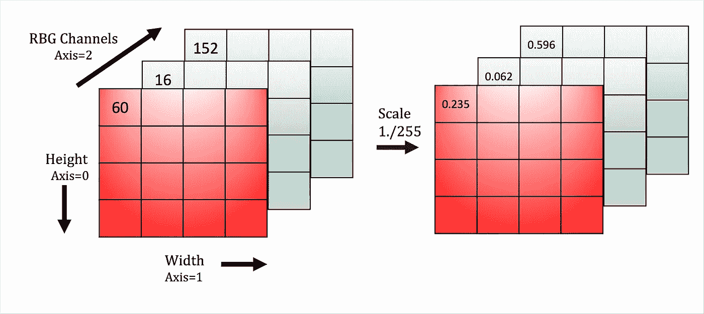***

***图 4-缩放 RBG 通道(图片由作者提供)***

***一般分为三个部分，*培训、验证和测试*。然而，与其他机器学习计算机视觉数据集相比，该数据集相对较小。因此，只需要一次分割，并且**推理**发生在`X_test`数据集上。***

*   ***`X_train`和`Y_train`由训练集的 *90%* 组成***
*   ***`X_test`和`Y_test`构成了剩余的*数据的 10%****

## ***模型架构***

***许多预先训练或预先定义的*卷积神经网络* (CNN)架构存在于图像分割任务中，例如 **U-Net** ，其中在这方面表现出了优越的能力。***

***U-Net 由*两条关键路径*组成:***

1.  *****收缩**对应一般卷积`Conv2D`操作，其中*滤波器*滑过输入图像提取特征。`Conv2D`*，*`MaxPooling2D`层对像素组进行操作，并通过**选择最大值**来过滤值。汇集*向下采样*输入图像尺寸，同时保持特征信息。***
2.  *****扩展:**使用转置卷积或*去卷积*、`Conv2DTranspose`扩展下采样图像，以恢复输入图像空间信息。在上采样时，**跳过连接** *连接*对称*收缩*和*扩展*层之间的特征。***

***图 5 描述了用于*航空影像分割*的简单 U-Net 设置，并突出显示了网络和图层形状的所有重要方面。***

***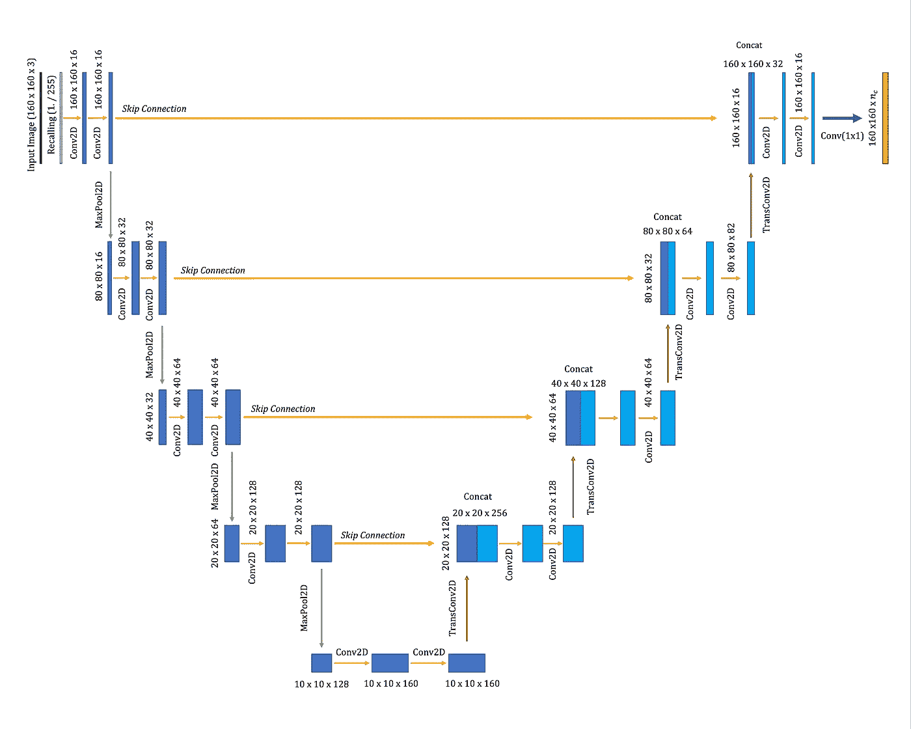***

***图 5 —带有输出形状的 U-Net 架构图(图片由作者提供)***

****两种类型的*信息允许 U-Net 在**语义分割**问题上发挥最佳功能:***

1.  ***扩展路径中的过滤器包含*高级空间*和*上下文*特征信息***
2.  ***收缩路径中包含的详细的*细粒度的*结构信息***

***这两个元件*通过跳线连接熔断*。因此，**串联**允许神经网络使用伴随低级特征信息的高分辨率数据来进行预测。***

***Gist 3 提供了使用`Keras`构建简单 U-Net 模型的示例代码。***

***要点 3 —在 Keras 中定义 U-Net 模型***

***图 6 提供了使用`model.summary`获得的控制台日志。将`Keras`输出与图 5 中的*架构图*进行比较，可以看到相应的**区块**和**图层形状**。***

***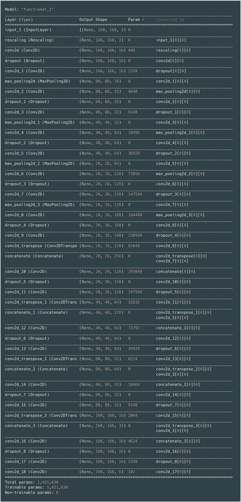***

***图 6 —卷积神经网络模型总结(图片由作者提供)***

## ***培训和评估***

***在拟合训练数据之前，必须定义性能指标。由于图像分割涉及为图片中的每个像素分配一个类别，标准的成功指标是**交集/并集** ( *IOU* )系数。***

*****IOU** 或 *Jaccard Index* 测量由实际和预测掩膜*包围的*重叠像素*的数量除以*横跨*和*两个掩膜的*总像素*。表达式 3 计算 IOU。***

***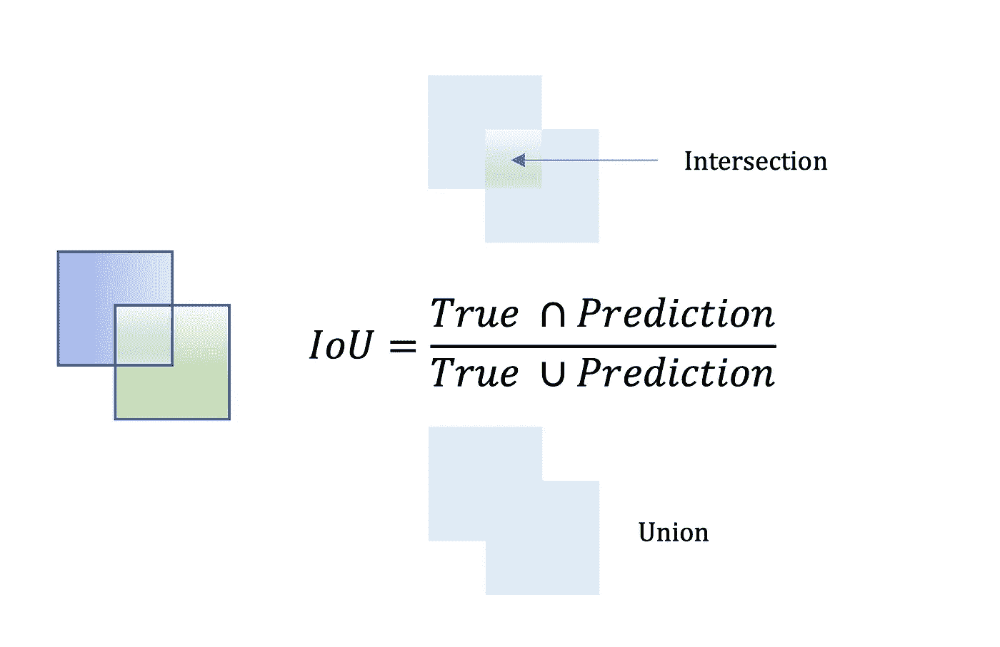***

***表达式 3 — Jaccard 相似性指数(作者图片)***

***下面在要点 4 中定义了定制的 Jaccard 相似性函数。***

***要点 4 — Jaccard 指数评估指标***

***特定的**回调**在训练神经网络时很有帮助，因为它们在训练期间提供了模型内部状态的*视图。Gist 5 中定义的三个回调是:****

1.  ***`**ModelCheckpoint**`:保存所有时期中验证精度最高的最佳模型***
2.  ***`**EarlyStopping**`:如果 validation_loss 在两个时期内没有继续减少，则停止拟合***
3.  ***`**CSVLogger**`:将每个时期的模型状态值保存到 CSV 文件中***

***一旦定义了回调，模型就用`Adam` *优化*、`categorical_crossentropy` *损失*进行编译，并为 *20 个时期*启动训练，如要点 5 所示。***

***要点 5 — Keras 回调、模型编译和训练数据拟合***

***图 7 是培训期间返回的 Python *控制台日志*的副本。它显示了在每次迭代中`categorical_crossentropy` **损失减少**，而 **Jaccard 相似性评估度量增加**。***

***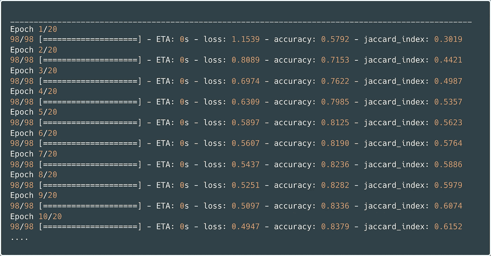***

***图 7 —时期 1–10 的 Python 控制台日志(图片由作者提供)***

***训练完成后，模型保存到硬盘上，达到最终性能指标值:***

*   ****损失* ≈ **0.4170*****
*   ****精度* ≈ **0.8616*****
*   ****Jaccard 指数* ≈ **0.6599*****

***最后，使用 Gist 6 中的代码来加载带有必要的定制评估指标(定义为依赖项)的模型。***

***要点 6 —从磁盘加载 Keras 模型***

## ***预言；预测；预告***

***由于*数据集大小限制*，预测发生在从测试集中随机采样的图像上。***

***使用经过训练的 U-Net 模型进行预测的详细注释代码在下面的要点 7 中提供。***

***要点 7——进行预测并可视化结果***

***图 8 是十个输出的*可视化*，描绘了迪拜的修补*航拍图像*、地面真相*蒙版*和 U 网分割*预测*。***

***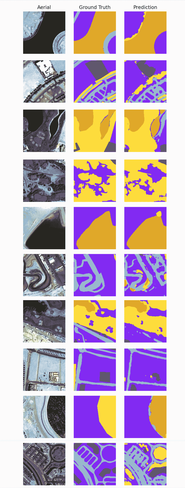***

***图 8-U-Net 航空影像分割预测(图片由作者提供)***

## ***结论***

***由于 ***计算能力*** 受限，神经网络 ***规模受限*** ，训练迭代不超过 20 个历元。目前大约有*140 万个可训练参数*，如图 6 所示。因此，模型性能无疑可以通过*超参数调整*和采用更加*复杂的*网络来提高。***

***图 9 描述了一些**最不成功的分割**。一些*相似之处*在航拍图像的最左边一栏很明显。每张图像都非常亮，包含许多像素，接近 RGB 光谱的白色端。相比之下，查看图 8，最*可接受的分割*在**高对比度图像**上。因此，合成额外的更亮的训练图像或者*在子集上微调*模型以提高性能可能是合理的。***

***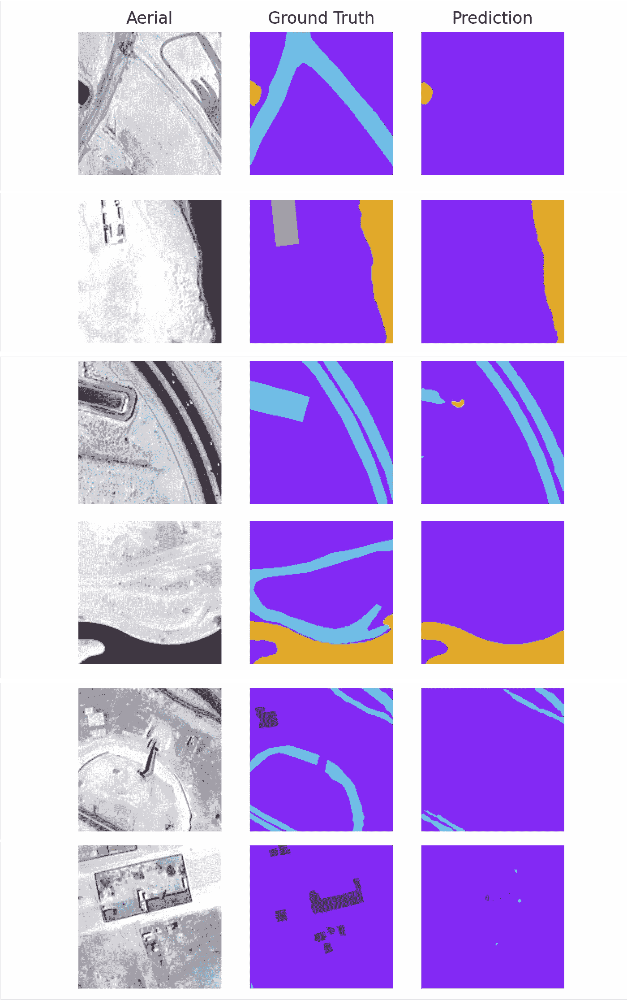***

***图 9——最佳预测检验(作者图片)***

***然而，正如预测所显示的，考虑到小的数据集大小和有限的计算能力，该模型通常**表现相对良好**。***

****本文展示了如何使用 U-Net TensorFlow 模型对迪拜数据集的 MBRSC 航空影像进行语义分割。****

***类似的过程适用于其他机器学习图像分割任务。U-Net 最初是为生物医学领域的工作而设计的，自问世以来，已在其他各种领域得到应用。***

***所有代码都存储在这个 GitHub [库](https://github.com/ad-1/u-net-aerial-imagery-segmentation)中:***

***<https://github.com/ad-1/u-net-aerial-imagery-segmentation>  <https://medium.com/@andrewdaviesul/membership>  

## 参考

[1] [航空影像语义分割](https://www.kaggle.com/humansintheloop/semantic-segmentation-of-aerial-imagery) ( [CC0:公共领域](https://creativecommons.org/publicdomain/zero/1.0/))—ka ggle
【2】[卷积神经网络](https://www.coursera.org/learn/convolutional-neural-networks) —深度学习。艾，
【3】[使用 U-net 对航空(卫星)影像进行语义分割](https://www.youtube.com/watch?v=jvZm8REF2KY&t=2109s)—digitals reeni
【4】[评估分割模型](https://www.jeremyjordan.me/evaluating-image-segmentation-models/#:~:text=Intersection%20over%20Union&text=This%20metric%20is%20closely%20related,pixels%20present%20across%20both%20masks.) —杰瑞米·乔登(2018 年 5 月 30 日)
【5】Keras 三分钟讲解—作者 [Andre Duong](https://www.linkedin.com/in/andreduong/) ，UT Dallas***