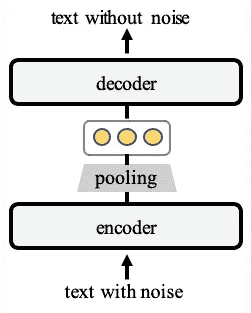
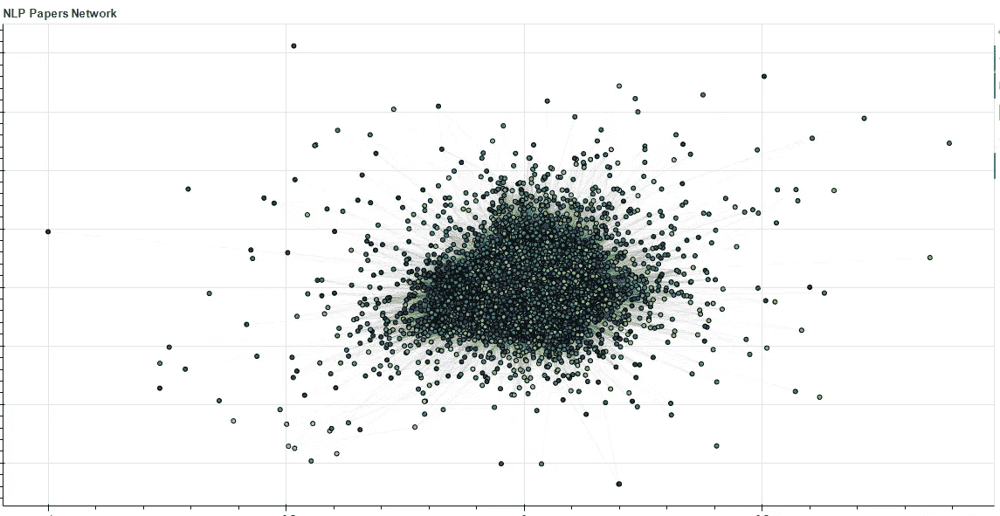

# 语义相似网络

> 原文：<https://towardsdatascience.com/semantic-similarity-networks-9aca31082d8e>

## 从文档的关联性中挖掘知识

从稳定扩散生成的图像

文字是最简洁、最普遍的信息交流方式。它可以说是我们物理世界最有用的代表。毫不奇怪，许多人工智能(包括当前的大量创新)依赖于自然语言理解(通过提示)。为了让机器能够理解语言，文本需要精确的数字表示，这在过去十年中已经发生了革命性的变化。从一个相对较小规模的语料库的热表示到静态单词嵌入，再到来自巨大互联网规模的虚拟数据的子标记的向量表示(通过注意机制)，这种变化是我们目前参与的人工智能革命的最重要的变化之一。

前面提到的在文本表示方面的创新使得能够将文本文档存储为向量，在这些向量上可以应用数学运算来探索和利用它们的相互关联性。例如，向量搜索引擎使用余弦相似度来搜索与查询最相关的文档。仅相似性就驱动了许多有用的应用，包括搜索、信息检索和推荐。然而，文本的向量相似性的使用在网络分析中仍然没有得到充分的讨论。

**审查现有工作**

大多数以前关于语义网络的工作将单词作为分析单位，而不是整个文档。在社会科学的语义网络分析中，Elad Segev 写道，

*“语义网络分析更多的是一种无监督的方法。它类似于主题建模，但它不是根据常用词对文档进行分类，而是根据单词的邻近性或共现性对文档中的单词进行分类。在这种情况下，输入是一个文本，输出是一个单词网络，根据它们的接近程度进行聚类。语义网络分析被认为是一种无监督的方法，因为不需要事先定义类别，并且根据单词在文本中的共现情况自动将单词分类。”*

该领域的其他一些工作包括“主题模型的网络方法”(Tiago，Eduardo 和 Altmann)，详细描述了主题模型和社区检测(用于网络分析)之间的交叉受精。(本文更接近于这里所描述的，但是使用了完全不同的方法，其中“*”节点由文档和单词组成，并且它们之间的边的强度由单词在文档中出现的次数给出，产生了等同于在主题模型中使用的单词-文档矩阵的二分多图。*”)。

相似性网络本身并不是一个新颖的想法。在《Python 中的复杂网络分析》一书中，Dmitry Zinoviev 详细介绍了这个主题，其中节点的相似性度量用于形成图中的边。本文讨论了我们感兴趣的项目(也称为网络节点，可以是内容网站上的推荐文章、文献调查的研究论文或电子商务网站上的产品(通过其产品描述))的文本表示的类似方法，以及它们之间仅通过其基础文本描述的向量表示的相互连接。

这种方法不同于传统的文本聚类，传统的文本聚类丢失了与较大文档空间的互连性信息。在网络分析中，这些信息通过节点之间的连接来保存。

**应用程序**

这种方法的一些潜在应用包括:

*   检测整个文档空间中的**空白**—例如，假设有一个关于给定主题的研究论文集合，并且您想要探索尚未得到充分研究的想法。您可以查看网络，以确定在各个集群中等级不高的节点。这些外围节点可以让你接触到文献中潜在的空白。
*   识别与连接两个概念的**不可或缺的文档**——比方说，通过语义节点上的社区检测，您已经能够识别代表某些类别或概念的集群。通过查看感兴趣的两个集群之间的互连，您可以选择在这两个集群之间具有最大边的节点(文档),这些节点可以作为“桥”概念的潜在候选。(这在文献调查中特别有用，在文献调查中，网络的使用通常仅限于将参考文献的数量视为边。某些论文可能会获得更多与论文内容不完全相关的参考文献(参见“Huber，Juergen and M. Inoua，Sabiou and Kerschbamer，Rudolf and knig-Kersting，Christian and Palan，Stefan and Smith，Vernon L .，Nobel and Novice:作者突出影响同行评议”(2022 年 8 月 16 日)。)
*   排除**建议中的冷启动问题** —建议通常需要用户参与数据，而这些数据在您开始时是不可用的。此外，仅根据相似性提供推荐可能会导致意想不到的后果。(例如，参见艾利森·j·b·邱晨等人的《推荐系统中的算法混淆如何增加同质性并降低效用》(2017)。为了给你的推荐增加多样性，可以使用语义相似度网络。假设用户点击了某篇文章。从网络上，可以使用以下伪代码:

1.  确定节点(文档)所连接的集群集 C。
2.  使用度的百分比阈值来过滤出最相关的聚类(C_filtered)[示例:该节点通过 4 条边连接到聚类号 1(它是该聚类的一部分)，3 条边连接到聚类 2，2 条边连接到聚类 3，1 条边连接到聚类 4，选择 90%的阈值，并且 10 条边(度)中的 9 条被聚类 1、2、3 占据，这些聚类成为 C _ filtered 的一部分。
3.  从最相似的节点(可能是任何聚类的节点的感兴趣节点的连接边)提供预定数量的推荐。
4.  对于剩余的推荐，从 C_filtered 中选择与感兴趣的节点的集群具有大量边但不与之连接的节点。设这个集合为 s。
5.  为了从 S 中挑选出前 k 个节点，可以使用最大边际相关性来识别彼此不同但与我们感兴趣的节点所属的集群语义相关的节点。

**主要挑战**:

使用语义相似性网络的主要挑战详述如下:

*   适应领域的高质量文档嵌入
*   为边缘的形成选择合适的相似性阈值
*   选择适合相似网络的社区发现算法

第三个需要实验。我用传统的社区检测算法如贪婪模块性得到的结果不如用欧几里德距离的凝聚聚类得到的结果好。这些聚类用于计算平均距离分数，该平均距离分数被进一步平均以计算网络边的单个阈值。(这个阈值可以认为是一个超参数。)调整阈值将改变网络的稀疏性。

至于文档嵌入，这是一个快速发展的领域，并且正在对最精确的领域适应嵌入进行积极的研究。对于我的实验(详见下文)，我使用了一组研究论文，其中最相关的预训练转换器是“allenai/specter”，其嵌入确实给出了不错的结果。我的另一个适用于域适配嵌入的方法是 Reimers 等人的基于变压器的顺序去噪自动编码器。该架构在解码器之前引入了一个瓶颈，从而提供了精确的文档嵌入(与单词嵌入相反)。这可以在未标记的数据集上训练，随后在标记的数据集上训练(优选地与感兴趣的领域相关)。

使用 TSDAE 进行域适配(来源:【www.sbert.net】T2，Apache 2.0)

**实验:**

cs 类别的数据集。arxiv 上的 CL 是 2018 年、2019 年和 2020 年拍摄的。(这些年来，在使用自我注意力来训练大型语言模型之后，自然语言处理也出现了显著的增长。)如前所述，文档嵌入是从‘allenai/specter’模型获得的，没有任何微调。这些嵌入被输入到 sklearn 的凝聚聚类中，随后获得 101 个聚类。(下面给出代码。)

已查询群集。例如，第 3 组有一些下列文件:

*   一个新的用于从代码混合对话中进行自然语言推理的数据集
*   夫妻治疗中言语行为的人际影响建模
*   用于行为编码的多标签多任务深度学习
*   用于交互式语言学习的监督种子迭代学习
*   重复参照游戏中学习的动态特征
*   使用言语和语言预测癌症患者和配偶互动中的行为
*   Alquist 3.0:使用对话知识图的 Alexa 奖励机器人
*   南非低资源语言中半正式患者交流中语码混合的普遍性

同样，第 10 组有一些下列文件。

*   一套盔甲能导电吗？一种新的开卷问答数据集
*   相似问题检索中语义表示和树搜索的再探讨
*   基于匹配的格子细胞神经网络中文问答系统
*   RuBQ:一个用于维基数据问答的俄罗斯数据集
*   Quizbowl:增量问答的案例
*   F1 不够！以用户为中心的可解释问答模型及其评价
*   生成适当问答对的元序列学习
*   主观问题回答:解读主观领域中变形金刚的内部运作
*   问答系统中自然语言问题解释的定量评估

粗略地看一下，我们就知道集群 3 是关于会话式 NLP 和对话系统的，集群 10 是关于问题回答的。为了找到聚类 3 中的外围论文，查询该图并获得以下结果:

*   作为人际多模态范畴化的符号涌现
*   南非低资源语言中半正式患者交流中语码混合的普遍性
*   使用健康行为改变的跨理论模型的体重管理聊天的对话注释方案
*   帮助还是伤害？通过在线社区互动预测用户自残风险的变化
*   在帖子标题中表达的社会支持会在在线药物使用康复论坛中引发评论吗？

这些看起来像利基专业话题。为了找到“桥论文”(在集群 3 和 10 之间)，再次查询图网络，并且获得以下结果。

*   将问答数据集转换为自然语言推理\n 数据集

结果与预期一致，因为论文谈到了将问答对转换成声明形式。

(RecSys 的实验会单独分享。)

语义相似性网络确实提供了一种不同的分析和查询数据集的方式。用进一步的实验来探索这一点会很有趣。

作者图片:自然语言处理论文的语义相似度网络